# 项目架构改造设计 - FastAPI + 前端分离方案

## 一、改造概述

### 1.1 改造目标

将现有Streamlit单体架构改造为FastAPI后端 + 前端分离架构，适配2核2G服务器配置，提升系统的并发处理能力、可维护性和扩展性。

### 1.2 改造动因

| 方面 | 当前问题 | 改造收益 |
|------|----------|----------|
| 并发性能 | Streamlit单进程运行，并发能力有限 | 基于Gunicorn/Uvicorn多worker模式，支持2-4个并发进程 |
| 资源占用 | 单体应用内存占用较高 | 前后端分离后各自优化，内存占用降低 |
| 可扩展性 | 前后端强耦合，难以独立扩展 | 前后端独立部署和扩展，支持API复用 |
| 开发效率 | 前后端混合，代码职责不清 | 前后端分离，团队可并行开发 |
| API服务化 | 不支持API调用 | 提供标准RESTful API，支持多端接入 |

### 1.3 适配场景

- 服务器配置：2核2G ECS实例
- 并发需求：2-4个worker进程
- 计费模式：包年包月
- 推荐策略：NewProductFirst

## 二、当前架构分析

### 2.1 现有架构图

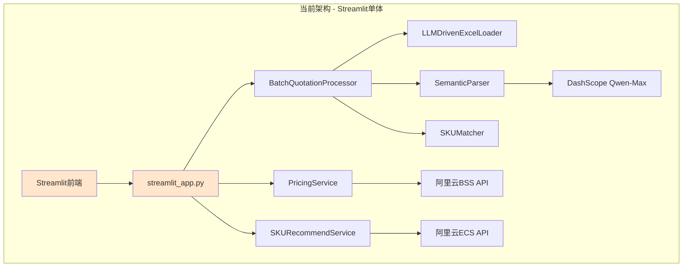

### 2.2 现有模块职责

| 模块 | 职责 | 文件位置 |
|------|------|----------|
| Streamlit前端 | 用户交互、文件上传、结果展示 | streamlit_app.py |
| PricingService | 价格查询服务 | app/core/pricing_service.py |
| SKURecommendService | SKU推荐服务 | app/core/sku_recommend_service.py |
| BatchQuotationProcessor | 批处理协调器 | app/data/batch_processor.py |
| LLMDrivenExcelLoader | Excel数据加载 | app/data/data_ingestion.py |
| SemanticParser | AI语义解析 | app/core/semantic_parser.py |

### 2.3 现有数据流

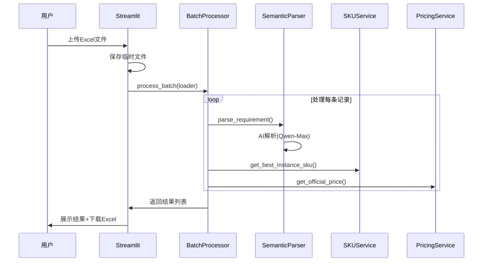

### 2.4 现有问题识别

| 问题类别 | 具体表现 | 影响 |
|---------|----------|------|
| 架构耦合 | 前端直接调用业务服务，职责不清晰 | 代码难以维护和扩展 |
| 并发限制 | 单进程运行，无法利用多核资源 | 并发处理能力不足 |
| 资源占用 | Streamlit框架开销较大 | 2G内存下运行压力大 |
| API缺失 | 无法通过API接入，仅支持Web界面 | 无法支持移动端或第三方集成 |
| 部署复杂 | systemd直接启动Streamlit，无进程管理 | 稳定性和可靠性不足 |

## 三、目标架构设计

### 3.1 目标架构图

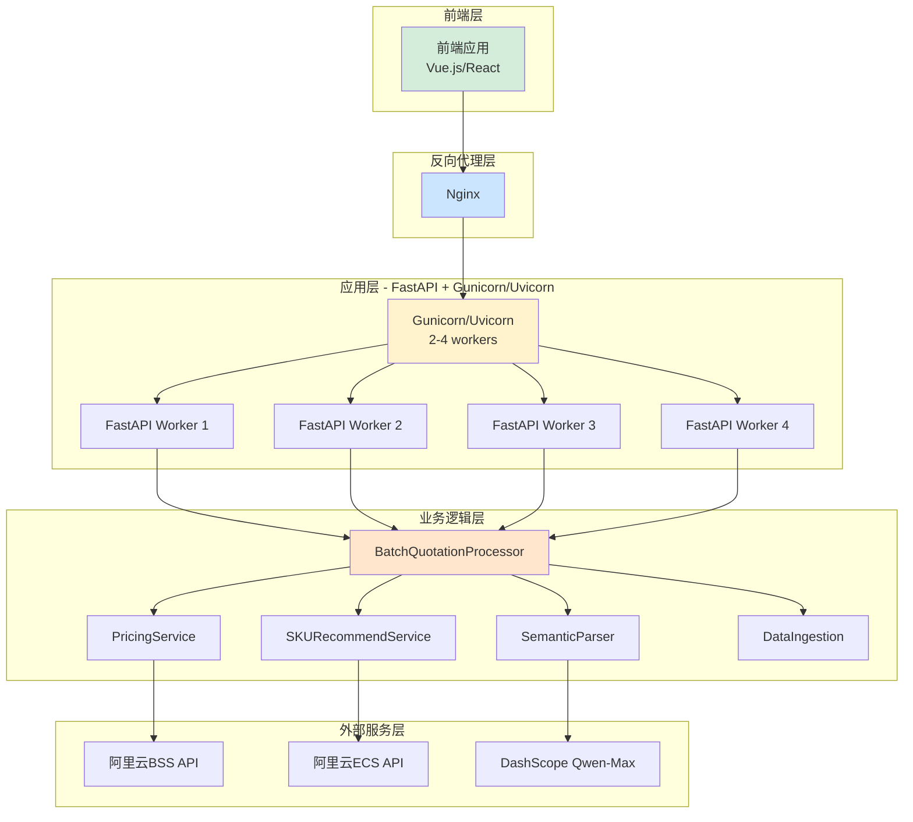

### 3.2 架构分层说明

| 层级 | 职责 | 技术选型 | 端口 |
|------|------|----------|------|
| 前端层 | 用户交互界面 | Vue.js 3 / React | 3000 (开发) |
| 反向代理层 | 请求转发、负载均衡、静态资源服务 | Nginx | 80 |
| 应用层 | API服务、请求处理 | FastAPI + Gunicorn/Uvicorn | 8000 |
| 业务逻辑层 | 核心业务处理（复用现有代码） | Python | - |
| 外部服务层 | 阿里云API、LLM服务 | SDK | - |

### 3.3 技术栈选型

#### 3.3.1 后端技术栈

| 组件 | 技术选型 | 理由 |
|------|----------|------|
| Web框架 | FastAPI | 高性能、异步支持、自动生成API文档、类型安全 |
| ASGI服务器 | Uvicorn + Gunicorn | 多worker进程管理，适配2核2G配置 |
| 数据验证 | Pydantic | 与FastAPI原生集成，已在项目中使用 |
| 异步支持 | asyncio | 提升I/O密集型操作性能（API调用） |
| 文件处理 | pandas, openpyxl | 保持现有Excel处理能力 |

#### 3.3.2 前端技术栈

| 组件 | 技术选型 | 理由 |
|------|----------|------|
| 框架 | Vue.js 3 / React | 轻量级，适合简洁界面设计 |
| UI组件库 | Element Plus / Ant Design | 开箱即用，快速开发 |
| HTTP客户端 | Axios | 标准HTTP库，支持拦截器和请求取消 |
| 构建工具 | Vite | 快速开发构建，体积小 |

### 3.4 worker进程配置策略

基于2核2G配置，推荐worker数量计算：

| 配置方案 | Worker数量 | 内存估算 | 适用场景 |
|----------|-----------|----------|----------|
| 保守方案 | 2 workers | 每个约500MB，总计1GB | 稳定优先，预留系统资源 |
| 平衡方案 | 3 workers | 每个约400MB，总计1.2GB | 平衡性能和稳定性 |
| 激进方案 | 4 workers | 每个约300MB，总计1.2GB | 性能优先，需监控内存 |

**推荐配置**：3 workers（平衡方案）

启动命令示例：
```
gunicorn main:app -w 3 -k uvicorn.workers.UvicornWorker --bind 0.0.0.0:8000
```

## 四、API接口设计

### 4.1 API设计原则

- 遵循RESTful风格
- 统一响应格式
- 完整的错误处理
- 请求参数验证
- 支持文件上传和下载
- 提供API文档（FastAPI自动生成）

### 4.2 核心API端点

#### 4.2.1 报价处理API

**端点：POST /api/v1/quotations/batch**

请求体（multipart/form-data）：
| 字段 | 类型 | 必填 | 说明 |
|------|------|------|------|
| file | File | 是 | Excel文件（.xlsx/.xls） |
| region_id | string | 是 | 阿里云区域ID（如cn-beijing） |

响应体：
| 字段 | 类型 | 说明 |
|------|------|------|
| code | integer | 状态码（200成功） |
| message | string | 响应消息 |
| data | object | 结果数据 |
| data.task_id | string | 任务ID |
| data.total_count | integer | 总记录数 |
| data.success_count | integer | 成功数量 |
| data.results | array | 处理结果列表 |
| data.download_url | string | 结果文件下载URL |

#### 4.2.2 区域列表API

**端点：GET /api/v1/regions**

响应体：
| 字段 | 类型 | 说明 |
|------|------|------|
| code | integer | 状态码 |
| data | array | 区域列表 |
| data[].id | string | 区域ID |
| data[].name | string | 区域名称 |

#### 4.2.3 任务状态查询API

**端点：GET /api/v1/quotations/tasks/{task_id}**

响应体：
| 字段 | 类型 | 说明 |
|------|------|------|
| code | integer | 状态码 |
| data | object | 任务信息 |
| data.status | string | 任务状态（processing/completed/failed） |
| data.progress | integer | 进度百分比 |
| data.result | object | 处理结果（completed时返回） |

#### 4.2.4 文件下载API

**端点：GET /api/v1/quotations/download/{task_id}**

响应：Excel文件流

### 4.3 统一响应格式

成功响应：
```json
{
  "code": 200,
  "message": "success",
  "data": {}
}
```

错误响应：
```json
{
  "code": 400,
  "message": "Invalid file format",
  "error": "详细错误信息"
}
```

### 4.4 错误码定义

| 错误码 | 说明 |
|--------|------|
| 200 | 成功 |
| 400 | 请求参数错误 |
| 401 | 未授权 |
| 404 | 资源不存在 |
| 500 | 服务器内部错误 |
| 503 | 外部服务不可用（阿里云API/LLM） |

## 五、目录结构设计

### 5.1 后端目录结构

```
Quotation_Pipeline/
├── backend/                          # 后端根目录
│   ├── app/                          # 应用主目录
│   │   ├── api/                      # API路由层
│   │   │   ├── v1/                   # API v1版本
│   │   │   │   ├── endpoints/        # 端点定义
│   │   │   │   │   ├── quotations.py # 报价相关接口
│   │   │   │   │   └── regions.py   # 区域相关接口
│   │   │   │   └── router.py        # 路由聚合
│   │   │   └── dependencies.py      # 依赖注入
│   │   ├── core/                     # 核心业务层（复用现有代码）
│   │   │   ├── pricing_service.py
│   │   │   ├── semantic_parser.py
│   │   │   └── sku_recommend_service.py
│   │   ├── data/                     # 数据处理层（复用现有代码）
│   │   │   ├── batch_processor.py
│   │   │   └── data_ingestion.py
│   │   ├── matchers/                 # 匹配逻辑（复用现有代码）
│   │   │   └── sku_matcher.py
│   │   ├── models/                   # 数据模型
│   │   │   ├── domain.py            # 业务模型（复用现有models.py）
│   │   │   ├── request.py           # API请求模型
│   │   │   └── response.py          # API响应模型
│   │   ├── schemas/                  # Pydantic模式定义
│   │   │   ├── quotation.py
│   │   │   └── region.py
│   │   ├── services/                 # 服务层
│   │   │   └── quotation_service.py # 报价业务编排
│   │   ├── utils/                    # 工具类
│   │   │   ├── file_handler.py      # 文件处理
│   │   │   └── response.py          # 响应封装
│   │   └── config.py                # 配置管理
│   ├── main.py                       # FastAPI应用入口
│   ├── requirements.txt              # 后端依赖
│   └── .env                          # 环境变量
├── frontend/                         # 前端根目录
│   ├── src/                          # 源代码
│   │   ├── api/                      # API调用封装
│   │   ├── components/               # Vue/React组件
│   │   ├── views/                    # 页面视图
│   │   ├── router/                   # 路由配置
│   │   ├── store/                    # 状态管理
│   │   ├── utils/                    # 工具函数
│   │   ├── App.vue/jsx               # 根组件
│   │   └── main.js/tsx               # 入口文件
│   ├── public/                       # 静态资源
│   ├── package.json                  # 前端依赖
│   └── vite.config.js                # 构建配置
├── deploy/                           # 部署配置
│   ├── deploy_fastapi.sh            # FastAPI部署脚本
│   ├── quotation-api.service        # systemd服务配置
│   └── nginx.conf                   # Nginx配置（更新）
├── tests/                            # 测试目录（保持现有结构）
└── docs/                             # 文档目录（保持现有结构）
```

### 5.2 关键文件说明

| 文件路径 | 职责 | 改造方式 |
|---------|------|----------|
| backend/main.py | FastAPI应用入口 | 新增 |
| backend/app/api/v1/endpoints/quotations.py | 报价API端点 | 新增 |
| backend/app/services/quotation_service.py | 报价业务编排 | 新增（封装现有BatchProcessor） |
| backend/app/core/* | 核心业务逻辑 | 保留复用，调整导入路径 |
| backend/app/data/* | 数据处理逻辑 | 保留复用，调整导入路径 |
| frontend/src/views/QuotationView.vue | 报价页面 | 新增 |
| deploy/quotation-api.service | API服务配置 | 新增 |
| deploy/nginx.conf | 反向代理配置 | 更新 |

## 六、数据流设计

### 6.1 新架构数据流

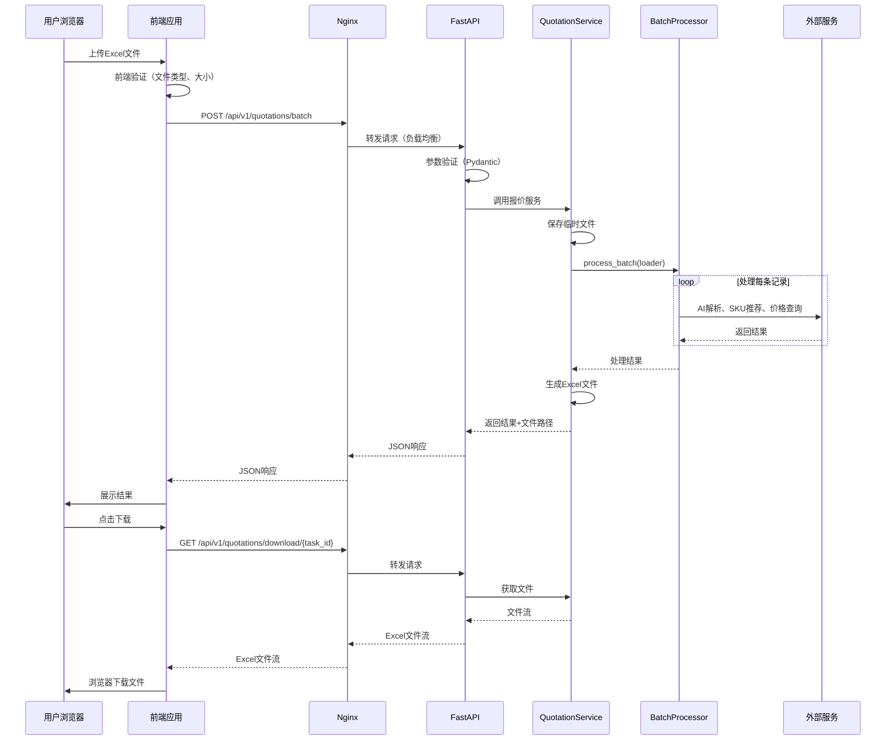

### 6.2 文件处理流程

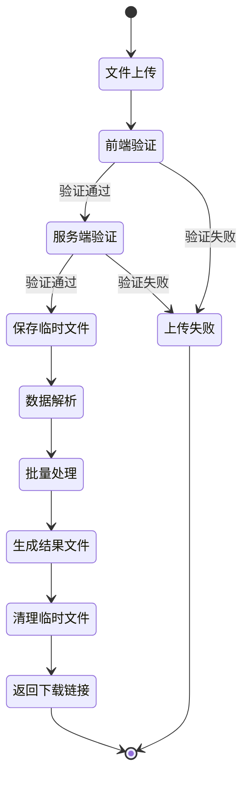

### 6.3 异步处理策略

对于大批量数据处理，设计异步任务机制：

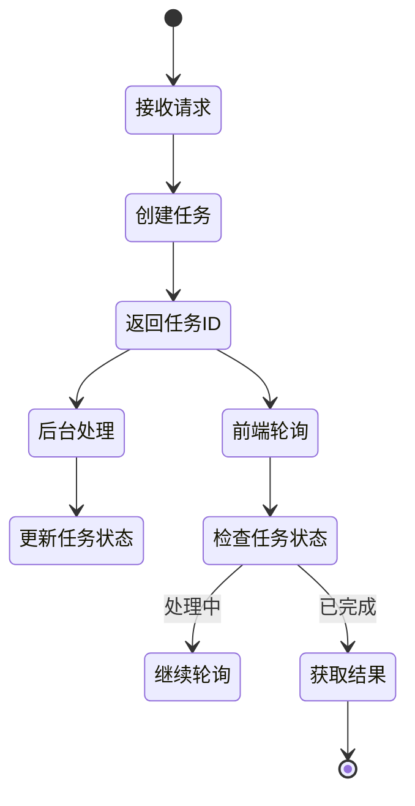

## 七、业务逻辑复用策略

### 7.1 核心服务复用

现有核心业务逻辑完全保留，无需重写：

| 现有模块 | 复用方式 | 调整内容 |
|---------|----------|----------|
| PricingService | 直接复用 | 调整导入路径 |
| SKURecommendService | 直接复用 | 调整导入路径 |
| BatchQuotationProcessor | 直接复用 | 调整导入路径 |
| SemanticParser | 直接复用 | 调整导入路径 |
| LLMDrivenExcelLoader | 直接复用 | 调整导入路径 |
| ResourceRequirement | 直接复用 | 调整导入路径 |

### 7.2 服务编排层设计

新增QuotationService作为服务编排层，封装现有BatchProcessor：

**职责**：
- 文件接收和验证
- 调用BatchQuotationProcessor处理业务逻辑
- 结果文件生成和管理
- 任务状态跟踪（可选）

**与BatchProcessor的关系**：
- QuotationService是外层封装，提供API友好的接口
- BatchQuotationProcessor保持不变，继续负责核心业务编排
- 遵循单一职责原则，各司其职

### 7.3 代码迁移策略

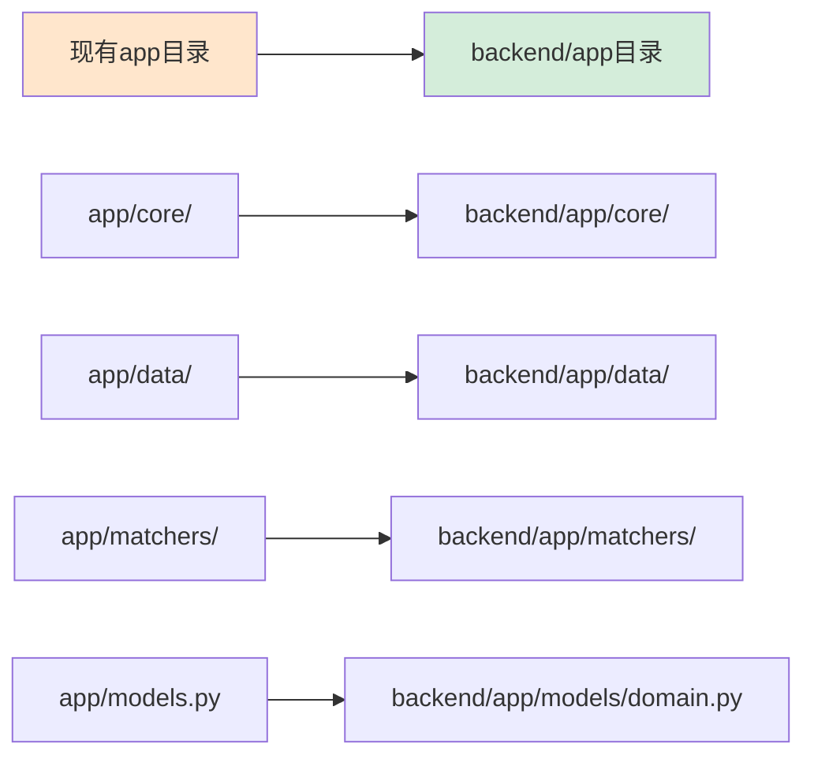

迁移步骤：
1. 创建backend目录结构
2. 复制现有app目录到backend/app
3. 调整导入语句（从相对导入改为绝对导入）
4. 新增API层、Schema层、Service层
5. 保持现有业务逻辑不变

## 八、部署方案设计

### 8.1 Nginx配置设计

Nginx负责：
- 反向代理FastAPI应用
- 服务前端静态资源
- 负载均衡（多worker）
- GZIP压缩
- 请求限流

配置要点：
| 配置项 | 值 | 说明 |
|--------|-----|------|
| upstream | 127.0.0.1:8000 | FastAPI应用地址 |
| location /api | proxy_pass到FastAPI | API请求转发 |
| location / | root前端构建目录 | 静态资源服务 |
| client_max_body_size | 10M | 限制上传文件大小 |

### 8.2 systemd服务配置

**quotation-api.service配置要点**：
| 配置项 | 值 | 说明 |
|--------|-----|------|
| WorkingDirectory | /root/Quotation_Pipeline/backend | 工作目录 |
| ExecStart | gunicorn启动命令 | 多worker模式 |
| Restart | always | 自动重启 |
| User | root | 运行用户 |

启动命令示例：
```
/root/Quotation_Pipeline/venv/bin/gunicorn main:app \
  -w 3 \
  -k uvicorn.workers.UvicornWorker \
  --bind 0.0.0.0:8000 \
  --access-logfile /var/log/quotation-api-access.log \
  --error-logfile /var/log/quotation-api-error.log
```

### 8.3 前端构建部署

**开发模式**：
- 运行开发服务器（npm run dev）
- 端口3000，支持热更新
- Nginx反向代理到3000端口

**生产模式**：
- 构建静态文件（npm run build）
- 输出到frontend/dist目录
- Nginx直接服务静态文件

### 8.4 部署流程

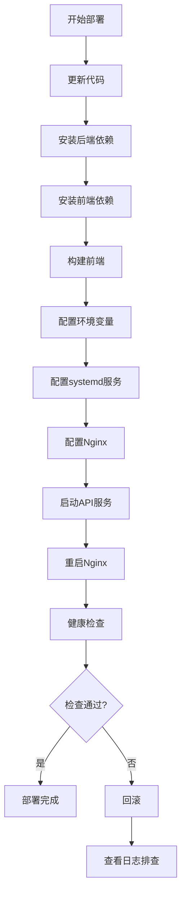

### 8.5 端口分配

| 服务 | 端口 | 说明 |
|------|------|------|
| Nginx | 80 | 对外HTTP端口 |
| FastAPI | 8000 | 内部API端口（不对外） |
| 前端开发服务器 | 3000 | 仅开发环境（生产环境不启动） |

## 九、前端界面设计

### 9.1 界面设计原则

- 保持极简风格，与现有Streamlit界面功能对等
- 仅保留核心功能：文件上传、区域选择、结果展示、文件下载
- 不增加额外复杂功能
- 响应式设计，适配桌面端

### 9.2 页面结构

单页面应用（SPA）：

| 区域 | 内容 | 组件 |
|------|------|------|
| 顶部 | 系统标题、Logo | Header |
| 左侧 | 配置面板（区域选择、计费模式展示） | ConfigPanel |
| 主区域 | 文件上传区、结果展示区 | UploadArea, ResultTable |
| 底部 | 版权信息 | Footer |

### 9.3 核心功能组件

**文件上传组件**：
- 拖拽上传支持
- 文件格式验证（.xlsx/.xls）
- 文件大小验证（最大10MB）
- 上传进度展示
- 错误提示

**区域选择组件**：
- 下拉选择框
- 区域列表从API动态加载
- 默认选中华北2（北京）

**结果展示组件**：
- 统计卡片（总条数、成功数、总价）
- 结果表格（支持排序、筛选）
- 下载按钮

### 9.4 交互流程

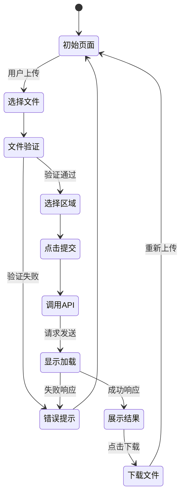

## 十、改造实施计划

### 10.1 实施阶段

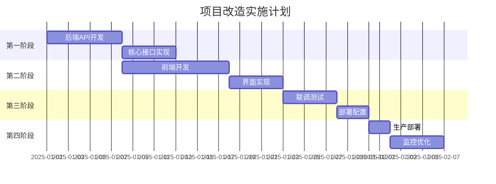

### 10.2 详细任务清单

**第一阶段：后端API开发（7天）**

| 任务 | 工作量 | 输出 |
|------|--------|------|
| 创建FastAPI项目结构 | 0.5天 | backend目录结构 |
| 实现核心API端点 | 2天 | quotations.py, regions.py |
| 实现服务编排层 | 1.5天 | quotation_service.py |
| 调整现有代码导入 | 1天 | 调整后的core/data/matchers模块 |
| 编写API单元测试 | 2天 | 测试代码 |

**第二阶段：前端开发（10天）**

| 任务 | 工作量 | 输出 |
|------|--------|------|
| 创建前端项目脚手架 | 0.5天 | frontend目录结构 |
| 实现文件上传组件 | 2天 | UploadArea组件 |
| 实现区域选择组件 | 1天 | ConfigPanel组件 |
| 实现结果展示组件 | 2天 | ResultTable组件 |
| API调用封装 | 1.5天 | api/quotation.js |
| 界面联调优化 | 3天 | 完整前端应用 |

**第三阶段：联调测试（5天）**

| 任务 | 工作量 | 输出 |
|------|--------|------|
| 接口联调测试 | 2天 | 测试报告 |
| 端到端测试 | 2天 | E2E测试用例 |
| 性能测试 | 1天 | 性能测试报告 |

**第四阶段：部署上线（5天）**

| 任务 | 工作量 | 输出 |
|------|--------|------|
| 编写部署脚本 | 1天 | deploy_fastapi.sh |
| 配置systemd和Nginx | 1天 | 配置文件 |
| 生产环境部署 | 1天 | 运行中的服务 |
| 监控和优化 | 2天 | 监控方案 |

### 10.3 风险控制

| 风险点 | 风险等级 | 缓解措施 |
|--------|----------|----------|
| 业务逻辑迁移出错 | 中 | 保留现有代码，仅调整导入；充分测试 |
| 前后端接口不匹配 | 中 | 使用API契约测试；及早联调 |
| 性能不达预期 | 低 | 性能测试验证；worker数量可调 |
| 部署失败 | 低 | 准备回滚方案；分步部署验证 |
| 内存不足 | 中 | 监控内存使用；调整worker数量 |

### 10.4 回滚方案

保留现有Streamlit应用作为备份：

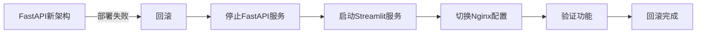

回滚步骤：
1. 停止quotation-api.service
2. 启动quotation-app.service（原Streamlit服务）
3. 恢复原Nginx配置
4. 验证访问正常
5. 保留新架构代码，待问题修复后再次部署

## 十一、性能优化策略

### 11.1 后端性能优化

| 优化点 | 实施方案 | 预期效果 |
|--------|----------|----------|
| 异步I/O | 使用async/await处理API调用 | 减少阻塞，提升并发能力 |
| 连接池 | 复用HTTP连接，减少握手开销 | 降低外部API调用延迟 |
| 响应压缩 | Nginx启用GZIP | 减少网络传输时间 |
| 静态资源缓存 | Nginx配置缓存头 | 减少重复请求 |
| 请求限流 | Nginx限流配置 | 保护系统稳定性 |

### 11.2 内存优化

| 优化点 | 实施方案 | 预期效果 |
|--------|----------|----------|
| Worker数量控制 | 3 workers配置 | 避免内存溢出 |
| 临时文件清理 | 处理完成后立即删除 | 释放磁盘空间 |
| 数据流式处理 | 大文件分批处理 | 降低峰值内存占用 |
| 垃圾回收优化 | 合理设置GC参数 | 减少内存碎片 |

### 11.3 并发性能估算

基于3 worker配置，并发处理能力估算：

| 指标 | 估算值 | 说明 |
|------|--------|------|
| 单请求处理时间 | 30秒 | 假设处理10条记录，每条3秒 |
| 单worker并发数 | 1 | 同步处理 |
| 总并发数 | 3 | 3个worker并行 |
| 每分钟处理请求数 | 6个 | 3 workers × 2次/分钟 |
| 每小时处理请求数 | 360个 | 足够中小规模使用 |

## 十二、监控和运维

### 12.1 监控指标

| 指标类别 | 具体指标 | 监控方式 |
|---------|----------|----------|
| 系统资源 | CPU使用率、内存使用率、磁盘I/O | 系统命令（top, free, iostat） |
| 应用性能 | API响应时间、请求成功率、错误率 | 日志分析 |
| 业务指标 | 每日处理量、成功率、平均处理时间 | 应用日志统计 |
| 外部依赖 | 阿里云API响应时间、LLM API响应时间 | 日志记录 |

### 12.2 日志管理

日志分类：
| 日志类型 | 文件路径 | 内容 |
|---------|----------|------|
| API访问日志 | /var/log/quotation-api-access.log | 请求时间、路径、状态码、响应时间 |
| API错误日志 | /var/log/quotation-api-error.log | 异常堆栈、错误详情 |
| 业务日志 | /var/log/quotation-business.log | 处理流程、外部API调用 |
| Nginx日志 | /var/log/nginx/access.log | HTTP请求日志 |

### 12.3 运维命令

常用运维命令：
| 操作 | 命令 |
|------|------|
| 查看API服务状态 | systemctl status quotation-api |
| 重启API服务 | systemctl restart quotation-api |
| 查看实时日志 | journalctl -u quotation-api -f |
| 查看错误日志 | tail -f /var/log/quotation-api-error.log |
| 查看进程资源 | ps aux \| grep gunicorn |
| 查看内存使用 | free -h |

## 十三、迁移对比

### 13.1 架构对比

| 维度 | Streamlit架构 | FastAPI架构 |
|------|---------------|-------------|
| 架构模式 | 单体应用 | 前后端分离 |
| 并发模型 | 单进程 | 多进程（3 workers） |
| API支持 | 无 | 完整RESTful API |
| 扩展性 | 低 | 高 |
| 维护性 | 中 | 高 |
| 部署复杂度 | 低 | 中 |

### 13.2 性能对比

| 指标 | Streamlit | FastAPI |
|------|-----------|---------|
| 并发处理能力 | 1个请求/次 | 3个请求/次 |
| 内存占用 | 约800MB | 约1.2GB（3 workers） |
| 响应时间 | 基准 | 基准（同等业务逻辑） |
| CPU利用率 | 单核 | 多核 |

### 13.3 功能对比

| 功能 | Streamlit | FastAPI |
|------|-----------|---------|
| Excel文件上传 | ✅ | ✅ |
| 区域选择 | ✅ | ✅ |
| 批量报价处理 | ✅ | ✅ |
| 结果展示 | ✅ | ✅ |
| Excel文件下载 | ✅ | ✅ |
| API接口 | ❌ | ✅ |
| 任务状态查询 | ❌ | ✅（可选） |
| 多端接入 | ❌ | ✅ |

### 13.4 开发效率对比

| 维度 | Streamlit | FastAPI |
|------|-----------|---------|
| 初始开发速度 | 快（一体化） | 中（需前后端协作） |
| 功能扩展速度 | 中（前后端耦合） | 快（前后端独立） |
| 团队协作 | 低（单体代码） | 高（前后端分离） |
| 代码复用 | 低 | 高（API可复用） |

## 十四、总结与建议

### 14.1 改造收益总结

**短期收益**：
- 并发处理能力提升3倍（1个→3个并发请求）
- 系统响应能力提升，充分利用多核CPU
- 提供标准API接口，支持多端接入

**长期收益**：
- 前后端分离，代码职责清晰，可维护性提升
- 支持前后端独立迭代和扩展
- API服务化，可支持移动端、第三方集成等场景
- 技术栈现代化，利于团队技术成长

### 14.2 实施建议

**推荐策略**：分步实施，降低风险

1. **第一步**：完成后端API开发和测试，确保功能完整
2. **第二步**：完成前端开发和联调，确保用户体验
3. **第三步**：在测试环境完整部署，验证性能和稳定性
4. **第四步**：生产环境部署，保留回滚方案

**关键成功因素**：
- 充分复用现有业务逻辑，降低迁移风险
- 严格控制worker数量，避免内存溢出
- 完善的测试覆盖，确保功能等价
- 完善的监控和日志，快速定位问题

### 14.3 后续优化方向

**性能优化**：
- 引入Redis缓存，缓存区域列表、SKU推荐结果等
- 异步任务队列（Celery），支持大批量数据处理
- 数据库持久化任务记录，支持历史查询

**功能扩展**：
- 用户认证和权限管理
- 批量任务历史记录
- 实时处理进度推送（WebSocket）
- 数据可视化分析

**运维优化**：
- Docker容器化部署
- CI/CD自动化部署流程
- 分布式部署（多节点负载均衡）
- 完善的监控告警体系

### 14.4 注意事项

**必须关注的风险点**：
1. **内存管理**：2G内存配置下，必须严格控制worker数量和内存使用
2. **业务逻辑一致性**：确保迁移后的业务逻辑与原系统完全一致
3. **外部依赖稳定性**：阿里云API和LLM服务的稳定性直接影响系统可用性
4. **临时文件清理**：及时清理上传和生成的临时文件，避免磁盘占满

**配置优化建议**：
- 初期使用3 workers配置
- 监控内存使用情况，必要时调整为2 workers
- 设置合理的请求超时时间（建议60秒）
- 配置Nginx请求限流，防止恶意攻击
