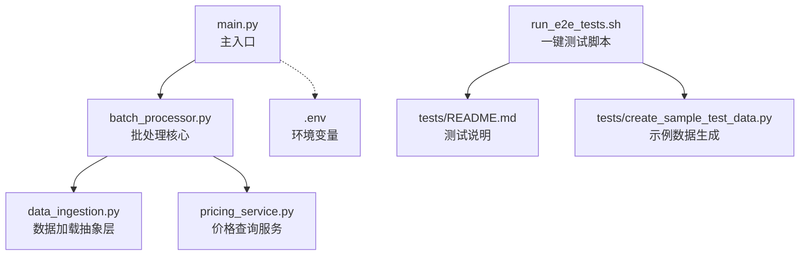
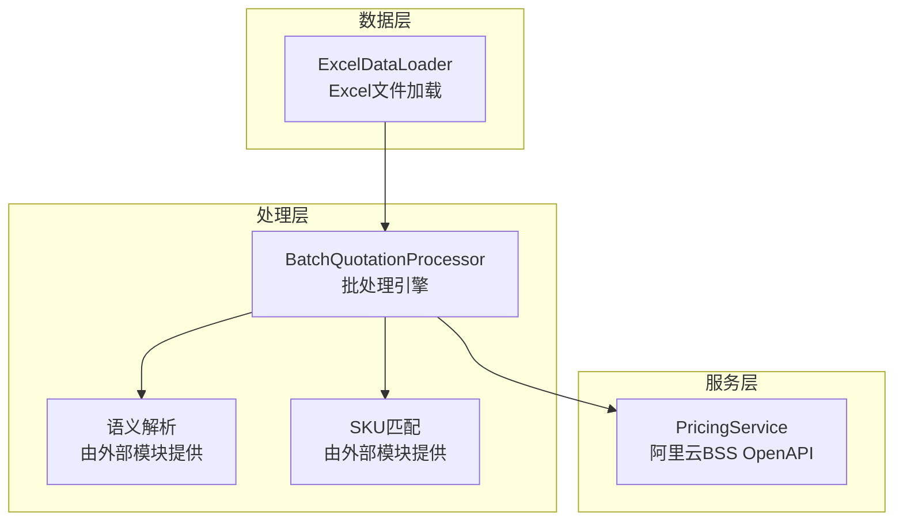
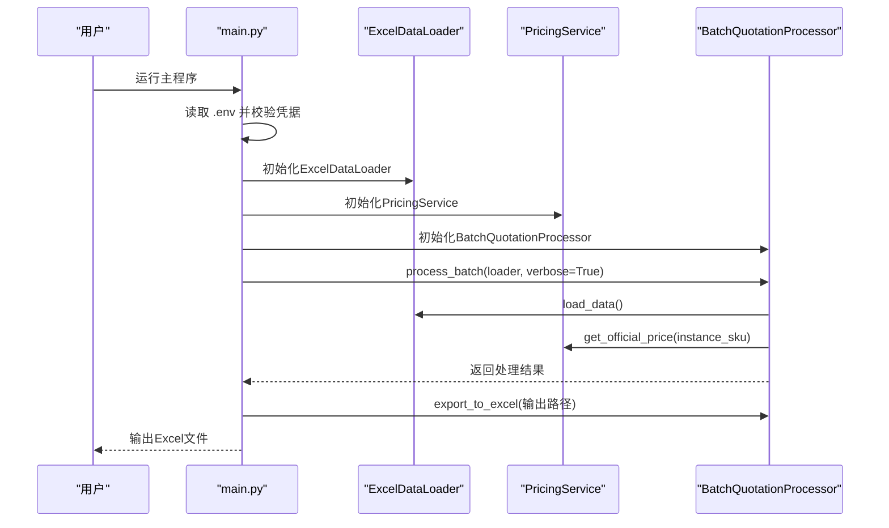
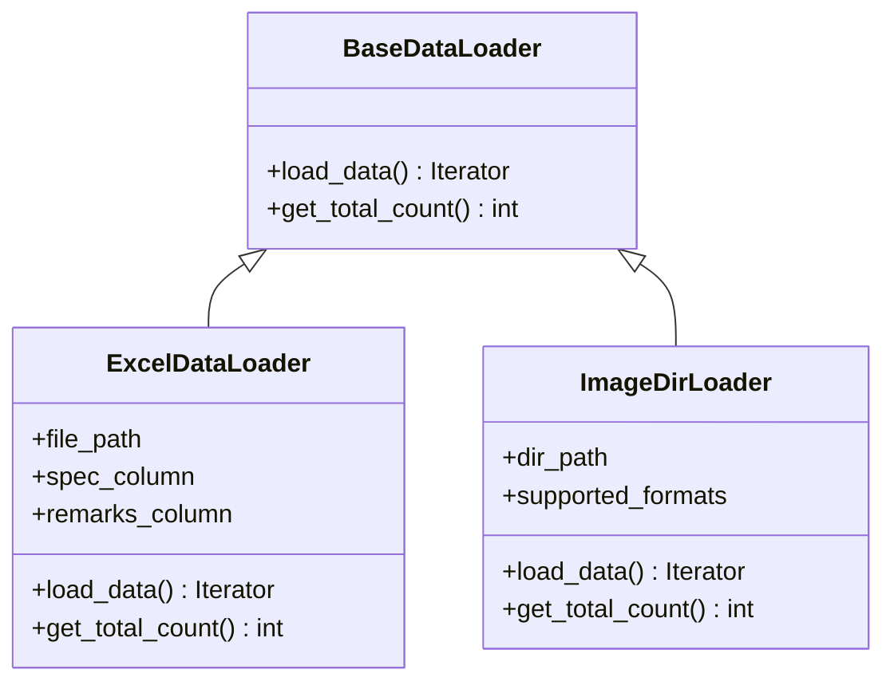
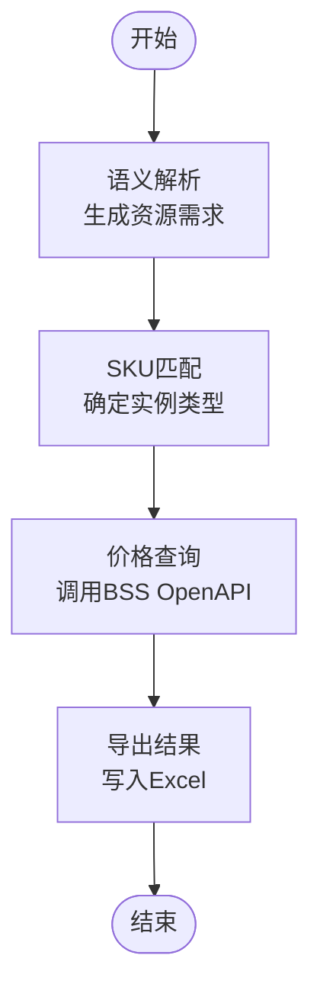
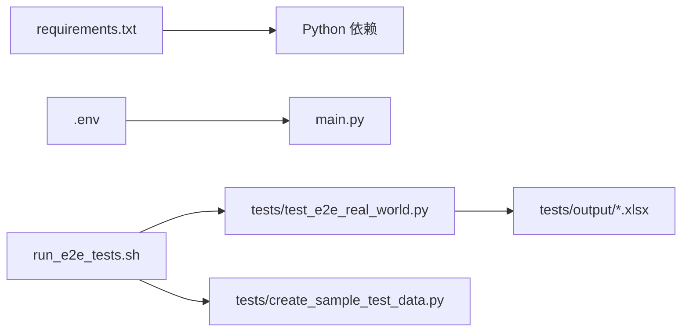

# 快速开始

<cite>
**本文引用的文件**
- [main.py](file://main.py)
- [requirements.txt](file://requirements.txt)
- [run_e2e_tests.sh](file://run_e2e_tests.sh)
- [tests/README.md](file://tests/README.md)
- [PHASE6_COMPLETION_SUMMARY.md](file://PHASE6_COMPLETION_SUMMARY.md)
- [tests/create_sample_test_data.py](file://tests/create_sample_test_data.py)
- [data_ingestion.py](file://data_ingestion.py)
- [batch_processor.py](file://batch_processor.py)
- [pricing_service.py](file://pricing_service.py)
</cite>

## 目录
1. [简介](#简介)
2. [项目结构](#项目结构)
3. [核心组件](#核心组件)
4. [架构概览](#架构概览)
5. [详细组件分析](#详细组件分析)
6. [依赖关系分析](#依赖关系分析)
7. [性能与资源](#性能与资源)
8. [故障排除指南](#故障排除指南)
9. [结论](#结论)
10. [附录](#附录)

## 简介
本指南面向首次接触报价管道系统的开发者，目标是在最短时间内完成环境准备、依赖安装、配置与运行，体验从“克隆仓库”到“看到输出结果”的完整流程。我们将重点介绍如何通过一键脚本验证安装正确性，并提供端到端示例，帮助你在本地快速上手。

## 项目结构
项目采用分层与模块化设计，核心入口为 main.py，批处理逻辑集中在 batch_processor.py，数据加载通过 data_ingestion.py 的抽象层实现，价格查询由 pricing_service.py 提供。测试与一键运行脚本位于 tests 与根目录。

图表来源
- [main.py](file://main.py#L1-L100)
- [batch_processor.py](file://batch_processor.py#L1-L200)
- [data_ingestion.py](file://data_ingestion.py#L1-L200)
- [pricing_service.py](file://pricing_service.py#L1-L81)
- [run_e2e_tests.sh](file://run_e2e_tests.sh#L1-L86)
- [tests/README.md](file://tests/README.md#L1-L276)
- [tests/create_sample_test_data.py](file://tests/create_sample_test_data.py#L1-L42)

章节来源
- [main.py](file://main.py#L1-L100)
- [run_e2e_tests.sh](file://run_e2e_tests.sh#L1-L86)

## 核心组件
- 主入口与批处理：main.py 负责初始化环境变量、构建数据加载器、价格服务与批处理器，并执行批量处理与结果导出。
- 数据加载抽象：data_ingestion.py 定义了 BaseDataLoader 抽象接口与 ExcelDataLoader 实现，支持未来扩展图像/语音等多模态输入。
- 批处理管线：batch_processor.py 实现“解析 → 匹配 → 询价”的三步流程，对任意数据源格式保持解耦。
- 价格查询：pricing_service.py 基于阿里云 BSS OpenAPI 提供官方价格查询能力。
- 一键测试：run_e2e_tests.sh 自动检查环境、准备测试数据并运行端到端测试，输出日志便于排错。

章节来源
- [main.py](file://main.py#L1-L100)
- [data_ingestion.py](file://data_ingestion.py#L1-L200)
- [batch_processor.py](file://batch_processor.py#L1-L200)
- [pricing_service.py](file://pricing_service.py#L1-L81)
- [run_e2e_tests.sh](file://run_e2e_tests.sh#L1-L86)

## 架构概览
报价管道采用“数据源抽象 + 批处理引擎 + 价格服务”的分层架构，核心在于通过抽象层屏蔽数据格式差异，使批处理逻辑与数据源解耦。

图表来源
- [batch_processor.py](file://batch_processor.py#L1-L200)
- [data_ingestion.py](file://data_ingestion.py#L1-L200)
- [pricing_service.py](file://pricing_service.py#L1-L81)

## 详细组件分析

### 主入口与运行流程（main.py）
- 功能要点
  - 从 .env 加载阿里云凭据，校验必填项。
  - 初始化 ExcelDataLoader、PricingService 与 BatchQuotationProcessor。
  - 执行批处理并将结果导出为 Excel。
- 关键行为
  - 输入/输出路径在代码中硬编码，便于快速运行。
  - 异常处理覆盖文件不存在与未知错误，保证可诊断性。

图表来源
- [main.py](file://main.py#L1-L100)
- [batch_processor.py](file://batch_processor.py#L1-L200)
- [pricing_service.py](file://pricing_service.py#L1-L81)
- [data_ingestion.py](file://data_ingestion.py#L1-L200)

章节来源
- [main.py](file://main.py#L1-L100)

### 数据加载抽象（data_ingestion.py）
- 抽象接口
  - BaseDataLoader 定义 load_data 与 get_total_count 两个抽象方法，确保批处理逻辑与数据格式无关。
- ExcelDataLoader
  - 从 Excel 读取数据，自动识别规格列与备注列，过滤空行并生成标准化的 QuotationRequest 流。
- 未来扩展
  - 提供 ImageDirLoader 的占位实现，展示如何扩展图像输入。

图表来源
- [data_ingestion.py](file://data_ingestion.py#L1-L200)

章节来源
- [data_ingestion.py](file://data_ingestion.py#L1-L200)

### 批处理引擎（batch_processor.py）
- 流程
  - 解析：将 QuotationRequest 转换为资源需求（CPU/内存/存储/环境/负载类型）。
  - 匹配：根据资源需求匹配最佳实例 SKU 与实例族。
  - 询价：调用 PricingService 获取官方价格（按月计费）。
- 错误处理
  - 对未实现的多模态功能、API 错误与通用异常进行分类处理，保留错误信息并继续后续处理。

图表来源
- [batch_processor.py](file://batch_processor.py#L1-L200)
- [pricing_service.py](file://pricing_service.py#L1-L81)

章节来源
- [batch_processor.py](file://batch_processor.py#L1-L200)

### 价格查询服务（pricing_service.py）
- 功能
  - 基于阿里云 BSS OpenAPI 的 GetSubscriptionPrice 接口查询官方价格。
  - 默认区域与计费周期在实现中内定，简化调用参数。
- 注意
  - 该模块依赖阿里云 SDK，需正确配置凭据。

章节来源
- [pricing_service.py](file://pricing_service.py#L1-L81)

## 依赖关系分析
- 运行依赖
  - 通过 requirements.txt 安装第三方库，包括阿里云 SDK、pandas、openpyxl、python-dotenv 等。
- 环境变量
  - main.py 依赖 .env 中的阿里云凭据；run_e2e_tests.sh 同时检查 .env 并提示缺失时的处理方式。
- 测试与示例数据
  - run_e2e_tests.sh 会在测试数据缺失时自动调用 create_sample_test_data.py 生成示例数据。

图表来源
- [requirements.txt](file://requirements.txt#L1-L9)
- [run_e2e_tests.sh](file://run_e2e_tests.sh#L1-L86)
- [tests/create_sample_test_data.py](file://tests/create_sample_test_data.py#L1-L42)

章节来源
- [requirements.txt](file://requirements.txt#L1-L9)
- [run_e2e_tests.sh](file://run_e2e_tests.sh#L1-L86)

## 性能与资源
- 执行效率
  - 环境检查与连通性测试通常在数秒内完成；批量处理时间随数据量线性增长。
- 资源使用
  - 每行数据触发一次 AI 解析与一次价格查询；网络与内存占用取决于 Excel 文件规模。
- 建议
  - 在本地运行时优先使用少量样本数据验证流程，再逐步扩大规模。

[本节为通用性能讨论，不直接分析具体文件]

## 故障排除指南
- 环境变量未配置
  - 现象：启动时报错提示缺少凭据。
  - 处理：在项目根目录创建 .env 文件，填写阿里云与 DashScope 的 API Key。
- 缺少测试数据
  - 现象：测试脚本提示未找到 Excel 文件。
  - 处理：运行示例数据生成脚本，或将自定义 Excel 放入 tests/data/xlsx/ 目录。
- API 调用失败
  - 现象：网络不稳定或配额不足导致调用失败。
  - 处理：检查网络、确认密钥有效并确保账户配额充足。
- 文件路径错误
  - 现象：找不到输入文件或输出目录不存在。
  - 处理：确认 main.py 中的输入/输出路径与实际文件一致。

章节来源
- [tests/README.md](file://tests/README.md#L1-L276)
- [PHASE6_COMPLETION_SUMMARY.md](file://PHASE6_COMPLETION_SUMMARY.md#L1-L600)

## 结论
通过本快速开始指南，你可以在几分钟内完成环境准备、依赖安装与一键测试，验证系统安装正确性并获得首批报价结果。建议在本地先用示例数据跑通全流程，再接入自有数据进行生产验证。

[本节为总结性内容，不直接分析具体文件]

## 附录

### 端到端示例（从零到结果）
- 步骤1：准备环境
  - 安装依赖：pip install -r requirements.txt
  - 准备 .env 文件（包含阿里云与 DashScope 的 API Key）
- 步骤2：准备测试数据
  - 方法A：使用示例数据生成脚本
    - python3 tests/create_sample_test_data.py
  - 方法B：将你的 Excel 放入 tests/data/xlsx/ 目录
- 步骤3：运行一键测试
  - ./run_e2e_tests.sh
  - 或者直接运行测试脚本：python3 tests/test_e2e_real_world.py
- 步骤4：查看输出
  - 在 tests/output/ 目录查看生成的报价结果 Excel 文件
  - 如需详细日志，查看 logs/e2e_test_run_*.log

章节来源
- [tests/README.md](file://tests/README.md#L1-L276)
- [PHASE6_COMPLETION_SUMMARY.md](file://PHASE6_COMPLETION_SUMMARY.md#L1-L600)
- [run_e2e_tests.sh](file://run_e2e_tests.sh#L1-L86)
- [tests/create_sample_test_data.py](file://tests/create_sample_test_data.py#L1-L42)

### 运行 main.py 的命令
- 直接运行主程序：python3 main.py
- 注意：main.py 默认使用 tests/data/xlsx/input_sample.xlsx 作为输入，tests/output/output_quoted.xlsx 作为输出。如需自定义，请在运行前准备相应文件或调整路径。

章节来源
- [main.py](file://main.py#L1-L100)