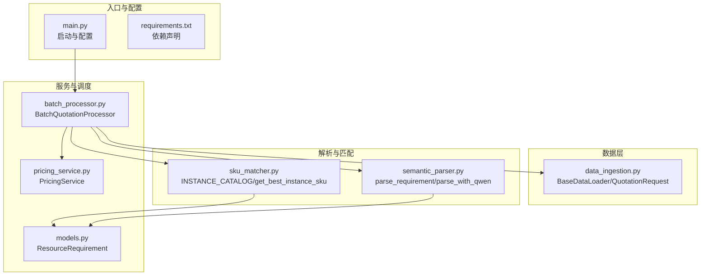
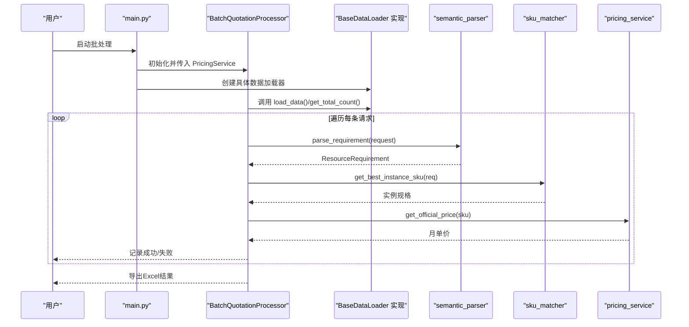
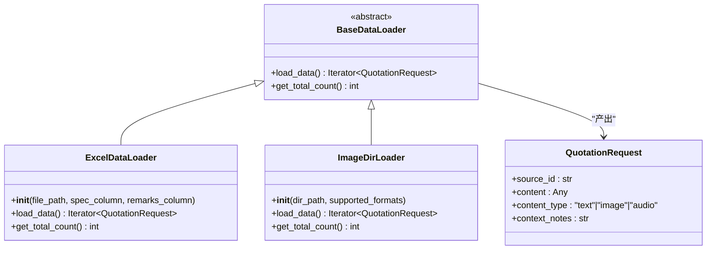
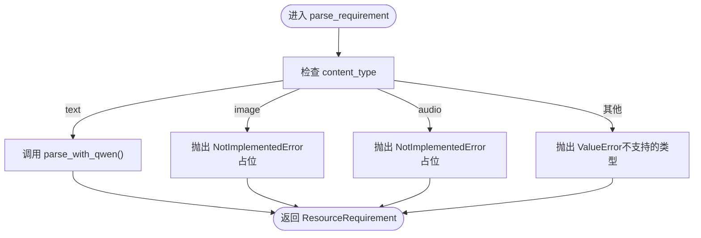
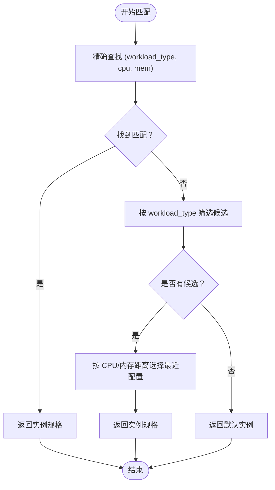
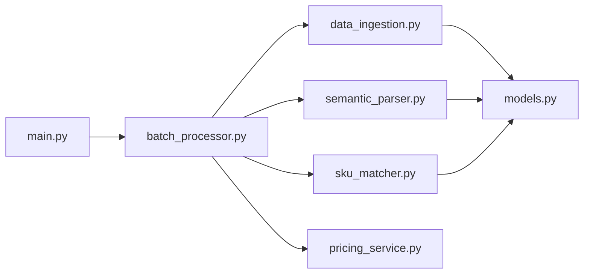

# 扩展开发

<cite>
**本文引用的文件**
- [main.py](file://main.py)
- [batch_processor.py](file://batch_processor.py)
- [data_ingestion.py](file://data_ingestion.py)
- [semantic_parser.py](file://semantic_parser.py)
- [sku_matcher.py](file://sku_matcher.py)
- [pricing_service.py](file://pricing_service.py)
- [models.py](file://models.py)
- [tests/test_e2e_real_world.py](file://tests/test_e2e_real_world.py)
- [tests/create_sample_test_data.py](file://tests/create_sample_test_data.py)
- [requirements.txt](file://requirements.txt)
</cite>

## 目录
1. [简介](#简介)
2. [项目结构](#项目结构)
3. [核心组件](#核心组件)
4. [架构总览](#架构总览)
5. [详细组件分析](#详细组件分析)
6. [依赖关系分析](#依赖关系分析)
7. [性能考量](#性能考量)
8. [故障排查指南](#故障排查指南)
9. [结论](#结论)
10. [附录](#附录)

## 简介
本指南面向希望为报价管道系统添加新功能的开发者，重点围绕以下两个扩展方向：
- 通过继承 BaseDataLoader 抽象基类，新增多模态数据源（如图像、语音）的输入适配器，保持批处理管线“格式无关”的特性。
- 在 sku_matcher.py 中扩展 INSTANCE_CATALOG 或自定义匹配策略，以支持新的实例规格与工作负载类型。

同时，文档提供完整的扩展步骤、最佳实践与常见陷阱提示，并通过图示帮助理解数据流与控制流。

## 项目结构
系统采用分层架构，核心由“数据加载层”“语义解析层”“SKU 匹配层”“定价服务层”和“批处理调度层”组成。数据加载层通过抽象接口屏蔽不同输入格式；语义解析层负责将非结构化输入转化为标准化 ResourceRequirement；SKU 匹配层将资源需求映射为具体实例规格；定价服务层对接阿里云官方计费接口；批处理调度层串联上述组件并导出结果。

图表来源
- [main.py](file://main.py#L1-L100)
- [batch_processor.py](file://batch_processor.py#L1-L244)
- [data_ingestion.py](file://data_ingestion.py#L1-L204)
- [semantic_parser.py](file://semantic_parser.py#L1-L349)
- [sku_matcher.py](file://sku_matcher.py#L1-L134)
- [pricing_service.py](file://pricing_service.py#L1-L81)
- [models.py](file://models.py#L1-L54)
- [requirements.txt](file://requirements.txt#L1-L9)

章节来源
- [main.py](file://main.py#L1-L100)
- [batch_processor.py](file://batch_processor.py#L1-L244)
- [data_ingestion.py](file://data_ingestion.py#L1-L204)
- [semantic_parser.py](file://semantic_parser.py#L1-L349)
- [sku_matcher.py](file://sku_matcher.py#L1-L134)
- [pricing_service.py](file://pricing_service.py#L1-L81)
- [models.py](file://models.py#L1-L54)
- [requirements.txt](file://requirements.txt#L1-L9)

## 核心组件
- 数据加载层（BaseDataLoader 抽象与具体实现）
  - 抽象接口：load_data() 与 get_total_count()，确保批处理器与输入格式解耦。
  - 现有实现：ExcelDataLoader（文本输入）、ImageDirLoader（占位，未来扩展图像输入）。
- 语义解析层（semantic_parser）
  - parse_requirement：根据 content_type 分派到不同解析策略；当前支持 text，image/audio 为占位。
  - parse_with_qwen：基于 DashScope Qwen-Max 的智能解析，带缓存与回退规则。
- SKU 匹配层（sku_matcher）
  - INSTANCE_CATALOG：按 (workload_type, cpu_cores, memory_gb) 映射实例规格。
  - get_best_instance_sku：精确匹配、降级匹配、兜底策略。
- 定价服务层（pricing_service）
  - PricingService：封装阿里云 BSS OpenAPI，查询实例月单价。
- 批处理调度层（batch_processor）
  - BatchQuotationProcessor：串联解析、匹配、定价三步，导出 Excel 结果。

章节来源
- [data_ingestion.py](file://data_ingestion.py#L32-L204)
- [semantic_parser.py](file://semantic_parser.py#L25-L218)
- [sku_matcher.py](file://sku_matcher.py#L15-L134)
- [pricing_service.py](file://pricing_service.py#L13-L81)
- [batch_processor.py](file://batch_processor.py#L18-L244)
- [models.py](file://models.py#L10-L54)

## 架构总览
下图展示了从输入到输出的完整流程，以及扩展点位置。

图表来源
- [main.py](file://main.py#L51-L90)
- [batch_processor.py](file://batch_processor.py#L42-L165)
- [semantic_parser.py](file://semantic_parser.py#L25-L218)
- [sku_matcher.py](file://sku_matcher.py#L45-L103)
- [pricing_service.py](file://pricing_service.py#L28-L81)
- [data_ingestion.py](file://data_ingestion.py#L32-L204)

## 详细组件分析

### 数据加载器扩展：新增 BaseDataLoader 子类
目标：为图像或语音等新输入格式提供统一的 QuotationRequest 流，使批处理器无需改动即可接入。

扩展步骤
1. 定义新类并继承 BaseDataLoader，实现 load_data() 与 get_total_count()。
2. 在 load_data() 中将具体输入（如图片路径、音频文件路径）封装为 QuotationRequest，content_type 设置为 "image" 或 "audio"。
3. 在 main.py 或业务入口处，将批处理器与新加载器组合使用，其余流程自动复用现有解析与匹配逻辑。

注意事项
- content_type 必须与语义解析层的分支逻辑一致，否则会触发 NotImplementedError。
- 对于图像/语音输入，建议在语义解析层增加对应的分支，以实现 OCR/ASR + 文本解析的链路。
- get_total_count() 应准确统计有效样本数量，以便进度与统计。

图表来源
- [data_ingestion.py](file://data_ingestion.py#L32-L204)
- [models.py](file://models.py#L10-L54)

章节来源
- [data_ingestion.py](file://data_ingestion.py#L32-L204)
- [models.py](file://models.py#L10-L54)

### 语义解析扩展：支持图像/语音输入
当前实现仅支持 text 类型；image/audio 类型抛出 NotImplementedError，作为未来集成点。

扩展步骤
1. 在 semantic_parser.parse_requirement 中增加对 "image"/"audio" 的分支。
2. 对于图像：调用视觉模型（如 Qwen-VL）提取文本描述，再走 parse_with_qwen。
3. 对于语音：先做 ASR，再走 parse_with_qwen。
4. 为每种 content_type 提供清晰的错误消息与回退策略。

图表来源
- [semantic_parser.py](file://semantic_parser.py#L25-L69)

章节来源
- [semantic_parser.py](file://semantic_parser.py#L25-L69)

### SKU 匹配扩展：更新 INSTANCE_CATALOG 与匹配策略
目标：为新增实例规格提供精确/降级/兜底匹配能力。

扩展步骤
1. 在 sku_matcher.py 的 INSTANCE_CATALOG 中新增键值对：键为 (workload_type, cpu_cores, memory_gb)，值为实例规格代码。
2. 如需更复杂的匹配规则，可在 get_best_instance_sku 中扩展候选集筛选与距离度量逻辑。
3. 若存在跨系列的近似匹配需求，可增加额外的降级策略（如优先同系列，再跨系列）。

图表来源
- [sku_matcher.py](file://sku_matcher.py#L45-L103)

章节来源
- [sku_matcher.py](file://sku_matcher.py#L15-L134)

### 批处理流程与导出
- 批处理器按序执行：解析 -> 匹配 -> 定价，捕获 NotImplementedError、API 异常与一般异常，记录错误并继续处理。
- 支持导出 Excel，包含原始内容、规格摘要、匹配实例、价格与状态等字段。

章节来源
- [batch_processor.py](file://batch_processor.py#L42-L244)

## 依赖关系分析
- 模块内聚与耦合
  - data_ingestion 与 models：前者产出后者模型，耦合度低，职责清晰。
  - semantic_parser 依赖 models 的 ResourceRequirement，同时依赖外部 DashScope API。
  - sku_matcher 依赖 models 的 ResourceRequirement，内部纯函数，无外部依赖。
  - pricing_service 依赖阿里云 SDK，对外暴露简洁方法。
  - batch_processor 串联各模块，是控制流中心，但不持有业务数据。
- 外部依赖
  - 阿里云 BSS OpenAPI、DashScope Qwen-Max、pandas/openpyxl、requests 等。

图表来源
- [batch_processor.py](file://batch_processor.py#L1-L244)
- [data_ingestion.py](file://data_ingestion.py#L1-L204)
- [semantic_parser.py](file://semantic_parser.py#L1-L349)
- [sku_matcher.py](file://sku_matcher.py#L1-L134)
- [pricing_service.py](file://pricing_service.py#L1-L81)
- [models.py](file://models.py#L1-L54)
- [main.py](file://main.py#L1-L100)

章节来源
- [batch_processor.py](file://batch_processor.py#L1-L244)
- [data_ingestion.py](file://data_ingestion.py#L1-L204)
- [semantic_parser.py](file://semantic_parser.py#L1-L349)
- [sku_matcher.py](file://sku_matcher.py#L1-L134)
- [pricing_service.py](file://pricing_service.py#L1-L81)
- [models.py](file://models.py#L1-L54)
- [main.py](file://main.py#L1-L100)

## 性能考量
- 解析缓存：semantic_parser 已内置 LLM 结果缓存，减少重复调用 DashScope 的 token 消耗。
- 批处理并发：当前实现为顺序处理，若需提升吞吐，可在 load_data() 侧引入异步/并发加载与解析队列。
- API 调用：pricing_service 的调用次数与请求体大小成正比，建议合并请求或使用批量查询接口（如可用）。
- 数据规模：ExcelDataLoader 一次性读取整表，大文件建议分页或流式读取；ImageDirLoader 遍历目录，注意 IO 与文件数限制。

## 故障排查指南
常见问题与定位
- 环境变量缺失
  - 现象：启动时报错或 API 调用失败。
  - 排查：确认 .env 文件中 ALIBABA_CLOUD_ACCESS_KEY_ID/SECRET 与 DASHSCOPE_API_KEY 已设置。
- 不支持的 content_type
  - 现象：parse_requirement 抛出 NotImplementedError 或 ValueError。
  - 排查：检查 QuotationRequest.content_type 是否为 "text"/"image"/"audio" 之一。
- SKU 未匹配
  - 现象：返回默认实例或日志警告。
  - 排查：检查 INSTANCE_CATALOG 是否包含所需键；必要时扩展匹配策略。
- API 返回异常
  - 现象：批处理阶段出现 API 错误。
  - 排查：查看批处理器捕获的 TeaException 与错误信息，确认实例规格与区域参数。

章节来源
- [main.py](file://main.py#L31-L50)
- [semantic_parser.py](file://semantic_parser.py#L44-L69)
- [batch_processor.py](file://batch_processor.py#L144-L165)
- [tests/test_e2e_real_world.py](file://tests/test_e2e_real_world.py#L101-L149)

## 结论
通过抽象数据加载接口与清晰的解析/匹配/定价分层，系统具备良好的扩展性。新增数据源与实例规格的两条主线路径清晰：前者通过继承 BaseDataLoader 并在解析层补齐多模态分支；后者通过扩展 INSTANCE_CATALOG 与匹配策略即可覆盖。遵循本文最佳实践与陷阱规避建议，可快速、稳健地完成扩展开发。

## 附录

### 最佳实践清单
- 新增数据源
  - 严格遵守 BaseDataLoader 接口契约，确保 load_data() 与 get_total_count() 一致性。
  - 在 main.py 或业务入口中替换加载器，避免修改批处理器。
  - 为新 content_type 在 semantic_parser 中预留分支，逐步实现 OCR/ASR + 文本解析。
- 新增实例规格
  - 在 sku_matcher.py 中补充 INSTANCE_CATALOG 条目，键值规范为 (workload_type, cpu_cores, memory_gb)。
  - 如需复杂匹配，扩展 get_best_instance_sku 的候选集与评分逻辑。
- 错误处理
  - 批处理阶段捕获 NotImplementedError、API 异常与通用异常，记录错误并继续处理，保证批处理完整性。
- 性能优化
  - 利用 semantic_parser 的缓存机制，减少重复调用。
  - 对大文件与大量图片，考虑分页/并发与本地缓存策略。

### 示例：创建新的数据加载器
- 步骤概览
  - 定义新类并继承 BaseDataLoader，实现 load_data() 与 get_total_count()。
  - 在 main.py 中将批处理器与新加载器组合使用。
  - 如需支持图像/语音，扩展 semantic_parser 的分支逻辑。
- 参考路径
  - [data_ingestion.py](file://data_ingestion.py#L32-L204)
  - [main.py](file://main.py#L51-L90)
  - [semantic_parser.py](file://semantic_parser.py#L25-L69)

### 示例：扩展 INSTANCE_CATALOG 与匹配策略
- 步骤概览
  - 在 sku_matcher.py 中新增实例规格映射。
  - 如需更灵活的匹配，扩展 get_best_instance_sku 的候选筛选与距离计算。
- 参考路径
  - [sku_matcher.py](file://sku_matcher.py#L15-L103)

### 示例：端到端验证与测试数据准备
- 端到端测试
  - 使用 tests/test_e2e_real_world.py 进行真实 API 连通性与批处理验证。
- 测试数据准备
  - 使用 tests/create_sample_test_data.py 生成示例 Excel 输入。
- 参考路径
  - [tests/test_e2e_real_world.py](file://tests/test_e2e_real_world.py#L1-L564)
  - [tests/create_sample_test_data.py](file://tests/create_sample_test_data.py#L1-L42)