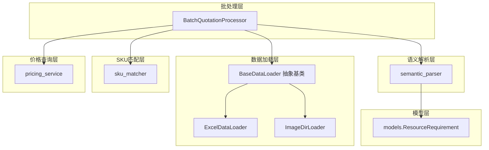
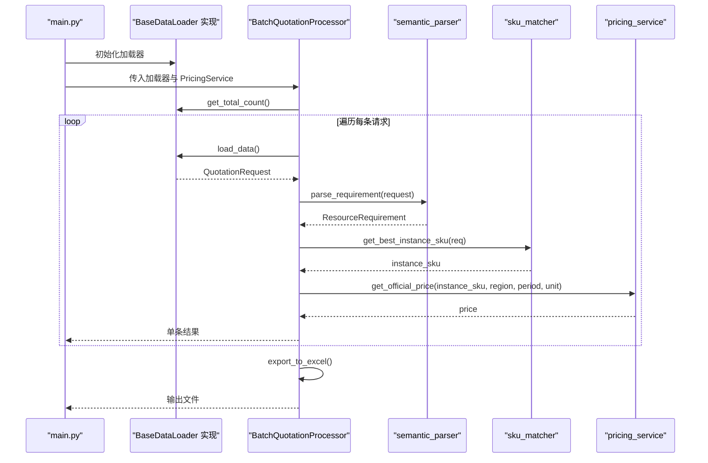
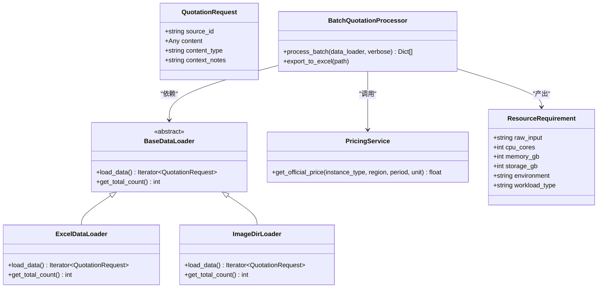
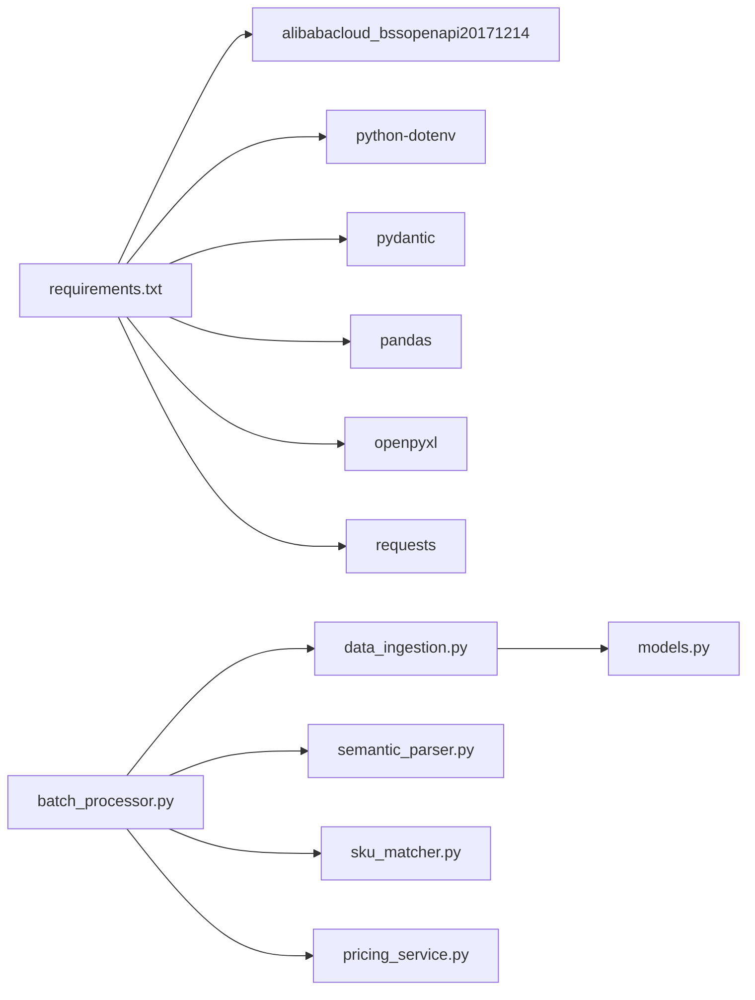
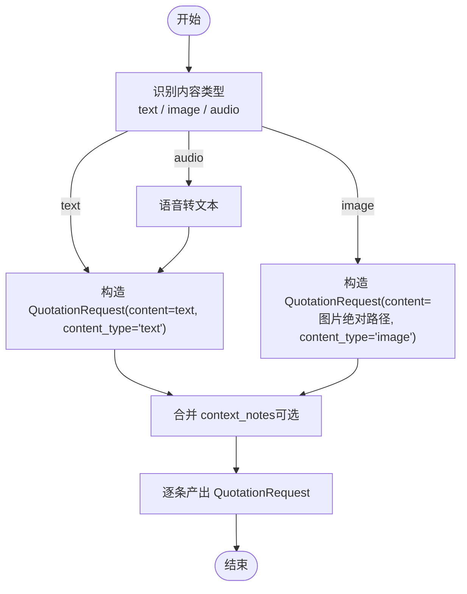

# 新数据源支持

<cite>
**本文引用的文件**
- [main.py](file://main.py)
- [data_ingestion.py](file://data_ingestion.py)
- [batch_processor.py](file://batch_processor.py)
- [semantic_parser.py](file://semantic_parser.py)
- [sku_matcher.py](file://sku_matcher.py)
- [pricing_service.py](file://pricing_service.py)
- [models.py](file://models.py)
- [requirements.txt](file://requirements.txt)
- [tests/README.md](file://tests/README.md)
- [PHASE6_COMPLETION_SUMMARY.md](file://PHASE6_COMPLETION_SUMMARY.md)
</cite>

## 目录
1. [简介](#简介)
2. [项目结构](#项目结构)
3. [核心组件](#核心组件)
4. [架构总览](#架构总览)
5. [详细组件分析](#详细组件分析)
6. [依赖关系分析](#依赖关系分析)
7. [性能考量](#性能考量)
8. [故障排查指南](#故障排查指南)
9. [结论](#结论)
10. [附录](#附录)

## 简介
本指南面向希望扩展系统以支持新数据源的开发者。系统通过抽象基类 BaseDataLoader 将“数据加载”与“批处理管线”解耦，使得新增数据源（如图像目录、语音转录文本等）无需改动批处理逻辑即可接入。本文将：
- 详解 BaseDataLoader 的 load_data 与 get_total_count 两个抽象方法的实现要求；
- 展示如何将非结构化数据（图像、语音转录文本）转换为标准的 QuotationRequest；
- 提供实现 ImageDirLoader 的完整步骤与注意事项；
- 说明如何在 main.py 中注册新加载器并与批处理流程兼容；
- 覆盖常见问题（数据格式不一致、性能瓶颈、内存管理）及最佳实践。

## 项目结构
系统采用分层架构：
- 数据加载层：抽象 BaseDataLoader，具体实现 ExcelDataLoader、ImageDirLoader 等；
- 批处理层：BatchQuotationProcessor 通过 BaseDataLoader 接口消费数据；
- 语义解析层：semantic_parser 将 QuotationRequest 解析为 ResourceRequirement；
- SKU 匹配层：sku_matcher 将 ResourceRequirement 映射为实例规格；
- 价格查询层：pricing_service 调用阿里云 BSS OpenAPI 获取官方价格；
- 模型层：models 定义标准化的数据结构（如 ResourceRequirement）。

图表来源
- [data_ingestion.py](file://data_ingestion.py#L32-L61)
- [data_ingestion.py](file://data_ingestion.py#L63-L147)
- [data_ingestion.py](file://data_ingestion.py#L153-L204)
- [batch_processor.py](file://batch_processor.py#L18-L165)
- [semantic_parser.py](file://semantic_parser.py#L25-L69)
- [sku_matcher.py](file://sku_matcher.py#L15-L103)
- [pricing_service.py](file://pricing_service.py#L13-L81)
- [models.py](file://models.py#L10-L54)

章节来源
- [data_ingestion.py](file://data_ingestion.py#L1-L204)
- [batch_processor.py](file://batch_processor.py#L1-L244)
- [semantic_parser.py](file://semantic_parser.py#L1-L349)
- [sku_matcher.py](file://sku_matcher.py#L1-L134)
- [pricing_service.py](file://pricing_service.py#L1-L81)
- [models.py](file://models.py#L1-L54)

## 核心组件
- BaseDataLoader：定义 load_data 与 get_total_count 两个抽象方法，作为数据加载器的统一接口。
- QuotationRequest：标准化的报价请求载体，包含 source_id、content、content_type、context_notes。
- ExcelDataLoader：现有实现，将 Excel 行转换为 QuotationRequest。
- ImageDirLoader：未来扩展点，遍历目录中的图片文件并封装为 QuotationRequest。
- BatchQuotationProcessor：批处理核心，按顺序执行解析、匹配、定价，并导出结果。
- semantic_parser：将 QuotationRequest 转换为 ResourceRequirement；当前支持 text 类型，image/audio 为占位。
- sku_matcher：基于 ResourceRequirement 选择实例规格。
- pricing_service：调用阿里云 BSS OpenAPI 获取官方价格。
- models：定义 ResourceRequirement 标准模型。

章节来源
- [data_ingestion.py](file://data_ingestion.py#L13-L61)
- [data_ingestion.py](file://data_ingestion.py#L63-L147)
- [data_ingestion.py](file://data_ingestion.py#L153-L204)
- [batch_processor.py](file://batch_processor.py#L18-L165)
- [semantic_parser.py](file://semantic_parser.py#L25-L69)
- [sku_matcher.py](file://sku_matcher.py#L15-L103)
- [pricing_service.py](file://pricing_service.py#L13-L81)
- [models.py](file://models.py#L10-L54)

## 架构总览
系统通过 BaseDataLoader 抽象层屏蔽数据源差异，批处理层只依赖该接口，从而实现“零代码变更”的多模态支持。

图表来源
- [main.py](file://main.py#L51-L79)
- [batch_processor.py](file://batch_processor.py#L42-L165)
- [semantic_parser.py](file://semantic_parser.py#L25-L69)
- [sku_matcher.py](file://sku_matcher.py#L45-L103)
- [pricing_service.py](file://pricing_service.py#L28-L81)

## 详细组件分析

### BaseDataLoader 抽象基类与实现要求
- load_data 方法
  - 返回类型：迭代器（Iterator[QuotationRequest]），逐条产出标准化请求对象；
  - 语义：将底层数据源（Excel、图片目录、语音文本等）转换为统一的 QuotationRequest；
  - 注意：应避免一次性加载全部数据，优先惰性生成，降低内存占用。
- get_total_count 方法
  - 返回类型：int，用于批处理进度显示；
  - 语义：返回有效数据条目数量（非空、可解析的条目）；
  - 注意：若底层数据源无法精确统计，可返回估算值，但需保证与 load_data 产出一致。

章节来源
- [data_ingestion.py](file://data_ingestion.py#L32-L61)

### QuotationRequest 数据模型
- 字段含义
  - source_id：数据来源标识（如 Excel 行号、图片文件名）；
  - content：主要内容（文本、图片路径、音频路径等）；
  - content_type：内容类型（"text"、"image"、"audio"）；
  - context_notes：补充备注信息（可用于提升解析质量）。
- 用途：作为上游解析与下游匹配、定价的统一数据载体。

章节来源
- [data_ingestion.py](file://data_ingestion.py#L13-L31)

### ExcelDataLoader 实现要点
- 初始化校验：文件存在性与列名合法性；
- 惰性加载：首次使用时才读取 Excel；
- 数据清洗：过滤空行，可选列缺失时填充默认值；
- 产出规范：每行产出一个 QuotationRequest，content_type 为 "text"。

章节来源
- [data_ingestion.py](file://data_ingestion.py#L63-L147)

### ImageDirLoader 实现步骤（面向扩展）
- 目标：将图片目录中的图片文件转换为 QuotationRequest，content_type 为 "image"；
- 步骤概览
  - 1) 参数与校验：接收目录路径与支持的图片格式元组，校验目录存在性；
  - 2) 实现 load_data：遍历目录，筛选支持格式文件，按文件名排序，逐个产出 QuotationRequest（content 为绝对路径，content_type="image"）；
  - 3) 实现 get_total_count：统计支持格式文件数量；
  - 4) 异常处理：目录无效、IO 错误等；
  - 5) 与解析器兼容：当前 semantic_parser 对 image 类型抛出 NotImplementedError，需在后续版本中接入视觉模型（OCR/多模态理解）。

章节来源
- [data_ingestion.py](file://data_ingestion.py#L153-L204)
- [semantic_parser.py](file://semantic_parser.py#L43-L57)

### 语义解析与多模态扩展
- 现状：parse_requirement 对 content_type="text" 调用 Qwen-Max；对 "image"/"audio" 抛出 NotImplementedError；
- 扩展建议：在 image 分支中接入视觉模型（如 Qwen-VL），先 OCR/理解图片内容，再复用现有解析逻辑；
- 对于语音转录文本：将音频转文字后，将 content_type 设为 "text"，交由现有解析流程处理。

章节来源
- [semantic_parser.py](file://semantic_parser.py#L25-L69)

### 批处理流程与兼容性
- BatchQuotationProcessor.process_batch 通过 get_total_count 与 load_data 驱动循环；
- 单条处理：parse_requirement -> get_best_instance_sku -> get_official_price；
- 导出：export_to_excel 将结果写入 Excel；
- 兼容性：只要新加载器遵循 BaseDataLoader 接口，批处理层无需改动。

章节来源
- [batch_processor.py](file://batch_processor.py#L42-L165)

### 注册新加载器并在 main.py 中使用
- 在 main.py 中替换加载器实例化处，将 ExcelDataLoader 替换为你的新加载器（如 ImageDirLoader）；
- 保持其余调用不变：初始化 PricingService、BatchQuotationProcessor，然后调用 process_batch 与 export_to_excel；
- 注意：确保新加载器的 get_total_count 与 load_data 产出一致，避免进度显示与实际处理不一致。

章节来源
- [main.py](file://main.py#L51-L79)
- [data_ingestion.py](file://data_ingestion.py#L153-L204)

### 代码级关系图（类与接口）

图表来源
- [data_ingestion.py](file://data_ingestion.py#L32-L61)
- [data_ingestion.py](file://data_ingestion.py#L63-L147)
- [data_ingestion.py](file://data_ingestion.py#L153-L204)
- [batch_processor.py](file://batch_processor.py#L18-L165)
- [pricing_service.py](file://pricing_service.py#L13-L81)
- [models.py](file://models.py#L10-L54)

## 依赖关系分析
- 外部依赖：alibabacloud_bssopenapi20171214、python-dotenv、pydantic、pandas、openpyxl、requests；
- 模块内依赖：data_ingestion 依赖 models；batch_processor 依赖 data_ingestion、semantic_parser、sku_matcher、pricing_service；
- 扩展点：新增加载器只需实现 BaseDataLoader 接口，不改变其他模块。

图表来源
- [requirements.txt](file://requirements.txt#L1-L9)
- [data_ingestion.py](file://data_ingestion.py#L1-L204)
- [batch_processor.py](file://batch_processor.py#L1-L244)
- [semantic_parser.py](file://semantic_parser.py#L1-L349)
- [sku_matcher.py](file://sku_matcher.py#L1-L134)
- [pricing_service.py](file://pricing_service.py#L1-L81)
- [models.py](file://models.py#L1-L54)

章节来源
- [requirements.txt](file://requirements.txt#L1-L9)
- [data_ingestion.py](file://data_ingestion.py#L1-L204)
- [batch_processor.py](file://batch_processor.py#L1-L244)

## 性能考量
- 惰性加载与流式处理：BaseDataLoader 的 load_data 应返回迭代器，避免一次性加载全部数据，降低内存峰值；
- 统计一致性：get_total_count 与 load_data 产出条目数必须一致，否则进度显示与实际处理不一致；
- 缓存与重试：semantic_parser 内置 LLM 结果缓存，减少重复调用；API 调用建议增加超时与重试策略；
- 并发与限流：在外部扩展（如图片 OCR）时，注意控制并发度与 API 限流；
- I/O 优化：图片目录扫描与文件 IO 可使用路径遍历与排序，避免不必要的重复操作。

[本节为通用指导，不直接分析具体文件]

## 故障排查指南
- 环境变量缺失
  - 现象：启动时报错提示缺少密钥；
  - 处理：在 .env 中配置 ALIBABA_CLOUD_ACCESS_KEY_ID、ALIBABA_CLOUD_ACCESS_KEY_SECRET、DASHSCOPE_API_KEY；
  - 参考：[tests/README.md](file://tests/README.md#L59-L80)。
- API 调用失败
  - 现象：DashScope 或 BSS OpenAPI 返回错误；
  - 处理：检查网络连通性、密钥有效性与配额；查看日志文件定位 RequestId；
  - 参考：[PHASE6_COMPLETION_SUMMARY.md](file://PHASE6_COMPLETION_SUMMARY.md#L225-L261)。
- 数据格式不一致
  - 现象：Excel 列名不匹配、图片目录为空或格式不受支持；
  - 处理：确保列名包含 "Spec"/"规格"/"配置"，图片格式在支持列表中；必要时扩展支持格式；
  - 参考：[data_ingestion.py](file://data_ingestion.py#L87-L108)、[data_ingestion.py](file://data_ingestion.py#L164-L177)。
- 多模态未实现
  - 现象：content_type 为 image/audio 时抛出 NotImplementedError；
  - 处理：在 semantic_parser 中接入视觉模型（OCR/多模态理解），或先将语音转文本再走 text 流程；
  - 参考：[semantic_parser.py](file://semantic_parser.py#L43-L57)。

章节来源
- [tests/README.md](file://tests/README.md#L59-L80)
- [PHASE6_COMPLETION_SUMMARY.md](file://PHASE6_COMPLETION_SUMMARY.md#L225-L261)
- [data_ingestion.py](file://data_ingestion.py#L87-L108)
- [data_ingestion.py](file://data_ingestion.py#L164-L177)
- [semantic_parser.py](file://semantic_parser.py#L43-L57)

## 结论
通过 BaseDataLoader 抽象层，系统实现了对多数据源的无缝扩展。新增数据源只需实现 load_data 与 get_total_count，并将非结构化数据转换为 QuotationRequest，即可接入现有批处理流程。对于图像与语音等多模态输入，可在语义解析层逐步引入视觉/语音模型，保持批处理层与下游模块的零改动兼容。

[本节为总结性内容，不直接分析具体文件]

## 附录

### 实现 ImageDirLoader 的完整步骤（不含代码片段）
- 步骤1：导入依赖
  - 在 data_ingestion.py 中添加必要的类型与模块（如 Path、typing.Iterable 等）；
  - 参考现有 ExcelDataLoader 的导入模式。
- 步骤2：定义类
  - 继承 BaseDataLoader，声明 __init__、load_data、get_total_count；
  - __init__ 校验目录存在性与合法性。
- 步骤3：实现 load_data
  - 遍历目录，筛选支持的图片格式；
  - 逐个产出 QuotationRequest，content 为图片绝对路径，content_type="image"，source_id 为文件名；
  - 保持排序一致性，便于进度与调试。
- 步骤4：实现 get_total_count
  - 统计支持格式文件数量，与 load_data 产出一致。
- 步骤5：异常处理
  - 目录不存在、IO 错误、格式不支持等情况需抛出明确异常；
  - 在 main.py 或上层调用处捕获并记录日志。
- 步骤6：在 main.py 中注册
  - 将 ExcelDataLoader 替换为 ImageDirLoader，传入目录路径；
  - 保持批处理与导出流程不变。
- 步骤7：与解析器兼容
  - 当前 semantic_parser 对 image/audio 抛出 NotImplementedError，需在后续版本接入视觉/语音模型；
  - 语音场景可先做转录，再将 content_type 设为 "text"。

章节来源
- [data_ingestion.py](file://data_ingestion.py#L153-L204)
- [main.py](file://main.py#L51-L79)
- [semantic_parser.py](file://semantic_parser.py#L43-L57)

### 数据格式转换流程（从非结构化到 QuotationRequest）

图表来源
- [data_ingestion.py](file://data_ingestion.py#L13-L31)
- [data_ingestion.py](file://data_ingestion.py#L153-L204)
- [semantic_parser.py](file://semantic_parser.py#L25-L69)