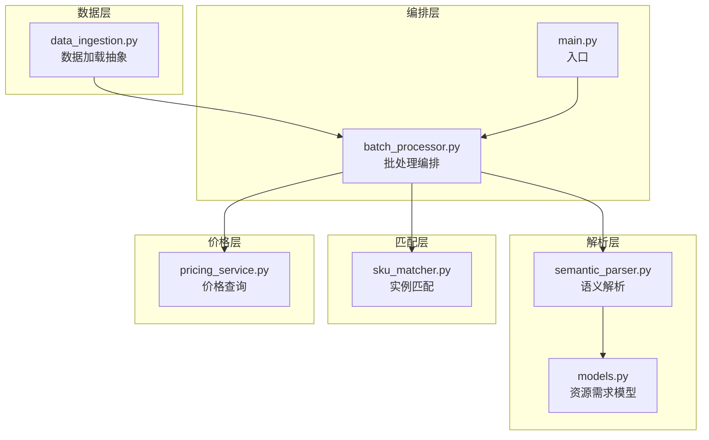
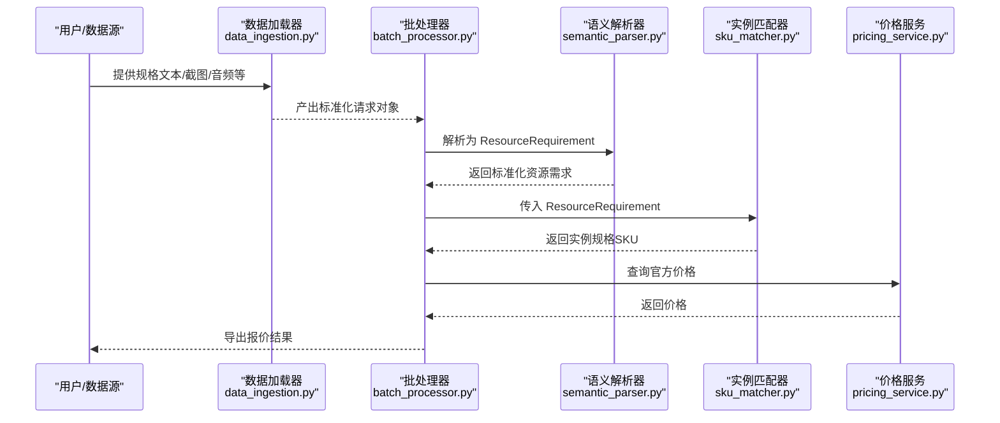
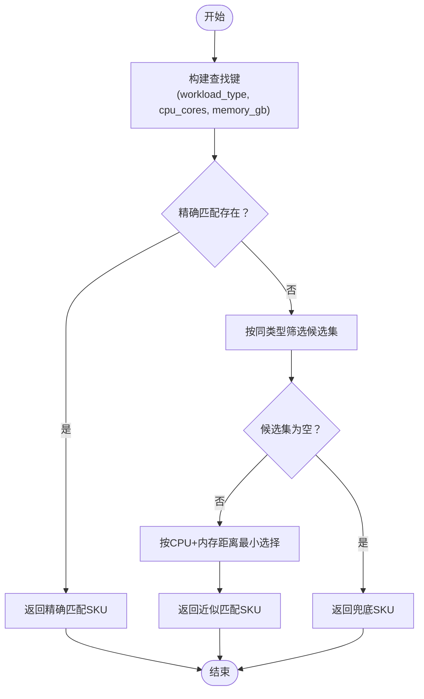
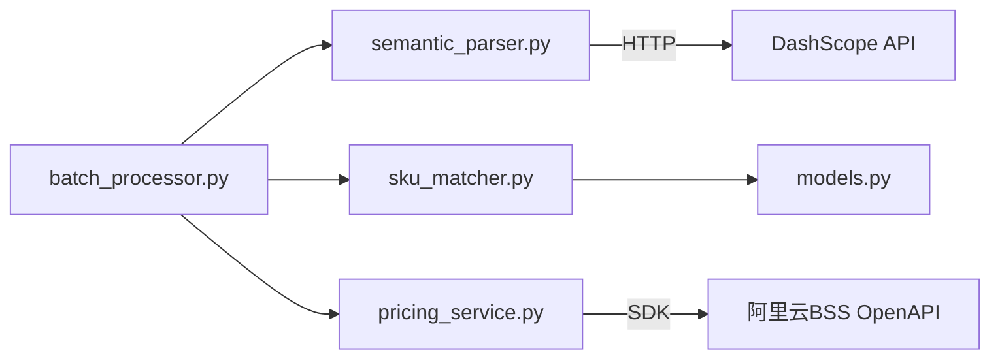

# 自定义匹配规则

<cite>
**本文引用的文件**
- [sku_matcher.py](file://sku_matcher.py)
- [pricing_service.py](file://pricing_service.py)
- [models.py](file://models.py)
- [semantic_parser.py](file://semantic_parser.py)
- [batch_processor.py](file://batch_processor.py)
- [data_ingestion.py](file://data_ingestion.py)
- [main.py](file://main.py)
- [tests/README.md](file://tests/README.md)
- [tests/test_e2e_real_world.py](file://tests/test_e2e_real_world.py)
- [tests/create_sample_test_data.py](file://tests/create_sample_test_data.py)
</cite>

## 目录
1. [简介](#简介)
2. [项目结构](#项目结构)
3. [核心组件](#核心组件)
4. [架构概览](#架构概览)
5. [详细组件分析](#详细组件分析)
6. [依赖关系分析](#依赖关系分析)
7. [性能考量](#性能考量)
8. [故障排查指南](#故障排查指南)
9. [结论](#结论)
10. [附录](#附录)

## 简介
本文面向开发者，系统讲解如何在 sku_matcher.py 中扩展 INSTANCE_CATALOG 以支持新的实例规格，或添加自定义匹配策略。重点解释 INSTANCE_CATALOG 字典的键（工作负载类型、CPU核心数、内存大小）与值（阿里云ECS实例规格）之间的映射逻辑；提供新增工作负载类型（如 GPU 计算场景）的实践指引；说明如何修改匹配函数以支持更复杂的匹配逻辑（如基于 GPU 型号或网络性能）；并给出扩展时的注意事项（键唯一性、规格命名规范、向后兼容性、对价格查询服务的影响），以及调试与验证新规则的测试方法。

## 项目结构
本项目采用“分层+模块化”的组织方式，核心流程为：数据加载 → 语义解析 → 实例匹配 → 价格查询 → 结果导出。其中与本主题密切相关的模块包括：
- sku_matcher.py：实例规格映射与匹配逻辑
- semantic_parser.py：将自然语言解析为标准化资源需求
- models.py：标准化资源需求的数据模型
- pricing_service.py：对接阿里云BSS OpenAPI的价格查询
- batch_processor.py：批处理流水线编排
- data_ingestion.py：数据加载抽象层
- main.py：主程序入口

图表来源
- [data_ingestion.py](file://data_ingestion.py#L1-L204)
- [semantic_parser.py](file://semantic_parser.py#L1-L349)
- [models.py](file://models.py#L1-L54)
- [sku_matcher.py](file://sku_matcher.py#L1-L134)
- [pricing_service.py](file://pricing_service.py#L1-L81)
- [batch_processor.py](file://batch_processor.py#L1-L244)
- [main.py](file://main.py#L1-L100)

章节来源
- [main.py](file://main.py#L1-L100)
- [batch_processor.py](file://batch_processor.py#L1-L244)
- [data_ingestion.py](file://data_ingestion.py#L1-L204)
- [semantic_parser.py](file://semantic_parser.py#L1-L349)
- [models.py](file://models.py#L1-L54)
- [sku_matcher.py](file://sku_matcher.py#L1-L134)
- [pricing_service.py](file://pricing_service.py#L1-L81)

## 核心组件
- INSTANCE_CATALOG：键为三元组 (workload_type, cpu_cores, memory_gb)，值为阿里云实例规格字符串。该字典是“精确匹配”的基础。
- get_best_instance_sku(req)：根据 ResourceRequirement 对象进行匹配，优先精确匹配，其次按同类型最近邻降级匹配，最后兜底为 DEFAULT_INSTANCE。
- get_instance_family_name(instance_type)：将实例规格映射为可读的实例系列名称，便于展示。
- PricingService.get_official_price：通过阿里云BSS OpenAPI查询实例的官方价格，作为后续报价依据。

章节来源
- [sku_matcher.py](file://sku_matcher.py#L1-L134)
- [pricing_service.py](file://pricing_service.py#L1-L81)
- [models.py](file://models.py#L1-L54)

## 架构概览
下图展示了从输入到输出的关键交互，以及与实例匹配相关的部分。

图表来源
- [batch_processor.py](file://batch_processor.py#L80-L165)
- [semantic_parser.py](file://semantic_parser.py#L25-L110)
- [sku_matcher.py](file://sku_matcher.py#L45-L103)
- [pricing_service.py](file://pricing_service.py#L28-L81)
- [data_ingestion.py](file://data_ingestion.py#L1-L204)

## 详细组件分析

### 实例匹配器（sku_matcher.py）详解
- 键的设计
  - workload_type：工作负载类型，来源于 ResourceRequirement 的枚举字段，当前取值为 "general"、"compute"、"memory_intensive"。
  - cpu_cores：CPU核心数，整型，大于0。
  - memory_gb：内存容量（GB），整型，大于等于0。
- 值的设计
  - 实例规格字符串，形如 "ecs.r6.4xlarge"，遵循阿里云实例规格命名规范。
- 匹配策略
  - 精确匹配：直接查找 INSTANCE_CATALOG 中的键。
  - 降级匹配：若无精确匹配，则在相同 workload_type 下寻找 CPU 与内存最接近的配置。
  - 兜底策略：若仍无匹配，返回 DEFAULT_INSTANCE。
- 展示辅助
  - get_instance_family_name：将实例规格映射为人类可读的系列名称，便于报表展示。

图表来源
- [sku_matcher.py](file://sku_matcher.py#L45-L103)

章节来源
- [sku_matcher.py](file://sku_matcher.py#L1-L134)
- [models.py](file://models.py#L10-L39)

### 新增工作负载类型与实例规格
- 新增工作负载类型
  - 在 ResourceRequirement 的 workload_type 字段中新增枚举值（如 "gpu_compute"），并在语义解析器中将自然语言推断为该类型，或在正则回退中识别关键词。
  - 语义解析器中已内置对工作负载类型的识别逻辑，可参考以下路径：
    - [semantic_parser.py](file://semantic_parser.py#L106-L123)（系统提示词中的分类规则）
    - [semantic_parser.py](file://semantic_parser.py#L184-L190)（AI输出到内部枚举的归一化）
    - [semantic_parser.py](file://semantic_parser.py#L322-L349)（关键词识别）
- 添加实例规格映射
  - 在 INSTANCE_CATALOG 中添加新的三元组键，并映射到合适的阿里云实例规格字符串。
  - 保持键的唯一性，避免重复键导致覆盖。
  - 为新增类型补充合理的 CPU/内存组合，覆盖常见规格档位。
- 兜底策略
  - 若新增类型尚未覆盖全部规格档位，建议保留 DEFAULT_INSTANCE，确保兜底可用。

章节来源
- [models.py](file://models.py#L10-L39)
- [semantic_parser.py](file://semantic_parser.py#L106-L123)
- [semantic_parser.py](file://semantic_parser.py#L184-L190)
- [semantic_parser.py](file://semantic_parser.py#L322-L349)
- [sku_matcher.py](file://sku_matcher.py#L15-L43)

### 修改匹配逻辑以支持更复杂规则
当前匹配逻辑仅基于 (workload_type, cpu_cores, memory_gb) 三元组。若需引入更复杂的匹配维度（如 GPU 型号、网络性能等级、存储类型等），可考虑以下方案：
- 方案A：扩展 ResourceRequirement 字段
  - 在模型中增加 GPU 型号、网络性能等级、存储类型等字段，使上游解析器能够提取这些信息。
  - 在匹配函数中将这些字段纳入匹配键，形成更高维的键集合。
- 方案B：在匹配函数内增加后处理逻辑
  - 在精确匹配与降级匹配之后，再根据额外字段进行二次筛选或排序，选择最优实例。
- 方案C：拆分匹配阶段
  - 先按工作负载类型过滤，再按 CPU/内存近似匹配，最后按 GPU/网络等条件进行细化。

注意：以上修改会影响 INSTANCE_CATALOG 的键结构与匹配函数的输入，务必保证向后兼容与测试覆盖。

章节来源
- [models.py](file://models.py#L10-L39)
- [semantic_parser.py](file://semantic_parser.py#L1-L349)
- [sku_matcher.py](file://sku_matcher.py#L45-L103)

### 扩展注意事项
- 键的唯一性
  - INSTANCE_CATALOG 的键为不可变元组，重复键会导致后者覆盖前者。新增时应确保键唯一。
- 规格命名规范
  - 实例规格字符串需符合阿里云命名规范，如 "ecs.<系列>.<规格>"，避免拼写错误导致无法查询价格。
- 向后兼容性
  - 新增类型或字段时，应确保旧数据仍能被解析与匹配；必要时在解析器中保留回退逻辑。
- 对价格查询服务的影响
  - 新增的实例规格必须存在于阿里云BSS OpenAPI可查询范围内，否则 get_official_price 会抛出异常。
  - 若新增规格尚未上线或受限，需在匹配阶段进行拦截或提示。

章节来源
- [sku_matcher.py](file://sku_matcher.py#L15-L43)
- [pricing_service.py](file://pricing_service.py#L28-L81)

### 调试与验证新规则的测试方法
- 环境准备
  - 配置 .env 文件，设置阿里云与 DashScope 的密钥；参考：
    - [tests/README.md](file://tests/README.md#L61-L67)
- 单元级验证
  - 使用测试套件对 AI 解析与价格查询进行连通性测试；参考：
    - [tests/test_e2e_real_world.py](file://tests/test_e2e_real_world.py#L151-L234)
- 端到端验证
  - 使用 Excel 输入数据，执行完整批处理流程，验证输出文件生成、价格列存在、无失败行；参考：
    - [tests/test_e2e_real_world.py](file://tests/test_e2e_real_world.py#L236-L454)
- 生成示例测试数据
  - 使用脚本快速生成示例 Excel 文件；参考：
    - [tests/create_sample_test_data.py](file://tests/create_sample_test_data.py#L1-L42)
- 日志与错误处理
  - 测试套件采用双输出日志（控制台 INFO + 文件 DEBUG），便于定位问题；参考：
    - [tests/README.md](file://tests/README.md#L100-L118)
    - [tests/test_e2e_real_world.py](file://tests/test_e2e_real_world.py#L31-L79)

章节来源
- [tests/README.md](file://tests/README.md#L1-L276)
- [tests/test_e2e_real_world.py](file://tests/test_e2e_real_world.py#L1-L564)
- [tests/create_sample_test_data.py](file://tests/create_sample_test_data.py#L1-L42)

## 依赖关系分析
- 模块耦合
  - batch_processor.py 依赖 semantic_parser.py 与 sku_matcher.py，同时依赖 pricing_service.py 进行价格查询。
  - sku_matcher.py 依赖 models.py 的 ResourceRequirement 类型。
  - pricing_service.py 依赖阿里云 BSS OpenAPI SDK。
- 外部依赖
  - 阿里云 BSS OpenAPI：用于查询实例官方价格。
  - DashScope API：用于自然语言解析与工作负载类型推断。

图表来源
- [batch_processor.py](file://batch_processor.py#L1-L244)
- [semantic_parser.py](file://semantic_parser.py#L1-L349)
- [sku_matcher.py](file://sku_matcher.py#L1-L134)
- [pricing_service.py](file://pricing_service.py#L1-L81)
- [models.py](file://models.py#L1-L54)

章节来源
- [batch_processor.py](file://batch_processor.py#L1-L244)
- [semantic_parser.py](file://semantic_parser.py#L1-L349)
- [sku_matcher.py](file://sku_matcher.py#L1-L134)
- [pricing_service.py](file://pricing_service.py#L1-L81)
- [models.py](file://models.py#L1-L54)

## 性能考量
- 匹配复杂度
  - 精确匹配为 O(1)，降级匹配在同类型候选集中遍历，时间复杂度约为 O(n)。
- 缓存与重用
  - 语义解析器内置了 LLM 结果缓存，有助于减少 DashScope API 调用次数。
- 批处理效率
  - 批处理器按行迭代处理，整体吞吐取决于数据量与外部 API 延迟。

章节来源
- [semantic_parser.py](file://semantic_parser.py#L21-L30)
- [batch_processor.py](file://batch_processor.py#L120-L165)

## 故障排查指南
- 环境变量缺失
  - 现象：提示密钥未配置或为空。
  - 排查：确认 .env 文件存在且包含所需密钥；参考：
    - [tests/README.md](file://tests/README.md#L61-L67)
    - [tests/test_e2e_real_world.py](file://tests/test_e2e_real_world.py#L101-L140)
- API 调用失败
  - 现象：出现 API 错误或价格查询异常。
  - 排查：检查网络连接、密钥有效性与账户配额；参考：
    - [pricing_service.py](file://pricing_service.py#L65-L81)
    - [tests/README.md](file://tests/README.md#L181-L200)
- 测试数据未找到
  - 现象：扫描不到 Excel 文件。
  - 排查：使用示例数据脚本生成或手动放置文件；参考：
    - [tests/create_sample_test_data.py](file://tests/create_sample_test_data.py#L1-L42)
    - [tests/test_e2e_real_world.py](file://tests/test_e2e_real_world.py#L261-L283)
- 输出验证失败
  - 现象：缺少价格列或存在失败行。
  - 排查：查看日志文件中的错误详情，定位失败原因；参考：
    - [tests/README.md](file://tests/README.md#L119-L127)
    - [tests/test_e2e_real_world.py](file://tests/test_e2e_real_world.py#L398-L426)

章节来源
- [tests/README.md](file://tests/README.md#L1-L276)
- [tests/test_e2e_real_world.py](file://tests/test_e2e_real_world.py#L1-L564)
- [pricing_service.py](file://pricing_service.py#L65-L81)

## 结论
通过在 sku_matcher.py 中扩展 INSTANCE_CATALOG 并结合语义解析与价格查询，可以灵活地为新的工作负载类型与实例规格提供报价能力。建议在新增时严格遵守键唯一性与命名规范，确保向后兼容，并通过测试套件进行全面验证。对于更复杂的匹配需求，可在模型与匹配函数层面进行演进，同时关注外部 API 的可用性与稳定性。

## 附录
- 快速上手步骤
  - 在 models.py 中确认/扩展 workload_type 枚举。
  - 在 semantic_parser.py 中完善工作负载类型识别逻辑。
  - 在 sku_matcher.py 中向 INSTANCE_CATALOG 添加新键值对。
  - 使用测试套件验证端到端流程。
- 相关文件路径
  - [models.py](file://models.py#L10-L39)
  - [semantic_parser.py](file://semantic_parser.py#L106-L123)
  - [semantic_parser.py](file://semantic_parser.py#L184-L190)
  - [semantic_parser.py](file://semantic_parser.py#L322-L349)
  - [sku_matcher.py](file://sku_matcher.py#L15-L43)
  - [sku_matcher.py](file://sku_matcher.py#L45-L103)
  - [pricing_service.py](file://pricing_service.py#L28-L81)
  - [tests/README.md](file://tests/README.md#L61-L67)
  - [tests/test_e2e_real_world.py](file://tests/test_e2e_real_world.py#L151-L234)
  - [tests/test_e2e_real_world.py](file://tests/test_e2e_real_world.py#L236-L454)
  - [tests/create_sample_test_data.py](file://tests/create_sample_test_data.py#L1-L42)