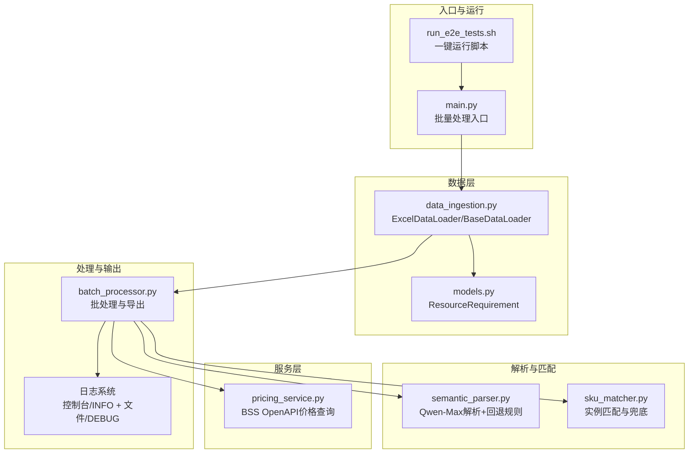
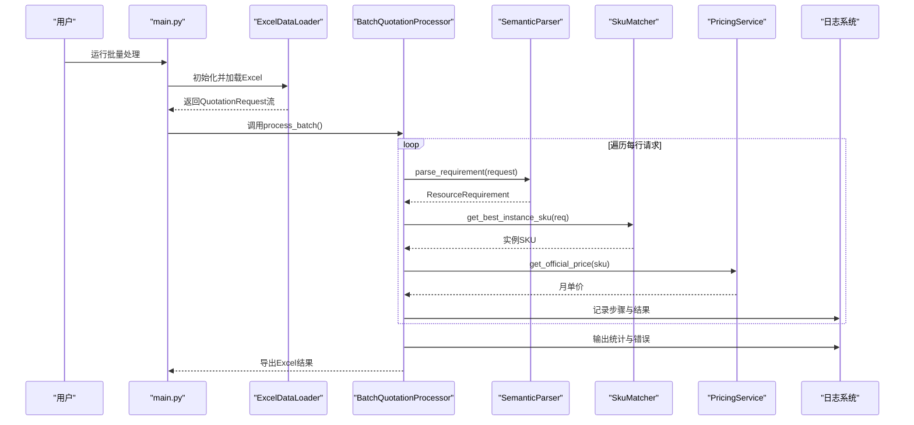
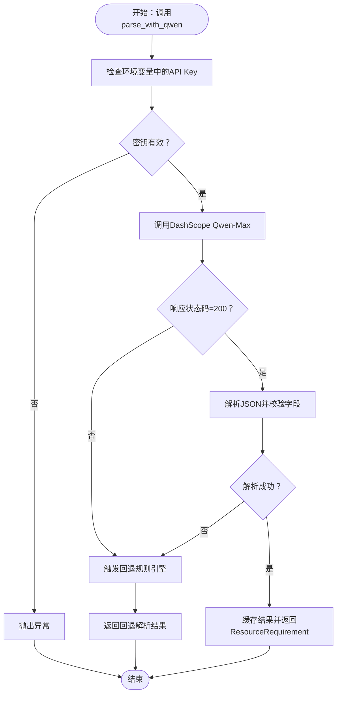
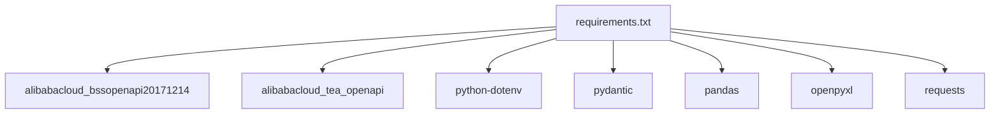

# 故障排查

<cite>
**本文引用的文件**
- [PHASE6_COMPLETION_SUMMARY.md](file://PHASE6_COMPLETION_SUMMARY.md)
- [tests/README.md](file://tests/README.md)
- [TESTING_GUIDE.md](file://TESTING_GUIDE.md)
- [main.py](file://main.py)
- [batch_processor.py](file://batch_processor.py)
- [semantic_parser.py](file://semantic_parser.py)
- [pricing_service.py](file://pricing_service.py)
- [data_ingestion.py](file://data_ingestion.py)
- [sku_matcher.py](file://sku_matcher.py)
- [models.py](file://models.py)
- [requirements.txt](file://requirements.txt)
</cite>

## 目录
1. [简介](#简介)
2. [项目结构](#项目结构)
3. [核心组件](#核心组件)
4. [架构总览](#架构总览)
5. [详细组件分析](#详细组件分析)
6. [依赖分析](#依赖分析)
7. [性能考虑](#性能考虑)
8. [故障排查指南](#故障排查指南)
9. [结论](#结论)
10. [附录](#附录)

## 简介
本故障排查文档面向使用报价管道系统的用户，聚焦于在真实环境中运行时可能遇到的典型问题，包括但不限于：环境变量未加载、API调用失败、无测试数据、价格查询权限不足、AI解析失败等。文档基于仓库中的测试与日志体系，提供可操作的调试步骤、回退机制说明、网络与API成本注意事项，以及数据隐私建议，帮助快速定位并解决问题。

## 项目结构
报价管道由“数据加载”“语义解析”“SKU匹配”“价格查询”“批量处理”“日志系统”等模块组成，采用分层与抽象设计，便于扩展与维护。

图表来源
- [main.py](file://main.py#L1-L100)
- [data_ingestion.py](file://data_ingestion.py#L1-L204)
- [models.py](file://models.py#L1-L54)
- [semantic_parser.py](file://semantic_parser.py#L1-L349)
- [sku_matcher.py](file://sku_matcher.py#L1-L134)
- [pricing_service.py](file://pricing_service.py#L1-L81)
- [batch_processor.py](file://batch_processor.py#L1-L244)

章节来源
- [main.py](file://main.py#L1-L100)
- [data_ingestion.py](file://data_ingestion.py#L1-L204)
- [semantic_parser.py](file://semantic_parser.py#L1-L349)
- [sku_matcher.py](file://sku_matcher.py#L1-L134)
- [pricing_service.py](file://pricing_service.py#L1-L81)
- [batch_processor.py](file://batch_processor.py#L1-L244)

## 核心组件
- 数据加载层：负责将Excel数据转换为标准化的报价请求对象，支持后续解析与匹配。
- 语义解析层：使用DashScope Qwen-Max进行意图理解，并在失败时回退到正则规则引擎。
- SKU匹配层：根据工作负载类型与资源规格匹配阿里云实例SKU，若无精确匹配则选择相近配置或使用默认通用型实例。
- 价格查询层：通过BSS OpenAPI查询官方月单价，出现异常时抛出并由上层捕获与记录。
- 批处理层：串联上述流程，逐行处理并导出Excel结果，同时输出统计与错误信息。
- 日志系统：双输出架构，控制台输出关键信息，文件输出详细调试信息，便于定位问题。

章节来源
- [data_ingestion.py](file://data_ingestion.py#L1-L204)
- [semantic_parser.py](file://semantic_parser.py#L1-L349)
- [sku_matcher.py](file://sku_matcher.py#L1-L134)
- [pricing_service.py](file://pricing_service.py#L1-L81)
- [batch_processor.py](file://batch_processor.py#L1-L244)
- [PHASE6_COMPLETION_SUMMARY.md](file://PHASE6_COMPLETION_SUMMARY.md#L147-L222)

## 架构总览
报价管道的端到端流程如下：Excel数据经加载器转换为请求对象，进入语义解析得到资源需求，随后进行SKU匹配，最后调用BSS OpenAPI获取价格，最终导出Excel并输出统计与错误信息。

图表来源
- [main.py](file://main.py#L1-L100)
- [data_ingestion.py](file://data_ingestion.py#L1-L204)
- [batch_processor.py](file://batch_processor.py#L1-L244)
- [semantic_parser.py](file://semantic_parser.py#L1-L349)
- [sku_matcher.py](file://sku_matcher.py#L1-L134)
- [pricing_service.py](file://pricing_service.py#L1-L81)

## 详细组件分析

### 组件A：环境与密钥加载（环境变量未加载）
- 症状：启动时提示缺少阿里云或DashScope密钥；或在运行中出现“密钥为空”的错误。
- 根因：.env文件缺失、格式错误、未正确加载或值为空。
- 处理要点：
  - 确认项目根目录存在“.env”，包含必需的密钥字段。
  - 使用dotenv加载后，对密钥进行非空校验。
  - 若密钥缺失，批处理入口会直接退出并给出明确提示。
- 调试建议：
  - 使用测试套件的“环境健康检查”用例，确认各密钥均已加载。
  - 查看日志文件中关于.env与密钥加载的DEBUG信息。

章节来源
- [main.py](file://main.py#L26-L34)
- [tests/README.md](file://tests/README.md#L203-L211)
- [TESTING_GUIDE.md](file://TESTING_GUIDE.md#L289-L307)
- [PHASE6_COMPLETION_SUMMARY.md](file://PHASE6_COMPLETION_SUMMARY.md#L44-L62)

### 组件B：AI解析（AI解析失败）
- 症状：AI解析失败，出现“AI解析失败”提示并回退到正则规则引擎；或DashScope API返回错误。
- 根因：API密钥无效、网络不可达、模型不可用、响应格式不符合预期。
- 处理要点：
  - 解析函数内部会尝试从环境变量加载DashScope API Key，并在失败时抛出异常。
  - 解析成功后会缓存结果以降低token消耗；失败时触发回退规则引擎。
  - 回退规则仍可提供基本的CPU/内存/存储与工作负载类型识别。
- 调试建议：
  - 使用测试套件的“组件连通性测试”验证DashScope Qwen-Max连通性。
  - 手动验证API Key与网络，参考“手动验证API连接”步骤。
  - 查看日志文件中关于AI解析的DEBUG与ERROR信息。

图表来源
- [semantic_parser.py](file://semantic_parser.py#L127-L218)

章节来源
- [semantic_parser.py](file://semantic_parser.py#L127-L218)
- [TESTING_GUIDE.md](file://TESTING_GUIDE.md#L348-L359)
- [PHASE6_COMPLETION_SUMMARY.md](file://PHASE6_COMPLETION_SUMMARY.md#L65-L95)

### 组件C：价格查询（价格查询权限不足/失败）
- 症状：BSS OpenAPI调用报错，如“权限不足”“无效AccessKey”等；或返回非成功状态。
- 根因：RAM角色缺少BSS OpenAPI权限、AccessKey配置错误、网络受限、账户状态异常。
- 处理要点：
  - 价格查询服务会构造请求并调用BSS OpenAPI，若响应非成功或缺少价格数据，会抛出异常。
  - 批处理层捕获异常并记录错误，同时保留RequestId以便追踪。
- 调试建议：
  - 使用测试套件的“组件连通性测试”验证BSS OpenAPI连通性。
  - 在阿里云控制台为RAM角色授予BSS相关权限（只读或完全权限）。
  - 手动验证API连接，参考“手动验证API连接”步骤。

章节来源
- [pricing_service.py](file://pricing_service.py#L47-L81)
- [batch_processor.py](file://batch_processor.py#L144-L163)
- [TESTING_GUIDE.md](file://TESTING_GUIDE.md#L334-L346)
- [PHASE6_COMPLETION_SUMMARY.md](file://PHASE6_COMPLETION_SUMMARY.md#L75-L95)

### 组件D：数据加载（无测试数据）
- 症状：找不到Excel文件，提示“未发现Excel文件”。
- 根因：测试数据目录为空或文件命名/列名不符合规范。
- 处理要点：
  - ExcelDataLoader会在初始化时校验文件是否存在，并在加载时对列名进行验证。
  - 批处理层会统计成功/失败数量并输出汇总。
- 调试建议：
  - 使用测试套件提供的示例数据生成脚本创建测试数据。
  - 确保Excel文件包含“规格/配置”列，备注列可选。
  - 查看日志文件中关于数据加载与列名的DEBUG信息。

章节来源
- [data_ingestion.py](file://data_ingestion.py#L82-L107)
- [tests/README.md](file://tests/README.md#L219-L225)
- [TESTING_GUIDE.md](file://TESTING_GUIDE.md#L321-L333)

### 组件E：SKU匹配（匹配不到合适实例）
- 症状：无法精确匹配到实例，系统选择相近配置或默认通用型实例。
- 根因：实例目录中缺少对应(workload_type, cpu, memory)组合。
- 处理要点：
  - 精确匹配优先；无精确匹配时按CPU与内存距离选择最近配置；仍无匹配则使用默认通用型实例。
  - 匹配过程会输出INFO/WARNING日志，便于观察匹配策略。
- 调试建议：
  - 根据日志确认是否触发了“无精确匹配/无合适匹配”的警告。
  - 在实例目录中补充缺失的SKU映射，或调整输入规格使其更贴近现有目录。

章节来源
- [sku_matcher.py](file://sku_matcher.py#L45-L103)
- [PHASE6_COMPLETION_SUMMARY.md](file://PHASE6_COMPLETION_SUMMARY.md#L197-L222)

## 依赖分析
- 运行时依赖：Alibaba Cloud BSS OpenAPI SDK、DashScope HTTP调用、dotenv、pandas、openpyxl、requests、pydantic。
- 组件耦合：
  - 批处理层依赖解析、匹配与价格查询服务，但通过抽象接口与数据模型解耦。
  - 日志系统贯穿各层，便于统一观测与排障。

图表来源
- [requirements.txt](file://requirements.txt#L1-L9)

章节来源
- [requirements.txt](file://requirements.txt#L1-L9)
- [batch_processor.py](file://batch_processor.py#L1-L244)
- [semantic_parser.py](file://semantic_parser.py#L1-L349)
- [pricing_service.py](file://pricing_service.py#L1-L81)

## 性能考虑
- 执行效率：环境检查<1秒，连通性测试约3-5秒，批量处理随数据量线性增长。
- API调用次数：每行数据一次AI解析与一次价格查询。
- 并发限制：DashScope与BSS OpenAPI均存在请求频率限制，建议控制批处理规模。
- 网络要求：需能访问dashscope.aliyuncs.com与business.aliyuncs.com。

章节来源
- [PHASE6_COMPLETION_SUMMARY.md](file://PHASE6_COMPLETION_SUMMARY.md#L427-L441)
- [TESTING_GUIDE.md](file://TESTING_GUIDE.md#L420-L459)

## 故障排查指南

### 一、环境变量未加载
- 症状
  - 启动时报错提示缺少密钥；或运行中出现“密钥为空”的错误。
- 快速定位
  - 使用测试套件的“环境健康检查”用例，确认.env文件存在且密钥均已加载。
  - 查看日志文件中关于.env与密钥加载的DEBUG信息。
- 解决方案
  - 在项目根目录创建正确的.env文件，确保密钥字段非空且无多余空格或引号。
  - 重新运行程序，确认密钥加载成功。

章节来源
- [main.py](file://main.py#L26-L34)
- [tests/README.md](file://tests/README.md#L203-L211)
- [TESTING_GUIDE.md](file://TESTING_GUIDE.md#L289-L307)
- [PHASE6_COMPLETION_SUMMARY.md](file://PHASE6_COMPLETION_SUMMARY.md#L44-L62)

### 二、API调用失败（DashScope/Qwen-Max）
- 症状
  - AI解析失败并回退到正则规则；或DashScope返回错误码。
- 快速定位
  - 使用测试套件的“组件连通性测试”验证Qwen-Max连通性。
  - 查看日志文件中关于DashScope调用的DEBUG与ERROR信息。
- 解决方案
  - 检查DashScope API Key是否有效、网络是否可达、模型是否可用。
  - 若仍失败，系统会自动回退到正则规则引擎，功能不受影响。

章节来源
- [semantic_parser.py](file://semantic_parser.py#L127-L218)
- [TESTING_GUIDE.md](file://TESTING_GUIDE.md#L348-L359)
- [PHASE6_COMPLETION_SUMMARY.md](file://PHASE6_COMPLETION_SUMMARY.md#L65-L95)

### 三、价格查询权限不足/失败（BSS OpenAPI）
- 症状
  - BSS OpenAPI调用报错，如“权限不足”“无效AccessKey”等。
- 快速定位
  - 使用测试套件的“组件连通性测试”验证BSS OpenAPI连通性。
  - 查看批处理层捕获的异常与RequestId。
- 解决方案
  - 在阿里云控制台为RAM角色授予BSS相关权限（只读或完全权限）。
  - 确认AccessKey配置正确、账户状态正常。

章节来源
- [pricing_service.py](file://pricing_service.py#L47-L81)
- [batch_processor.py](file://batch_processor.py#L144-L163)
- [TESTING_GUIDE.md](file://TESTING_GUIDE.md#L334-L346)
- [PHASE6_COMPLETION_SUMMARY.md](file://PHASE6_COMPLETION_SUMMARY.md#L75-L95)

### 四、无测试数据
- 症状
  - “未发现Excel文件”或数据加载失败。
- 快速定位
  - 确认Excel文件位于tests/data/xlsx/目录，且包含“规格/配置”列。
  - 查看日志文件中关于数据加载与列名的DEBUG信息。
- 解决方案
  - 使用示例数据生成脚本创建测试数据，或将自定义Excel放入指定目录。

章节来源
- [data_ingestion.py](file://data_ingestion.py#L82-L107)
- [tests/README.md](file://tests/README.md#L219-L225)
- [TESTING_GUIDE.md](file://TESTING_GUIDE.md#L321-L333)

### 五、SKU匹配不到合适实例
- 症状
  - 无法精确匹配到实例，系统选择相近配置或默认通用型实例。
- 快速定位
  - 查看日志中关于“无精确匹配/无合适匹配”的WARNING信息。
- 解决方案
  - 在实例目录中补充缺失的SKU映射，或调整输入规格使其更贴近现有目录。

章节来源
- [sku_matcher.py](file://sku_matcher.py#L45-L103)
- [PHASE6_COMPLETION_SUMMARY.md](file://PHASE6_COMPLETION_SUMMARY.md#L197-L222)

### 六、查看详细日志与手动验证API连接
- 查看详细日志
  - 使用测试套件输出的日志文件位置，查看DEBUG级别的详细信息。
- 手动验证API连接
  - 使用测试套件提供的“手动验证API连接”步骤，分别验证Qwen-Max与BSS OpenAPI。
- 使用回退机制
  - AI解析失败时会自动回退到正则规则引擎，确保功能可用。

章节来源
- [TESTING_GUIDE.md](file://TESTING_GUIDE.md#L360-L390)
- [PHASE6_COMPLETION_SUMMARY.md](file://PHASE6_COMPLETION_SUMMARY.md#L147-L222)

### 七、网络要求、API成本与数据隐私
- 网络要求
  - 需要稳定的互联网连接，能够访问dashscope.aliyuncs.com与business.aliyuncs.com。
- API成本
  - 本测试会产生真实API调用费用，建议先在小数据集上验证，再处理大批量数据。
- 数据隐私
  - 测试数据会发送到云端API，请勿使用敏感或机密信息。

章节来源
- [TESTING_GUIDE.md](file://TESTING_GUIDE.md#L436-L459)
- [PHASE6_COMPLETION_SUMMARY.md](file://PHASE6_COMPLETION_SUMMARY.md#L197-L222)

## 结论
通过测试套件与双输出日志体系，报价管道系统具备良好的可观测性与健壮的错误处理能力。针对环境变量、API连通性、数据准备、权限配置与AI解析失败等常见问题，用户可依据本指南的步骤快速定位并解决。建议在生产前先进行小规模验证，关注网络与API成本，并严格遵守数据隐私要求。

## 附录

### A. 关键流程与断点
- 环境健康检查：验证.env与密钥加载。
- 组件连通性测试：验证Qwen-Max与BSS OpenAPI连通性。
- 真实数据批处理：扫描Excel目录、逐行处理、导出结果并验证。

章节来源
- [PHASE6_COMPLETION_SUMMARY.md](file://PHASE6_COMPLETION_SUMMARY.md#L42-L144)
- [TESTING_GUIDE.md](file://TESTING_GUIDE.md#L96-L191)

### B. 退出代码与输出验证
- 退出代码：0表示全部通过，1表示至少一个测试失败，130表示用户中断。
- 输出验证：确保输出文件存在、包含价格列、统计成功/失败行数。

章节来源
- [tests/README.md](file://tests/README.md#L234-L239)
- [TESTING_GUIDE.md](file://TESTING_GUIDE.md#L253-L260)