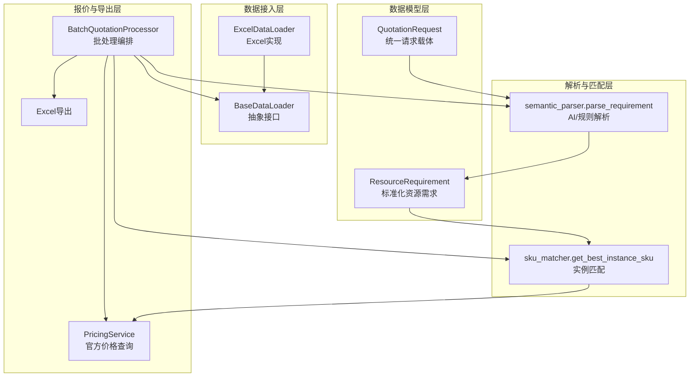
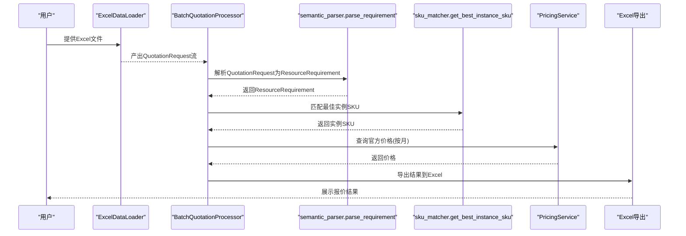
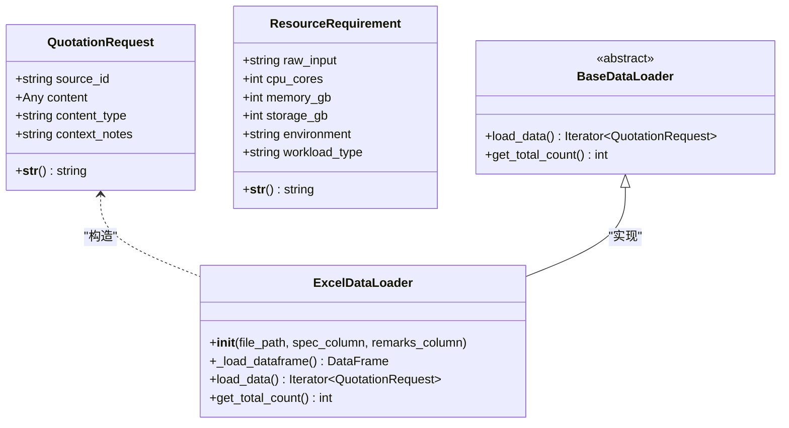
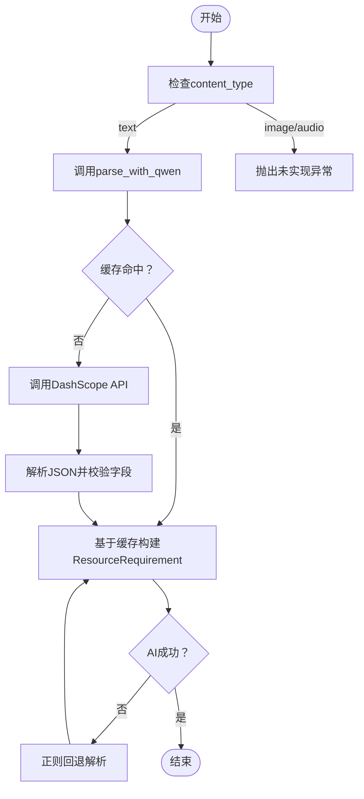
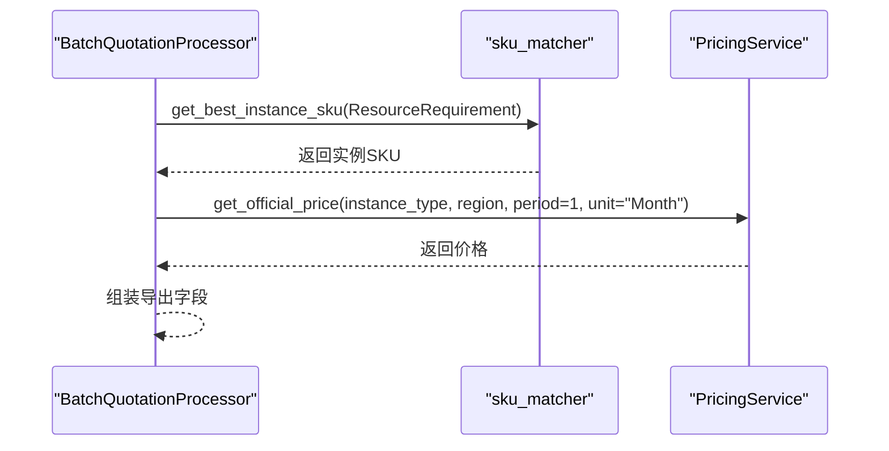
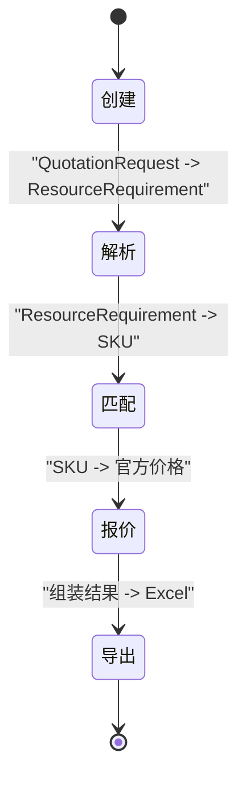
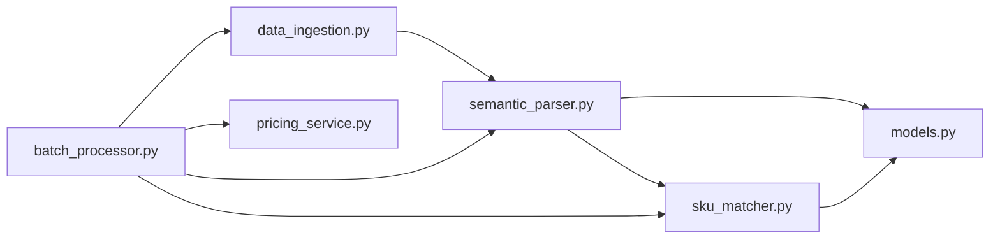

# 数据模型

<cite>
**本文引用的文件**
- [models.py](file://models.py)
- [data_ingestion.py](file://data_ingestion.py)
- [semantic_parser.py](file://semantic_parser.py)
- [sku_matcher.py](file://sku_matcher.py)
- [batch_processor.py](file://batch_processor.py)
- [pricing_service.py](file://pricing_service.py)
- [tests/create_sample_test_data.py](file://tests/create_sample_test_data.py)
- [tests/test_e2e_real_world.py](file://tests/test_e2e_real_world.py)
</cite>

## 目录
1. [简介](#简介)
2. [项目结构](#项目结构)
3. [核心组件](#核心组件)
4. [架构总览](#架构总览)
5. [详细组件分析](#详细组件分析)
6. [依赖分析](#依赖分析)
7. [性能考虑](#性能考虑)
8. [故障排查指南](#故障排查指南)
9. [结论](#结论)
10. [附录](#附录)

## 简介
本文件聚焦于Quotation_Pipeline中的核心数据模型，重点阐述以下两个标准化数据结构：
- QuotationRequest：统一的报价请求载体，屏蔽数据来源差异（Excel、图片、语音等），向下游解析、匹配、定价模块提供一致输入。
- ResourceRequirement：标准化资源需求模型，承载用户意图（CPU、内存、存储、环境、工作负载类型），作为系统各组件之间的“黄金契约”。

本文将从实体关系、字段定义、数据类型、业务规则、验证约束、生命周期管理、组件交互与错误处理等方面进行全面说明，并辅以图示帮助理解。

## 项目结构
围绕数据模型的关键文件组织如下：
- models.py：定义ResourceRequirement与Golden Schema说明
- data_ingestion.py：定义QuotationRequest及数据加载抽象层
- semantic_parser.py：将QuotationRequest解析为ResourceRequirement
- sku_matcher.py：根据ResourceRequirement匹配实例SKU
- batch_processor.py：编排从请求到报价结果的全流程
- pricing_service.py：对接阿里云BSS OpenAPI获取官方单价
- tests/*：样例数据与端到端测试，验证数据模型在真实流程中的使用

**图表来源**
- [data_ingestion.py](file://data_ingestion.py#L13-L30)
- [models.py](file://models.py#L10-L54)
- [semantic_parser.py](file://semantic_parser.py#L25-L69)
- [sku_matcher.py](file://sku_matcher.py#L45-L103)
- [batch_processor.py](file://batch_processor.py#L42-L165)
- [pricing_service.py](file://pricing_service.py#L28-L81)

**章节来源**
- [models.py](file://models.py#L1-L54)
- [data_ingestion.py](file://data_ingestion.py#L13-L30)
- [batch_processor.py](file://batch_processor.py#L42-L165)

## 核心组件
本节对QuotationRequest与ResourceRequirement进行深入剖析，涵盖字段、类型、约束、业务规则与验证。

- QuotationRequest（统一请求载体）
  - 字段
    - source_id: str，数据来源标识（如“Row 1”、“Screenshot_001.png”）
    - content: Any，主要内容（文本/图片路径/音频路径等）
    - content_type: Literal["text","image","audio"]，内容类型
    - context_notes: str，默认空字符串，补充上下文备注
  - 业务规则
    - content_type决定后续解析与匹配策略；当前实现支持text，image/audio为预留扩展点
    - context_notes可与content合并用于更丰富的AI理解
  - 验证与约束
    - content_type必须为["text","image","audio"]之一
    - content应与content_type一致（如image需为图片路径）

- ResourceRequirement（标准化资源需求）
  - 字段
    - raw_input: str，原始输入文本，用于日志与溯源
    - cpu_cores: int，CPU核心数，gt(0)
    - memory_gb: int，内存容量(GB)，gt(0)
    - storage_gb: int，默认0，存储容量(GB)，ge(0)
    - environment: Literal["dev","prod","test"]，环境类型
    - workload_type: Literal["general","compute","memory_intensive"]，工作负载类型
  - 业务规则
    - cpu_cores与memory_gb必须为正数
    - storage_gb可为0（未明确给出时）
    - environment与workload_type为枚举值，AI解析阶段会进行归一化
  - 验证与约束
    - Pydantic校验确保字段类型与范围
    - AI解析阶段会从raw_input中抽取并归一化workload_type

**章节来源**
- [data_ingestion.py](file://data_ingestion.py#L13-L30)
- [models.py](file://models.py#L10-L54)
- [semantic_parser.py](file://semantic_parser.py#L71-L218)

## 架构总览
Quotation_Pipeline采用“数据来源无关”的抽象层设计，通过QuotationRequest将不同来源的数据统一为ResourceRequirement，再由SKU匹配与官方价格查询得到报价结果，并最终导出到Excel。

**图表来源**
- [data_ingestion.py](file://data_ingestion.py#L111-L147)
- [batch_processor.py](file://batch_processor.py#L80-L165)
- [semantic_parser.py](file://semantic_parser.py#L25-L69)
- [sku_matcher.py](file://sku_matcher.py#L45-L103)
- [pricing_service.py](file://pricing_service.py#L28-L81)

## 详细组件分析

### 数据模型类图

**图表来源**
- [data_ingestion.py](file://data_ingestion.py#L13-L30)
- [data_ingestion.py](file://data_ingestion.py#L63-L147)

**章节来源**
- [data_ingestion.py](file://data_ingestion.py#L13-L30)
- [data_ingestion.py](file://data_ingestion.py#L63-L147)
- [models.py](file://models.py#L10-L54)

### 解析流程与验证规则
- 输入来源
  - ExcelDataLoader将Excel行转换为QuotationRequest，过滤空行，缺失备注列自动补空字符串
- AI解析
  - semantic_parser.parse_requirement根据content_type选择解析路径：text走AI解析，image/audio抛出未实现异常
  - parse_with_qwen优先命中缓存，否则调用DashScope Qwen-Max，提取JSON并校验必要字段
  - 若AI失败，回退至正则规则解析，提取CPU、内存、存储与工作负载类型
- 输出模型
  - ResourceRequirement由解析结果构建，字段均通过Pydantic校验

**图表来源**
- [semantic_parser.py](file://semantic_parser.py#L25-L69)
- [semantic_parser.py](file://semantic_parser.py#L71-L218)

**章节来源**
- [semantic_parser.py](file://semantic_parser.py#L25-L69)
- [semantic_parser.py](file://semantic_parser.py#L71-L218)

### 匹配与报价流程
- 匹配策略
  - sku_matcher.get_best_instance_sku先精确匹配，再按CPU+内存距离最小化进行模糊匹配，最后兜底为默认通用型实例
- 报价策略
  - pricing_service.get_official_price调用阿里云BSS OpenAPI，返回官方单价（CNY/月）
- 结果组装
  - batch_processor将解析结果、匹配SKU、实例族名与价格整合为导出字段

**图表来源**
- [sku_matcher.py](file://sku_matcher.py#L45-L103)
- [pricing_service.py](file://pricing_service.py#L28-L81)
- [batch_processor.py](file://batch_processor.py#L120-L143)

**章节来源**
- [sku_matcher.py](file://sku_matcher.py#L45-L103)
- [pricing_service.py](file://pricing_service.py#L28-L81)
- [batch_processor.py](file://batch_processor.py#L120-L143)

### 数据生命周期管理
- 创建
  - ExcelDataLoader从Excel读取，构造QuotationRequest
- 解析
  - semantic_parser将QuotationRequest解析为ResourceRequirement
- 匹配
  - sku_matcher根据workload_type与资源配置匹配实例SKU
- 报价
  - pricing_service查询官方价格
- 导出
  - batch_processor将结果导出为Excel，包含原始内容、规格摘要、SKU、实例族名与价格等

**图表来源**
- [data_ingestion.py](file://data_ingestion.py#L111-L147)
- [semantic_parser.py](file://semantic_parser.py#L25-L69)
- [sku_matcher.py](file://sku_matcher.py#L45-L103)
- [pricing_service.py](file://pricing_service.py#L28-L81)
- [batch_processor.py](file://batch_processor.py#L209-L244)

**章节来源**
- [batch_processor.py](file://batch_processor.py#L209-L244)

### 示例JSON数据
以下为ResourceRequirement的典型JSON结构（字段与含义见上文）：
- 示例字段
  - raw_input: 原始输入文本
  - cpu_cores: CPU核心数
  - memory_gb: 内存容量(GB)
  - storage_gb: 存储容量(GB)
  - environment: 环境类型
  - workload_type: 工作负载类型

示例JSON（仅示意，字段与取值请参考实际解析结果）：
{
  "raw_input": "16C 64G 1000G存储 | 备注: 生产环境-多维数据库",
  "cpu_cores": 16,
  "memory_gb": 64,
  "storage_gb": 1000,
  "environment": "prod",
  "workload_type": "memory_intensive"
}

**章节来源**
- [models.py](file://models.py#L28-L38)

## 依赖分析
- 组件耦合
  - data_ingestion与batch_processor通过BaseDataLoader解耦，新增数据源仅需实现BaseDataLoader
  - semantic_parser依赖models.ResourceRequirement，输出标准化模型
  - sku_matcher依赖ResourceRequirement，返回实例SKU
  - batch_processor串联上述组件，形成端到端流程
- 外部依赖
  - DashScope API（Qwen-Max）与阿里云BSS OpenAPI（官方价格）
- 循环依赖
  - 未发现循环导入；模块职责清晰，接口边界明确

**图表来源**
- [data_ingestion.py](file://data_ingestion.py#L13-L30)
- [semantic_parser.py](file://semantic_parser.py#L25-L69)
- [models.py](file://models.py#L10-L54)
- [sku_matcher.py](file://sku_matcher.py#L45-L103)
- [batch_processor.py](file://batch_processor.py#L42-L165)
- [pricing_service.py](file://pricing_service.py#L28-L81)

**章节来源**
- [batch_processor.py](file://batch_processor.py#L42-L165)

## 性能考虑
- 缓存优化
  - semantic_parser内置LLM缓存，避免重复调用DashScope API，降低token与延迟开销
- 匹配效率
  - sku_matcher的精确匹配为O(1)，模糊匹配按同类型候选集线性扫描，整体开销可控
- 批处理并发
  - 当前实现逐条处理，若需提升吞吐，可在保持语义一致的前提下引入异步或并行（需评估API限流与一致性）
- 导出性能
  - Excel导出使用pandas，建议控制单次导出行数或分批写入以减少内存峰值

[本节为通用建议，不直接分析具体文件]

## 故障排查指南
- 环境变量缺失
  - 缺少阿里云AK/SK或DashScope API Key会导致初始化与API调用失败
  - 建议通过tests/test_e2e_real_world.py中的健康检查用例定位问题
- Excel列名不匹配
  - ExcelDataLoader要求存在“Specification”列，缺失时会报错；备注列可选
- AI解析失败
  - parse_with_qwen失败会回退到正则解析；若仍失败，检查DashScope API Key与网络连通性
- SKU匹配不到
  - 若未在INSTANCE_CATALOG中找到匹配项，将返回默认通用型实例；可扩展catalog或调整配置
- 价格查询异常
  - PricingService对响应体进行严格校验，若返回码非Success或缺少价格字段，会抛出异常

**章节来源**
- [tests/test_e2e_real_world.py](file://tests/test_e2e_real_world.py#L81-L149)
- [tests/test_e2e_real_world.py](file://tests/test_e2e_real_world.py#L151-L234)
- [tests/test_e2e_real_world.py](file://tests/test_e2e_real_world.py#L236-L454)
- [data_ingestion.py](file://data_ingestion.py#L87-L110)
- [semantic_parser.py](file://semantic_parser.py#L106-L175)
- [pricing_service.py](file://pricing_service.py#L65-L81)
- [sku_matcher.py](file://sku_matcher.py#L15-L43)

## 结论
Quotation_Pipeline通过QuotationRequest与ResourceRequirement两大标准化数据模型，实现了“数据来源无关、解析与匹配解耦、报价与导出可扩展”的报价流水线。ResourceRequirement作为系统内部的“黄金契约”，确保了从Excel到AI解析、SKU匹配、官方价格查询再到结果导出的全链路一致性与可维护性。建议在扩展新数据源或新业务场景时，遵循该模型契约，以最小改动获得最大复用价值。

[本节为总结性内容，不直接分析具体文件]

## 附录
- 样例数据生成脚本展示了Excel输入的典型结构（Specification与Remarks列），可用于本地验证
- 端到端测试脚本验证了环境变量、AI解析与BSS价格查询的真实连通性，并对批量处理流程进行回归验证

**章节来源**
- [tests/create_sample_test_data.py](file://tests/create_sample_test_data.py#L15-L42)
- [tests/test_e2e_real_world.py](file://tests/test_e2e_real_world.py#L236-L454)