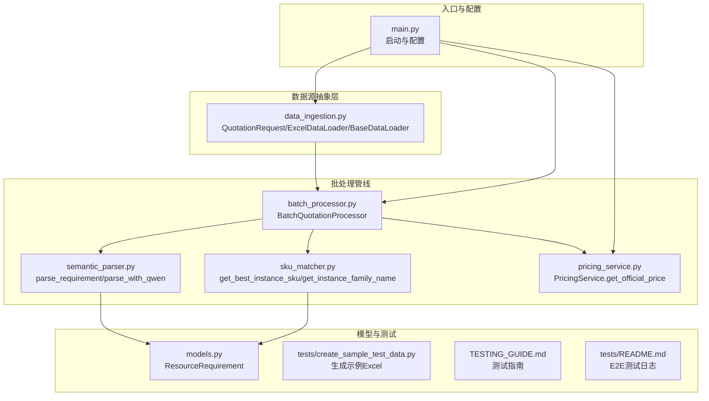
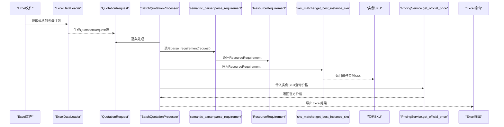
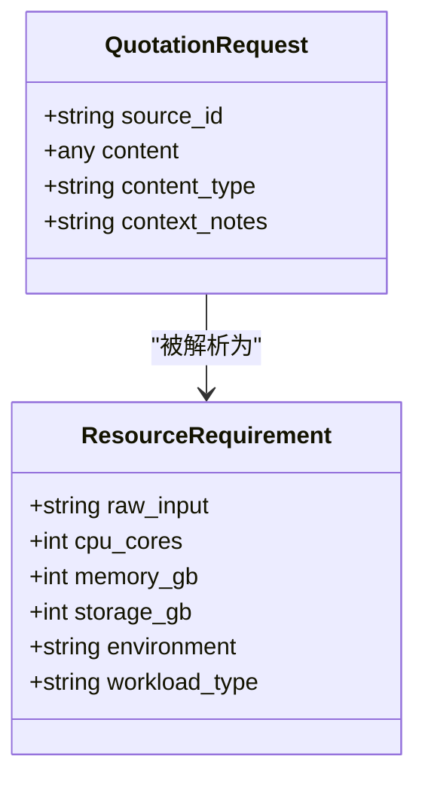
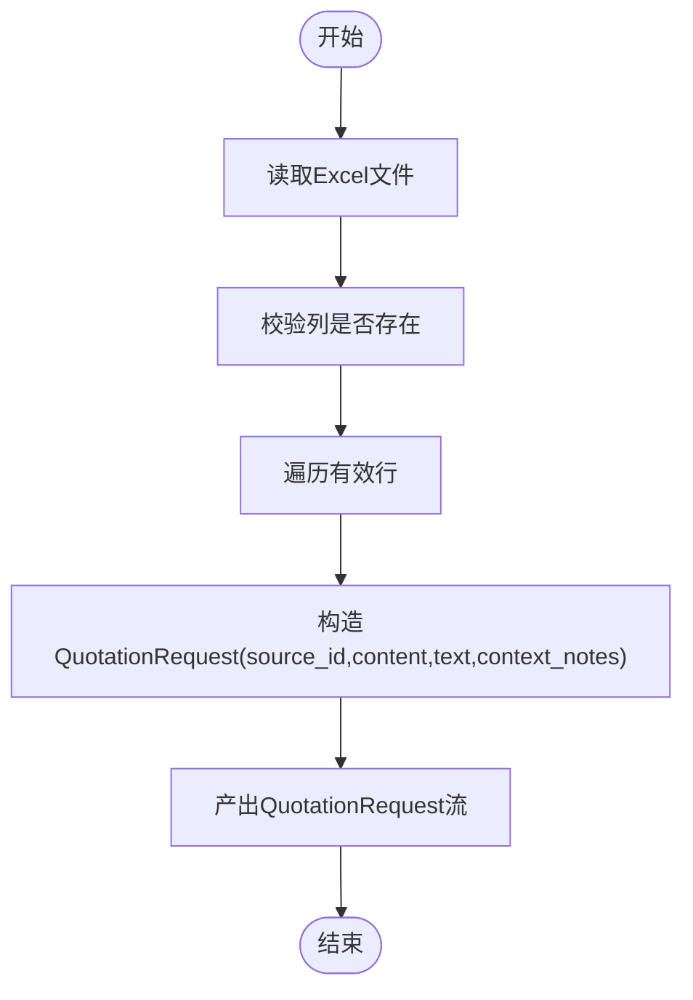
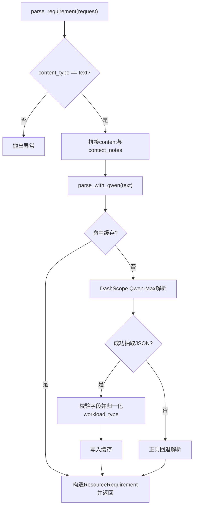
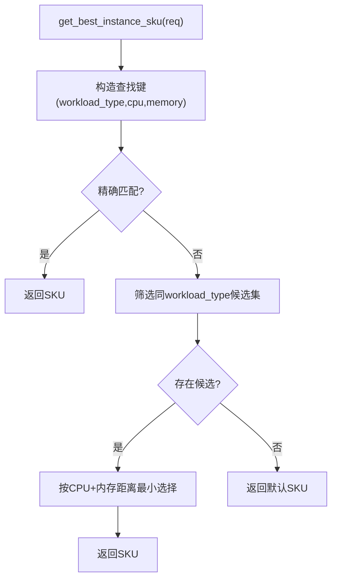
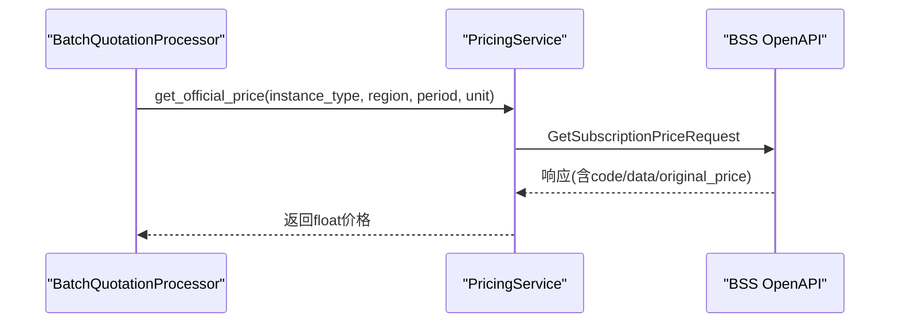
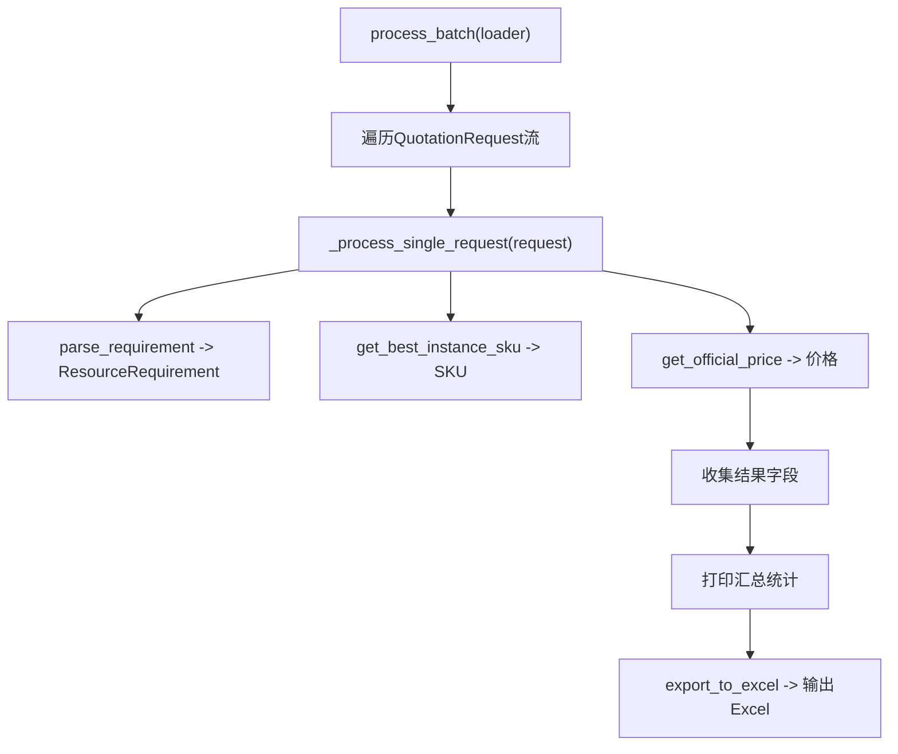
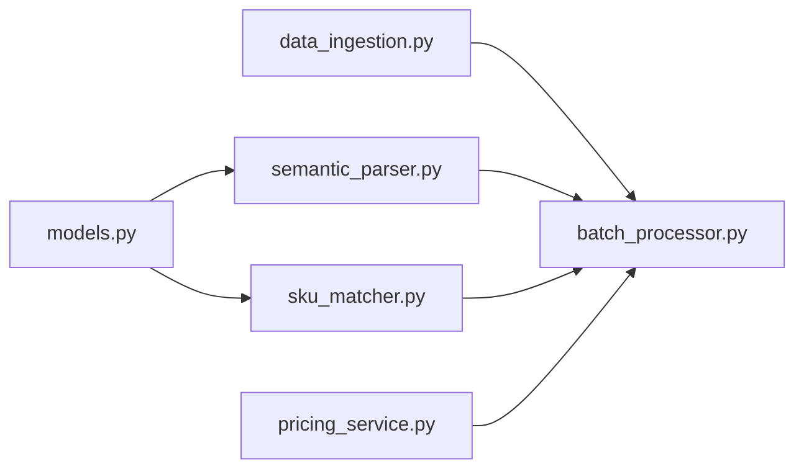

# 数据流分析

<cite>
**本文引用的文件**
- [main.py](file://main.py)
- [data_ingestion.py](file://data_ingestion.py)
- [models.py](file://models.py)
- [semantic_parser.py](file://semantic_parser.py)
- [sku_matcher.py](file://sku_matcher.py)
- [pricing_service.py](file://pricing_service.py)
- [batch_processor.py](file://batch_processor.py)
- [tests/create_sample_test_data.py](file://tests/create_sample_test_data.py)
- [TESTING_GUIDE.md](file://TESTING_GUIDE.md)
- [tests/README.md](file://tests/README.md)
</cite>

## 目录
1. [引言](#引言)
2. [项目结构](#项目结构)
3. [核心组件](#核心组件)
4. [架构总览](#架构总览)
5. [详细组件分析](#详细组件分析)
6. [依赖分析](#依赖分析)
7. [性能考虑](#性能考虑)
8. [故障排查指南](#故障排查指南)
9. [结论](#结论)
10. [附录](#附录)

## 引言
本文件面向“从Excel输入到最终报价输出”的端到端数据流，系统性梳理QuotationRequest对象如何在各组件中演进为ResourceRequirement，再经SKU匹配与BSS OpenAPI价格查询，最终形成可导出的报价结果。文档重点说明：
- 数据结构演进：QuotationRequest → ResourceRequirement 的字段映射与业务规则
- 关键转换阶段：AI语义解析、实例SKU匹配、官方价格查询
- 管道流程：顺序调用与错误处理
- 可扩展性：多模态输入抽象与未来扩展点

## 项目结构
项目采用分层与抽象设计，围绕“数据源抽象层 → 批处理管线 → 业务服务”组织代码，确保对Excel以外的输入（图像、语音）保持零代码变更的兼容能力。

图表来源
- [main.py](file://main.py#L1-L100)
- [data_ingestion.py](file://data_ingestion.py#L1-L204)
- [batch_processor.py](file://batch_processor.py#L1-L244)
- [semantic_parser.py](file://semantic_parser.py#L1-L349)
- [sku_matcher.py](file://sku_matcher.py#L1-L134)
- [pricing_service.py](file://pricing_service.py#L1-L81)
- [models.py](file://models.py#L1-L54)
- [tests/create_sample_test_data.py](file://tests/create_sample_test_data.py#L1-L42)
- [TESTING_GUIDE.md](file://TESTING_GUIDE.md#L1-L355)
- [tests/README.md](file://tests/README.md#L132-L179)

章节来源
- [main.py](file://main.py#L1-L100)
- [data_ingestion.py](file://data_ingestion.py#L1-L204)
- [batch_processor.py](file://batch_processor.py#L1-L244)
- [semantic_parser.py](file://semantic_parser.py#L1-L349)
- [sku_matcher.py](file://sku_matcher.py#L1-L134)
- [pricing_service.py](file://pricing_service.py#L1-L81)
- [models.py](file://models.py#L1-L54)
- [tests/create_sample_test_data.py](file://tests/create_sample_test_data.py#L1-L42)
- [TESTING_GUIDE.md](file://TESTING_GUIDE.md#L1-L355)
- [tests/README.md](file://tests/README.md#L132-L179)

## 核心组件
- QuotationRequest：统一的报价请求载体，承载来源标识、内容、内容类型与上下文备注，作为所有输入的标准化起点。
- ResourceRequirement：标准化资源需求模型，包含CPU、内存、存储、环境与工作负载类型等字段，作为AI解析后的标准输出。
- 批处理管线：负责按序执行解析、匹配、询价，并汇总结果与导出Excel。
- AI语义解析：基于DashScope Qwen-Max的智能解析，支持JSON抽取与正则回退。
- SKU匹配：根据工作负载类型与CPU/内存规格在实例目录中查找最佳匹配。
- 官方价格查询：通过BSS OpenAPI获取实例的官方价格。

章节来源
- [data_ingestion.py](file://data_ingestion.py#L13-L31)
- [models.py](file://models.py#L10-L54)
- [batch_processor.py](file://batch_processor.py#L18-L57)
- [semantic_parser.py](file://semantic_parser.py#L25-L68)
- [sku_matcher.py](file://sku_matcher.py#L45-L103)
- [pricing_service.py](file://pricing_service.py#L28-L81)

## 架构总览
下图展示从Excel输入到报价输出的端到端数据流，包括数据结构演进与关键转换步骤。

图表来源
- [data_ingestion.py](file://data_ingestion.py#L111-L147)
- [batch_processor.py](file://batch_processor.py#L80-L165)
- [semantic_parser.py](file://semantic_parser.py#L25-L68)
- [sku_matcher.py](file://sku_matcher.py#L45-L103)
- [pricing_service.py](file://pricing_service.py#L28-L81)

## 详细组件分析

### 数据模型：QuotationRequest 与 ResourceRequirement
- QuotationRequest
  - 字段：source_id、content、content_type、context_notes
  - 作用：作为所有输入（Excel/图像/语音）的统一抽象，屏蔽数据源差异
- ResourceRequirement
  - 字段：raw_input、cpu_cores、memory_gb、storage_gb、environment、workload_type
  - 作用：标准化资源需求意图，供后续SKU匹配与价格查询使用

图表来源
- [data_ingestion.py](file://data_ingestion.py#L13-L31)
- [models.py](file://models.py#L10-L54)

章节来源
- [data_ingestion.py](file://data_ingestion.py#L13-L31)
- [models.py](file://models.py#L10-L54)

### 数据流阶段一：Excel输入到QuotationRequest
- ExcelDataLoader读取Excel文件，校验列是否存在，将每行转换为QuotationRequest
- content_type固定为"text"，content为规格文本，context_notes为备注
- get_total_count统计有效行数，用于进度显示

图表来源
- [data_ingestion.py](file://data_ingestion.py#L91-L147)

章节来源
- [data_ingestion.py](file://data_ingestion.py#L63-L147)
- [tests/create_sample_test_data.py](file://tests/create_sample_test_data.py#L15-L42)

### 数据流阶段二：QuotationRequest 到 ResourceRequirement（AI语义解析）
- parse_requirement(request)
  - content_type为"text"时，拼接content与context_notes，调用parse_with_qwen
  - 不支持的content_type抛出异常
- parse_with_qwen(text)
  - 优先命中缓存；否则调用DashScope Qwen-Max，抽取JSON并校验字段
  - 若AI失败，回退到正则规则提取CPU、内存、存储与工作负载类型
  - 返回ResourceRequirement对象

图表来源
- [semantic_parser.py](file://semantic_parser.py#L25-L68)
- [semantic_parser.py](file://semantic_parser.py#L71-L218)

章节来源
- [semantic_parser.py](file://semantic_parser.py#L25-L68)
- [semantic_parser.py](file://semantic_parser.py#L71-L218)

### 数据流阶段三：ResourceRequirement 到 实例SKU（SKU匹配）
- get_best_instance_sku(req)
  - 精确匹配：以(workload_type, cpu_cores, memory_gb)为键查找
  - 降级匹配：若无精确匹配，按相同workload_type内寻找最接近的CPU/内存组合
  - 兜底策略：返回默认通用型实例
- get_instance_family_name(instance_type)
  - 将实例类型映射为友好名称，便于输出展示

图表来源
- [sku_matcher.py](file://sku_matcher.py#L45-L103)

章节来源
- [sku_matcher.py](file://sku_matcher.py#L15-L103)

### 数据流阶段四：实例SKU 到 官方价格（BSS OpenAPI）
- PricingService.get_official_price(instance_type, region, period, unit)
  - 使用固定常量：product_code="ecs"、order_type="NewOrder"、module_code="InstanceType"
  - 请求包体包含订阅类型、购买周期与实例类型配置
  - 成功时解析original_price并返回；失败抛出异常交由上层处理

图表来源
- [pricing_service.py](file://pricing_service.py#L28-L81)
- [batch_processor.py](file://batch_processor.py#L128-L143)

章节来源
- [pricing_service.py](file://pricing_service.py#L28-L81)
- [batch_processor.py](file://batch_processor.py#L128-L143)

### 批处理与导出：从请求到Excel
- process_batch(data_loader, verbose)
  - 逐条调用_process_single_request，收集结果
- _process_single_request(request, verbose)
  - 步骤1：parse_requirement → ResourceRequirement
  - 步骤2：get_best_instance_sku → 实例SKU
  - 步骤3：get_official_price → 官方价格
  - 汇总字段：source_id、content、content_type、context_notes、cpu_cores、memory_gb、storage_gb、environment、workload_type、matched_sku、instance_family、price_cny_month、success、error
- export_to_excel(output_path)
  - 将结果导出为Excel，包含状态与错误信息

图表来源
- [batch_processor.py](file://batch_processor.py#L42-L165)
- [batch_processor.py](file://batch_processor.py#L209-L244)

章节来源
- [batch_processor.py](file://batch_processor.py#L42-L165)
- [batch_processor.py](file://batch_processor.py#L209-L244)

## 依赖分析
- 组件耦合与职责
  - data_ingestion.py 提供统一请求模型与数据加载抽象
  - semantic_parser.py 仅依赖models.py中的ResourceRequirement
  - sku_matcher.py 依赖models.py中的ResourceRequirement
  - batch_processor.py 依赖上述三个模块，并持有PricingService
  - pricing_service.py 依赖阿里云SDK，提供官方价格查询
- 外部依赖
  - DashScope API（Qwen-Max）、阿里云BSS OpenAPI、pandas/openpyxl、dotenv等

图表来源
- [data_ingestion.py](file://data_ingestion.py#L1-L204)
- [batch_processor.py](file://batch_processor.py#L1-L244)
- [semantic_parser.py](file://semantic_parser.py#L1-L349)
- [sku_matcher.py](file://sku_matcher.py#L1-L134)
- [pricing_service.py](file://pricing_service.py#L1-L81)
- [models.py](file://models.py#L1-L54)

章节来源
- [data_ingestion.py](file://data_ingestion.py#L1-L204)
- [batch_processor.py](file://batch_processor.py#L1-L244)
- [semantic_parser.py](file://semantic_parser.py#L1-L349)
- [sku_matcher.py](file://sku_matcher.py#L1-L134)
- [pricing_service.py](file://pricing_service.py#L1-L81)
- [models.py](file://models.py#L1-L54)

## 性能考虑
- AI解析缓存：_llm_cache减少重复调用，降低DashScope Token消耗
- SKU匹配：先精确匹配，再按距离最近的候选集降级，避免全表扫描
- 批处理：逐条处理，便于进度与错误定位；导出前一次性写入Excel，避免多次IO
- 网络调用：BSS OpenAPI为外部服务，建议在批量处理中合理设置超时与重试策略（当前未内置重试）

[本节为通用指导，不直接分析具体文件]

## 故障排查指南
- 环境变量缺失
  - 现象：启动时报错提示缺少密钥
  - 排查：确认.env中包含阿里云与DashScope密钥
- Excel文件缺失或列不匹配
  - 现象：FileNotFoundError或列不存在
  - 排查：检查文件路径与列名（默认列名为"Specification"与"Remarks"）
- AI解析失败
  - 现象：AI解析失败，回退到正则规则
  - 排查：检查DashScope API Key有效性；调整输入文本格式以利于JSON抽取
- BSS OpenAPI权限不足
  - 现象：API返回权限错误
  - 排查：授予RAM角色AliyunBSSReadOnlyAccess或AliyunBSSFullAccess
- 输出为空
  - 现象：导出Excel但无数据
  - 排查：确认已先执行process_batch()，且results非空

章节来源
- [main.py](file://main.py#L31-L40)
- [data_ingestion.py](file://data_ingestion.py#L87-L108)
- [semantic_parser.py](file://semantic_parser.py#L128-L159)
- [TESTING_GUIDE.md](file://TESTING_GUIDE.md#L1-L355)
- [tests/README.md](file://tests/README.md#L132-L179)

## 结论
该报价管道以“数据源抽象层 + 批处理管线 + 业务服务”为核心，实现了从Excel输入到最终报价输出的完整闭环。通过标准化的ResourceRequirement模型与多阶段转换，系统具备良好的可扩展性与鲁棒性。AI解析与SKU匹配提供了智能化决策能力，BSS OpenAPI保证了价格来源的权威性。建议在生产环境中结合重试与监控完善错误处理，并持续扩展实例目录与工作负载类型映射。

[本节为总结性内容，不直接分析具体文件]

## 附录

### 关键字段映射与业务规则
- QuotationRequest → ResourceRequirement
  - raw_input ← request.content + " | " + request.context_notes
  - cpu_cores ← AI/正则抽取
  - memory_gb ← AI/正则抽取
  - storage_gb ← AI可能缺失，使用正则回退
  - environment ← Phase 5：不再分类，固定为"prod"
  - workload_type ← AI抽取后归一化：memory_intensive→memory_intensive；compute_intensive→compute；general_purpose→general
- SKU匹配
  - 精确匹配优先；否则按workload_type内最近CPU/内存组合；无匹配返回默认通用型实例
- 价格查询
  - 固定product_code="ecs"、order_type="NewOrder"、module_code="InstanceType"
  - 默认region="cn-beijing"、unit="Month"、period=1

章节来源
- [semantic_parser.py](file://semantic_parser.py#L90-L218)
- [semantic_parser.py](file://semantic_parser.py#L220-L349)
- [sku_matcher.py](file://sku_matcher.py#L45-L103)
- [pricing_service.py](file://pricing_service.py#L28-L81)