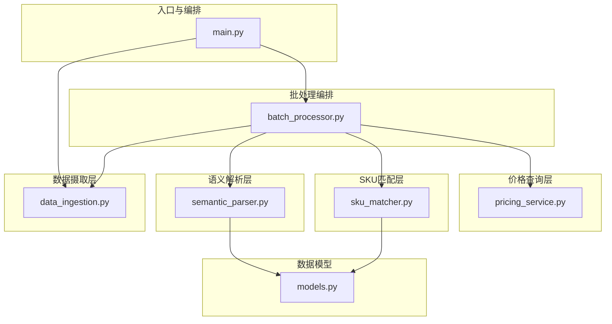
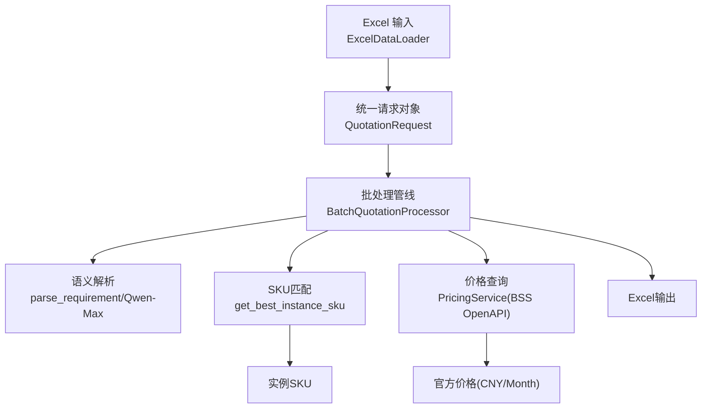
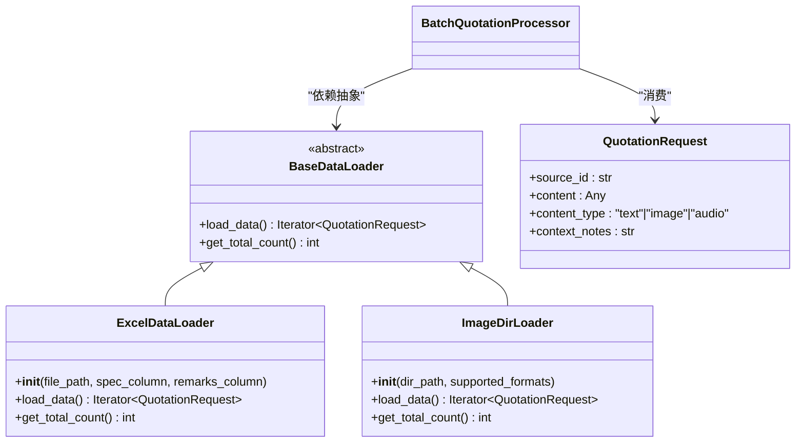
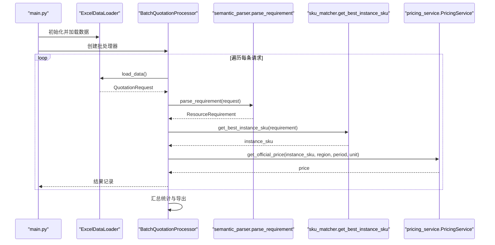
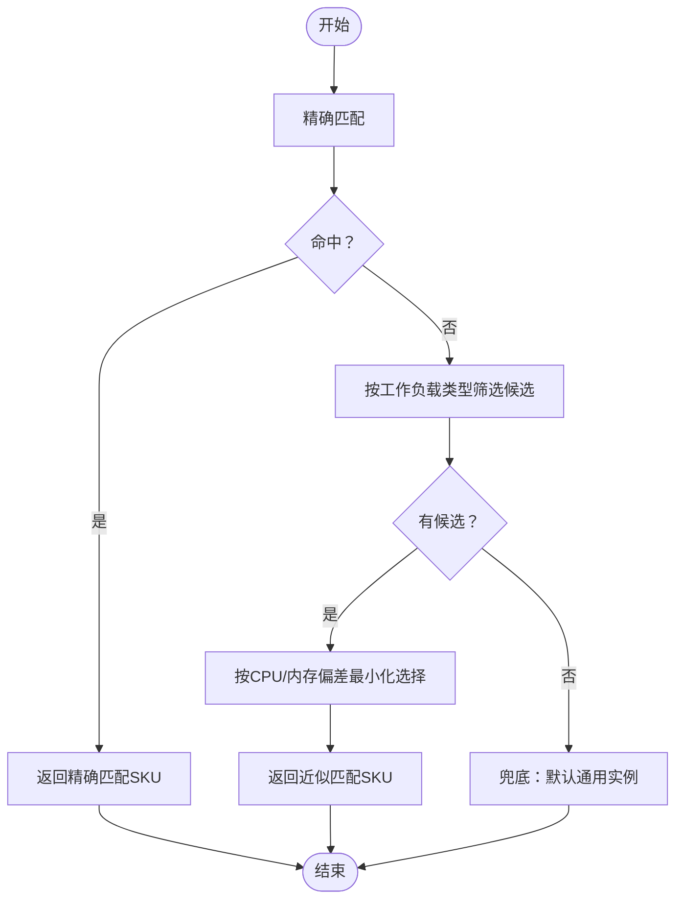
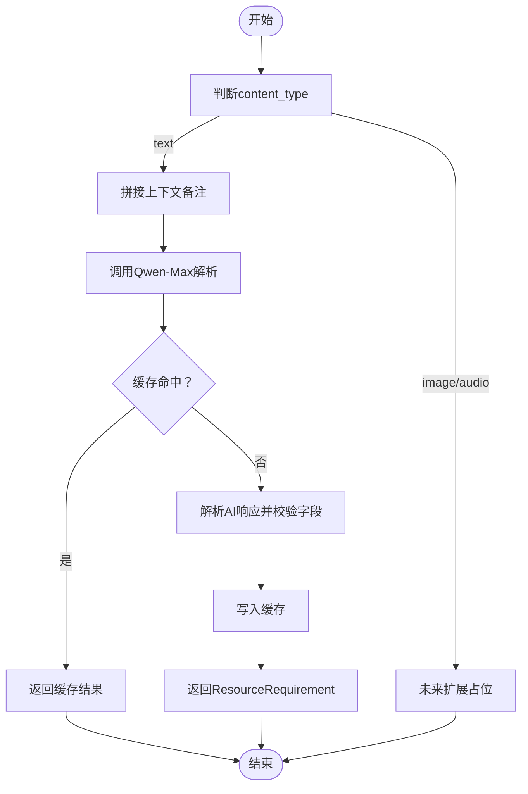
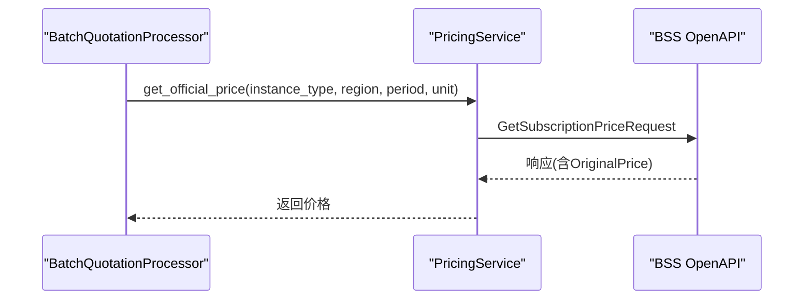
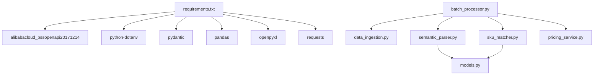

# 架构设计

<cite>
**本文引用的文件**
- [main.py](file://main.py)
- [batch_processor.py](file://batch_processor.py)
- [data_ingestion.py](file://data_ingestion.py)
- [semantic_parser.py](file://semantic_parser.py)
- [sku_matcher.py](file://sku_matcher.py)
- [pricing_service.py](file://pricing_service.py)
- [models.py](file://models.py)
- [requirements.txt](file://requirements.txt)
- [tests/README.md](file://tests/README.md)
- [TESTING_GUIDE.md](file://TESTING_GUIDE.md)
- [PHASE6_COMPLETION_SUMMARY.md](file://PHASE6_COMPLETION_SUMMARY.md)
- [tests/test_e2e_real_world.py](file://tests/test_e2e_real_world.py)
</cite>

## 目录
1. [简介](#简介)
2. [项目结构](#项目结构)
3. [核心组件](#核心组件)
4. [架构总览](#架构总览)
5. [详细组件分析](#详细组件分析)
6. [依赖关系分析](#依赖关系分析)
7. [性能考量](#性能考量)
8. [故障排查指南](#故障排查指南)
9. [结论](#结论)
10. [附录](#附录)

## 简介
本架构设计文档围绕报价管道系统，系统性阐述其分层架构风格与组件交互关系，并重点解释以下设计模式的应用：
- 抽象工厂模式在实现“数据源无关性”中的作用：通过抽象的数据加载器接口，使批处理管线对具体数据格式完全解耦。
- 责任链模式在批处理流程中的体现：从“语义解析”到“SKU匹配”，再到“价格查询”的顺序处理，形成一条职责链。
- 策略模式在SKU匹配中的实现：通过实例目录与近似匹配策略，将“如何选择最优实例”的决策与“如何执行报价”的流程解耦。

同时，文档提供系统上下文图与组件分解图，展示从Excel输入到报价输出的完整数据流；解释技术决策背后的权衡，包括为何选择Qwen-Max进行语义解析以及BSS OpenAPI集成的优势；并给出可扩展性考虑与未来扩展点（如多模态数据源支持）。

## 项目结构
项目采用按职责分层的组织方式，核心模块如下：
- 入口与编排：main.py
- 批处理编排：batch_processor.py
- 数据摄取层：data_ingestion.py
- 语义解析层：semantic_parser.py
- SKU匹配层：sku_matcher.py
- 价格查询层：pricing_service.py
- 数据模型：models.py
- 测试与验证：tests/* 与 PHASE6_COMPLETION_SUMMARY.md、TESTING_GUIDE.md

图表来源
- [main.py](file://main.py#L1-L100)
- [batch_processor.py](file://batch_processor.py#L1-L244)
- [data_ingestion.py](file://data_ingestion.py#L1-L204)
- [semantic_parser.py](file://semantic_parser.py#L1-L349)
- [sku_matcher.py](file://sku_matcher.py#L1-L134)
- [pricing_service.py](file://pricing_service.py#L1-L81)
- [models.py](file://models.py#L1-L54)

章节来源
- [main.py](file://main.py#L1-L100)
- [batch_processor.py](file://batch_processor.py#L1-L244)
- [data_ingestion.py](file://data_ingestion.py#L1-L204)
- [semantic_parser.py](file://semantic_parser.py#L1-L349)
- [sku_matcher.py](file://sku_matcher.py#L1-L134)
- [pricing_service.py](file://pricing_service.py#L1-L81)
- [models.py](file://models.py#L1-L54)

## 核心组件
- 入口与编排（main.py）
  - 负责加载环境变量、初始化数据加载器、价格查询服务与批处理器，并驱动批处理流程与结果导出。
- 批处理编排（batch_processor.py）
  - 作为责任链的调度者，依次执行“语义解析—SKU匹配—价格查询”，并负责错误处理与汇总统计。
- 数据摄取层（data_ingestion.py）
  - 定义统一的请求对象与抽象数据加载器接口；当前实现ExcelDataLoader，预留ImageDirLoader等扩展。
- 语义解析层（semantic_parser.py）
  - 基于Qwen-Max进行意图抽取与工作负载分类；内置缓存与回退规则，保证鲁棒性。
- SKU匹配层（sku_matcher.py）
  - 基于实例目录与近似匹配策略，将资源需求映射为具体实例SKU。
- 价格查询层（pricing_service.py）
  - 通过BSS OpenAPI查询官方价格，封装SDK细节，简化调用。
- 数据模型（models.py）
  - 统一的资源需求Schema，确保跨数据源的一致性。

章节来源
- [main.py](file://main.py#L1-L100)
- [batch_processor.py](file://batch_processor.py#L1-L244)
- [data_ingestion.py](file://data_ingestion.py#L1-L204)
- [semantic_parser.py](file://semantic_parser.py#L1-L349)
- [sku_matcher.py](file://sku_matcher.py#L1-L134)
- [pricing_service.py](file://pricing_service.py#L1-L81)
- [models.py](file://models.py#L1-L54)

## 架构总览
系统采用“分层+解耦”的架构风格：
- 分层：入口层、编排层、领域层（解析/匹配/定价）、基础设施层（SDK/HTTP）。
- 解耦：通过抽象接口（BaseDataLoader）与标准化数据模型（ResourceRequirement），屏蔽数据源差异与下游变化。

图表来源
- [main.py](file://main.py#L1-L100)
- [batch_processor.py](file://batch_processor.py#L1-L244)
- [data_ingestion.py](file://data_ingestion.py#L1-L204)
- [semantic_parser.py](file://semantic_parser.py#L1-L349)
- [sku_matcher.py](file://sku_matcher.py#L1-L134)
- [pricing_service.py](file://pricing_service.py#L1-L81)

## 详细组件分析

### 抽象工厂模式与数据源无关性
- 抽象工厂思想体现在：通过BaseDataLoader抽象接口与具体实现（ExcelDataLoader、ImageDirLoader等）分离，使得批处理管线无需感知具体数据格式。
- 价值：新增数据源（如图片、音频）时，仅需实现新的Loader，批处理器保持不变，实现零侵入扩展。

图表来源
- [data_ingestion.py](file://data_ingestion.py#L1-L204)
- [batch_processor.py](file://batch_processor.py#L1-L244)

章节来源
- [data_ingestion.py](file://data_ingestion.py#L1-L204)
- [batch_processor.py](file://batch_processor.py#L1-L244)

### 责任链模式在批处理流程中的体现
- 责任链三段式：语义解析（Parse）→ SKU匹配（Match）→ 价格查询（Quote）。
- 每个阶段只关注自身职责，错误在当前阶段被捕获并向上游反馈，保证整体流程的稳定性。

图表来源
- [main.py](file://main.py#L1-L100)
- [batch_processor.py](file://batch_processor.py#L1-L244)
- [semantic_parser.py](file://semantic_parser.py#L1-L349)
- [sku_matcher.py](file://sku_matcher.py#L1-L134)
- [pricing_service.py](file://pricing_service.py#L1-L81)

章节来源
- [batch_processor.py](file://batch_processor.py#L1-L244)
- [semantic_parser.py](file://semantic_parser.py#L1-L349)
- [sku_matcher.py](file://sku_matcher.py#L1-L134)
- [pricing_service.py](file://pricing_service.py#L1-L81)

### 策略模式在SKU匹配中的实现
- 策略：实例目录（INSTANCE_CATALOG）+ 近似匹配策略（按工作负载类型最小化CPU/内存偏差）+ 兜底策略（默认通用实例）。
- 价值：将“如何选择实例”的业务规则与“如何执行报价”的流程解耦，便于维护与扩展。

图表来源
- [sku_matcher.py](file://sku_matcher.py#L1-L134)
- [models.py](file://models.py#L1-L54)

章节来源
- [sku_matcher.py](file://sku_matcher.py#L1-L134)
- [models.py](file://models.py#L1-L54)

### 语义解析与AI决策
- 采用Qwen-Max进行意图抽取与工作负载分类，结合缓存与回退规则，提升鲁棒性与成本控制。
- 未来扩展：图像/音频输入的多模态解析（预留占位）。

图表来源
- [semantic_parser.py](file://semantic_parser.py#L1-L349)

章节来源
- [semantic_parser.py](file://semantic_parser.py#L1-L349)

### 价格查询与BSS OpenAPI集成
- 通过BSS OpenAPI查询官方价格，封装请求构造与响应解析，简化调用复杂度。
- 技术权衡：使用OpenAPI而非SDK，减少依赖与版本绑定风险；同时保留SDK能力以备后续迁移。

图表来源
- [pricing_service.py](file://pricing_service.py#L1-L81)
- [batch_processor.py](file://batch_processor.py#L1-L244)

章节来源
- [pricing_service.py](file://pricing_service.py#L1-L81)
- [batch_processor.py](file://batch_processor.py#L1-L244)

## 依赖关系分析
- 外部依赖：Alibaba Cloud BSS OpenAPI、DashScope Qwen-Max、pandas/openpyxl、requests、python-dotenv、pydantic。
- 内部依赖：批处理器依赖数据摄取、语义解析、SKU匹配与价格查询；语义解析与SKU匹配依赖统一数据模型。

图表来源
- [requirements.txt](file://requirements.txt#L1-L9)
- [batch_processor.py](file://batch_processor.py#L1-L244)
- [data_ingestion.py](file://data_ingestion.py#L1-L204)
- [semantic_parser.py](file://semantic_parser.py#L1-L349)
- [sku_matcher.py](file://sku_matcher.py#L1-L134)
- [pricing_service.py](file://pricing_service.py#L1-L81)
- [models.py](file://models.py#L1-L54)

章节来源
- [requirements.txt](file://requirements.txt#L1-L9)
- [batch_processor.py](file://batch_processor.py#L1-L244)
- [data_ingestion.py](file://data_ingestion.py#L1-L204)
- [semantic_parser.py](file://semantic_parser.py#L1-L349)
- [sku_matcher.py](file://sku_matcher.py#L1-L134)
- [pricing_service.py](file://pricing_service.py#L1-L81)
- [models.py](file://models.py#L1-L54)

## 性能考量
- 批处理吞吐：每行数据触发一次AI解析与一次价格查询，网络延迟为主要瓶颈。
- 缓存策略：语义解析层内置LLM缓存，降低重复输入的token与调用成本。
- 错误处理：对API异常与未实现特性进行显式捕获与降级，避免单点失败影响整体。
- 可观测性：测试套件提供双输出日志（控制台/INFO + 文件/DEBUG），便于定位问题。

章节来源
- [semantic_parser.py](file://semantic_parser.py#L1-L349)
- [batch_processor.py](file://batch_processor.py#L1-L244)
- [PHASE6_COMPLETION_SUMMARY.md](file://PHASE6_COMPLETION_SUMMARY.md#L1-L600)
- [TESTING_GUIDE.md](file://TESTING_GUIDE.md#L1-L515)

## 故障排查指南
- 环境变量缺失：确认ALIBABA_CLOUD_ACCESS_KEY_ID、ALIBABA_CLOUD_ACCESS_KEY_SECRET、DASHSCOPE_API_KEY均已配置。
- API调用失败：检查网络连通性、账户权限与配额；参考日志文件定位RequestId。
- 测试数据缺失：使用测试脚本生成示例数据或将Excel放入tests/data/xlsx/目录。
- 输出验证：确保输出文件存在且包含“Price (CNY/Month)”列，统计成功/失败数量。

章节来源
- [tests/README.md](file://tests/README.md#L1-L276)
- [TESTING_GUIDE.md](file://TESTING_GUIDE.md#L1-L515)
- [PHASE6_COMPLETION_SUMMARY.md](file://PHASE6_COMPLETION_SUMMARY.md#L1-L600)
- [tests/test_e2e_real_world.py](file://tests/test_e2e_real_world.py#L1-L200)

## 结论
本报价管道系统通过“抽象工厂+责任链+策略”的组合设计，实现了数据源无关、流程清晰、策略可插拔的架构。语义解析采用Qwen-Max并辅以缓存与回退，价格查询通过BSS OpenAPI直连，既保证了准确性也兼顾了成本与可观测性。未来可进一步扩展多模态数据源与策略规则，持续提升系统的灵活性与智能化水平。

## 附录
- 多模态扩展点：预留ImageDirLoader与未来图像/音频解析占位，批处理器无需改动即可接入。
- 可扩展性建议：引入配置中心管理实例目录与策略阈值；增加并发与重试机制；完善指标采集与告警。