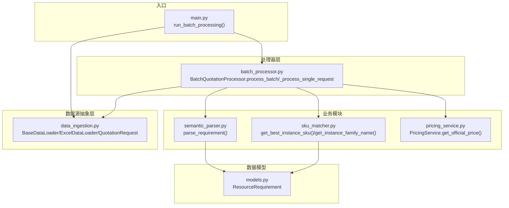
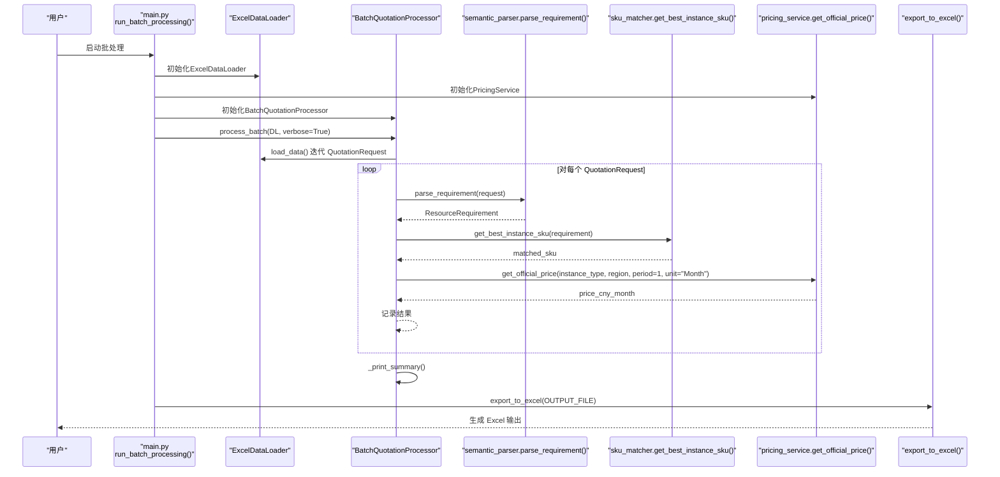
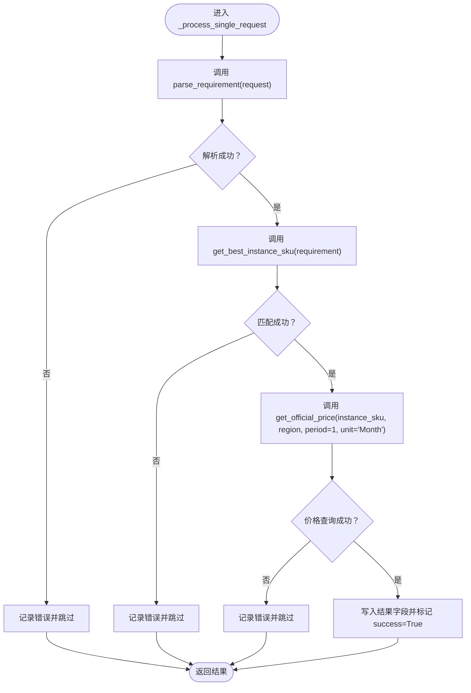
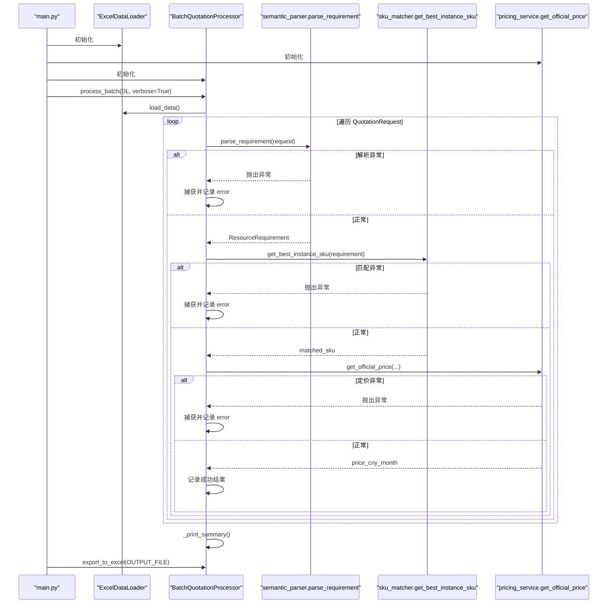
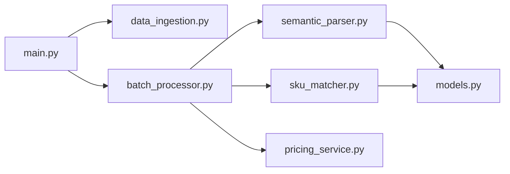

# 控制流

<cite>
**本文引用的文件**
- [main.py](file://main.py)
- [batch_processor.py](file://batch_processor.py)
- [semantic_parser.py](file://semantic_parser.py)
- [sku_matcher.py](file://sku_matcher.py)
- [pricing_service.py](file://pricing_service.py)
- [data_ingestion.py](file://data_ingestion.py)
- [models.py](file://models.py)
- [tests/test_e2e_real_world.py](file://tests/test_e2e_real_world.py)
</cite>

## 目录
1. [简介](#简介)
2. [项目结构](#项目结构)
3. [核心组件](#核心组件)
4. [架构总览](#架构总览)
5. [详细组件分析](#详细组件分析)
6. [依赖关系分析](#依赖关系分析)
7. [性能考量](#性能考量)
8. [故障排查指南](#故障排查指南)
9. [结论](#结论)

## 简介
本文围绕从 main.py 的 run_batch_processing() 出发，系统梳理报价批处理的完整控制流。重点覆盖：
- BatchQuotationProcessor 如何迭代 data_loader 提供的 QuotationRequest 对象，并对每个请求执行三阶段处理流水线（解析→匹配→定价）。
- 数据在 parse_requirement、get_best_instance_sku、pricing_service.get_official_price 之间的传递路径。
- _print_summary 如何生成统计摘要，export_to_excel 如何将结果持久化到 Excel 文件。
- 方法调用顺序与时序图，以及异常传播路径。

## 项目结构
本项目采用“数据源抽象 + 处理器 + 业务模块”的分层设计：
- 数据源抽象层：BaseDataLoader 及其实现（ExcelDataLoader、ImageDirLoader 等），负责将不同来源的数据标准化为 QuotationRequest。
- 处理器层：BatchQuotationProcessor，面向任意数据源，执行解析、匹配、定价三阶段流水线。
- 业务模块：semantic_parser（语义解析）、sku_matcher（实例匹配）、pricing_service（官方价格查询）。
- 数据模型：models.ResourceRequirement，作为三阶段之间的统一数据载体。

图表来源
- [main.py](file://main.py#L15-L99)
- [data_ingestion.py](file://data_ingestion.py#L13-L204)
- [batch_processor.py](file://batch_processor.py#L42-L165)
- [semantic_parser.py](file://semantic_parser.py#L25-L69)
- [sku_matcher.py](file://sku_matcher.py#L45-L103)
- [pricing_service.py](file://pricing_service.py#L28-L81)
- [models.py](file://models.py#L10-L54)

章节来源
- [main.py](file://main.py#L15-L99)
- [data_ingestion.py](file://data_ingestion.py#L13-L204)
- [batch_processor.py](file://batch_processor.py#L42-L165)
- [semantic_parser.py](file://semantic_parser.py#L25-L69)
- [sku_matcher.py](file://sku_matcher.py#L45-L103)
- [pricing_service.py](file://pricing_service.py#L28-L81)
- [models.py](file://models.py#L10-L54)

## 核心组件
- main.py：初始化环境变量、构建数据加载器、定价服务与批处理器，调用 process_batch 并导出 Excel。
- data_ingestion.py：定义 QuotationRequest 标准化输入；BaseDataLoader 抽象接口；ExcelDataLoader 实现从 Excel 读取并产出 QuotationRequest 流。
- batch_processor.py：批处理器核心，实现 process_batch 迭代处理、_process_single_request 三阶段流水线、_print_summary 统计、export_to_excel 导出。
- semantic_parser.py：parse_requirement 将 QuotationRequest 转换为 ResourceRequirement；parse_with_qwen 使用 DashScope API 进行 AI 解析；包含回退规则。
- sku_matcher.py：基于 ResourceRequirement 在 INSTANCE_CATALOG 中匹配最佳实例 SKU，并提供实例族名称映射。
- pricing_service.py：封装阿里云 BSS OpenAPI，查询实例官方价格（默认按月）。
- models.py：ResourceRequirement 标准化资源需求模型。

章节来源
- [main.py](file://main.py#L15-L99)
- [data_ingestion.py](file://data_ingestion.py#L13-L204)
- [batch_processor.py](file://batch_processor.py#L42-L244)
- [semantic_parser.py](file://semantic_parser.py#L25-L218)
- [sku_matcher.py](file://sku_matcher.py#L15-L134)
- [pricing_service.py](file://pricing_service.py#L13-L81)
- [models.py](file://models.py#L10-L54)

## 架构总览
批处理系统遵循“数据源无关 + 三阶段流水线”的设计原则：
- 数据源抽象：通过 BaseDataLoader 接口屏蔽 Excel、图片、音频等不同输入格式。
- 处理器：BatchQuotationProcessor 仅依赖抽象接口，保证新增输入格式无需修改处理器代码。
- 三阶段流水线：解析（语义理解）→ 匹配（实例落地）→ 定价（官方价格）。
- 结果输出：汇总统计与 Excel 导出。

图表来源
- [main.py](file://main.py#L51-L79)
- [batch_processor.py](file://batch_processor.py#L42-L165)
- [semantic_parser.py](file://semantic_parser.py#L25-L69)
- [sku_matcher.py](file://sku_matcher.py#L45-L103)
- [pricing_service.py](file://pricing_service.py#L28-L81)

## 详细组件分析

### 从 main.py 到批处理器的控制流
- main.py 读取 .env 凭证，构造 ExcelDataLoader、PricingService、BatchQuotationProcessor，并调用 process_batch。
- process_batch 返回结果列表，随后调用 export_to_excel 导出。

章节来源
- [main.py](file://main.py#L51-L79)
- [batch_processor.py](file://batch_processor.py#L42-L79)

### 批处理器的迭代与三阶段流水线
- process_batch：初始化 results，遍历 data_loader.load_data() 产出的 QuotationRequest，逐个调用 _process_single_request，并在完成后打印汇总。
- _process_single_request：三阶段流水线
  1) 解析：调用 parse_requirement(request) 得到 ResourceRequirement，并写入结果字典字段（cpu_cores、memory_gb、storage_gb、environment、workload_type）。
  2) 匹配：调用 get_best_instance_sku(requirement) 得到最佳实例 SKU，并写入 matched_sku、instance_family。
  3) 定价：调用 pricing_service.get_official_price(...) 获取官方价格（默认按月），写入 price_cny_month，并标记 success=True。
- 异常处理：捕获 NotImplementedError（多模态未实现）、TeaException（API 错误）、其他异常，分别记录 error 字段并继续下一个请求。

图表来源
- [batch_processor.py](file://batch_processor.py#L80-L165)
- [semantic_parser.py](file://semantic_parser.py#L25-L69)
- [sku_matcher.py](file://sku_matcher.py#L45-L103)
- [pricing_service.py](file://pricing_service.py#L28-L81)

章节来源
- [batch_processor.py](file://batch_processor.py#L80-L165)

### 数据在解析、匹配、定价之间的流动
- 输入：QuotationRequest（source_id、content、content_type、context_notes）
- 解析阶段：parse_requirement(request) → ResourceRequirement（cpu_cores、memory_gb、storage_gb、environment、workload_type）
- 匹配阶段：get_best_instance_sku(requirement) → matched_sku；get_instance_family_name(matched_sku) → instance_family
- 定价阶段：pricing_service.get_official_price(instance_type, region, period=1, unit="Month") → price_cny_month

章节来源
- [semantic_parser.py](file://semantic_parser.py#L25-L69)
- [sku_matcher.py](file://sku_matcher.py#L45-L103)
- [pricing_service.py](file://pricing_service.py#L28-L81)
- [models.py](file://models.py#L10-L54)

### 统计摘要与 Excel 导出
- _print_summary：遍历 results，区分成功/失败，打印表格与统计（总数、成功数、失败数、总成本、年估、平均成本）。
- export_to_excel：校验 results 非空，构造 DataFrame，导出到指定路径。

章节来源
- [batch_processor.py](file://batch_processor.py#L166-L244)

### 时序图：方法调用顺序与异常传播

图表来源
- [main.py](file://main.py#L51-L79)
- [batch_processor.py](file://batch_processor.py#L42-L165)
- [semantic_parser.py](file://semantic_parser.py#L25-L69)
- [sku_matcher.py](file://sku_matcher.py#L45-L103)
- [pricing_service.py](file://pricing_service.py#L28-L81)

## 依赖关系分析
- 模块内聚与耦合
  - data_ingestion 与 models：前者提供标准化输入，后者提供统一数据模型，耦合度低。
  - batch_processor 依赖 semantic_parser、sku_matcher、pricing_service，但通过抽象接口与数据模型解耦。
  - main.py 仅负责编排，不直接参与业务逻辑，职责清晰。
- 外部依赖
  - 阿里云 BSS OpenAPI、DashScope API，通过 pricing_service 与 semantic_parser 的封装对外暴露。
- 潜在循环依赖
  - 未发现循环依赖；各模块方向单一，自顶向下依赖。

图表来源
- [main.py](file://main.py#L15-L99)
- [data_ingestion.py](file://data_ingestion.py#L13-L204)
- [batch_processor.py](file://batch_processor.py#L42-L165)
- [semantic_parser.py](file://semantic_parser.py#L25-L69)
- [sku_matcher.py](file://sku_matcher.py#L45-L103)
- [pricing_service.py](file://pricing_service.py#L28-L81)
- [models.py](file://models.py#L10-L54)

章节来源
- [main.py](file://main.py#L15-L99)
- [batch_processor.py](file://batch_processor.py#L42-L165)

## 性能考量
- 解析阶段的 DashScope API 调用具备缓存机制，可显著降低重复输入的 token 消耗与响应时间。
- SKU 匹配采用精确查找 + 最近邻降级策略，时间复杂度与 catalog 规模相关；建议根据实际规模评估性能。
- 定价阶段为外部 API 调用，受网络与服务端响应影响；建议在批量处理中合理设置超时与重试策略（当前实现未显式重试，需结合上层调用者策略）。
- Excel 导出使用 pandas/openpyxl，大数据量时注意内存占用与磁盘 IO。

[本节为一般性指导，不直接分析具体文件]

## 故障排查指南
- 环境变量缺失
  - 现象：启动时报错提示缺少密钥。
  - 处理：确保 .env 中设置 ALIBABA_CLOUD_ACCESS_KEY_ID、ALIBABA_CLOUD_ACCESS_KEY_SECRET、DASHSCOPE_API_KEY。
- Excel 文件路径或列名问题
  - 现象：FileNotFoundError 或列不存在。
  - 处理：确认输入文件存在，且包含规范的规格列；remarks 列可选。
- 多模态输入类型
  - 现象：解析阶段抛出 NotImplementedError。
  - 处理：当前 text 类型已实现；image/audio 类型为未来扩展，会抛出 NotImplementedError。
- API 错误
  - 现象：TeaException 或 API 返回非成功状态。
  - 处理：记录错误与 RequestId，检查凭证与网络连通性；必要时重试。
- 导出前未执行批处理
  - 现象：export_to_excel 抛出 ValueError。
  - 处理：先调用 process_batch，再导出。

章节来源
- [main.py](file://main.py#L31-L40)
- [data_ingestion.py](file://data_ingestion.py#L82-L108)
- [semantic_parser.py](file://semantic_parser.py#L43-L69)
- [batch_processor.py](file://batch_processor.py#L144-L165)
- [pricing_service.py](file://pricing_service.py#L65-L81)

## 结论
本系统通过“数据源抽象 + 三阶段流水线 + 统一数据模型”的设计，实现了对多模态输入的批处理能力。从 main.py 的 run_batch_processing() 到 BatchQuotationProcessor 的 process_batch，再到解析、匹配、定价的链路清晰，异常处理完善，统计与导出功能完备。建议在生产环境中结合外部 API 的稳定性与网络状况，制定合理的超时与重试策略，并持续优化 SKU 匹配与解析的性能。