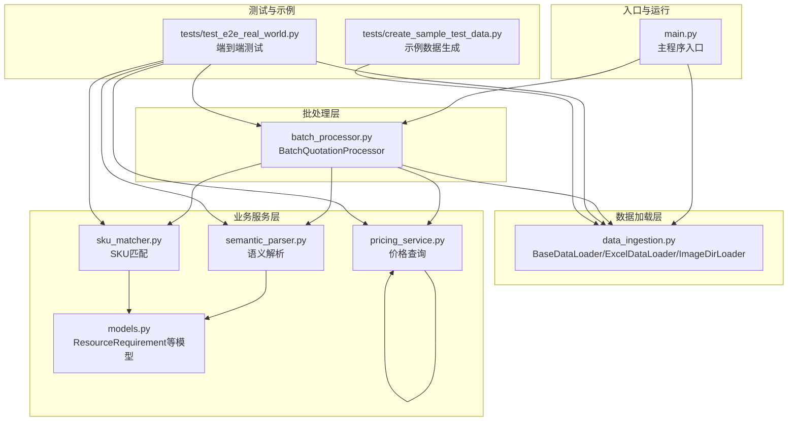
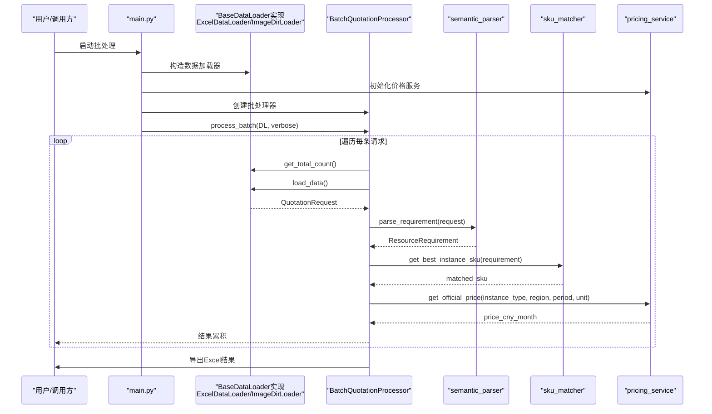
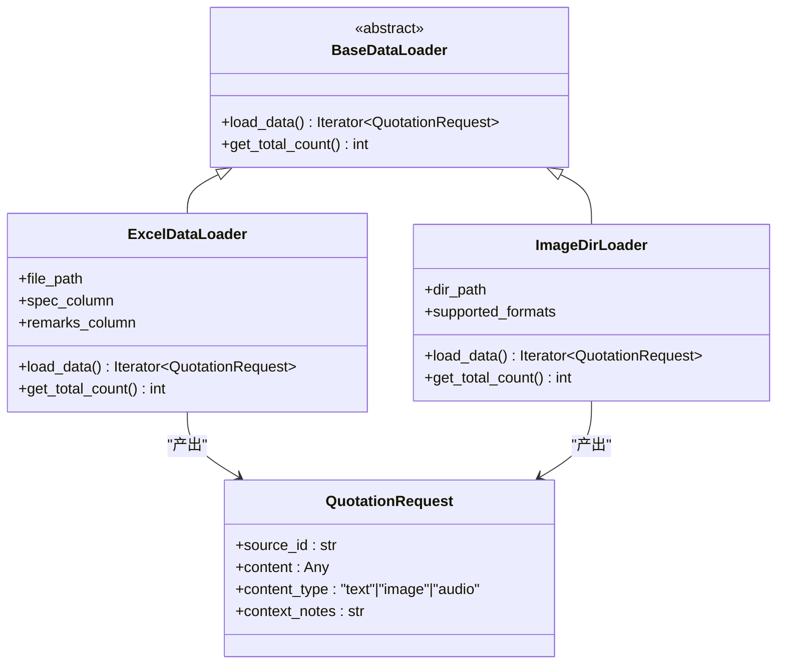
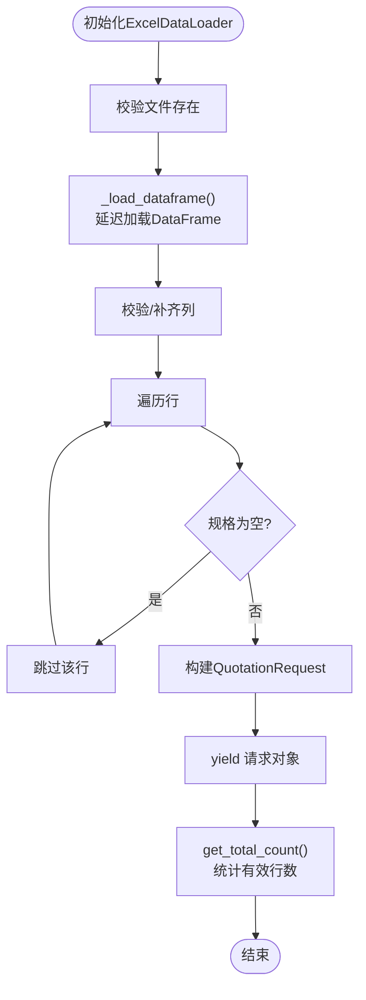
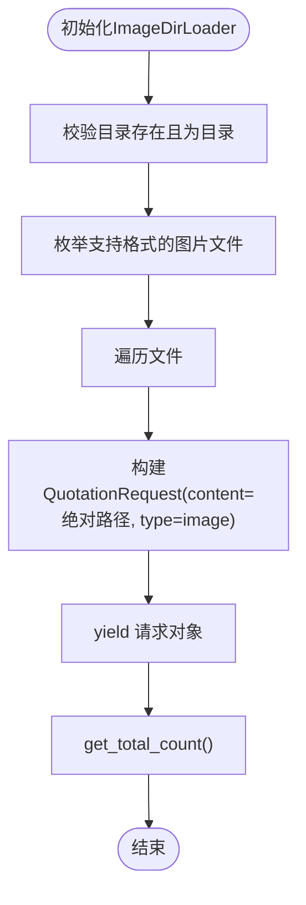
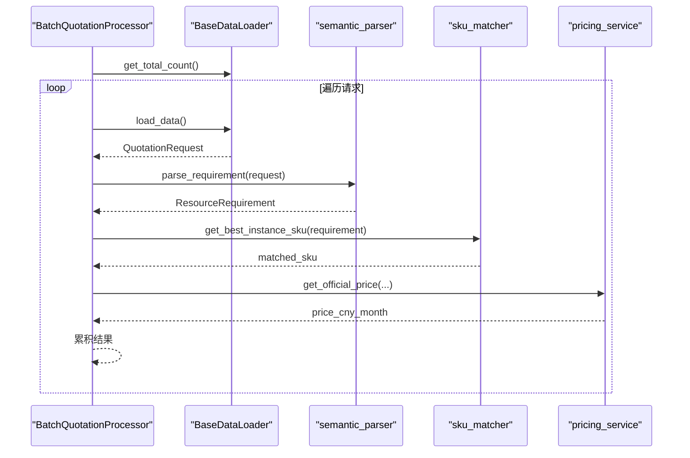
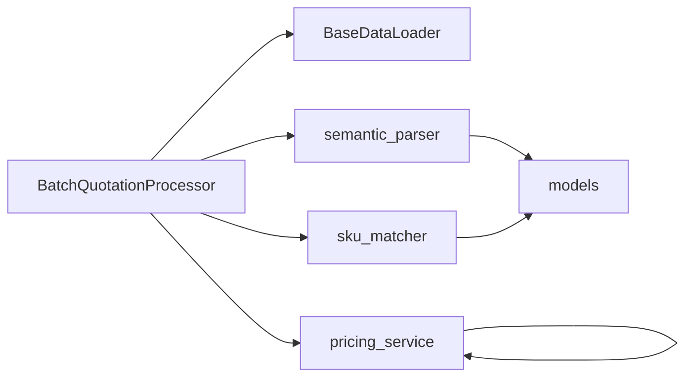

# 数据源解耦机制

<cite>
**本文引用的文件**
- [batch_processor.py](file://batch_processor.py)
- [data_ingestion.py](file://data_ingestion.py)
- [main.py](file://main.py)
- [semantic_parser.py](file://semantic_parser.py)
- [sku_matcher.py](file://sku_matcher.py)
- [pricing_service.py](file://pricing_service.py)
- [models.py](file://models.py)
- [tests/test_e2e_real_world.py](file://tests/test_e2e_real_world.py)
- [tests/create_sample_test_data.py](file://tests/create_sample_test_data.py)
- [requirements.txt](file://requirements.txt)
</cite>

## 目录
1. [引言](#引言)
2. [项目结构](#项目结构)
3. [核心组件](#核心组件)
4. [架构总览](#架构总览)
5. [详细组件分析](#详细组件分析)
6. [依赖关系分析](#依赖关系分析)
7. [性能考量](#性能考量)
8. [故障排查指南](#故障排查指南)
9. [结论](#结论)
10. [附录](#附录)

## 引言
本文件围绕“基于BaseDataLoader抽象接口的数据源无关性设计”展开，重点阐释：
- BatchQuotationProcessor如何仅依赖load_data()与get_total_count()两个抽象方法，从而完全解耦于具体数据格式；
- ExcelDataLoader如何实现BaseDataLoader接口；
- 未来扩展（如ImageDirLoader）只需实现相同接口即可无缝接入现有批处理器；
- 抽象工厂模式带来的可扩展性与维护性优势；
- 多模态支持的未来路径以及NotImplementedError在此设计中的作用。

## 项目结构
该项目采用分层架构，核心由“数据加载层”“批处理层”“业务服务层”组成，配合测试与示例数据脚本，形成可验证的端到端流水线。

图表来源
- [main.py](file://main.py#L1-L100)
- [data_ingestion.py](file://data_ingestion.py#L1-L204)
- [batch_processor.py](file://batch_processor.py#L1-L244)
- [semantic_parser.py](file://semantic_parser.py#L1-L349)
- [sku_matcher.py](file://sku_matcher.py#L1-L134)
- [pricing_service.py](file://pricing_service.py#L1-L81)
- [models.py](file://models.py#L1-L54)
- [tests/test_e2e_real_world.py](file://tests/test_e2e_real_world.py#L1-L564)
- [tests/create_sample_test_data.py](file://tests/create_sample_test_data.py#L1-L42)

章节来源
- [main.py](file://main.py#L1-L100)
- [requirements.txt](file://requirements.txt#L1-L9)

## 核心组件
- BaseDataLoader：定义数据加载器的统一抽象接口，要求实现load_data()与get_total_count()，确保批处理器与数据源格式解耦。
- ExcelDataLoader：BaseDataLoader的具体实现，负责从Excel中读取规格说明与备注，转换为标准化的QuotationRequest流。
- ImageDirLoader：BaseDataLoader的未来扩展实现，遍历图片目录，将图片路径封装为QuotationRequest，content_type为image，为后续视觉解析预留入口。
- BatchQuotationProcessor：批处理器，仅依赖BaseDataLoader抽象接口，完成“语义解析—SKU匹配—价格查询”的三段式处理。
- semantic_parser：将QuotationRequest解析为ResourceRequirement，当前支持text；对image/audio类型抛出NotImplementedError，为多模态扩展预留。
- sku_matcher：根据ResourceRequirement匹配阿里云实例SKU，并提供友好族名。
- pricing_service：调用阿里云BSS OpenAPI查询官方价格。
- models：定义ResourceRequirement等标准化数据模型。

章节来源
- [data_ingestion.py](file://data_ingestion.py#L32-L204)
- [batch_processor.py](file://batch_processor.py#L18-L208)
- [semantic_parser.py](file://semantic_parser.py#L25-L69)
- [sku_matcher.py](file://sku_matcher.py#L15-L134)
- [pricing_service.py](file://pricing_service.py#L13-L81)
- [models.py](file://models.py#L10-L54)

## 架构总览
下图展示了数据从“数据源”到“报价结果”的端到端流程，强调批处理器对数据源格式的完全解耦。

图表来源
- [main.py](file://main.py#L15-L90)
- [batch_processor.py](file://batch_processor.py#L42-L165)
- [data_ingestion.py](file://data_ingestion.py#L111-L147)
- [semantic_parser.py](file://semantic_parser.py#L25-L69)
- [sku_matcher.py](file://sku_matcher.py#L45-L103)
- [pricing_service.py](file://pricing_service.py#L28-L81)

## 详细组件分析

### BaseDataLoader抽象接口与实现
- 接口职责
  - load_data(): 返回迭代器，逐条产出标准化的QuotationRequest，供批处理器消费。
  - get_total_count(): 返回数据总量，用于批处理进度与统计。
- 设计要点
  - 通过抽象接口隔离具体数据格式（Excel、图片、音频等），批处理器无需感知差异。
  - 新增数据源只需实现上述两个方法，保持批处理逻辑零改动。

图表来源
- [data_ingestion.py](file://data_ingestion.py#L32-L204)

章节来源
- [data_ingestion.py](file://data_ingestion.py#L32-L204)

### ExcelDataLoader实现
- 功能概述
  - 读取Excel文件，校验必要列，按行构造QuotationRequest，content_type为"text"，并保留备注信息。
  - 提供get_total_count()统计有效行数。
- 关键点
  - 延迟加载DataFrame，避免重复IO。
  - 对缺失列给出警告并自动补全，提升健壮性。
  - 严格过滤空行，保证批处理输入质量。

图表来源
- [data_ingestion.py](file://data_ingestion.py#L91-L147)

章节来源
- [data_ingestion.py](file://data_ingestion.py#L91-L147)

### ImageDirLoader（未来扩展）
- 设计目标
  - 遍历指定目录下的图片文件，将图片绝对路径封装为QuotationRequest，content_type为"image"。
  - 为后续视觉解析（如Qwen-VL）提供统一输入格式。
- 与批处理器的协作
  - 保持与ExcelDataLoader相同的接口契约，批处理器无需修改即可处理图片输入。

图表来源
- [data_ingestion.py](file://data_ingestion.py#L153-L204)

章节来源
- [data_ingestion.py](file://data_ingestion.py#L153-L204)

### BatchQuotationProcessor如何实现数据源无关性
- 仅依赖的两个抽象方法
  - get_total_count()：用于进度与统计。
  - load_data()：逐条产出QuotationRequest，驱动后续三段式处理。
- 处理流程
  - 语义解析：将QuotationRequest转换为ResourceRequirement。
  - SKU匹配：根据ResourceRequirement匹配最佳实例SKU。
  - 价格查询：调用阿里云BSS OpenAPI获取官方价格。
- 错误处理
  - 对NotImplementedError进行捕获并记录，提示多模态特性尚未实现，不影响其他流程。
  - 对API错误与通用异常进行分类处理，保证批处理稳定性。

图表来源
- [batch_processor.py](file://batch_processor.py#L42-L165)
- [semantic_parser.py](file://semantic_parser.py#L25-L69)
- [sku_matcher.py](file://sku_matcher.py#L45-L103)
- [pricing_service.py](file://pricing_service.py#L28-L81)

章节来源
- [batch_processor.py](file://batch_processor.py#L42-L165)

### 多模态支持的未来路径与NotImplementedError的作用
- 当前状态
  - semantic_parser对content_type为"text"的请求进行AI解析；对"image"/"audio"类型抛出NotImplementedError，明确标注未来集成计划。
- 未来演进
  - image：引入Qwen-VL进行截图解析，提取规格信息后再进入统一的ResourceRequirement流程。
  - audio：先ASR转文本，再复用现有解析流程。
- 设计意义
  - 通过NotImplementedError在接口层提示功能边界，避免在批处理器中散落条件分支，保持代码清晰与可维护性。

章节来源
- [semantic_parser.py](file://semantic_parser.py#L25-L69)
- [batch_processor.py](file://batch_processor.py#L144-L164)

## 依赖关系分析
- 组件耦合与内聚
  - 批处理器与数据加载器通过BaseDataLoader解耦，内聚于业务流程（解析—匹配—定价）。
  - 语义解析、SKU匹配、价格查询各自职责清晰，相互独立。
- 外部依赖
  - 阿里云BSS OpenAPI：用于查询官方价格。
  - DashScope Qwen-Max：用于智能解析文本为ResourceRequirement。
  - pandas/openpyxl：用于Excel读写。
- 循环依赖
  - 未发现循环依赖，模块间依赖方向清晰。

图表来源
- [batch_processor.py](file://batch_processor.py#L18-L208)
- [semantic_parser.py](file://semantic_parser.py#L1-L349)
- [sku_matcher.py](file://sku_matcher.py#L1-L134)
- [pricing_service.py](file://pricing_service.py#L1-L81)
- [models.py](file://models.py#L1-L54)

章节来源
- [batch_processor.py](file://batch_processor.py#L18-L208)
- [semantic_parser.py](file://semantic_parser.py#L1-L349)
- [sku_matcher.py](file://sku_matcher.py#L1-L134)
- [pricing_service.py](file://pricing_service.py#L1-L81)
- [models.py](file://models.py#L1-L54)

## 性能考量
- IO与内存
  - ExcelDataLoader采用延迟加载DataFrame，避免重复读取；建议在大规模Excel场景下控制并发与分块处理。
- API调用
  - 价格查询与AI解析均为外部调用，建议结合重试与超时控制，避免批处理长时间阻塞。
- 缓存
  - 语义解析模块内置LLM结果缓存，减少重复调用，提高吞吐。
- 扩展性
  - 新增数据源仅需实现BaseDataLoader接口，不改变批处理器逻辑，有利于横向扩展与维护。

## 故障排查指南
- 环境变量缺失
  - 阿里云AK/SK与DashScope API Key未配置会导致连接失败。请在.env文件中设置相应变量。
- Excel文件问题
  - 文件不存在或缺少必要列会触发异常。请确认文件路径与列名（默认为“Specification”“Remarks”）。
- 多模态特性
  - 对image/audio类型的请求会抛出NotImplementedError，属于预期行为，需等待未来集成。
- API错误
  - 价格查询或AI解析失败会捕获异常并记录错误信息，可在日志中定位具体原因。

章节来源
- [main.py](file://main.py#L31-L40)
- [data_ingestion.py](file://data_ingestion.py#L87-L108)
- [semantic_parser.py](file://semantic_parser.py#L43-L69)
- [batch_processor.py](file://batch_processor.py#L144-L164)

## 结论
通过BaseDataLoader抽象接口，系统实现了“数据源无关”的批处理架构：批处理器仅依赖两个抽象方法，即可适配Excel、图片、音频等多种输入。ExcelDataLoader作为当前实现，满足现有业务；ImageDirLoader作为未来扩展，遵循同一接口契约，确保零改动接入。多模态支持以NotImplementedError明确边界，配合语义解析缓存与错误处理机制，兼顾可扩展性与稳定性。该设计显著提升了系统的可维护性与演进弹性。

## 附录
- 示例数据生成
  - 使用示例脚本创建测试Excel文件，便于本地验证批处理流程。
- 端到端测试
  - 真实网络调用验证AI解析与价格查询连通性，覆盖多文件批量处理与结果校验。

章节来源
- [tests/create_sample_test_data.py](file://tests/create_sample_test_data.py#L1-L42)
- [tests/test_e2e_real_world.py](file://tests/test_e2e_real_world.py#L236-L454)