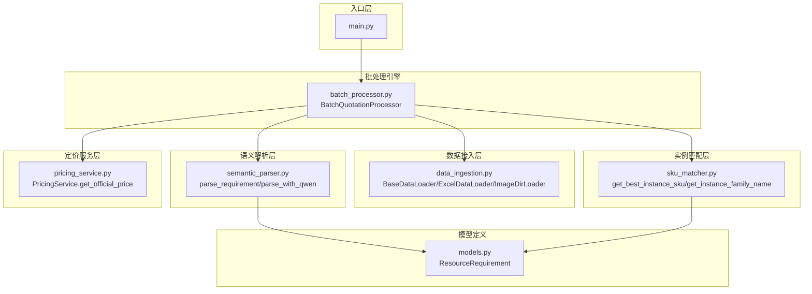
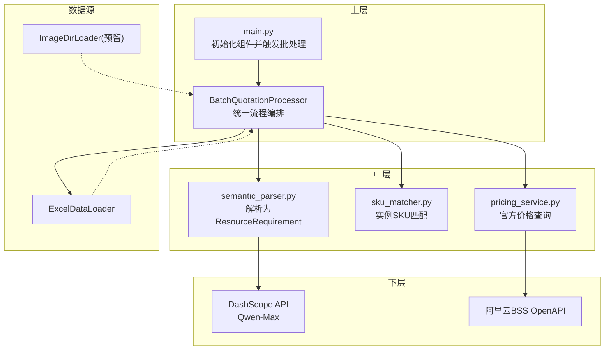
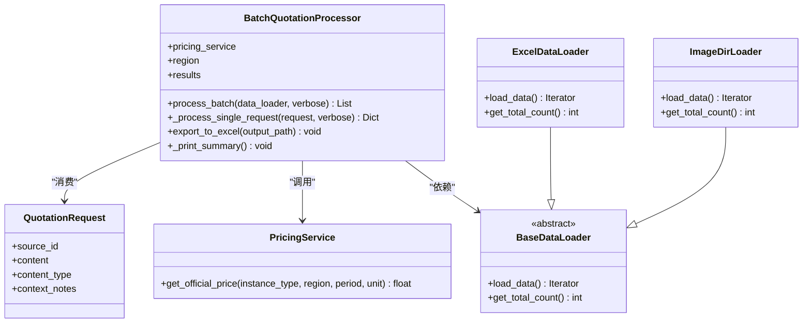
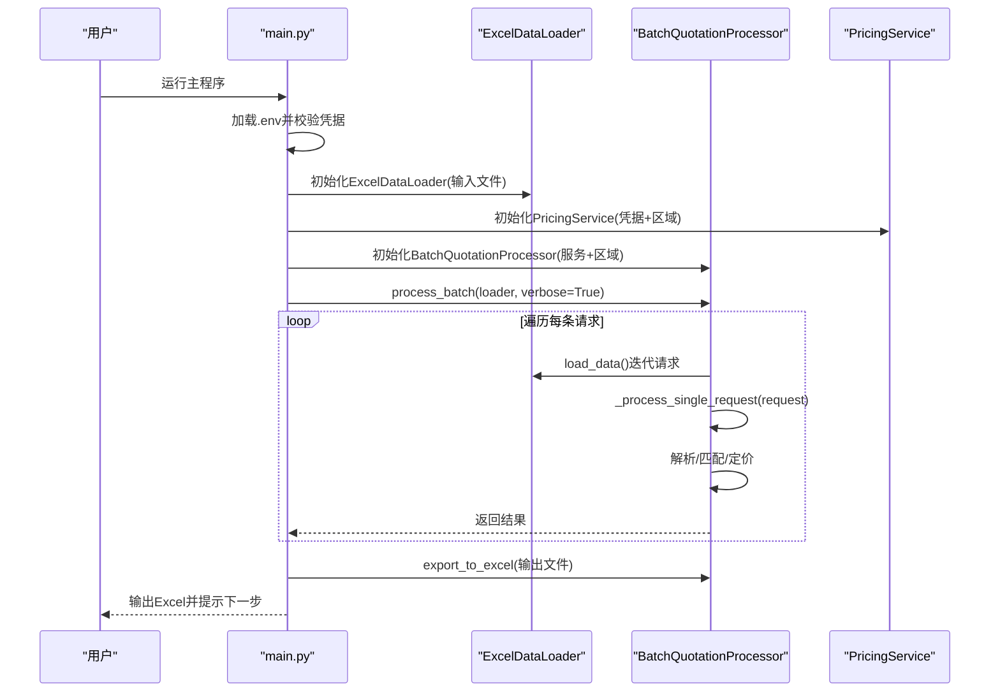
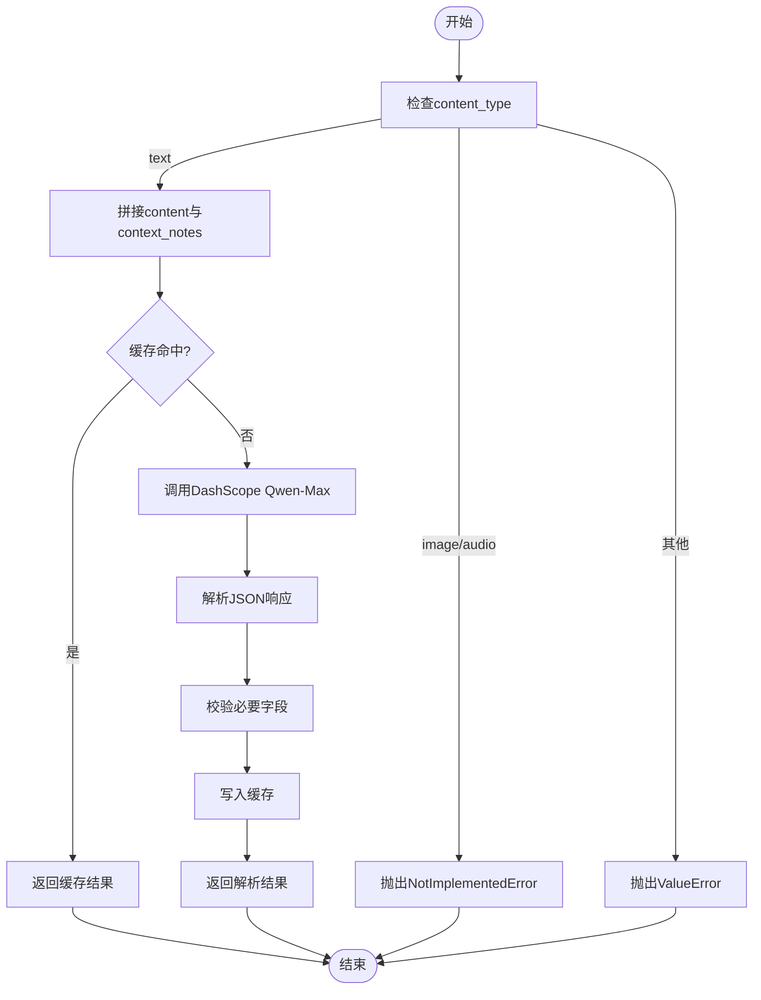
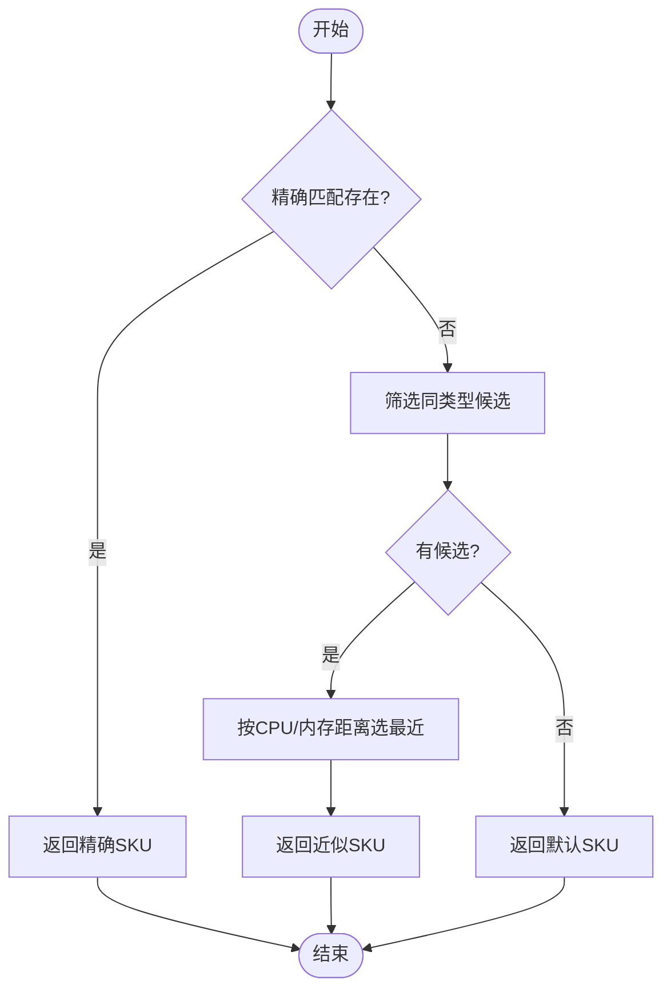
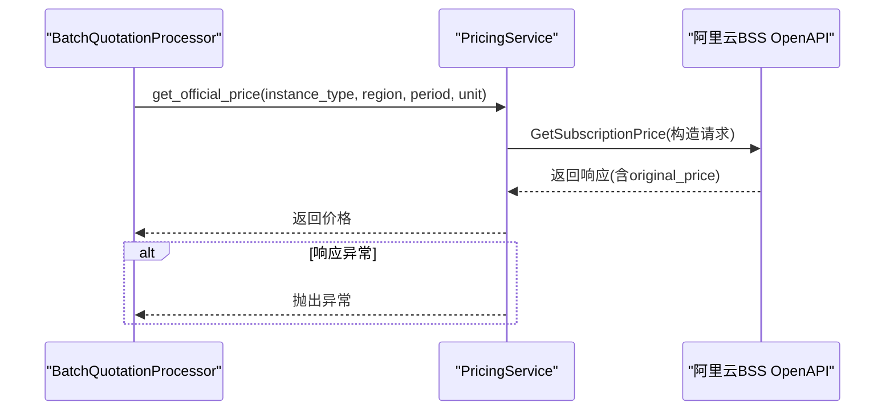
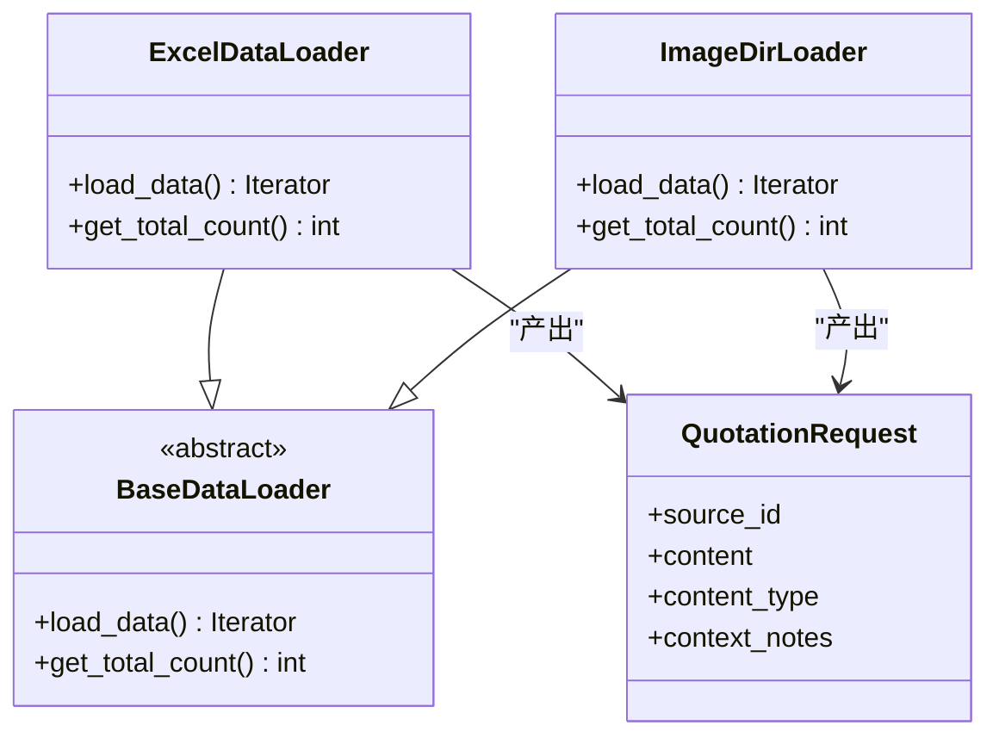
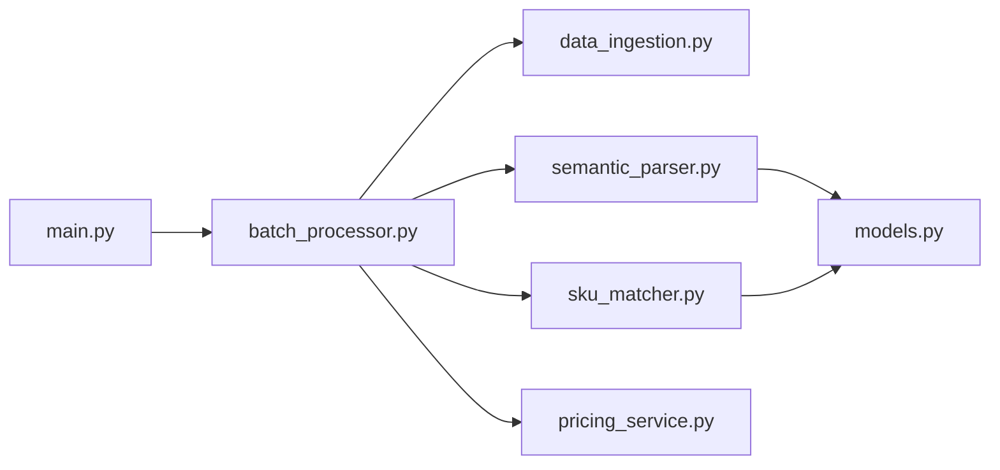

# 核心架构

<cite>
**本文引用的文件**
- [main.py](file://main.py)
- [batch_processor.py](file://batch_processor.py)
- [pricing_service.py](file://pricing_service.py)
- [data_ingestion.py](file://data_ingestion.py)
- [semantic_parser.py](file://semantic_parser.py)
- [sku_matcher.py](file://sku_matcher.py)
- [models.py](file://models.py)
- [requirements.txt](file://requirements.txt)
- [tests/create_sample_test_data.py](file://tests/create_sample_test_data.py)
- [tests/test_e2e_real_world.py](file://tests/test_e2e_real_world.py)
</cite>

## 目录
1. [引言](#引言)
2. [项目结构](#项目结构)
3. [核心组件](#核心组件)
4. [架构总览](#架构总览)
5. [详细组件分析](#详细组件分析)
6. [依赖关系分析](#依赖关系分析)
7. [性能考量](#性能考量)
8. [故障排查指南](#故障排查指南)
9. [结论](#结论)
10. [附录](#附录)

## 引言
本文件面向报价管道系统的核心架构，聚焦于分层架构设计与组件交互。系统以“数据源无关”为核心理念，通过抽象接口屏蔽不同输入格式（Excel、图像、语音等）差异，使批处理引擎在不感知数据来源的情况下完成“解析—匹配—定价”的三段式流程。本文将深入解释 BatchQuotationProcessor 如何作为核心处理引擎协调全流程，并展示 main.py 作为主入口点如何串联各组件（如 PricingService、ExcelDataLoader）。同时，我们将提供系统上下文图与组件交互图，说明错误传播机制与日志输出策略，帮助读者快速理解并高效使用该系统。

## 项目结构
系统采用按功能分层的组织方式：
- 入口层：main.py 提供主程序入口，负责初始化与串联组件。
- 数据接入层：data_ingestion.py 定义抽象接口 BaseDataLoader 与具体实现 ExcelDataLoader，并预留 ImageDirLoader 扩展点。
- 语义解析层：semantic_parser.py 将非结构化文本转化为标准化 ResourceRequirement。
- 实例匹配层：sku_matcher.py 将 ResourceRequirement 映射为具体的阿里云实例 SKU。
- 定价服务层：pricing_service.py 封装阿里云 BSS OpenAPI，查询官方价格。
- 批处理引擎：batch_processor.py 以统一流程驱动上述模块，形成可扩展的批处理流水线。
- 模型定义：models.py 提供标准化的数据模型，确保跨模块一致性。
- 测试与依赖：tests/* 提供端到端验证脚本；requirements.txt 列出外部依赖。

图表来源
- [main.py](file://main.py#L1-L100)
- [batch_processor.py](file://batch_processor.py#L1-L244)
- [data_ingestion.py](file://data_ingestion.py#L1-L204)
- [semantic_parser.py](file://semantic_parser.py#L1-L349)
- [sku_matcher.py](file://sku_matcher.py#L1-L134)
- [pricing_service.py](file://pricing_service.py#L1-L81)
- [models.py](file://models.py#L1-L54)

章节来源
- [main.py](file://main.py#L1-L100)
- [data_ingestion.py](file://data_ingestion.py#L1-L204)
- [semantic_parser.py](file://semantic_parser.py#L1-L349)
- [sku_matcher.py](file://sku_matcher.py#L1-L134)
- [pricing_service.py](file://pricing_service.py#L1-L81)
- [batch_processor.py](file://batch_processor.py#L1-L244)
- [models.py](file://models.py#L1-L54)

## 核心组件
- 批处理引擎 BatchQuotationProcessor
  - 职责：统一调度解析、匹配、定价三阶段；维护批处理结果与统计；导出 Excel 结果。
  - 关键方法：process_batch、_process_single_request、export_to_excel。
  - 设计要点：完全依赖 BaseDataLoader 抽象接口，不关心数据来源格式。
- 数据接入层 data_ingestion
  - 抽象接口 BaseDataLoader：定义 load_data 与 get_total_count，约束数据加载协议。
  - 具体实现 ExcelDataLoader：从 Excel 文件读取规格与备注，转换为 QuotationRequest 流。
  - 扩展点 ImageDirLoader：预留图片目录加载器，未来支持图像输入。
- 语义解析 semantic_parser
  - parse_requirement：根据 content_type 分派到不同解析策略；当前支持 text，未来支持 image/audio。
  - parse_with_qwen：基于 DashScope Qwen-Max 的智能解析，带缓存与回退策略。
- 实例匹配 sku_matcher
  - get_best_instance_sku：基于工作负载类型与 CPU/内存配置在 INSTANCE_CATALOG 中查找或近似匹配。
  - get_instance_family_name：将实例类型映射为友好名称。
- 定价服务 pricing_service
  - PricingService：封装阿里云 BSS OpenAPI，查询实例的官方价格（默认按月）。
- 模型 models
  - ResourceRequirement：标准化资源需求模型，统一字段与约束，便于跨模块传递。

章节来源
- [batch_processor.py](file://batch_processor.py#L1-L244)
- [data_ingestion.py](file://data_ingestion.py#L1-L204)
- [semantic_parser.py](file://semantic_parser.py#L1-L349)
- [sku_matcher.py](file://sku_matcher.py#L1-L134)
- [pricing_service.py](file://pricing_service.py#L1-L81)
- [models.py](file://models.py#L1-L54)

## 架构总览
系统采用“数据源无关”的分层架构：
- 上层（入口与批处理）：main.py 与 BatchQuotationProcessor 仅依赖抽象接口 BaseDataLoader。
- 中层（业务逻辑）：语义解析、实例匹配、定价服务各自独立演进。
- 下层（外部集成）：DashScope API 与阿里云 BSS OpenAPI 通过服务封装暴露最小接口。

图表来源
- [main.py](file://main.py#L1-L100)
- [batch_processor.py](file://batch_processor.py#L1-L244)
- [semantic_parser.py](file://semantic_parser.py#L1-L349)
- [sku_matcher.py](file://sku_matcher.py#L1-L134)
- [pricing_service.py](file://pricing_service.py#L1-L81)
- [data_ingestion.py](file://data_ingestion.py#L1-L204)

## 详细组件分析

### 批处理引擎 BatchQuotationProcessor
- 统一流程
  - 解析阶段：调用 semantic_parser.parse_requirement 将 QuotationRequest 转换为 ResourceRequirement。
  - 匹配阶段：调用 sku_matcher.get_best_instance_sku 将 ResourceRequirement 映射为实例 SKU。
  - 定价阶段：调用 PricingService.get_official_price 获取官方价格（默认按月）。
- 错误处理
  - 对 NotImplementedError（多模态特性未实现）、TeaException（API 错误）、其他异常分别捕获并记录，保证批处理继续执行。
- 日志与统计
  - 逐条进度打印与汇总统计（成功/失败数量、总成本、年化估算、平均成本）。
- 导出
  - 将结果写入 Excel，包含原始内容、规格摘要、SKU、实例族、价格与状态等字段。

图表来源
- [batch_processor.py](file://batch_processor.py#L1-L244)
- [pricing_service.py](file://pricing_service.py#L1-L81)
- [data_ingestion.py](file://data_ingestion.py#L1-L204)

章节来源
- [batch_processor.py](file://batch_processor.py#L1-L244)

### 主入口 main.py 的初始化与控制流
- 环境准备：加载 .env，校验阿里云凭据；若缺失则退出。
- 组件初始化：
  - ExcelDataLoader：读取 Excel 输入文件，统计记录数。
  - PricingService：初始化阿里云 BSS 客户端。
  - BatchQuotationProcessor：注入 PricingService 与区域参数。
- 执行流程：
  - 调用 processor.process_batch(loader, verbose=True) 启动批处理。
  - 调用 processor.export_to_excel(OUTPUT_FILE) 导出结果。
- 错误处理：捕获 FileNotFoundError 与通用异常，打印堆栈并退出。

图表来源
- [main.py](file://main.py#L1-L100)
- [batch_processor.py](file://batch_processor.py#L1-L244)
- [data_ingestion.py](file://data_ingestion.py#L1-L204)
- [pricing_service.py](file://pricing_service.py#L1-L81)

章节来源
- [main.py](file://main.py#L1-L100)

### 语义解析 semantic_parser 的职责与协作
- 输入：QuotationRequest（content/content_type/context_notes）。
- 多模态入口：
  - text：调用 parse_with_qwen，基于 DashScope Qwen-Max 进行意图抽取与工作负载分类。
  - image/audio：抛出 NotImplementedError，预留未来扩展。
- 缓存与回退：
  - parse_with_qwen 内置内存缓存，命中则直接返回；否则调用 API 并缓存结果。
  - 若 API 失败，回退到正则规则解析，保证鲁棒性。
- 输出：ResourceRequirement（cpu_cores/memory_gb/storage_gb/environment/workload_type）。

图表来源
- [semantic_parser.py](file://semantic_parser.py#L1-L349)
- [models.py](file://models.py#L1-L54)

章节来源
- [semantic_parser.py](file://semantic_parser.py#L1-L349)
- [models.py](file://models.py#L1-L54)

### 实例匹配 sku_matcher 的匹配策略
- 精确匹配：以 (workload_type, cpu_cores, memory_gb) 为键在 INSTANCE_CATALOG 中查找。
- 降级匹配：若无精确匹配，按相同工作负载类型筛选候选，选择 CPU/内存距离最近的实例。
- 兜底策略：若仍无匹配，返回 DEFAULT_INSTANCE。
- 名称友好化：get_instance_family_name 将实例类型映射为人类可读名称。

图表来源
- [sku_matcher.py](file://sku_matcher.py#L1-L134)
- [models.py](file://models.py#L1-L54)

章节来源
- [sku_matcher.py](file://sku_matcher.py#L1-L134)
- [models.py](file://models.py#L1-L54)

### 定价服务 pricing_service 的调用细节
- 初始化：根据 access_key_id/access_key_secret 与 region_id 创建 BSS 客户端。
- 查询：构造 GetSubscriptionPrice 请求，设置产品码、模块码、购买周期与单位，默认按月查询。
- 响应：解析 original_price 字段；若无数据或非成功状态，抛出异常由上层处理。

图表来源
- [batch_processor.py](file://batch_processor.py#L1-L244)
- [pricing_service.py](file://pricing_service.py#L1-L81)

章节来源
- [pricing_service.py](file://pricing_service.py#L1-L81)
- [batch_processor.py](file://batch_processor.py#L1-L244)

### 数据接入层 data_ingestion 的抽象与实现
- 抽象接口 BaseDataLoader：定义 load_data 与 get_total_count，约束数据加载协议。
- QuotationRequest：标准化请求载体，包含 source_id、content、content_type、context_notes。
- ExcelDataLoader：
  - 读取 Excel，校验列名，处理空值与备注列缺失。
  - 将每行转换为 QuotationRequest，content_type 固定为 text。
- ImageDirLoader（预留）：遍历目录中的图片文件，封装为 QuotationRequest，content_type=image，便于后续视觉模型接入。

图表来源
- [data_ingestion.py](file://data_ingestion.py#L1-L204)

章节来源
- [data_ingestion.py](file://data_ingestion.py#L1-L204)

## 依赖关系分析
- 组件耦合
  - BatchQuotationProcessor 仅依赖 BaseDataLoader 抽象接口，与具体数据源实现解耦。
  - 语义解析与实例匹配均依赖 ResourceRequirement 模型，保持数据契约一致。
  - 定价服务独立封装外部 API，避免上层直连。
- 外部依赖
  - 阿里云 BSS OpenAPI、DashScope Qwen-Max、pandas/openpyxl、requests 等。
- 循环依赖
  - 未发现循环依赖；模块间为单向调用链。

图表来源
- [main.py](file://main.py#L1-L100)
- [batch_processor.py](file://batch_processor.py#L1-L244)
- [data_ingestion.py](file://data_ingestion.py#L1-L204)
- [semantic_parser.py](file://semantic_parser.py#L1-L349)
- [sku_matcher.py](file://sku_matcher.py#L1-L134)
- [pricing_service.py](file://pricing_service.py#L1-L81)
- [models.py](file://models.py#L1-L54)

章节来源
- [requirements.txt](file://requirements.txt#L1-L9)
- [main.py](file://main.py#L1-L100)
- [batch_processor.py](file://batch_processor.py#L1-L244)

## 性能考量
- 缓存优化
  - 语义解析层对 DashScope API 响应进行内存缓存，减少重复调用与 token 消耗。
- 批处理并发
  - 当前实现为顺序批处理；若需提升吞吐，可在不破坏抽象的前提下引入异步/并发策略（注意保持结果顺序与幂等性）。
- I/O 优化
  - ExcelDataLoader 延迟加载 DataFrame，避免不必要的磁盘访问。
- 日志开销
  - 批处理阶段 verbose 输出会带来一定 IO 成本，建议在生产环境中降低日志级别或关闭详细输出。

## 故障排查指南
- 环境变量缺失
  - 现象：启动即退出并提示缺少凭据。
  - 排查：确认 .env 中 ALIBABA_CLOUD_ACCESS_KEY_ID 与 ALIBABA_CLOUD_ACCESS_KEY_SECRET 已设置。
- Excel 文件问题
  - 现象：找不到文件或列名不匹配导致异常。
  - 排查：检查输入文件路径与列名（默认 Specification/Remarks），或在测试脚本中自动探测列名。
- API 调用失败
  - 现象：解析失败回退到正则；或 BSS OpenAPI 返回非成功状态。
  - 排查：检查 DashScope API Key 与网络连通性；查看 PricingService 抛出的异常信息。
- 多模态特性未实现
  - 现象：传入 image/audio 时抛出 NotImplementedError。
  - 排查：当前版本仅支持 text；未来可通过实现相应 DataLoader 与 Parser 扩展。
- 日志定位
  - 批处理引擎会输出逐条进度与汇总统计；测试套件提供双通道日志（控制台 INFO 与文件 DEBUG），便于定位问题。

章节来源
- [main.py](file://main.py#L1-L100)
- [batch_processor.py](file://batch_processor.py#L1-L244)
- [semantic_parser.py](file://semantic_parser.py#L1-L349)
- [pricing_service.py](file://pricing_service.py#L1-L81)
- [tests/test_e2e_real_world.py](file://tests/test_e2e_real_world.py#L1-L564)

## 结论
该报价管道系统通过清晰的分层与抽象接口，实现了“数据源无关”的可扩展架构。BatchQuotationProcessor 作为核心引擎，将解析、匹配、定价三阶段无缝衔接，配合缓存与回退策略提升了鲁棒性与性能。main.py 作为入口，简洁地串联各组件并提供良好的错误传播与日志输出。未来可轻松扩展新的数据源（如图像/语音）与解析能力，而无需修改批处理核心逻辑，满足多模态就绪的演进目标。

## 附录
- 示例测试数据生成
  - 使用 tests/create_sample_test_data.py 可快速生成示例 Excel 文件，便于本地验证。
- 端到端测试
  - tests/test_e2e_real_world.py 提供环境健康检查、组件连通性测试与真实数据批处理验证，覆盖真实 API 调用，适合生产前验证。

章节来源
- [tests/create_sample_test_data.py](file://tests/create_sample_test_data.py#L1-L42)
- [tests/test_e2e_real_world.py](file://tests/test_e2e_real_world.py#L1-L564)