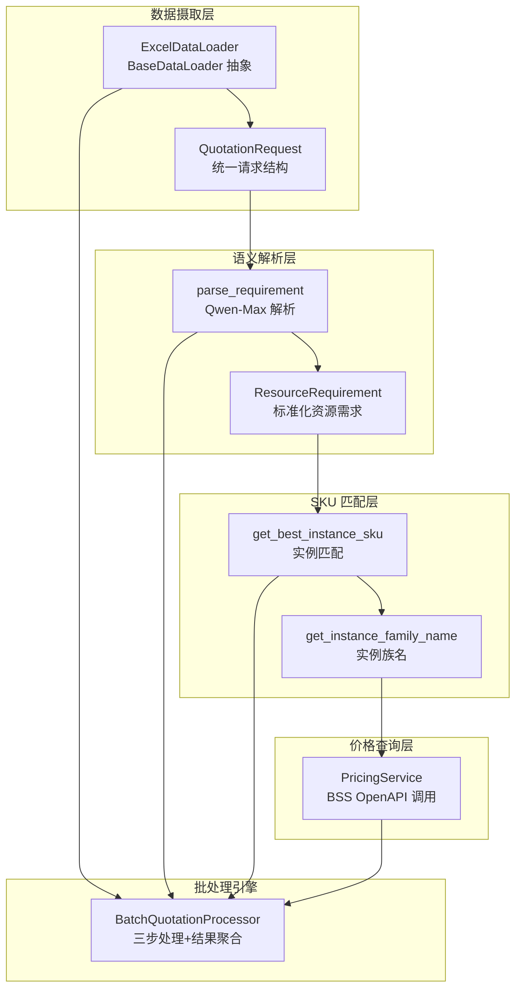
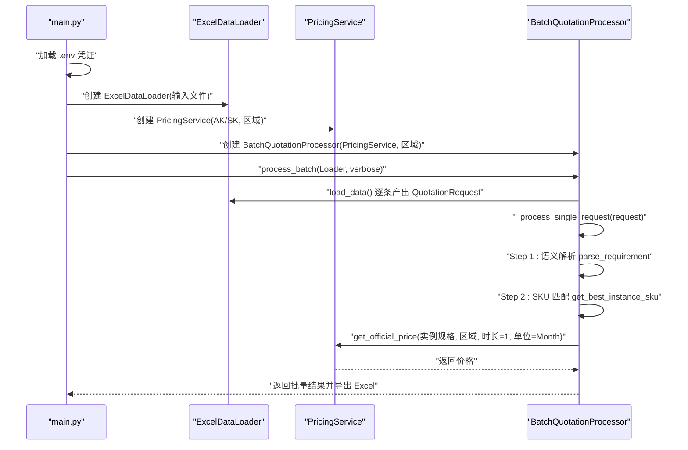
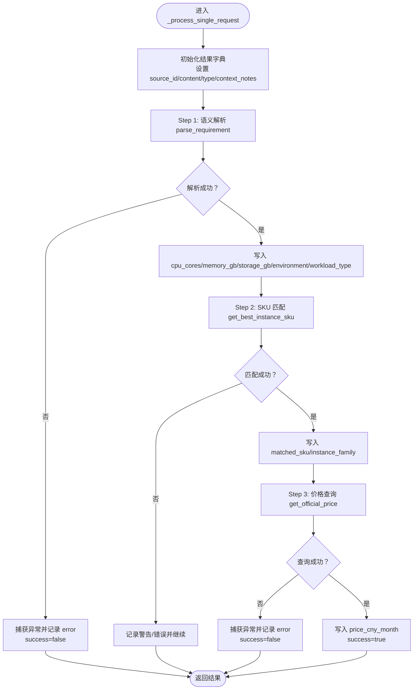
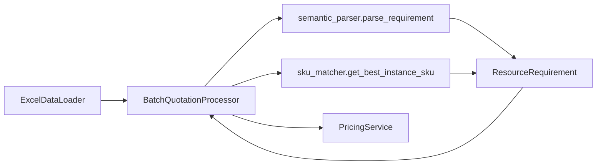

# 组件职责

<cite>
**本文引用的文件**
- [main.py](file://main.py)
- [batch_processor.py](file://batch_processor.py)
- [pricing_service.py](file://pricing_service.py)
- [semantic_parser.py](file://semantic_parser.py)
- [sku_matcher.py](file://sku_matcher.py)
- [data_ingestion.py](file://data_ingestion.py)
- [models.py](file://models.py)
- [tests/test_e2e_real_world.py](file://tests/test_e2e_real_world.py)
</cite>

## 目录
1. [引言](#引言)
2. [项目结构](#项目结构)
3. [核心组件](#核心组件)
4. [架构总览](#架构总览)
5. [详细组件分析](#详细组件分析)
6. [依赖关系分析](#依赖关系分析)
7. [性能考量](#性能考量)
8. [故障排查指南](#故障排查指南)
9. [结论](#结论)

## 引言
本文件围绕报价处理流水线中的核心处理引擎——BatchQuotationProcessor 的职责展开，系统阐述其在报价管道中的协调作用，以及如何通过“语义解析—SKU匹配—价格查询”三步法处理单个请求，并维护处理结果状态。同时，结合 main.py 展示如何初始化 PricingService、ExcelDataLoader 和 BatchQuotationProcessor，形成完整的处理链；并说明依赖注入与控制反转的设计思想。最后，聚焦 _process_single_request 方法的错误处理策略与日志输出机制。

## 项目结构
该项目采用分层与抽象设计，围绕“数据源无关”的核心理念构建报价流水线：
- 数据摄取层：定义统一的 QuotationRequest 结构与 BaseDataLoader 抽象，当前提供 ExcelDataLoader 实现，预留 ImageDirLoader 等扩展点。
- 语义解析层：基于 DashScope Qwen-Max 的智能解析，将自然语言转化为标准化 ResourceRequirement。
- SKU 匹配层：根据工作负载类型与资源规格在业务目录中匹配最佳实例 SKU，并提供降级与兜底策略。
- 价格查询层：对接阿里云 BSS OpenAPI，按月价查询官方价格。
- 批处理引擎：BatchQuotationProcessor 串联上述模块，负责批量调度、单请求处理、结果聚合与导出。

图表来源
- [data_ingestion.py](file://data_ingestion.py#L13-L147)
- [semantic_parser.py](file://semantic_parser.py#L25-L68)
- [models.py](file://models.py#L10-L38)
- [sku_matcher.py](file://sku_matcher.py#L45-L103)
- [pricing_service.py](file://pricing_service.py#L28-L81)
- [batch_processor.py](file://batch_processor.py#L42-L164)

章节来源
- [data_ingestion.py](file://data_ingestion.py#L13-L147)
- [semantic_parser.py](file://semantic_parser.py#L25-L68)
- [models.py](file://models.py#L10-L38)
- [sku_matcher.py](file://sku_matcher.py#L45-L103)
- [pricing_service.py](file://pricing_service.py#L28-L81)
- [batch_processor.py](file://batch_processor.py#L42-L164)

## 核心组件
- BatchQuotationProcessor：批处理引擎，负责批量调度、单请求三步处理、结果聚合与导出。
- PricingService：价格查询服务，封装阿里云 BSS OpenAPI 调用，提供按月价查询能力。
- ExcelDataLoader：Excel 数据加载器，将表格行转换为统一的 QuotationRequest 流。
- semantic_parser.parse_requirement：语义解析入口，当前以 Qwen-Max 为主，支持图像/音频的未来扩展点。
- sku_matcher.get_best_instance_sku：实例匹配核心逻辑，包含精确匹配、近似匹配与兜底策略。
- models.ResourceRequirement：标准化资源需求模型，承载 CPU、内存、存储、环境与工作负载类型等字段。

章节来源
- [batch_processor.py](file://batch_processor.py#L18-L41)
- [pricing_service.py](file://pricing_service.py#L13-L27)
- [data_ingestion.py](file://data_ingestion.py#L63-L147)
- [semantic_parser.py](file://semantic_parser.py#L25-L68)
- [sku_matcher.py](file://sku_matcher.py#L45-L103)
- [models.py](file://models.py#L10-L38)

## 架构总览
下图展示 main.py 中组件初始化与串联过程，体现依赖注入与控制反转的设计：上层 main.py 创建 PricingService 与 ExcelDataLoader，然后将 PricingService 注入 BatchQuotationProcessor，从而实现“外部创建、内部使用”的解耦。

图表来源
- [main.py](file://main.py#L51-L73)
- [batch_processor.py](file://batch_processor.py#L42-L78)
- [pricing_service.py](file://pricing_service.py#L28-L81)
- [data_ingestion.py](file://data_ingestion.py#L111-L147)

章节来源
- [main.py](file://main.py#L51-L73)
- [batch_processor.py](file://batch_processor.py#L42-L78)
- [pricing_service.py](file://pricing_service.py#L28-L81)
- [data_ingestion.py](file://data_ingestion.py#L111-L147)

## 详细组件分析

### BatchQuotationProcessor：批处理引擎
- 职责与定位
  - 作为报价管道的协调者，屏蔽数据源格式差异，仅依赖 BaseDataLoader 抽象接口。
  - 提供 process_batch 与 _process_single_request 两个关键方法，分别承担批量调度与单请求三步处理。
- 三步处理流程
  1) 语义解析：调用 parse_requirement 将 QuotationRequest 转换为 ResourceRequirement，抽取 CPU、内存、存储、工作负载类型等。
  2) SKU 匹配：调用 get_best_instance_sku 基于工作负载类型与资源规格匹配最佳实例 SKU，并通过 get_instance_family_name 获取友好名称。
  3) 价格查询：调用 PricingService.get_official_price 获取官方价格（默认按月价）。
- 结果状态管理
  - 对每个请求构造字典结果，包含 source_id、content、content_type、context_notes、success、error 等字段，并在成功时填充 cpu_cores、memory_gb、storage_gb、environment、workload_type、matched_sku、instance_family、price_cny_month。
  - 在 process_batch 中累积 results 列表，最终可导出 Excel。
- 日志与统计
  - process_batch 与 _process_single_request 在 verbose 模式下输出进度与明细；_print_summary 输出统计摘要（成功/失败数量、总成本、年化估算、平均成本）。
- 导出功能
  - export_to_excel 将结果写入 Excel，包含原始内容、规格摘要、SKU、实例族、价格、状态与错误信息。

图表来源
- [batch_processor.py](file://batch_processor.py#L80-L164)
- [semantic_parser.py](file://semantic_parser.py#L25-L68)
- [sku_matcher.py](file://sku_matcher.py#L45-L103)
- [pricing_service.py](file://pricing_service.py#L28-L81)

章节来源
- [batch_processor.py](file://batch_processor.py#L42-L164)

### 依赖注入与控制反转
- 控制反转（IoC）体现在：BatchQuotationProcessor 不直接创建 PricingService，而是通过构造函数接收 PricingService 实例，由上层 main.py 负责创建与装配。
- 依赖注入（DI）体现在：main.py 创建 PricingService 与 ExcelDataLoader 后，将 PricingService 注入 BatchQuotationProcessor，使 BatchQuotationProcessor 仅依赖抽象接口 BaseDataLoader 与 PricingService。
- 这种设计使得新增数据源（如 ImageDirLoader）或替换价格查询实现时，无需修改 BatchQuotationProcessor，只需实现相应接口并注入即可。

章节来源
- [main.py](file://main.py#L51-L73)
- [batch_processor.py](file://batch_processor.py#L28-L41)
- [data_ingestion.py](file://data_ingestion.py#L32-L61)

### 错误处理策略与日志输出
- _process_single_request 的异常分支
  - NotImplementedError：当 content_type 为 image/audio 时抛出，提示未来集成计划；记录 error 并标记 success=false。
  - TeaException：捕获阿里云 SDK 异常，记录 message 与 RequestId（若存在），success=false。
  - 其他异常：捕获通用异常，记录错误信息，success=false。
- 日志输出
  - verbose=True 时，process_batch 与 _process_single_request 输出进度、解析结果、SKU 匹配情况与价格查询结果。
  - _print_summary 输出统计摘要与成本估算。
  - tests/test_e2e_real_world.py 展示了端到端测试中的双通道日志配置（控制台 INFO、文件 DEBUG），便于问题定位。

章节来源
- [batch_processor.py](file://batch_processor.py#L144-L164)
- [tests/test_e2e_real_world.py](file://tests/test_e2e_real_world.py#L31-L79)

## 依赖关系分析
- 组件耦合与内聚
  - BatchQuotationProcessor 与 PricingService 通过接口耦合，内聚于报价流程；与数据加载器通过 BaseDataLoader 抽象耦合，保持高内聚低耦合。
  - semantic_parser 与 models 之间存在强依赖（返回 ResourceRequirement），但通过 Pydantic 字段约束保证数据一致性。
  - sku_matcher 与 models 的 ResourceRequirement 字段保持一致，便于跨模块协作。
- 外部依赖
  - PricingService 依赖阿里云 BSS OpenAPI 客户端；semantic_parser 依赖 DashScope Qwen-Max API。
- 循环依赖
  - 未发现循环依赖；模块间单向依赖清晰。

图表来源
- [batch_processor.py](file://batch_processor.py#L42-L164)
- [semantic_parser.py](file://semantic_parser.py#L25-L68)
- [sku_matcher.py](file://sku_matcher.py#L45-L103)
- [pricing_service.py](file://pricing_service.py#L28-L81)
- [models.py](file://models.py#L10-L38)
- [data_ingestion.py](file://data_ingestion.py#L111-L147)

章节来源
- [batch_processor.py](file://batch_processor.py#L42-L164)
- [semantic_parser.py](file://semantic_parser.py#L25-L68)
- [sku_matcher.py](file://sku_matcher.py#L45-L103)
- [pricing_service.py](file://pricing_service.py#L28-L81)
- [models.py](file://models.py#L10-L38)
- [data_ingestion.py](file://data_ingestion.py#L111-L147)

## 性能考量
- 解析缓存：semantic_parser 内置 LLM 缓存，避免重复调用 DashScope API，降低 token 消耗与延迟。
- SKU 匹配策略：先精确匹配，再按 CPU/内存距离最小化原则近似匹配，最后兜底到 DEFAULT_INSTANCE，兼顾准确性与稳定性。
- 批处理并发：当前实现为顺序迭代，如需提升吞吐可在上层引入并发（注意线程安全与错误隔离）。
- 导出性能：export_to_excel 使用 pandas，建议在大数据量时考虑分块导出或异步写入。

## 故障排查指南
- 环境变量缺失
  - main.py 在启动时校验 ALIBABA_CLOUD_ACCESS_KEY_ID 与 ALIBABA_CLOUD_ACCESS_KEY_SECRET，缺失则直接退出。
  - tests/test_e2e_real_world.py 的环境健康检查会验证 .env 文件存在、密钥加载与 DashScope API Key。
- API 调用异常
  - PricingService.get_official_price 返回非成功状态码或响应体缺少价格数据时抛出异常，由上层捕获并记录。
  - semantic_parser.parse_with_qwen 在 DashScope API 调用失败时回退到正则规则解析。
- 多模态支持
  - 当 content_type 为 image/audio 时，semantic_parser.parse_requirement 抛出 NotImplementedError，提示未来集成计划。
- 结果导出
  - export_to_excel 在无结果时抛出异常，确保先执行 process_batch 再导出。

章节来源
- [main.py](file://main.py#L31-L40)
- [pricing_service.py](file://pricing_service.py#L65-L81)
- [semantic_parser.py](file://semantic_parser.py#L103-L159)
- [semantic_parser.py](file://semantic_parser.py#L214-L218)
- [batch_processor.py](file://batch_processor.py#L210-L244)
- [tests/test_e2e_real_world.py](file://tests/test_e2e_real_world.py#L100-L149)

## 结论
BatchQuotationProcessor 作为报价流水线的核心协调者，通过“语义解析—SKU匹配—价格查询”三步法完成单请求处理，并以统一的结果字典维护状态。main.py 采用依赖注入与控制反转，将 PricingService 与 ExcelDataLoader 注入批处理引擎，形成可扩展、可维护的报价处理链。错误处理与日志输出贯穿全流程，配合端到端测试与双通道日志配置，能够有效支撑真实世界场景的稳定运行与快速排障。