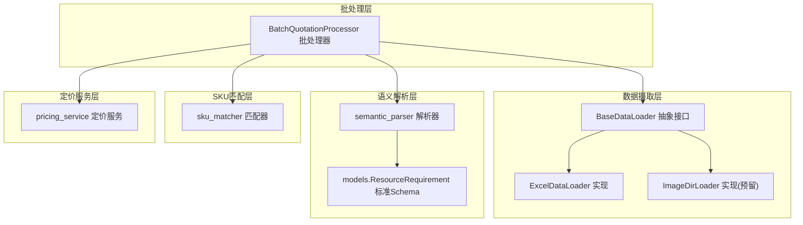
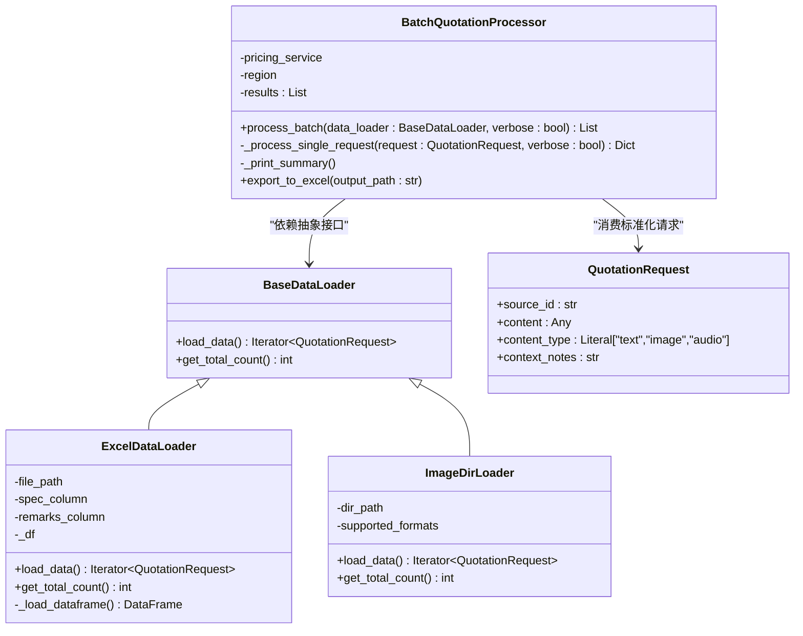
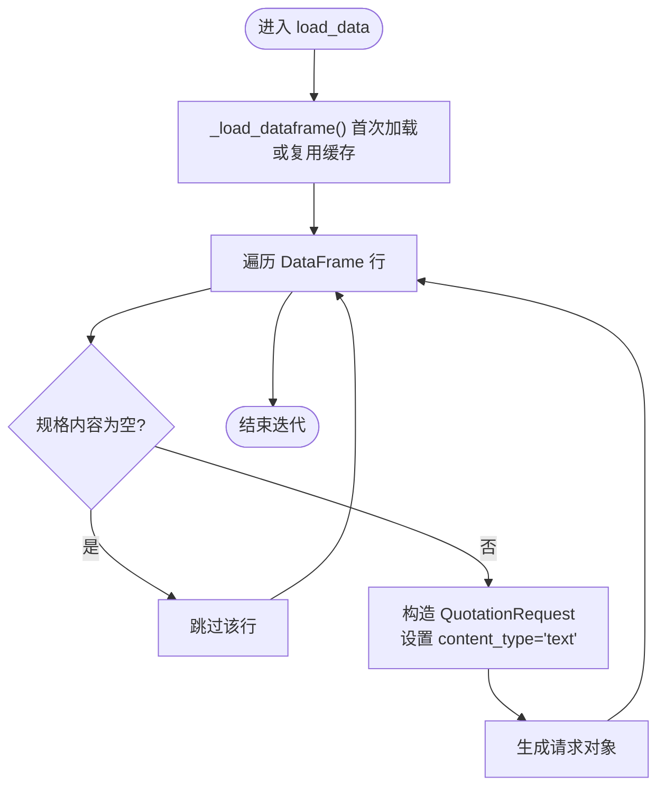
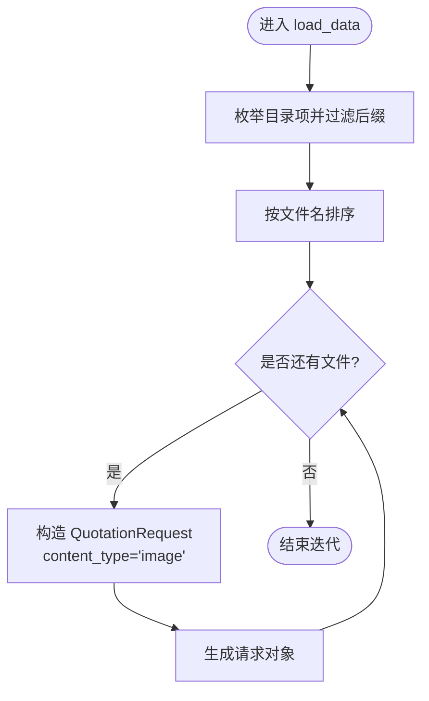
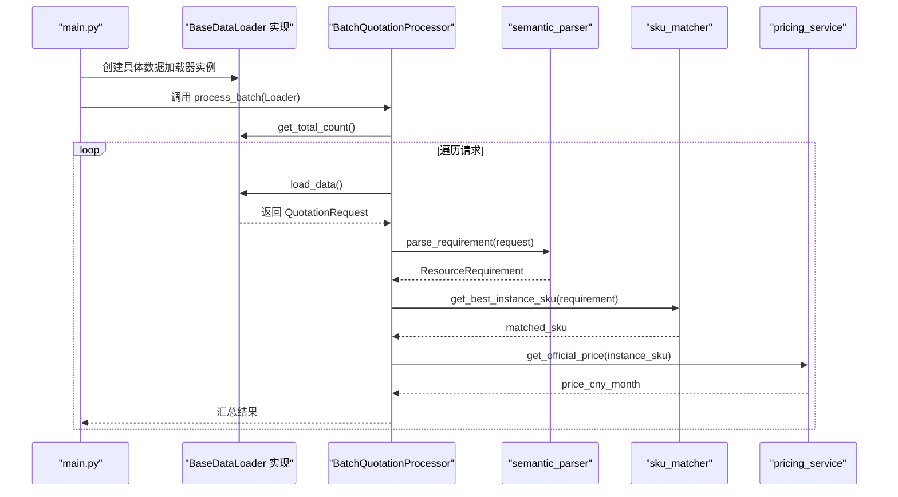
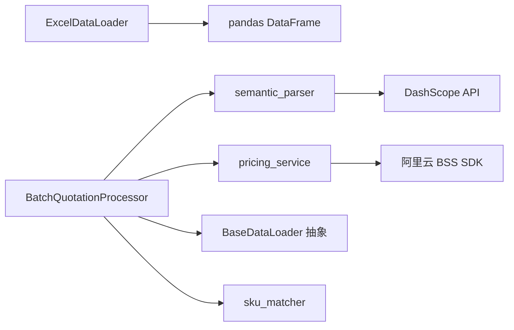

# 抽象工厂模式

<cite>
**本文引用的文件**
- [data_ingestion.py](file://data_ingestion.py)
- [batch_processor.py](file://batch_processor.py)
- [main.py](file://main.py)
- [semantic_parser.py](file://semantic_parser.py)
- [sku_matcher.py](file://sku_matcher.py)
- [pricing_service.py](file://pricing_service.py)
- [models.py](file://models.py)
- [tests/create_sample_test_data.py](file://tests/create_sample_test_data.py)
- [tests/test_e2e_real_world.py](file://tests/test_e2e_real_world.py)
</cite>

## 目录
1. [引言](#引言)
2. [项目结构](#项目结构)
3. [核心组件](#核心组件)
4. [架构总览](#架构总览)
5. [详细组件分析](#详细组件分析)
6. [依赖分析](#依赖分析)
7. [性能考虑](#性能考虑)
8. [故障排查指南](#故障排查指南)
9. [结论](#结论)
10. [附录](#附录)

## 引言
本文件围绕“抽象工厂模式”在本项目中的落地实践展开，重点剖析 BaseDataLoader 抽象基类与其具体实现（ExcelDataLoader、ImageDirLoader）如何共同构建“数据源无关”的批处理流水线。通过定义统一接口 load_data 和 get_total_count，批处理引擎与具体数据源格式实现解耦；ExcelDataLoader 将 Excel 行数据转换为标准化的 QuotationRequest 对象，确保下游解析、匹配与定价模块无需感知数据来源差异。同时，项目预留了 ImageDirLoader 的扩展点，为未来多模态输入（图像、语音等）的无缝集成奠定基础。该设计遵循开闭原则：新增数据源时无需修改批处理核心逻辑，仅需实现新的 DataLoader 即可接入。

## 项目结构
项目采用分层架构，核心围绕数据摄取层（抽象 + 实现）、批处理层、语义解析层、SKU 匹配层与定价服务层协同工作。数据摄取层负责将不同来源的数据标准化为统一的 QuotationRequest；批处理层以抽象接口驱动，屏蔽具体数据源；语义解析层将文本/图像/语音等多模态内容解析为 ResourceRequirement；SKU 匹配层将抽象需求映射为具体的阿里云实例规格；定价服务层调用官方 BSS 接口获取价格。

图表来源
- [data_ingestion.py](file://data_ingestion.py#L32-L204)
- [batch_processor.py](file://batch_processor.py#L18-L244)
- [semantic_parser.py](file://semantic_parser.py#L25-L120)
- [sku_matcher.py](file://sku_matcher.py#L15-L134)
- [pricing_service.py](file://pricing_service.py#L13-L81)
- [models.py](file://models.py#L10-L54)

章节来源
- [data_ingestion.py](file://data_ingestion.py#L1-L204)
- [batch_processor.py](file://batch_processor.py#L18-L244)

## 核心组件
- BaseDataLoader 抽象接口：定义 load_data 与 get_total_count 两个核心方法，约束所有数据加载器必须提供“可迭代的标准化请求流”和“总条目计数”，从而保证批处理层的统一消费模型。
- ExcelDataLoader：当前实现，负责读取 Excel 文件、校验列、清洗空行、逐行构造 QuotationRequest，并提供有效计数统计。
- ImageDirLoader：未来扩展点，遍历目录中支持的图片文件，将图片路径封装为 QuotationRequest，content_type 设为 image，为后续视觉模型集成预留入口。
- QuotationRequest：统一的报价请求数据结构，包含 source_id、content、content_type、context_notes 等字段，确保多模态输入在系统内保持一致的表达形式。
- BatchQuotationProcessor：批处理引擎，完全依赖 BaseDataLoader 抽象接口，依次执行解析、匹配、定价三阶段，并对异常进行分类处理与汇总输出。

章节来源
- [data_ingestion.py](file://data_ingestion.py#L32-L204)
- [batch_processor.py](file://batch_processor.py#L42-L165)
- [models.py](file://models.py#L10-L54)

## 架构总览
下图展示了抽象工厂模式在本项目中的体现：BaseDataLoader 是“抽象产品”，ExcelDataLoader 与 ImageDirLoader 是“具体产品”。批处理引擎只依赖抽象接口，不关心具体产品类型，从而实现“创建者与使用者分离”的工厂思想。

图表来源
- [data_ingestion.py](file://data_ingestion.py#L32-L204)
- [batch_processor.py](file://batch_processor.py#L42-L165)
- [models.py](file://models.py#L10-L54)

## 详细组件分析

### BaseDataLoader 抽象接口
- 职责边界清晰：仅定义“数据加载”和“计数”两个契约，不涉及具体 IO 或解析逻辑，确保批处理层与数据源实现解耦。
- 接口稳定性：新增数据源（如语音转写、PDF 文本抽取）只需实现相同接口，即可无缝接入现有批处理流程。

章节来源
- [data_ingestion.py](file://data_ingestion.py#L32-L61)

### ExcelDataLoader 实现
- 文件与列校验：在初始化阶段检查文件存在性；首次加载时验证必填列，缺失则抛出明确错误；可选列缺失时自动补空值并给出告警。
- 延迟加载与缓存：内部缓存 DataFrame，避免重复 IO；按需读取，提升性能。
- 行级转换：遍历有效行，清洗空值，拼接备注，构造 QuotationRequest；source_id 映射 Excel 行号，便于溯源。
- 计数策略：基于规范列非空且非空白的行数统计，确保进度与结果一致性。

图表来源
- [data_ingestion.py](file://data_ingestion.py#L91-L147)

章节来源
- [data_ingestion.py](file://data_ingestion.py#L63-L147)

### ImageDirLoader 扩展点
- 目录扫描：遍历指定目录，筛选支持的图片格式，按文件名排序输出。
- 请求封装：将图片绝对路径作为 content，content_type 设为 image，便于下游解析器识别并触发视觉模型。
- 计数策略：统计符合条件的图片数量，与 ExcelDataLoader 保持一致的对外契约。

图表来源
- [data_ingestion.py](file://data_ingestion.py#L153-L204)

章节来源
- [data_ingestion.py](file://data_ingestion.py#L153-L204)

### 批处理引擎与多模态适配
- 与数据源解耦：批处理引擎只接收 BaseDataLoader 实例，不关心具体来源（Excel、图片、语音等），实现“对扩展开放，对修改关闭”。
- 多模态入口：语义解析器根据 content_type 分支处理；当前支持 text，image/audio 为预留分支，抛出 NotImplementedError 提示未来集成点。
- 结果聚合：统一收集每个请求的解析、匹配、定价结果，支持导出 Excel 并打印汇总统计。

图表来源
- [main.py](file://main.py#L52-L73)
- [batch_processor.py](file://batch_processor.py#L42-L165)
- [semantic_parser.py](file://semantic_parser.py#L25-L120)
- [sku_matcher.py](file://sku_matcher.py#L45-L103)
- [pricing_service.py](file://pricing_service.py#L28-L81)

章节来源
- [batch_processor.py](file://batch_processor.py#L42-L165)
- [semantic_parser.py](file://semantic_parser.py#L25-L120)

### 异常处理机制
- 文件与路径错误：ExcelDataLoader 在初始化时校验文件存在性；ImageDirLoader 校验目录有效性；主程序捕获 FileNotFoundError 并给出明确提示。
- 列缺失与数据清洗：ExcelDataLoader 在首次加载时校验必填列，缺失时报错；可选列缺失时自动补空并告警，避免中断流程。
- API 与业务异常：批处理引擎捕获 NotImplementedError（多模态未实现）、TeaException（API 错误）与通用异常，分别记录错误信息与 RequestId，保证批处理的稳健性。
- 导出前置校验：导出 Excel 前检查是否存在结果，避免空输出。

章节来源
- [data_ingestion.py](file://data_ingestion.py#L87-L108)
- [batch_processor.py](file://batch_processor.py#L144-L165)
- [main.py](file://main.py#L80-L90)

## 依赖分析
- 组件耦合度：批处理层仅依赖 BaseDataLoader 抽象接口，耦合度低；各层职责清晰，跨层交互通过标准化对象（QuotationRequest、ResourceRequirement）完成。
- 外部依赖：ExcelDataLoader 依赖 pandas；语义解析器依赖 DashScope API；定价服务依赖阿里云 BSS SDK；这些外部依赖位于各自层内，不影响批处理核心。
- 扩展路径：新增数据源只需实现 BaseDataLoader 接口，无需修改批处理核心；新增解析/匹配策略可在对应层内替换或扩展。

图表来源
- [data_ingestion.py](file://data_ingestion.py#L63-L147)
- [semantic_parser.py](file://semantic_parser.py#L10-L20)
- [pricing_service.py](file://pricing_service.py#L13-L27)
- [batch_processor.py](file://batch_processor.py#L42-L165)

章节来源
- [data_ingestion.py](file://data_ingestion.py#L63-L147)
- [batch_processor.py](file://batch_processor.py#L42-L165)

## 性能考虑
- 延迟加载与缓存：ExcelDataLoader 首次加载 DataFrame 后缓存，避免重复 IO；建议在大规模数据场景下合理控制内存占用。
- 迭代式处理：load_data 返回迭代器，边消费边产出，降低内存峰值；适合大文件与流式处理。
- 批量导出：导出阶段一次性构建 DataFrame 并批量写入，减少多次 IO。
- API 调用节流：语义解析器内置 LLM 缓存，命中缓存可显著降低 token 消耗与响应时间。

## 故障排查指南
- Excel 文件找不到：确认文件路径正确，检查权限；必要时在主程序中捕获 FileNotFoundError 并提示修复。
- 必填列缺失：ExcelDataLoader 在首次加载时会报错，检查列名是否与期望一致；可参考测试脚本自动推断列名的策略。
- 目录无效：ImageDirLoader 初始化时校验目录存在且为目录，修正路径后重试。
- API 错误：批处理引擎捕获 TeaException 并打印 RequestId，便于定位问题；检查网络连通性与密钥配置。
- 导出失败：确保已先运行 process_batch，再调用 export_to_excel。

章节来源
- [data_ingestion.py](file://data_ingestion.py#L87-L108)
- [batch_processor.py](file://batch_processor.py#L144-L165)
- [main.py](file://main.py#L80-L90)

## 结论
本项目通过抽象工厂模式（以 BaseDataLoader 抽象接口为核心）成功实现了“数据源无关”的批处理架构。ExcelDataLoader 与 ImageDirLoader 展示了如何以最小改动接入统一的处理流水线；语义解析、SKU 匹配与定价服务均以标准化对象为契约，确保系统在多模态扩展时保持高内聚、低耦合。该设计遵循开闭原则，新增数据源无需修改批处理核心逻辑，为未来支持更多输入格式（图像、语音等）提供了清晰的演进路径。

## 附录
- 示例：如何使用 ExcelDataLoader 与批处理引擎
  - 参考路径：[main.py](file://main.py#L52-L73)
  - 参考路径：[tests/create_sample_test_data.py](file://tests/create_sample_test_data.py#L14-L42)
  - 参考路径：[tests/test_e2e_real_world.py](file://tests/test_e2e_real_world.py#L325-L354)
- 接口定义与实现要点
  - 抽象接口：[data_ingestion.py](file://data_ingestion.py#L32-L61)
  - Excel 实现：[data_ingestion.py](file://data_ingestion.py#L63-L147)
  - 图像扩展：[data_ingestion.py](file://data_ingestion.py#L153-L204)
- 多模态解析入口
  - 文本解析：[semantic_parser.py](file://semantic_parser.py#L25-L120)
  - 图像/音频预留：[semantic_parser.py](file://semantic_parser.py#L43-L69)