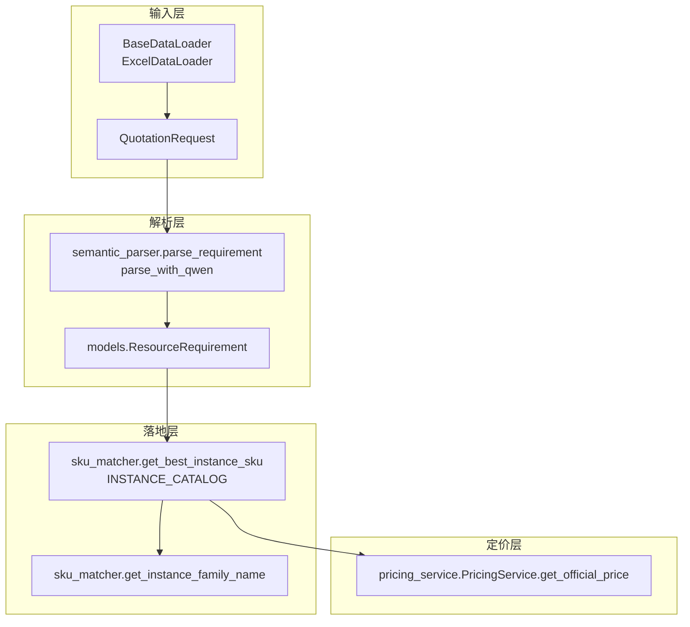
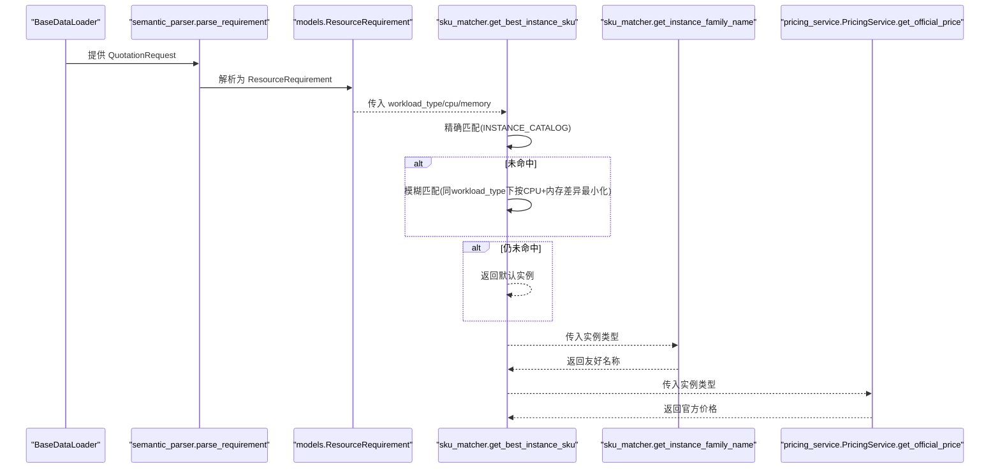
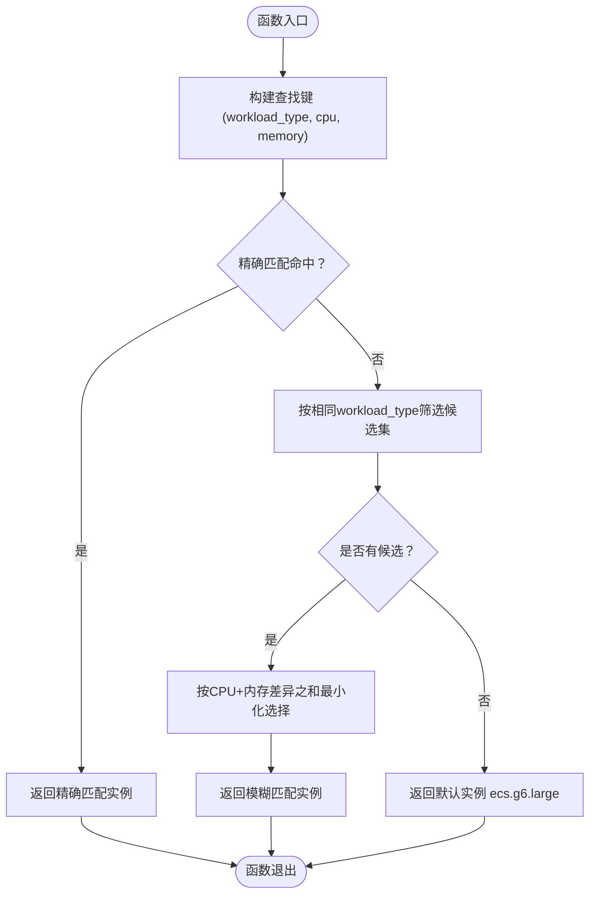
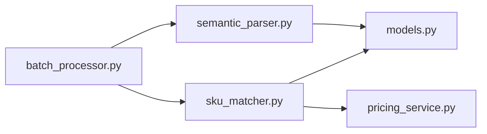
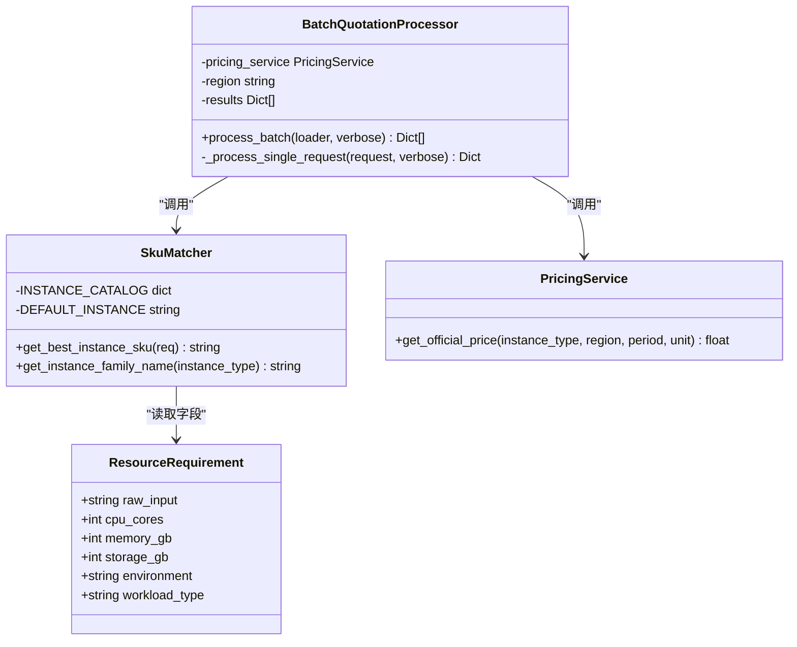

# 策略模式

<cite>
**本文引用的文件**
- [sku_matcher.py](file://sku_matcher.py)
- [models.py](file://models.py)
- [semantic_parser.py](file://semantic_parser.py)
- [batch_processor.py](file://batch_processor.py)
- [pricing_service.py](file://pricing_service.py)
- [data_ingestion.py](file://data_ingestion.py)
- [tests/test_e2e_real_world.py](file://tests/test_e2e_real_world.py)
</cite>

## 目录
1. [引言](#引言)
2. [项目结构](#项目结构)
3. [核心组件](#核心组件)
4. [架构总览](#架构总览)
5. [详细组件分析](#详细组件分析)
6. [依赖分析](#依赖分析)
7. [性能考虑](#性能考虑)
8. [故障排查指南](#故障排查指南)
9. [结论](#结论)
10. [附录](#附录)

## 引言
本文件围绕策略模式在 sku_matcher 模块中的实现展开，重点解释 get_best_instance_sku 如何依据 ResourceRequirement 中的 workload_type 字段动态选择不同实例规格匹配策略（内存密集型、计算密集型、通用型），并说明 INSTANCE_CATALOG 字典作为“策略映射表”的作用。文档还梳理了匹配算法的三层流程：精确匹配、模糊匹配（基于 CPU 和内存差异最小化）、默认兜底策略；并通过示例展示在 8C64G 内存密集型需求下的匹配过程。最后总结该模式带来的灵活性与可维护性，并说明 get_instance_family_name 辅助函数如何提升结果可读性。

## 项目结构
系统采用分层设计，输入经由数据加载器抽象进入，经过语义解析标准化为 ResourceRequirement，再由 SKU 匹配器选择合适的阿里云实例规格，最后通过定价服务查询官方价格。sku_matcher 是“落地层”，负责将抽象意图转化为具体的阿里云实例类型。

图表来源
- [batch_processor.py](file://batch_processor.py#L80-L165)
- [semantic_parser.py](file://semantic_parser.py#L25-L218)
- [models.py](file://models.py#L10-L38)
- [sku_matcher.py](file://sku_matcher.py#L15-L103)
- [pricing_service.py](file://pricing_service.py#L13-L81)

章节来源
- [batch_processor.py](file://batch_processor.py#L80-L165)
- [data_ingestion.py](file://data_ingestion.py#L13-L147)
- [semantic_parser.py](file://semantic_parser.py#L25-L218)
- [models.py](file://models.py#L10-L38)
- [sku_matcher.py](file://sku_matcher.py#L15-L103)
- [pricing_service.py](file://pricing_service.py#L13-L81)

## 核心组件
- ResourceRequirement：标准化资源需求对象，包含 workload_type、cpu_cores、memory_gb 等字段，作为策略选择的输入。
- INSTANCE_CATALOG：以 (workload_type, cpu_cores, memory_gb) 为键，映射到阿里云实例类型 ID 的字典，充当“策略映射表”。
- get_best_instance_sku：根据 ResourceRequirement 的 workload_type 与资源参数执行三层匹配策略。
- get_instance_family_name：将实例类型代码转换为更易读的“家族名称”。

章节来源
- [models.py](file://models.py#L10-L38)
- [sku_matcher.py](file://sku_matcher.py#L15-L103)
- [sku_matcher.py](file://sku_matcher.py#L105-L134)

## 架构总览
下图展示了从输入到落地匹配再到定价的整体流程，以及各模块之间的依赖关系。

图表来源
- [batch_processor.py](file://batch_processor.py#L80-L165)
- [semantic_parser.py](file://semantic_parser.py#L25-L218)
- [sku_matcher.py](file://sku_matcher.py#L45-L103)
- [sku_matcher.py](file://sku_matcher.py#L105-L134)
- [pricing_service.py](file://pricing_service.py#L28-L81)

## 详细组件分析

### 组件A：策略映射表 INSTANCE_CATALOG
- 结构：字典键为三元组 (workload_type, cpu_cores, memory_gb)，值为阿里云实例类型 ID。
- 分类：
  - 内存密集型：键中 workload_type 为 memory_intensive，对应 r6 系列。
  - 计算密集型：键中 workload_type 为 compute，对应 c6 系列。
  - 通用型：键中 workload_type 为 general，对应 g6 系列。
- 价值：将业务规则（工作负载类型与实例系列的绑定）集中管理，便于新增或调整实例映射，无需改动核心匹配逻辑。

章节来源
- [sku_matcher.py](file://sku_matcher.py#L15-L43)

### 组件B：匹配函数 get_best_instance_sku 的策略实现
- 策略一：精确匹配
  - 以 (workload_type, cpu_cores, memory_gb) 为键直接查表。
  - 若命中，立即返回对应实例类型。
- 策略二：模糊匹配
  - 若精确匹配失败，则在同一 workload_type 下筛选候选集。
  - 在候选集中按 CPU 差异绝对值与内存差异绝对值之和最小化选择最接近的规格。
- 策略三：兜底策略
  - 若同一 workload_type 下也无候选，返回默认通用型实例 ecs.g6.large。

图表来源
- [sku_matcher.py](file://sku_matcher.py#L45-L103)

章节来源
- [sku_matcher.py](file://sku_matcher.py#L45-L103)

### 组件C：辅助函数 get_instance_family_name 的可读性增强
- 功能：将实例类型字符串（如 ecs.g6.4xlarge）解析为更具可读性的“家族名称”（如 通用型 g6）。
- 用途：在批处理输出中，既保留技术代码又提供人类可读的描述，便于审计与汇报。

章节来源
- [sku_matcher.py](file://sku_matcher.py#L105-L134)

### 组件D：与上游解析层的衔接
- 语义解析层会将非结构化文本解析为 ResourceRequirement，其中包含 workload_type。
- 批处理层在完成解析后，调用 get_best_instance_sku 并进一步调用 get_instance_family_name，确保输出既有技术代码又有友好名称。

章节来源
- [semantic_parser.py](file://semantic_parser.py#L25-L218)
- [batch_processor.py](file://batch_processor.py#L80-L165)

### 组件E：与下游定价层的衔接
- 匹配完成后，实例类型被传递给 PricingService.get_official_price，查询官方价格。
- 该流程体现了“落地层”只负责实例类型选择，价格查询独立于匹配逻辑，符合关注点分离。

章节来源
- [pricing_service.py](file://pricing_service.py#L28-L81)
- [batch_processor.py](file://batch_processor.py#L120-L143)

## 依赖分析
- 模块内聚与耦合
  - sku_matcher 对 models 的依赖仅限于 ResourceRequirement 类型定义，耦合度低。
  - 与 semantic_parser 的交互通过 parse_requirement 返回的 ResourceRequirement 对象，保持接口稳定。
  - 与 pricing_service 的交互仅通过实例类型字符串，不依赖其内部实现细节。
- 外部依赖
  - 依赖阿里云 BSS OpenAPI 获取官方价格。
  - 依赖 DashScope Qwen-Max 进行语义解析（在解析层）。

图表来源
- [sku_matcher.py](file://sku_matcher.py#L1-L134)
- [models.py](file://models.py#L10-L38)
- [pricing_service.py](file://pricing_service.py#L13-L81)
- [batch_processor.py](file://batch_processor.py#L80-L165)
- [semantic_parser.py](file://semantic_parser.py#L25-L218)

章节来源
- [sku_matcher.py](file://sku_matcher.py#L1-L134)
- [models.py](file://models.py#L10-L38)
- [pricing_service.py](file://pricing_service.py#L13-L81)
- [batch_processor.py](file://batch_processor.py#L80-L165)
- [semantic_parser.py](file://semantic_parser.py#L25-L218)

## 性能考虑
- 精确匹配：O(1) 查表时间，常数级开销。
- 模糊匹配：在同类型候选集中遍历，复杂度 O(n)，n 为该类型下的映射数量。由于映射规模有限，实际开销可忽略。
- 默认兜底：O(1)。
- 整体流程：三次查找/一次遍历，整体时间复杂度为 O(1)+O(n)，满足实时报价场景。

[本节为一般性讨论，不直接分析具体文件]

## 故障排查指南
- 精确匹配失败
  - 检查 ResourceRequirement 的 workload_type 是否与 INSTANCE_CATALOG 键一致（注意 memory_intensive/compute/general 的命名差异）。
  - 检查 cpu_cores 与 memory_gb 是否为正整数且与映射表一致。
- 模糊匹配失败
  - 确认同一 workload_type 下是否存在映射项。
  - 若无候选，将触发默认兜底。
- 默认兜底生效
  - 确认 DEFAULT_INSTANCE 值是否合理（当前为 ecs.g6.large）。
- 日志与可观测性
  - get_best_instance_sku 在命中/未命中时会输出 INFO/WARNING 日志，便于定位问题。
  - 批处理层在成功/失败时也会输出状态信息，便于批量问题排查。

章节来源
- [sku_matcher.py](file://sku_matcher.py#L45-L103)
- [batch_processor.py](file://batch_processor.py#L100-L165)

## 结论
通过在 sku_matcher 中引入策略模式（以 INSTANCE_CATALOG 为核心映射表），系统实现了“业务规则可配置、核心逻辑不变”的设计。新增或调整实例映射仅需修改映射表，无需改动匹配函数与调用链，显著提升了灵活性与可维护性。配合 get_instance_family_name 的可读性增强与批处理层的端到端集成，系统在真实世界中具备良好的扩展能力与稳定性。

[本节为总结性内容，不直接分析具体文件]

## 附录

### 示例：8C64G 内存密集型需求的匹配过程
- 输入条件
  - workload_type：memory_intensive
  - cpu_cores：8
  - memory_gb：64
- 匹配步骤
  1) 精确匹配：在 INSTANCE_CATALOG 中查找键 (memory_intensive, 8, 64)。
  2) 若命中：直接返回对应实例类型。
  3) 若未命中：在同一 workload_type 下（memory_intensive）筛选候选集，按 CPU+内存差异之和最小化选择最接近规格。
  4) 若仍无候选：返回默认实例 ecs.g6.large。
- 输出
  - 返回实例类型（如 ecs.r6.2xlarge）。
  - 通过 get_instance_family_name 输出友好名称（如 内存优化型 r6）。
  - 批处理层随后调用 PricingService 查询官方价格。

章节来源
- [sku_matcher.py](file://sku_matcher.py#L15-L43)
- [sku_matcher.py](file://sku_matcher.py#L45-L103)
- [sku_matcher.py](file://sku_matcher.py#L105-L134)
- [batch_processor.py](file://batch_processor.py#L116-L143)
- [pricing_service.py](file://pricing_service.py#L28-L81)

### UML 类图：数据结构与函数关系

图表来源
- [models.py](file://models.py#L10-L38)
- [sku_matcher.py](file://sku_matcher.py#L15-L134)
- [pricing_service.py](file://pricing_service.py#L13-L81)
- [batch_processor.py](file://batch_processor.py#L18-L165)