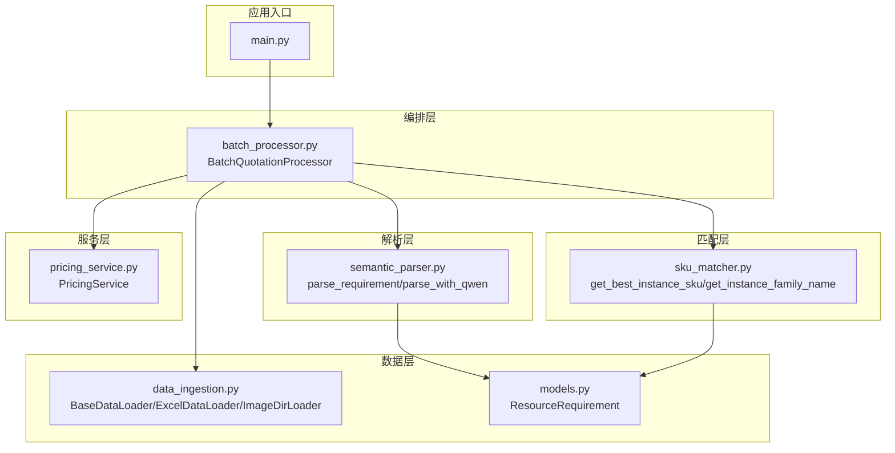
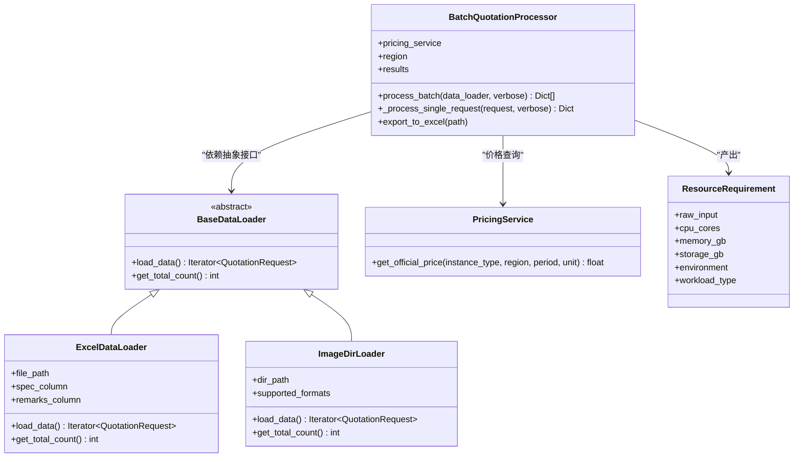
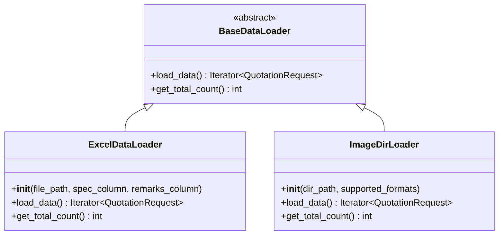
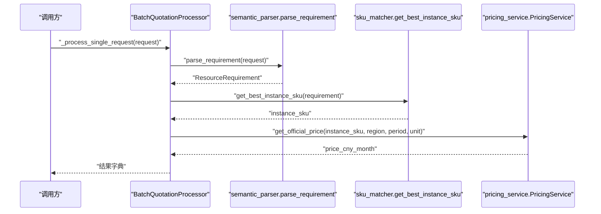
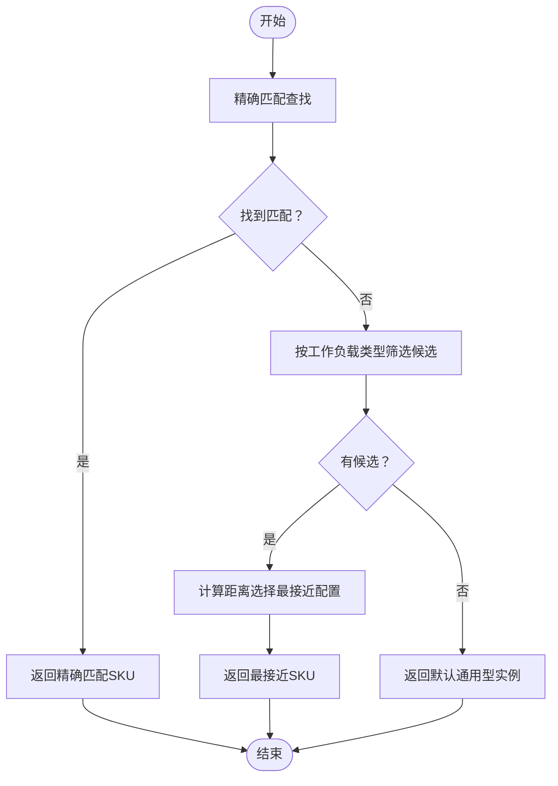
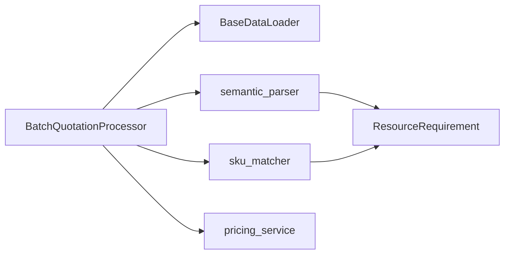

# 设计模式应用

<cite>
**本文引用的文件**
- [main.py](file://main.py)
- [batch_processor.py](file://batch_processor.py)
- [data_ingestion.py](file://data_ingestion.py)
- [semantic_parser.py](file://semantic_parser.py)
- [sku_matcher.py](file://sku_matcher.py)
- [pricing_service.py](file://pricing_service.py)
- [models.py](file://models.py)
</cite>

## 目录
1. [引言](#引言)
2. [项目结构](#项目结构)
3. [核心组件](#核心组件)
4. [架构总览](#架构总览)
5. [详细组件分析](#详细组件分析)
6. [依赖关系分析](#依赖关系分析)
7. [性能考量](#性能考量)
8. [故障排查指南](#故障排查指南)
9. [结论](#结论)

## 引言
本文件聚焦于报价流水线系统中的三大关键设计模式：抽象工厂模式、责任链模式与策略模式。通过对代码的深入分析，我们将解释这些模式在系统中的具体落地方式，展示它们如何提升系统的可维护性与扩展性，并给出相应的类图、序列图与流程图帮助读者快速理解。

## 项目结构
项目采用分层清晰的模块化组织，围绕“数据源抽象—语义解析—SKU匹配—价格查询”的处理管线展开。核心文件包括：
- 数据源抽象与实现：BaseDataLoader、ExcelDataLoader、ImageDirLoader
- 语义解析：parse_requirement、parse_with_qwen
- SKU匹配：get_best_instance_sku、get_instance_family_name
- 价格查询：PricingService
- 统一数据模型：ResourceRequirement
- 批处理编排：BatchQuotationProcessor
- 应用入口：main

图表来源
- [main.py](file://main.py#L1-L100)
- [batch_processor.py](file://batch_processor.py#L1-L244)
- [data_ingestion.py](file://data_ingestion.py#L1-L204)
- [semantic_parser.py](file://semantic_parser.py#L1-L349)
- [sku_matcher.py](file://sku_matcher.py#L1-L134)
- [pricing_service.py](file://pricing_service.py#L1-L81)
- [models.py](file://models.py#L1-L54)

章节来源
- [main.py](file://main.py#L1-L100)
- [batch_processor.py](file://batch_processor.py#L1-L244)
- [data_ingestion.py](file://data_ingestion.py#L1-L204)
- [semantic_parser.py](file://semantic_parser.py#L1-L349)
- [sku_matcher.py](file://sku_matcher.py#L1-L134)
- [pricing_service.py](file://pricing_service.py#L1-L81)
- [models.py](file://models.py#L1-L54)

## 核心组件
- 抽象工厂模式：以BaseDataLoader为“抽象工厂”，ExcelDataLoader与ImageDirLoader为“具体工厂”。批处理器仅依赖抽象接口，新增数据源无需修改现有代码。
- 责任链模式：BatchQuotationProcessor._process_single_request按顺序执行“语义解析→SKU匹配→价格查询”，每步失败可被捕获并继续后续步骤或终止。
- 策略模式：sku_matcher通过查找表与降级策略，根据工作负载类型与资源规格选择最优实例SKU，体现“同一接口下多种策略”的思想。

章节来源
- [batch_processor.py](file://batch_processor.py#L1-L244)
- [data_ingestion.py](file://data_ingestion.py#L1-L204)
- [sku_matcher.py](file://sku_matcher.py#L1-L134)

## 架构总览
以下类图展示了抽象工厂模式在数据加载器中的应用，以及各组件之间的依赖关系。

图表来源
- [data_ingestion.py](file://data_ingestion.py#L32-L204)
- [batch_processor.py](file://batch_processor.py#L1-L244)
- [pricing_service.py](file://pricing_service.py#L1-L81)
- [models.py](file://models.py#L1-L54)

## 详细组件分析

### 抽象工厂模式：BaseDataLoader 与子类
- 抽象层：BaseDataLoader定义统一接口，确保批处理器对具体数据格式无感知。
- 具体工厂：
  - ExcelDataLoader：从Excel读取规格与备注，生成标准化请求对象。
  - ImageDirLoader：遍历图片目录，将图片路径封装为请求对象，预留未来视觉模型集成点。
- 扩展性：新增数据源（如语音转写）只需实现BaseDataLoader接口，批处理器零改动。

图表来源
- [data_ingestion.py](file://data_ingestion.py#L32-L204)

章节来源
- [data_ingestion.py](file://data_ingestion.py#L32-L204)
- [batch_processor.py](file://batch_processor.py#L42-L79)

### 责任链模式：BatchQuotationProcessor._process_single_request
该方法将单条报价请求处理拆分为三个阶段，形成责任链式顺序处理：
1) 语义解析：将非结构化内容解析为ResourceRequirement。
2) SKU匹配：根据工作负载类型与资源规格匹配实例SKU。
3) 价格查询：调用定价服务获取官方价格。

图表来源
- [batch_processor.py](file://batch_processor.py#L80-L164)
- [semantic_parser.py](file://semantic_parser.py#L25-L69)
- [sku_matcher.py](file://sku_matcher.py#L45-L103)
- [pricing_service.py](file://pricing_service.py#L28-L81)

章节来源
- [batch_processor.py](file://batch_processor.py#L80-L164)
- [semantic_parser.py](file://semantic_parser.py#L25-L69)
- [sku_matcher.py](file://sku_matcher.py#L45-L103)
- [pricing_service.py](file://pricing_service.py#L28-L81)

### 策略模式：sku_matcher 中的实例选择策略
- 策略核心：通过查找表与降级策略，根据工作负载类型与资源规格选择最优实例SKU。
- 策略步骤：
  1) 精确匹配：按(workload_type, cpu_cores, memory_gb)查找。
  2) 降级匹配：若无精确匹配，按相同工作负载类型寻找最接近配置。
  3) 兜底策略：若仍无匹配，返回默认通用型实例。
- 扩展性：新增实例类型只需更新查找表，无需修改匹配逻辑。

图表来源
- [sku_matcher.py](file://sku_matcher.py#L45-L103)

章节来源
- [sku_matcher.py](file://sku_matcher.py#L15-L103)
- [models.py](file://models.py#L10-L54)

## 依赖关系分析
- 批处理编排层依赖数据源抽象接口，从而与具体数据格式解耦。
- 语义解析层依赖统一的数据模型ResourceRequirement，保证下游处理的一致性。
- SKU匹配层依赖ResourceRequirement，同时通过查找表实现策略化选择。
- 价格查询层独立于业务逻辑，仅负责调用外部API获取价格。

图表来源
- [batch_processor.py](file://batch_processor.py#L1-L244)
- [semantic_parser.py](file://semantic_parser.py#L1-L349)
- [sku_matcher.py](file://sku_matcher.py#L1-L134)
- [pricing_service.py](file://pricing_service.py#L1-L81)
- [models.py](file://models.py#L1-L54)

章节来源
- [batch_processor.py](file://batch_processor.py#L1-L244)
- [semantic_parser.py](file://semantic_parser.py#L1-L349)
- [sku_matcher.py](file://sku_matcher.py#L1-L134)
- [pricing_service.py](file://pricing_service.py#L1-L81)
- [models.py](file://models.py#L1-L54)

## 性能考量
- 抽象工厂模式降低耦合，便于引入缓存与异步处理，提升整体吞吐。
- 责任链模式在每个阶段可加入重试与超时控制，避免单点故障影响全局。
- 策略模式通过查找表实现O(1)近似匹配，降级策略采用最小距离计算，复杂度与候选数量成正比，建议对候选集做限制与缓存。

## 故障排查指南
- 数据源异常：检查Excel列名映射与文件存在性；确认ImageDirLoader目录路径与格式支持。
- 语义解析异常：当content_type为image或audio时会抛出未实现异常，需等待未来集成；文本解析失败时回退到正则规则。
- SKU匹配异常：若无候选实例，将返回默认通用型实例；建议核查查找表是否覆盖目标规格。
- 价格查询异常：外部API错误由PricingService抛出，批处理器捕获并记录错误信息。

章节来源
- [data_ingestion.py](file://data_ingestion.py#L91-L147)
- [semantic_parser.py](file://semantic_parser.py#L43-L69)
- [sku_matcher.py](file://sku_matcher.py#L98-L103)
- [pricing_service.py](file://pricing_service.py#L65-L81)
- [batch_processor.py](file://batch_processor.py#L144-L164)

## 结论
本系统通过抽象工厂模式实现了数据源的可插拔扩展，通过责任链模式串联了语义解析、SKU匹配与价格查询的处理流程，通过策略模式在SKU选择上提供了灵活且可演进的决策机制。这些设计模式共同提升了系统的可维护性与扩展性，使得未来接入图像、语音等多模态输入成为可能，同时保持批处理逻辑的稳定性与一致性。