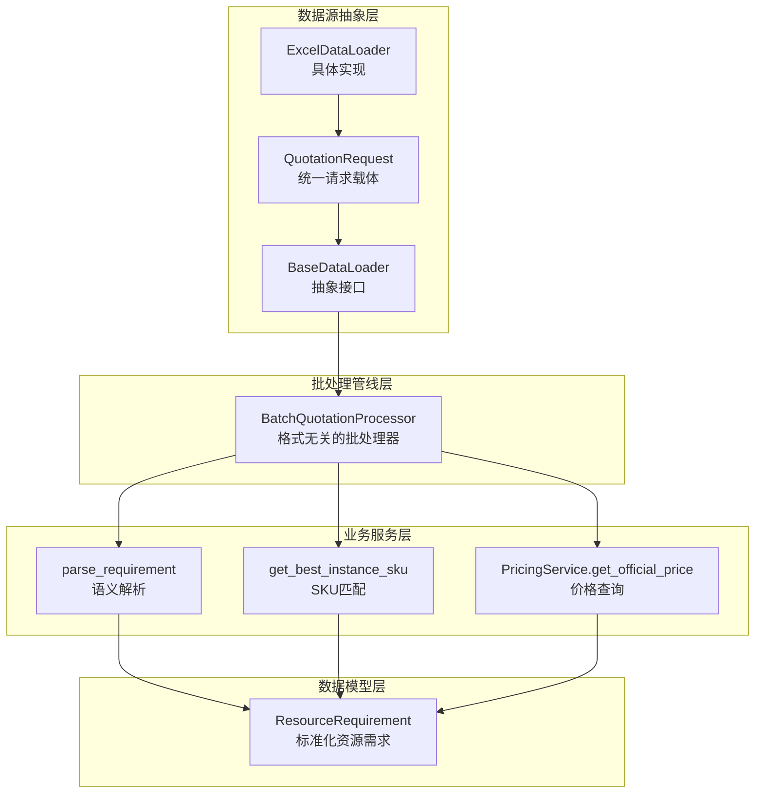
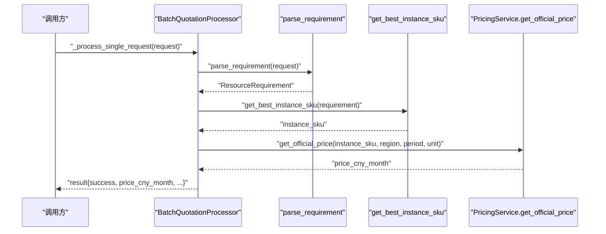
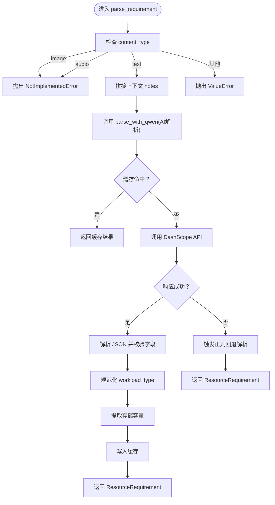
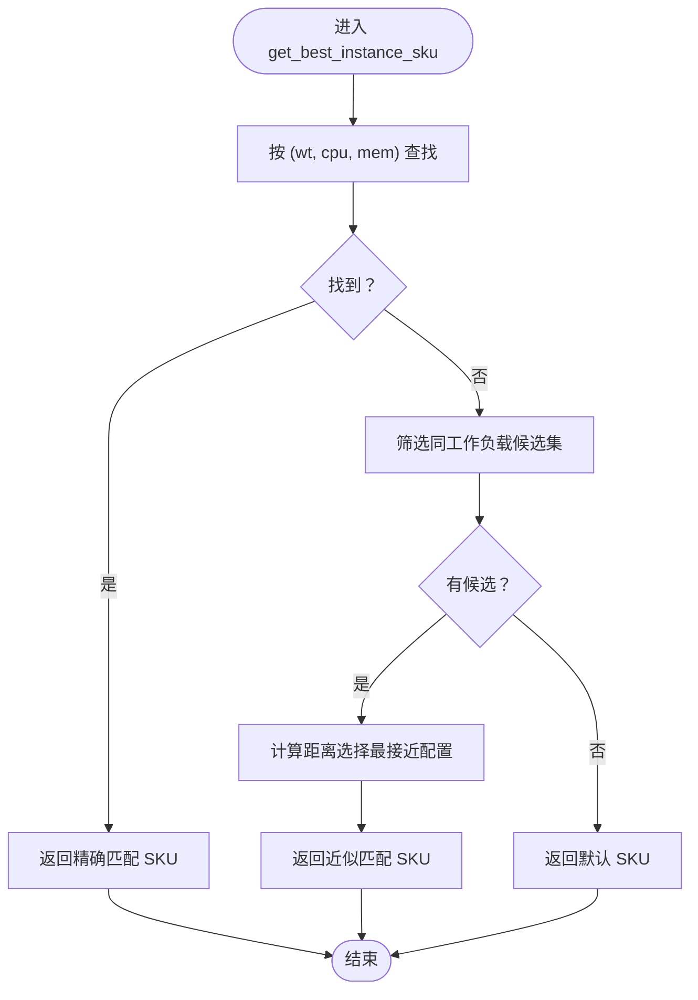
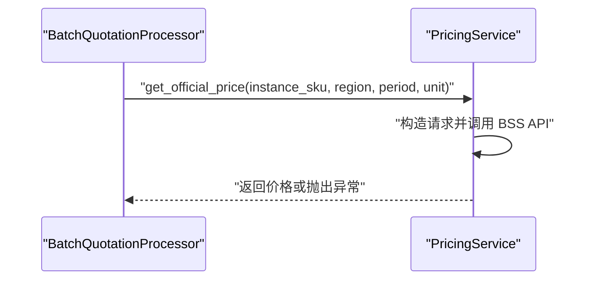
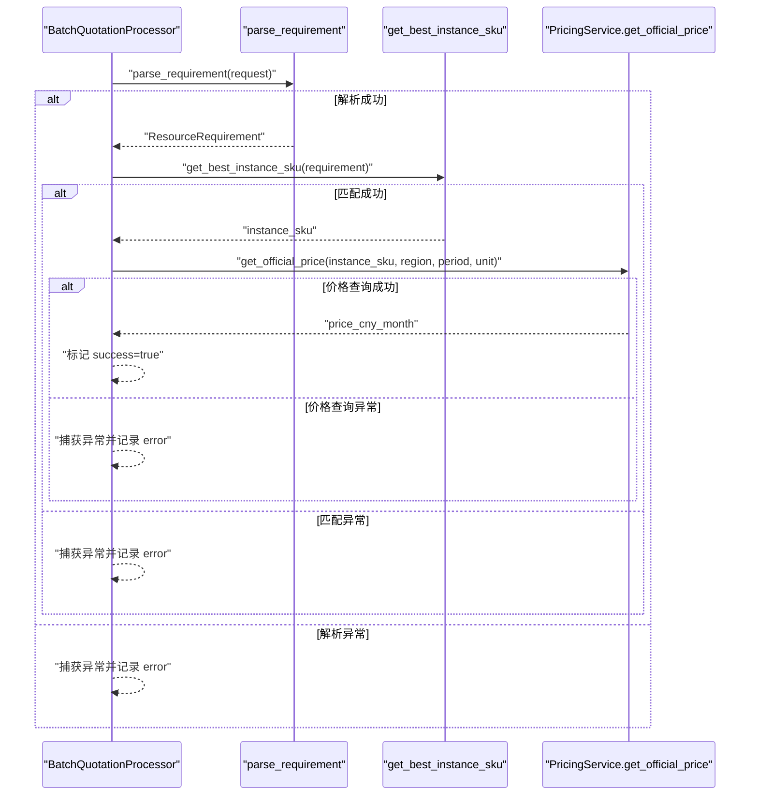
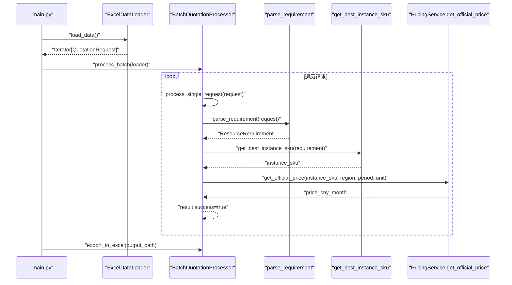
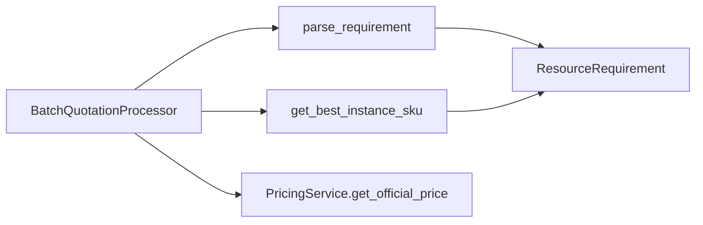

# 责任链模式

<cite>
**本文引用的文件**
- [batch_processor.py](file://batch_processor.py)
- [semantic_parser.py](file://semantic_parser.py)
- [sku_matcher.py](file://sku_matcher.py)
- [pricing_service.py](file://pricing_service.py)
- [models.py](file://models.py)
- [data_ingestion.py](file://data_ingestion.py)
- [main.py](file://main.py)
</cite>

## 目录
1. [引言](#引言)
2. [项目结构](#项目结构)
3. [核心组件](#核心组件)
4. [架构总览](#架构总览)
5. [详细组件分析](#详细组件分析)
6. [依赖关系分析](#依赖关系分析)
7. [性能考量](#性能考量)
8. [故障排查指南](#故障排查指南)
9. [结论](#结论)
10. [附录](#附录)

## 引言
本文围绕责任链模式在批量报价处理器中的应用展开，聚焦于 BatchQuotationProcessor 的 _process_single_request 方法如何将单个报价请求依次传递给三个独立处理阶段：语义解析（parse_requirement）→ SKU 匹配（get_best_instance_sku）→ 价格查询（get_official_price），形成一条清晰的处理链条。我们将从职责划分、输入输出、错误传播机制、松耦合特性、可视化序列图以及实际调用示例等方面进行深入剖析，并说明进度显示与日志输出如何增强可观察性。

## 项目结构
系统采用“数据源抽象 + 批处理管线 + 业务服务”的分层组织方式：
- 数据源抽象层：定义统一的 QuotationRequest 和 BaseDataLoader 接口，屏蔽 Excel/图片/音频等不同输入格式差异。
- 批处理管线层：BatchQuotationProcessor 提供格式无关的批量处理能力，内部以责任链串联三阶段处理。
- 业务服务层：语义解析（semantic_parser）、SKU 匹配（sku_matcher）、价格查询（pricing_service）分别承担各自职责。
- 数据模型层：ResourceRequirement 作为标准化的资源需求对象，贯穿解析与匹配阶段。

图表来源
- [data_ingestion.py](file://data_ingestion.py#L13-L31)
- [data_ingestion.py](file://data_ingestion.py#L32-L61)
- [data_ingestion.py](file://data_ingestion.py#L63-L147)
- [batch_processor.py](file://batch_processor.py#L42-L79)
- [semantic_parser.py](file://semantic_parser.py#L25-L68)
- [sku_matcher.py](file://sku_matcher.py#L45-L103)
- [pricing_service.py](file://pricing_service.py#L28-L80)
- [models.py](file://models.py#L10-L27)

章节来源
- [data_ingestion.py](file://data_ingestion.py#L13-L31)
- [data_ingestion.py](file://data_ingestion.py#L32-L61)
- [data_ingestion.py](file://data_ingestion.py#L63-L147)
- [batch_processor.py](file://batch_processor.py#L42-L79)

## 核心组件
- 批处理管线：BatchQuotationProcessor 负责遍历数据源，逐条调用 _process_single_request，聚合结果并导出。
- 语义解析：parse_requirement 将 QuotationRequest 转换为 ResourceRequirement，支持文本 AI 解析与正则回退。
- SKU 匹配：get_best_instance_sku 基于工作负载类型与 CPU/内存规格在目录中查找最优实例 SKU，并提供近似匹配与兜底策略。
- 价格查询：PricingService.get_official_price 通过阿里云 BSS API 查询官方价格，支持默认单位与区域参数。
- 数据模型：ResourceRequirement 统一了资源需求字段，确保跨阶段的数据一致性。

章节来源
- [batch_processor.py](file://batch_processor.py#L80-L164)
- [semantic_parser.py](file://semantic_parser.py#L25-L68)
- [sku_matcher.py](file://sku_matcher.py#L45-L103)
- [pricing_service.py](file://pricing_service.py#L28-L80)
- [models.py](file://models.py#L10-L27)

## 架构总览
责任链模式在此处体现为：_process_single_request 顺序调用三个函数，每个阶段只关注自身职责，彼此之间通过标准化对象（如 ResourceRequirement）进行数据传递，从而实现松耦合与可扩展性。

图表来源
- [batch_processor.py](file://batch_processor.py#L80-L164)
- [semantic_parser.py](file://semantic_parser.py#L25-L68)
- [sku_matcher.py](file://sku_matcher.py#L45-L103)
- [pricing_service.py](file://pricing_service.py#L28-L80)

## 详细组件分析

### 责任链阶段一：语义解析（parse_requirement）
- 输入：QuotationRequest（包含 source_id、content、content_type、context_notes）
- 输出：ResourceRequirement（cpu_cores、memory_gb、storage_gb、environment、workload_type）
- 职责：
  - 根据 content_type 分派处理逻辑；
  - 对 text 类型调用 AI 解析（Qwen-Max），并支持缓存与回退；
  - 对 image/audio 类型抛出未实现异常，预留未来扩展点；
  - 对不支持的类型抛出值错误。
- 错误传播：
  - NotImplementedError 由上层捕获并记录；
  - 其他异常（如 API 错误、解析失败）由上层捕获并记录。

图表来源
- [semantic_parser.py](file://semantic_parser.py#L25-L68)
- [semantic_parser.py](file://semantic_parser.py#L71-L218)
- [semantic_parser.py](file://semantic_parser.py#L220-L349)

章节来源
- [semantic_parser.py](file://semantic_parser.py#L25-L68)
- [semantic_parser.py](file://semantic_parser.py#L71-L218)
- [semantic_parser.py](file://semantic_parser.py#L220-L349)

### 责任链阶段二：SKU 匹配（get_best_instance_sku）
- 输入：ResourceRequirement
- 输出：实例 SKU 字符串
- 职责：
  - 精确匹配：按 (workload_type, cpu_cores, memory_gb) 查找；
  - 降级匹配：若无精确匹配，按相同工作负载类型寻找最接近配置；
  - 兜底策略：若仍无匹配，返回默认通用型实例。
- 日志与可观测性：
  - 精确匹配、模糊匹配、兜底时分别输出 INFO/WARNING 日志，便于定位问题。

图表来源
- [sku_matcher.py](file://sku_matcher.py#L45-L103)

章节来源
- [sku_matcher.py](file://sku_matcher.py#L45-L103)

### 责任链阶段三：价格查询（get_official_price）
- 输入：实例 SKU、区域、购买时长、时间单位
- 输出：官方价格（CNY/月）
- 职责：
  - 构造阿里云 BSS API 请求；
  - 调用 GetSubscriptionPrice 获取价格；
  - 解析响应并返回价格数值；
  - 异常向上抛出，由上层统一处理。
- 注意：
  - 默认单位为 Month，区域默认 cn-beijing；这些在批处理器中固定传入。

图表来源
- [batch_processor.py](file://batch_processor.py#L128-L143)
- [pricing_service.py](file://pricing_service.py#L28-L80)

章节来源
- [batch_processor.py](file://batch_processor.py#L128-L143)
- [pricing_service.py](file://pricing_service.py#L28-L80)

### 单请求处理链路与错误传播
_process_single_request 将上述三阶段串联，严格遵循“失败即中断”的责任链原则：
- 成功路径：parse_requirement → get_best_instance_sku → get_official_price → success=true
- 失败路径：任一阶段抛出异常，被捕获并记录 error，后续阶段不再执行，最终 result.success=false

图表来源
- [batch_processor.py](file://batch_processor.py#L80-L164)
- [semantic_parser.py](file://semantic_parser.py#L25-L68)
- [sku_matcher.py](file://sku_matcher.py#L45-L103)
- [pricing_service.py](file://pricing_service.py#L28-L80)

章节来源
- [batch_processor.py](file://batch_processor.py#L80-L164)

### 松耦合特性
- 数据源解耦：BaseDataLoader 抽象屏蔽了 Excel/图片/音频等输入差异，批处理器仅依赖接口。
- 处理阶段解耦：三阶段均通过标准化对象（QuotationRequest/ResourceRequirement）传递，互不感知对方实现细节。
- 易扩展：新增处理步骤只需在 _process_single_request 中追加调用，保持原有链路不变。
- 易维护：异常捕获集中在 _process_single_request，便于统一记录与诊断。

章节来源
- [data_ingestion.py](file://data_ingestion.py#L32-L61)
- [batch_processor.py](file://batch_processor.py#L42-L79)

### 实际调用示例（从 QuotationRequest 到最终报价）
- 入口：main.py 中初始化 ExcelDataLoader、PricingService、BatchQuotationProcessor，并调用 process_batch。
- 单条请求：对每条 QuotationRequest，调用 _process_single_request，按责任链执行三阶段。
- 结果：成功时 result.success=true 并包含 price_cny_month；失败时 result.success=false 并记录 error。
- 导出：调用 export_to_excel 将结果写入 Excel 文件。

图表来源
- [main.py](file://main.py#L51-L90)
- [batch_processor.py](file://batch_processor.py#L42-L79)
- [batch_processor.py](file://batch_processor.py#L80-L164)
- [semantic_parser.py](file://semantic_parser.py#L25-L68)
- [sku_matcher.py](file://sku_matcher.py#L45-L103)
- [pricing_service.py](file://pricing_service.py#L28-L80)

章节来源
- [main.py](file://main.py#L51-L90)
- [batch_processor.py](file://batch_processor.py#L42-L79)
- [batch_processor.py](file://batch_processor.py#L80-L164)

## 依赖关系分析
- 批处理管线依赖：
  - 语义解析：调用 parse_requirement，接收 QuotationRequest，返回 ResourceRequirement。
  - SKU 匹配：调用 get_best_instance_sku，接收 ResourceRequirement，返回实例 SKU。
  - 价格查询：调用 PricingService.get_official_price，接收实例 SKU，返回价格。
- 数据模型依赖：
  - ResourceRequirement 作为跨阶段的共享数据结构，被语义解析与 SKU 匹配共同使用。
- 数据源依赖：
  - BaseDataLoader 抽象屏蔽具体输入格式，批处理器无需感知。

图表来源
- [batch_processor.py](file://batch_processor.py#L80-L164)
- [semantic_parser.py](file://semantic_parser.py#L25-L68)
- [sku_matcher.py](file://sku_matcher.py#L45-L103)
- [pricing_service.py](file://pricing_service.py#L28-L80)
- [models.py](file://models.py#L10-L27)

章节来源
- [batch_processor.py](file://batch_processor.py#L80-L164)
- [semantic_parser.py](file://semantic_parser.py#L25-L68)
- [sku_matcher.py](file://sku_matcher.py#L45-L103)
- [pricing_service.py](file://pricing_service.py#L28-L80)
- [models.py](file://models.py#L10-L27)

## 性能考量
- 缓存优化：语义解析模块内置 LLM 结果缓存，减少重复调用 DashScope API 的开销。
- 匹配效率：SKU 匹配采用字典查找与近似距离计算，复杂度可控；建议在目录规模扩大时考虑索引优化。
- I/O 与网络：价格查询依赖外部 API，建议在批处理中控制并发与重试策略（当前实现未显式并发，避免阻塞）。
- 日志与可观测性：阶段内日志输出有助于快速定位瓶颈与异常。

章节来源
- [semantic_parser.py](file://semantic_parser.py#L25-L68)
- [semantic_parser.py](file://semantic_parser.py#L71-L218)
- [sku_matcher.py](file://sku_matcher.py#L45-L103)
- [pricing_service.py](file://pricing_service.py#L28-L80)

## 故障排查指南
- 常见异常与处理：
  - NotImplementedError：当 content_type 为 image/audio 时触发，属于预期的未实现分支，需等待未来集成。
  - ValueError：当 content_type 不受支持时触发，检查数据源列配置或输入类型。
  - TeaException/其他异常：由价格查询或外部 API 引起，批处理器会捕获并记录错误详情（含 RequestId 等）。
- 诊断建议：
  - 启用 verbose 输出，观察各阶段日志与进度；
  - 检查 .env 中的阿里云密钥配置；
  - 核对 Excel 输入列名与数据有效性；
  - 在语义解析阶段确认 DashScope API Key 已正确设置。

章节来源
- [batch_processor.py](file://batch_processor.py#L144-L164)
- [main.py](file://main.py#L26-L40)
- [semantic_parser.py](file://semantic_parser.py#L128-L159)

## 结论
本系统以责任链模式为核心，将报价流程拆分为“语义解析 → SKU 匹配 → 价格查询”三个清晰且相互独立的阶段。通过标准化数据模型与抽象接口，实现了数据源与处理逻辑的松耦合；通过集中式的异常捕获与日志输出，增强了可观察性与可维护性。该设计使得新增处理步骤、替换解析器或扩展输入格式变得简单而安全，同时保留了良好的性能与可扩展性。

## 附录
- 进度显示与日志输出：
  - 批处理启动与汇总统计：在 process_batch 与 _print_summary 中输出批次级进度与统计信息。
  - 单请求阶段日志：在 _process_single_request 中按阶段打印进度与结果摘要。
  - 语义解析阶段：AI 解析与缓存命中提示。
  - SKU 匹配阶段：精确/近似匹配与兜底策略的日志提示。
  - 价格查询阶段：API 调用与错误信息输出。

章节来源
- [batch_processor.py](file://batch_processor.py#L42-L79)
- [batch_processor.py](file://batch_processor.py#L166-L208)
- [batch_processor.py](file://batch_processor.py#L100-L143)
- [semantic_parser.py](file://semantic_parser.py#L90-L105)
- [semantic_parser.py](file://semantic_parser.py#L106-L204)
- [sku_matcher.py](file://sku_matcher.py#L61-L102)