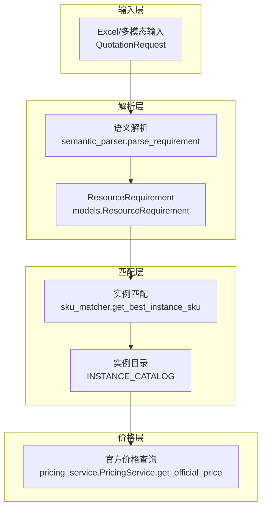
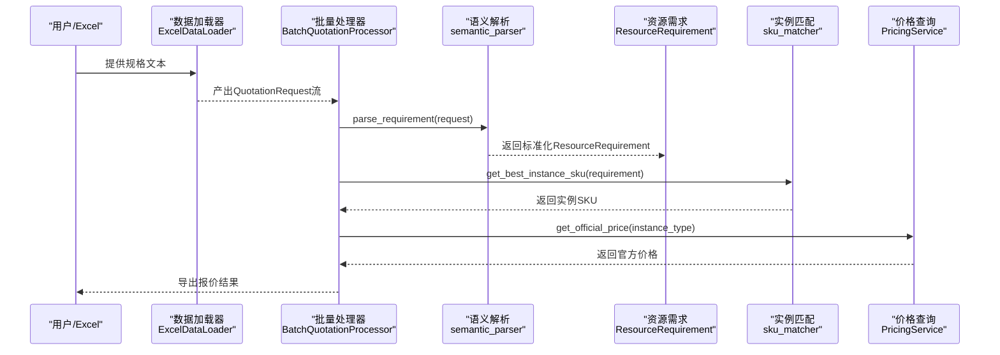
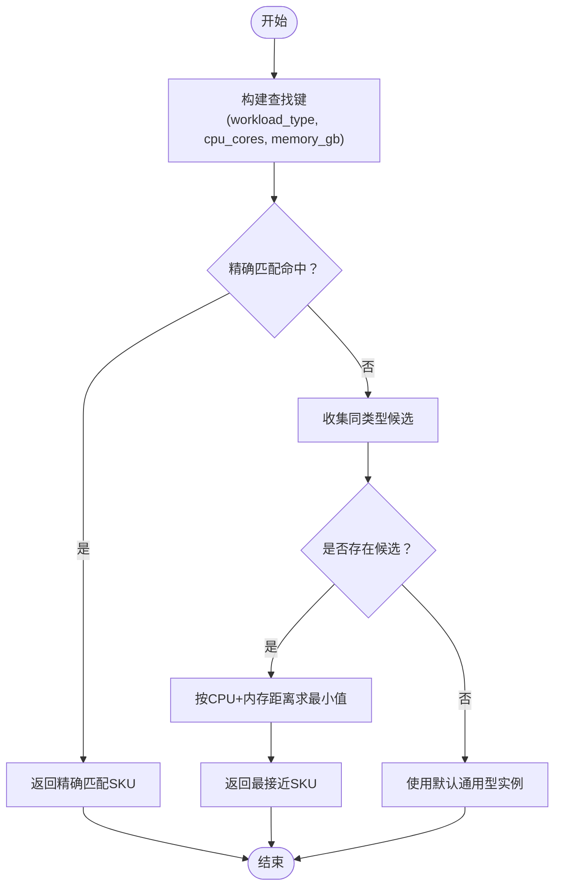
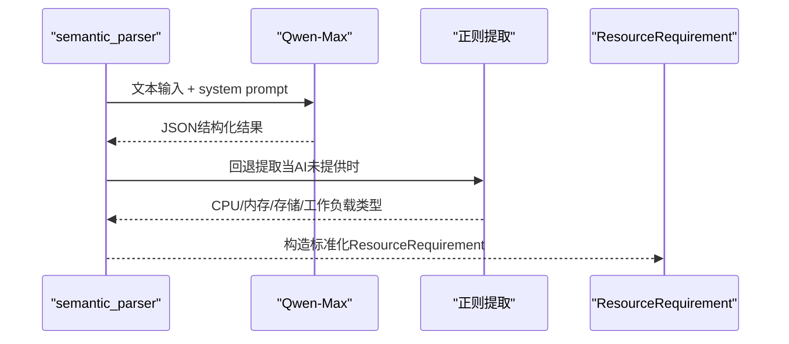
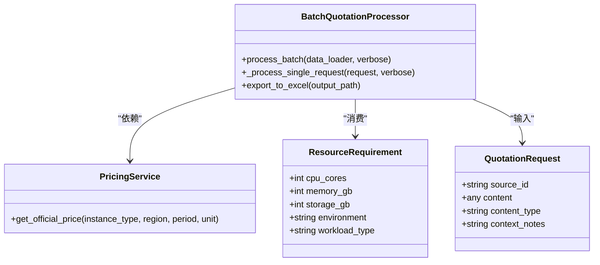
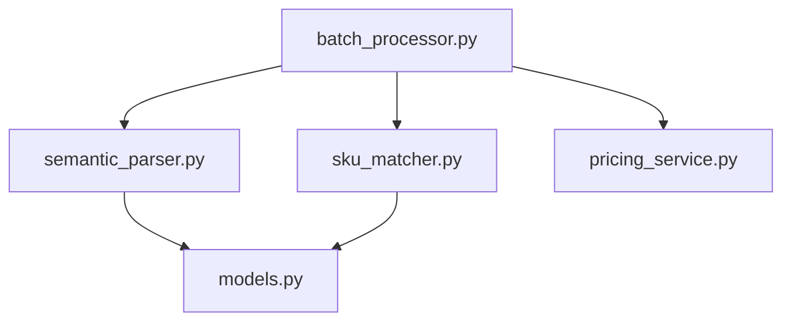

# SKU匹配模块

<cite>
**本文引用的文件**
- [sku_matcher.py](file://sku_matcher.py)
- [models.py](file://models.py)
- [semantic_parser.py](file://semantic_parser.py)
- [batch_processor.py](file://batch_processor.py)
- [data_ingestion.py](file://data_ingestion.py)
- [pricing_service.py](file://pricing_service.py)
- [main.py](file://main.py)
</cite>

## 目录
1. [简介](#简介)
2. [项目结构](#项目结构)
3. [核心组件](#核心组件)
4. [架构总览](#架构总览)
5. [详细组件分析](#详细组件分析)
6. [依赖关系分析](#依赖关系分析)
7. [性能考量](#性能考量)
8. [故障排查指南](#故障排查指南)
9. [结论](#结论)
10. [附录](#附录)

## 简介
本文件面向“SKU匹配模块”的内部逻辑进行全面文档化，重点解释基于工作负载类型的实例规格匹配策略。文档覆盖以下要点：
- INSTANCE_CATALOG中通用型、计算密集型和内存密集型实例的分类标准及对应实例族的选择逻辑
- match_sku方法（通过get_best_instance_sku实现）如何根据解析后的ResourceRequirement（CPU、内存、GPU需求）查找最合适的云实例SKU
- 具体匹配案例：数据库需求映射到Redis或MySQL实例系列的策略说明
- 匹配精度优化方向：引入更多维度权重、支持自定义匹配规则的扩展点，以及处理模糊需求时的默认策略

## 项目结构
该模块位于报价流水线的“语义解析-实例匹配-价格查询”链路中，围绕统一的数据结构ResourceRequirement展开，形成“输入规范-意图抽取-实例落地-价格查询”的闭环。

图表来源
- [batch_processor.py](file://batch_processor.py#L42-L165)
- [semantic_parser.py](file://semantic_parser.py#L25-L68)
- [models.py](file://models.py#L10-L54)
- [sku_matcher.py](file://sku_matcher.py#L15-L103)
- [pricing_service.py](file://pricing_service.py#L28-L81)

章节来源
- [main.py](file://main.py#L15-L99)
- [batch_processor.py](file://batch_processor.py#L42-L165)
- [data_ingestion.py](file://data_ingestion.py#L13-L29)

## 核心组件
- ResourceRequirement：标准化资源需求对象，包含CPU核心数、内存容量、存储容量、环境类型、工作负载类型等字段，确保上游解析结果以一致结构进入匹配阶段。
- INSTANCE_CATALOG：实例目录，以三元组(key)作为索引，key由工作负载类型、CPU核心数、内存容量组成；值为具体的阿里云实例规格代码。
- get_best_instance_sku：核心匹配函数，执行“精确匹配-降级匹配-兜底策略”的三层匹配逻辑，并返回最佳实例SKU。
- get_instance_family_name：辅助函数，将实例规格代码映射为可读的实例族名称，便于展示与审计。
- PricingService：官方价格查询服务，基于阿里云BSS OpenAPI按实例规格查询包月价格。

章节来源
- [models.py](file://models.py#L10-L54)
- [sku_matcher.py](file://sku_matcher.py#L15-L103)
- [sku_matcher.py](file://sku_matcher.py#L105-L134)
- [pricing_service.py](file://pricing_service.py#L13-L81)

## 架构总览
SKU匹配模块在整体报价流水线中的位置如下：

图表来源
- [batch_processor.py](file://batch_processor.py#L42-L165)
- [semantic_parser.py](file://semantic_parser.py#L25-L68)
- [pricing_service.py](file://pricing_service.py#L28-L81)

## 详细组件分析

### 实例目录与工作负载分类
- 分类标准
  - 通用型（general）：适用于Web、应用网关、中间件等通用场景，强调均衡的CPU与内存能力。
  - 计算密集型（compute）：适用于算法、AI训练、编码、科学计算等需要高算力的场景，通常对CPU性能要求更高。
  - 内存密集型（memory_intensive）：适用于数据库、缓存（如Redis）、大规模内存计算等需要大内存的场景。
- 实例族选择逻辑
  - 通用型：g6/g7系列
  - 计算密集型：c6/c7系列
  - 内存密集型：r6/r7系列
- 实例目录（INSTANCE_CATALOG）以三元组(key)组织，key=(workload_type, cpu_cores, memory_gb)，值为实例规格代码。该结构保证了按工作负载类型+资源规格的快速检索。

章节来源
- [sku_matcher.py](file://sku_matcher.py#L15-L43)

### 匹配策略与match_sku实现
- 精确匹配：以(workload_type, cpu_cores, memory_gb)为键直接查表，命中即返回。
- 降级匹配：若无精确匹配，则仅在同一workload_type下寻找最接近的配置，使用“CPU差值绝对值+内存差值绝对值”作为距离度量，取最小者。
- 兜底策略：若同一workload_type下也无候选，则回退到默认通用型实例。

图表来源
- [sku_matcher.py](file://sku_matcher.py#L45-L103)

章节来源
- [sku_matcher.py](file://sku_matcher.py#L45-L103)

### 语义解析到资源需求的映射
- 语义解析器负责将非结构化文本转化为ResourceRequirement，其中：
  - workload_type由关键词规则或AI推理得出，映射到“general/compute/memory_intensive”
  - cpu_cores、memory_gb、storage_gb分别通过正则提取或AI推理得到
  - environment在当前阶段简化处理，不再由AI分类
- 该过程确保后续SKU匹配仅依赖标准化的ResourceRequirement对象。

图表来源
- [semantic_parser.py](file://semantic_parser.py#L71-L218)
- [semantic_parser.py](file://semantic_parser.py#L220-L349)

章节来源
- [semantic_parser.py](file://semantic_parser.py#L71-L218)
- [semantic_parser.py](file://semantic_parser.py#L220-L349)
- [models.py](file://models.py#L10-L54)

### 价格查询与输出
- 批量处理器在完成SKU匹配后，调用PricingService查询官方包月价格，并将结果导出至Excel。
- 价格查询默认单位为“月”，默认区域为“cn-beijing”。

章节来源
- [batch_processor.py](file://batch_processor.py#L120-L143)
- [pricing_service.py](file://pricing_service.py#L28-L81)

### 典型匹配案例
- 数据库需求映射到Redis或MySQL实例系列
  - 若解析出workload_type为“memory_intensive”，且CPU/内存规格与目录中某项匹配，则直接返回对应r6系列实例。
  - 若无精确匹配，将按CPU+内存距离在memory_intensive类型内寻找最接近配置。
  - 若仍无候选，回退到默认通用型实例。
- 算法/AI训练需求映射到计算密集型
  - workload_type为“compute”，优先匹配c6/c7系列中最接近的规格。
- Web/应用网关需求映射到通用型
  - workload_type为“general”，优先匹配g6/g7系列中最接近的规格。

章节来源
- [sku_matcher.py](file://sku_matcher.py#L15-L43)
- [semantic_parser.py](file://semantic_parser.py#L106-L123)
- [semantic_parser.py](file://semantic_parser.py#L322-L349)

### 类关系图（代码级）

图表来源
- [models.py](file://models.py#L10-L54)
- [batch_processor.py](file://batch_processor.py#L18-L41)
- [pricing_service.py](file://pricing_service.py#L13-L81)
- [data_ingestion.py](file://data_ingestion.py#L13-L29)

## 依赖关系分析
- 模块耦合
  - BatchQuotationProcessor依赖semantic_parser与sku_matcher，形成“解析-匹配”的紧耦合；与PricingService松耦合，便于替换或扩展。
  - sku_matcher与models紧密耦合（依赖ResourceRequirement），与外部API解耦（通过PricingService）。
- 外部依赖
  - 阿里云BSS OpenAPI用于价格查询
  - DashScope Qwen-Max用于语义解析（可回退到正则规则）

图表来源
- [batch_processor.py](file://batch_processor.py#L11-L16)
- [semantic_parser.py](file://semantic_parser.py#L10-L16)
- [sku_matcher.py](file://sku_matcher.py#L1-L13)
- [pricing_service.py](file://pricing_service.py#L1-L12)
- [models.py](file://models.py#L1-L9)

章节来源
- [batch_processor.py](file://batch_processor.py#L11-L16)
- [semantic_parser.py](file://semantic_parser.py#L10-L16)
- [sku_matcher.py](file://sku_matcher.py#L1-L13)
- [pricing_service.py](file://pricing_service.py#L1-L12)
- [models.py](file://models.py#L1-L9)

## 性能考量
- 匹配复杂度
  - 精确匹配为O(1)字典查找
  - 降级匹配在同类型候选集合上做线性扫描，时间复杂度近似O(n)，n为同一workload_type下的条目数量
- 缓存与稳定性
  - 语义解析层具备LLM结果缓存，减少重复调用与Token消耗
  - 日志记录有助于定位匹配失败原因，便于后续优化
- 优化建议
  - 引入多维权重：在降级匹配时，为CPU与内存赋予不同权重，以反映业务偏好（如内存敏感场景提高内存权重）
  - 支持自定义匹配规则：通过配置文件或插件机制，允许用户为特定业务场景注入优先级规则
  - 模糊需求默认策略：在无法确定workload_type时，采用保守策略（如默认通用型或内存型），并在日志中标注“需人工复核”

[本节为通用性能讨论，不直接分析具体文件]

## 故障排查指南
- 语义解析失败
  - 现象：抛出NotImplementedError或异常，提示多模态功能尚未实现或AI解析失败
  - 排查：检查content_type是否为"text"；确认DashScope API Key已正确配置；查看回退到正则规则时的提取结果
- 匹配不到合适SKU
  - 现象：日志提示“无精确匹配/无合适匹配”，最终回退到默认通用型实例
  - 排查：确认ResourceRequirement的workload_type是否合理；检查INSTANCE_CATALOG中是否存在相近规格；必要时扩展目录
- 价格查询异常
  - 现象：API错误或价格数据缺失
  - 排查：检查Access Key配置、网络连通性、实例规格有效性；查看错误码与RequestId

章节来源
- [semantic_parser.py](file://semantic_parser.py#L43-L68)
- [semantic_parser.py](file://semantic_parser.py#L103-L160)
- [batch_processor.py](file://batch_processor.py#L144-L165)
- [pricing_service.py](file://pricing_service.py#L66-L81)

## 结论
SKU匹配模块通过“标准化资源需求+实例目录+三层匹配策略”实现了从非结构化规格到具体实例SKU的稳健落地。其优势在于：
- 明确的工作负载分类与实例族映射，便于业务理解与维护
- 渐进式匹配策略兼顾准确性与鲁棒性
- 与解析与价格查询层解耦，便于扩展与演进

建议的演进方向：
- 引入多维权重与自定义规则扩展点，提升匹配精度
- 在模糊需求场景下制定更明确的默认策略
- 增加对GPU等新维度的支持，完善匹配维度

[本节为总结性内容，不直接分析具体文件]

## 附录
- 实例族名称映射：get_instance_family_name将实例规格代码映射为可读名称，便于展示与审计
- 默认实例：当所有匹配策略均失败时，回退到默认通用型实例，确保流程可用性

章节来源
- [sku_matcher.py](file://sku_matcher.py#L105-L134)