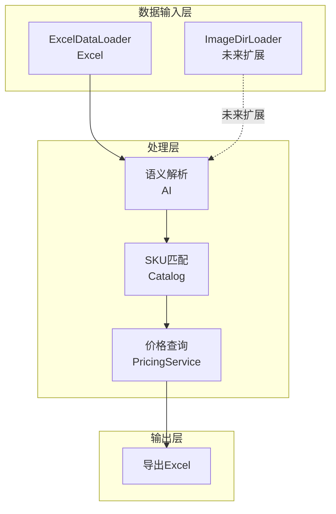
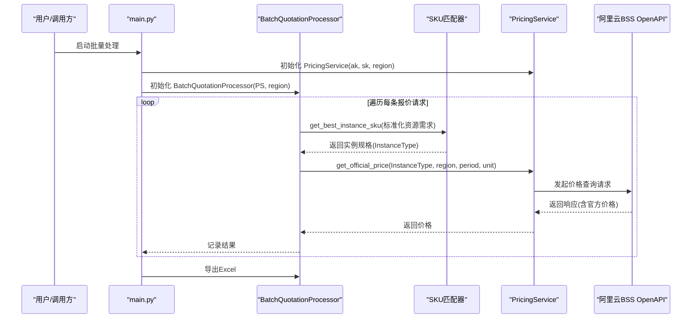
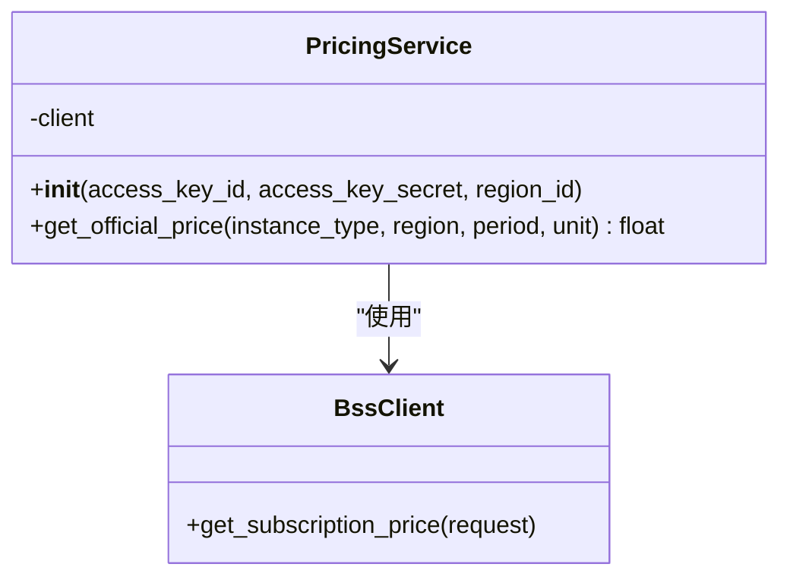
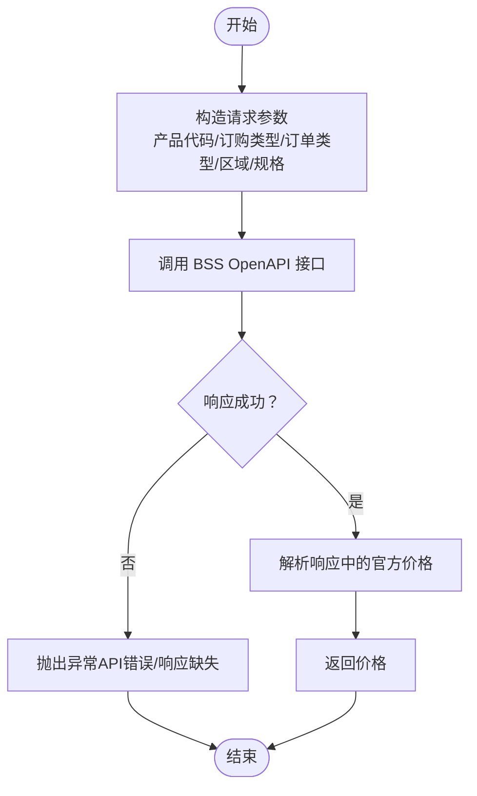
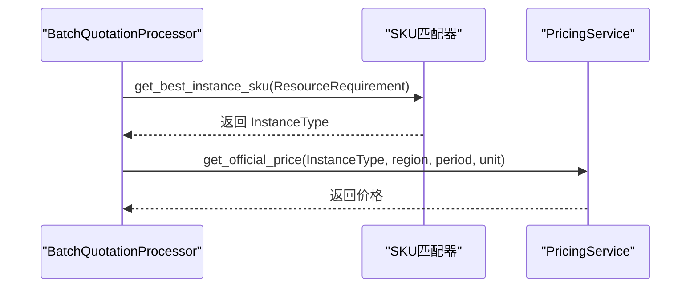
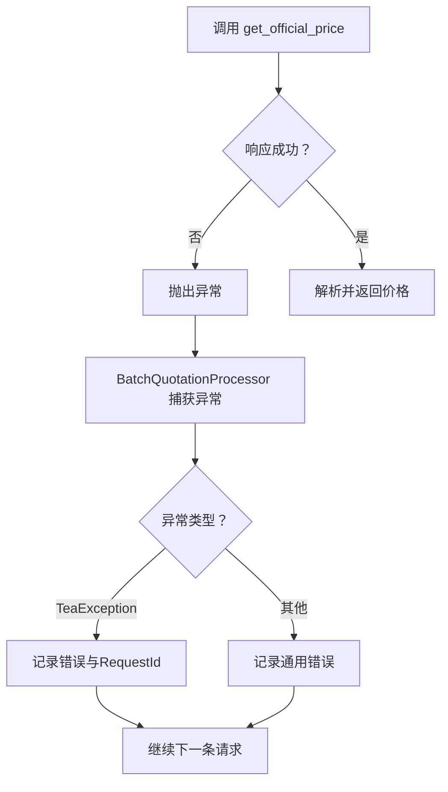
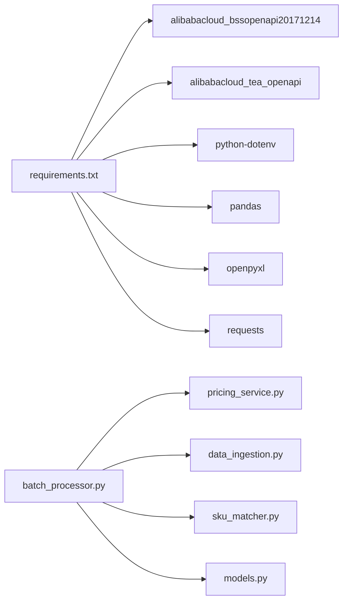

# 价格服务模块

<cite>
**本文引用的文件**
- [pricing_service.py](file://pricing_service.py)
- [batch_processor.py](file://batch_processor.py)
- [main.py](file://main.py)
- [sku_matcher.py](file://sku_matcher.py)
- [models.py](file://models.py)
- [requirements.txt](file://requirements.txt)
- [tests/test_e2e_real_world.py](file://tests/test_e2e_real_world.py)
- [TESTING_GUIDE.md](file://TESTING_GUIDE.md)
</cite>

## 目录
1. [简介](#简介)
2. [项目结构](#项目结构)
3. [核心组件](#核心组件)
4. [架构总览](#架构总览)
5. [详细组件分析](#详细组件分析)
6. [依赖关系分析](#依赖关系分析)
7. [性能考量](#性能考量)
8. [故障排查指南](#故障排查指南)
9. [结论](#结论)
10. [附录](#附录)

## 简介
本文件面向“价格服务模块”的技术文档，聚焦于与阿里云BSS OpenAPI的集成实现。重点说明 PricingService 类如何通过 alibabacloud_bssopenapi20171214 SDK 发起价格查询请求，并围绕以下主题展开：
- 请求参数构造：产品代码（ProductCode）、订单类型（OrderType）、模块代码（ModuleCode）、规格（InstanceType）等字段的映射与组装。
- 区域配置：默认区域为 cn-beijing 的设定与使用。
- 价格查询流程：从 SKU 到官方价格的调用链路。
- 异常处理：对 API 错误码、响应缺失、TeaException 等的处理策略。
- 结果缓存策略：当前实现未内置缓存，建议在上层或独立组件中引入缓存以降低调用频次。
- 生产注意事项：API 密钥安全、调用频率限制、配额与权限校验等。

## 项目结构
该模块位于报价流水线的中间层，负责将 SKU 映射为官方价格。整体数据流如下：
- 输入：Excel/图片/音频等多模态数据源（由数据加载器抽象层提供）。
- 中间层：语义解析（AI）、SKU 匹配（Catalog）。
- 价格查询：PricingService 调用 BSS OpenAPI。
- 输出：批量结果导出为 Excel。

图表来源
- [batch_processor.py](file://batch_processor.py#L1-L244)
- [data_ingestion.py](file://data_ingestion.py#L1-L204)
- [pricing_service.py](file://pricing_service.py#L1-L81)
- [sku_matcher.py](file://sku_matcher.py#L1-L134)

章节来源
- [batch_processor.py](file://batch_processor.py#L1-L244)
- [data_ingestion.py](file://data_ingestion.py#L1-L204)
- [pricing_service.py](file://pricing_service.py#L1-L81)
- [sku_matcher.py](file://sku_matcher.py#L1-L134)

## 核心组件
- PricingService：封装 BSS OpenAPI 客户端，提供 get_official_price 方法，用于按实例规格查询官方价格。
- BatchQuotationProcessor：批量处理管线，串联解析、匹配、价格查询与导出。
- SKU 匹配器：将标准化资源需求映射为阿里云实例规格（InstanceType）。
- 模型层：ResourceRequirement 标准化输入意图，供解析与匹配使用。

章节来源
- [pricing_service.py](file://pricing_service.py#L1-L81)
- [batch_processor.py](file://batch_processor.py#L1-L244)
- [sku_matcher.py](file://sku_matcher.py#L1-L134)
- [models.py](file://models.py#L1-L54)

## 架构总览
下图展示从请求进入至价格查询完成的关键交互路径，以及与 BSS OpenAPI 的对接点。

图表来源
- [main.py](file://main.py#L1-L100)
- [batch_processor.py](file://batch_processor.py#L1-L244)
- [pricing_service.py](file://pricing_service.py#L1-L81)
- [sku_matcher.py](file://sku_matcher.py#L1-L134)

## 详细组件分析

### PricingService 类分析
- 职责：封装 BSS OpenAPI 客户端，构造请求并解析响应，返回官方价格。
- 关键点：
  - 产品代码（ProductCode）固定为“ecs”。
  - 订单类型（OrderType）固定为“NewOrder”。
  - 模块代码（ModuleCode）固定为“InstanceType”，规格（InstanceType）通过“InstanceType:{instance_type}”形式传入。
  - 默认区域为“cn-beijing”，endpoint 固定为“business.aliyuncs.com”。

图表来源
- [pricing_service.py](file://pricing_service.py#L1-L81)

章节来源
- [pricing_service.py](file://pricing_service.py#L1-L81)

### 价格查询流程与参数映射
- 参数映射要点：
  - 产品代码：固定为“ecs”。
  - 订购类型：固定为“Subscription”。
  - 订单类型：固定为“NewOrder”。
  - 规格参数：以“InstanceType:{instance_type}”的形式注入模块配置。
  - 区域：默认“cn-beijing”，可按需覆盖。
  - 购买周期与单位：默认周期为1，单位为“Month”。

图表来源
- [pricing_service.py](file://pricing_service.py#L28-L81)

章节来源
- [pricing_service.py](file://pricing_service.py#L28-L81)

### 与 SKU 匹配器的衔接
- SKU 匹配器根据 ResourceRequirement（CPU、内存、工作负载类型）返回阿里云实例规格（InstanceType）。
- PricingService 仅接收 InstanceType 并发起价格查询，不参与 SKU 选择逻辑。

图表来源
- [batch_processor.py](file://batch_processor.py#L120-L143)
- [sku_matcher.py](file://sku_matcher.py#L45-L103)
- [pricing_service.py](file://pricing_service.py#L28-L81)

章节来源
- [batch_processor.py](file://batch_processor.py#L120-L143)
- [sku_matcher.py](file://sku_matcher.py#L45-L103)
- [pricing_service.py](file://pricing_service.py#L28-L81)

### 异常处理与错误传播
- API 错误：当响应码非“Success”或响应体缺失时，抛出异常交由上层处理。
- 上层处理：BatchQuotationProcessor 捕获 TeaException（SDK 异常）与通用异常，记录错误并继续处理其他请求。
- 日志与追踪：上层在捕获异常时打印 RequestId（若可用），便于定位问题。

图表来源
- [pricing_service.py](file://pricing_service.py#L65-L81)
- [batch_processor.py](file://batch_processor.py#L144-L164)

章节来源
- [pricing_service.py](file://pricing_service.py#L65-L81)
- [batch_processor.py](file://batch_processor.py#L144-L164)

### 结果缓存策略
- 当前实现未内置缓存。建议在以下位置引入缓存：
  - 在 BatchQuotationProcessor 层缓存 SKU->价格映射，避免重复查询相同规格。
  - 在 PricingService 层增加本地缓存（如 LRU），结合 TTL 控制。
  - 使用分布式缓存（如 Redis）以支持多进程或多节点部署。
- 缓存键建议：region + product_code + subscription_type + order_type + module_list.config（规格）。

章节来源
- [batch_processor.py](file://batch_processor.py#L1-L244)
- [pricing_service.py](file://pricing_service.py#L1-L81)

## 依赖关系分析
- 外部 SDK：alibabacloud_bssopenapi20171214、alibabacloud_tea_openapi、python-dotenv、pandas、openpyxl、requests。
- 内部模块：pricing_service、batch_processor、data_ingestion、sku_matcher、models。

图表来源
- [requirements.txt](file://requirements.txt#L1-L9)
- [batch_processor.py](file://batch_processor.py#L1-L244)
- [pricing_service.py](file://pricing_service.py#L1-L81)
- [data_ingestion.py](file://data_ingestion.py#L1-L204)
- [sku_matcher.py](file://sku_matcher.py#L1-L134)
- [models.py](file://models.py#L1-L54)

章节来源
- [requirements.txt](file://requirements.txt#L1-L9)
- [batch_processor.py](file://batch_processor.py#L1-L244)
- [pricing_service.py](file://pricing_service.py#L1-L81)
- [data_ingestion.py](file://data_ingestion.py#L1-L204)
- [sku_matcher.py](file://sku_matcher.py#L1-L134)
- [models.py](file://models.py#L1-L54)

## 性能考量
- 调用频次：每条请求都会触发一次 BSS OpenAPI 查询，批量处理时请关注调用次数与成本。
- 缓存优化：建议引入缓存以减少重复 SKU 的查询；同时设置合理的过期时间，避免价格波动导致的数据陈旧。
- 并发与限流：在高并发场景下，建议配合 SDK 的重试与退避策略，或在应用层做限流控制。
- 响应解析：仅解析所需字段（官方价格），避免不必要的数据处理。

## 故障排查指南
- API 密钥与权限
  - 确保 .env 中配置了有效的 ALIBABA_CLOUD_ACCESS_KEY_ID 与 ALIBANA_CLOUD_ACCESS_KEY_SECRET。
  - 确认 RAM 角色具备 BSS OpenAPI 权限（如 AliyunBSSReadOnlyAccess 或 AliyunBSSFullAccess）。
- 常见错误与处理
  - API 错误：响应码非“Success”或响应体缺失时，会抛出异常。上层捕获后记录错误与 RequestId（若有）。
  - SKU 不匹配：若 SKU 未在 Catalog 中，将回退到默认实例类型（ecs.g6.large）。请检查 Catalog 是否包含目标规格。
  - 文件路径错误：Excel 文件不存在或列名不匹配会导致初始化失败。请确认输入文件与列名。
- 日志参考
  - 端到端测试日志展示了从 AI 解析到 SKU 匹配再到价格查询的完整流程，可作为调试参考。

章节来源
- [TESTING_GUIDE.md](file://TESTING_GUIDE.md#L1-L421)
- [tests/test_e2e_real_world.py](file://tests/test_e2e_real_world.py#L187-L221)
- [batch_processor.py](file://batch_processor.py#L144-L164)
- [pricing_service.py](file://pricing_service.py#L65-L81)

## 结论
本价格服务模块通过 PricingService 与阿里云 BSS OpenAPI 紧密集成，实现了从 SKU 到官方价格的可靠查询。当前实现简洁明确，参数映射清晰，异常处理完善。建议在生产环境中补充缓存与限流策略，并持续监控调用频率与成本，以提升稳定性与性价比。

## 附录

### API 调用日志示例（来自测试日志）
- 步骤：AI 解析 -> SKU 匹配 -> 价格查询 -> 导出结果。
- 日志片段展示了请求的 SKU、区域与返回的价格，便于理解网络交互过程。

章节来源
- [TESTING_GUIDE.md](file://TESTING_GUIDE.md#L380-L421)
- [tests/test_e2e_real_world.py](file://tests/test_e2e_real_world.py#L351-L377)

### 生产注意事项
- API 密钥安全
  - 使用 python-dotenv 从 .env 文件加载密钥，避免硬编码。
  - 限制密钥权限范围，遵循最小权限原则。
- 调用频率限制
  - 遵循阿里云 BSS OpenAPI 的速率限制与配额策略，必要时增加重试与退避。
- 配额与权限
  - 确保 RAM 角色具备 BSS OpenAPI 的只读或完全访问权限。
- 缓存与幂等
  - 在上层引入缓存，避免重复查询相同 SKU；注意缓存一致性与过期策略。

章节来源
- [TESTING_GUIDE.md](file://TESTING_GUIDE.md#L326-L355)
- [main.py](file://main.py#L1-L100)
- [batch_processor.py](file://batch_processor.py#L1-L244)