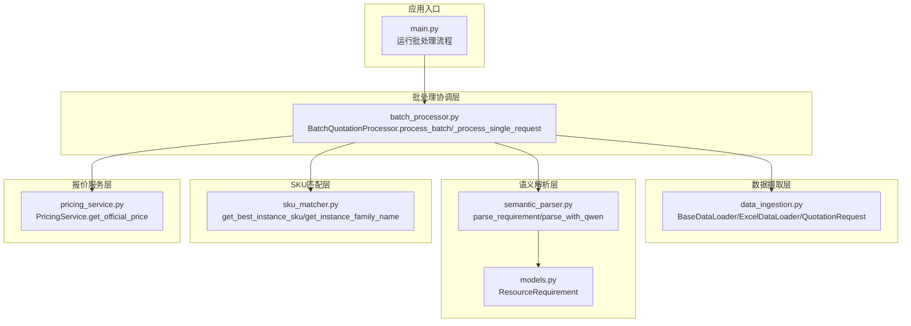
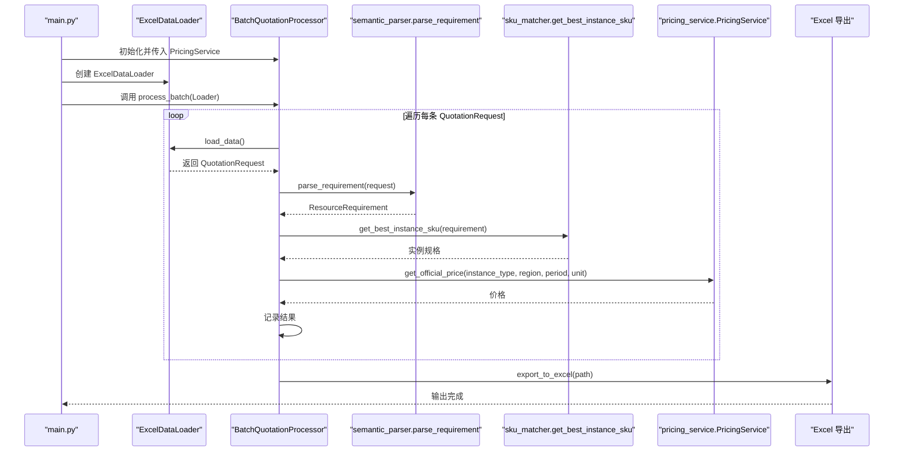
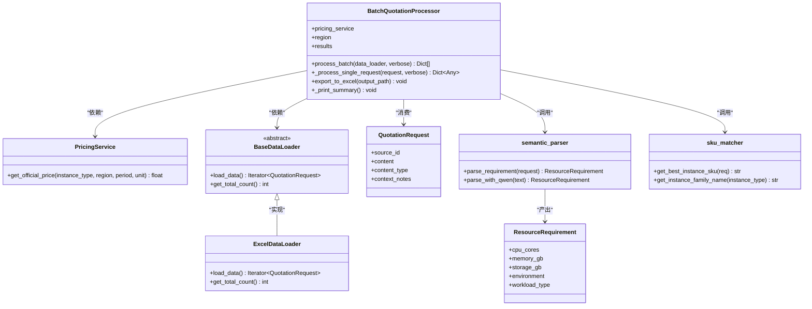
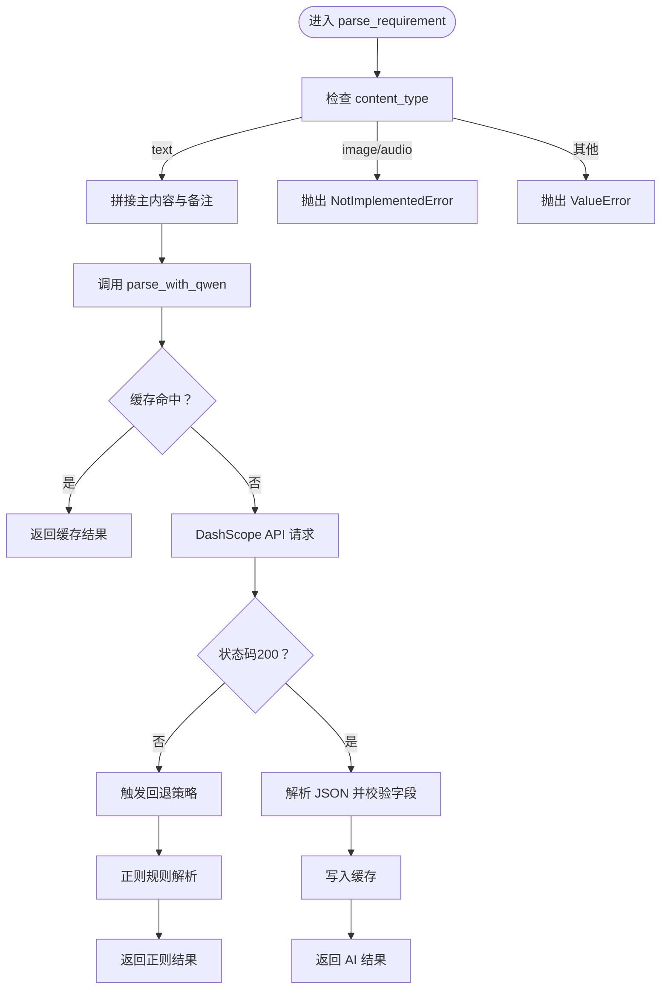
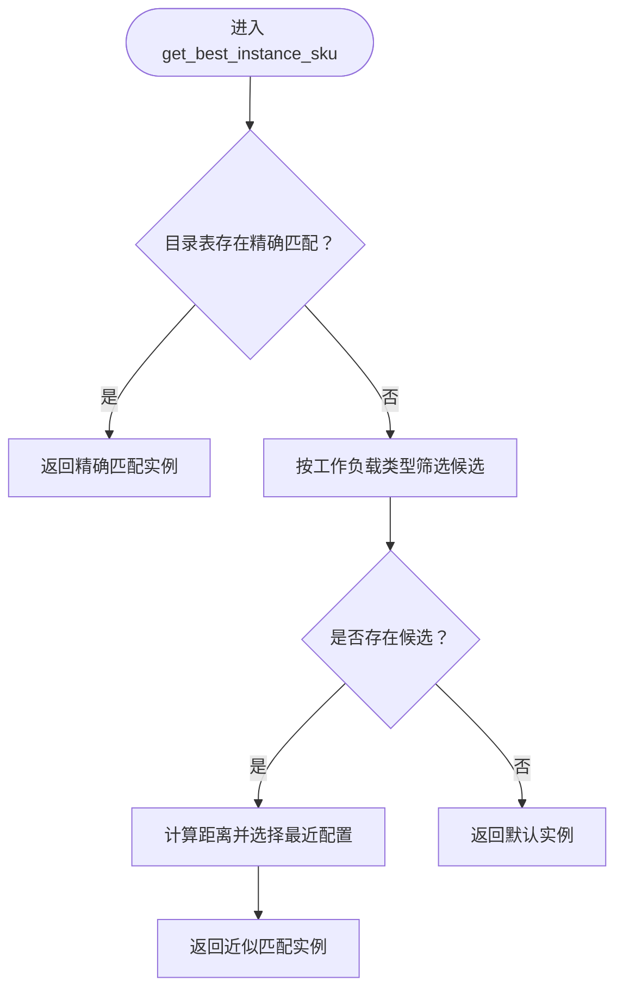
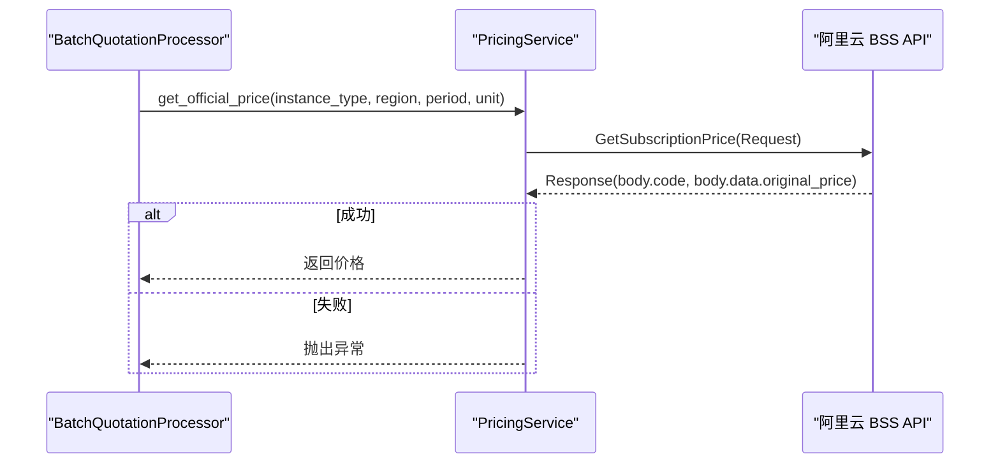
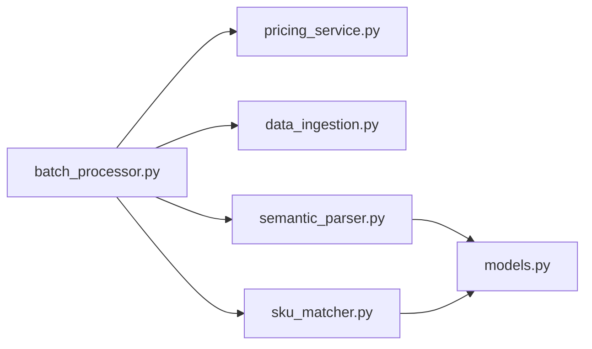

# 批处理模块

<cite>
**本文引用的文件**
- [batch_processor.py](file://batch_processor.py)
- [pricing_service.py](file://pricing_service.py)
- [data_ingestion.py](file://data_ingestion.py)
- [semantic_parser.py](file://semantic_parser.py)
- [sku_matcher.py](file://sku_matcher.py)
- [models.py](file://models.py)
- [main.py](file://main.py)
- [requirements.txt](file://requirements.txt)
- [tests/create_sample_test_data.py](file://tests/create_sample_test_data.py)
</cite>

## 目录
1. [简介](#简介)
2. [项目结构](#项目结构)
3. [核心组件](#核心组件)
4. [架构总览](#架构总览)
5. [详细组件分析](#详细组件分析)
6. [依赖关系分析](#依赖关系分析)
7. [性能考量](#性能考量)
8. [故障排查指南](#故障排查指南)
9. [结论](#结论)
10. [附录](#附录)

## 简介
本文件围绕“批处理模块”展开，系统性解析其作为系统协调中枢的设计与实现。重点包括：
- BatchQuotationProcessor 如何通过依赖注入接收 PricingService 和 BaseDataLoader 实例，实现组件解耦；
- process_batch 方法的三阶段处理流程：解析（Parse）、匹配（Match）、报价（Quote）的责任链执行机制；
- 如何利用抽象接口支持多数据源输入而不修改核心逻辑，体现开闭原则；
- 提供完整的调用时序图，展示从数据加载到结果导出的全流程；
- 讨论批量处理的性能瓶颈（如 AI 和 API 调用延迟）及并行化优化潜力。

## 项目结构
该仓库采用“分层+抽象”的组织方式，核心由以下层次构成：
- 数据摄取层：定义统一的 QuotationRequest 抽象与 BaseDataLoader 接口，当前实现 ExcelDataLoader；预留 ImageDirLoader 等扩展点。
- 语义解析层：基于 DashScope 的 Qwen-Max 实现自然语言到 ResourceRequirement 的解析，并提供缓存与回退策略。
- SKU 匹配层：根据 ResourceRequirement 与业务目录映射，选择最优实例规格并提供友好名称。
- 报价服务层：封装阿里云 BSS OpenAPI，提供官方价格查询能力。
- 批处理协调层：BatchQuotationProcessor 串联上述组件，形成格式无关的批量处理流水线。
- 应用入口：main.py 负责初始化各组件并驱动批处理流程，最终导出 Excel 结果。

图表来源
- [main.py](file://main.py#L1-L100)
- [data_ingestion.py](file://data_ingestion.py#L1-L204)
- [semantic_parser.py](file://semantic_parser.py#L1-L349)
- [models.py](file://models.py#L1-L54)
- [sku_matcher.py](file://sku_matcher.py#L1-L134)
- [pricing_service.py](file://pricing_service.py#L1-L81)
- [batch_processor.py](file://batch_processor.py#L1-L244)

章节来源
- [main.py](file://main.py#L1-L100)
- [data_ingestion.py](file://data_ingestion.py#L1-L204)
- [semantic_parser.py](file://semantic_parser.py#L1-L349)
- [sku_matcher.py](file://sku_matcher.py#L1-L134)
- [pricing_service.py](file://pricing_service.py#L1-L81)
- [batch_processor.py](file://batch_processor.py#L1-L244)
- [models.py](file://models.py#L1-L54)

## 核心组件
- BatchQuotationProcessor：负责批量调度与责任链执行，内部持有 PricingService 与 region，对外暴露 process_batch 与 export_to_excel。
- PricingService：封装阿里云 BSS OpenAPI，提供按实例规格查询官方价格的能力。
- BaseDataLoader/ExcelDataLoader：抽象数据源接口与 Excel 实现，统一产出 QuotationRequest 流。
- semantic_parser.parse_requirement/parse_with_qwen：将非结构化文本解析为 ResourceRequirement，内置缓存与回退策略。
- sku_matcher.get_best_instance_sku/get_instance_family_name：将 ResourceRequirement 映射为实例规格与友好名称。
- models.ResourceRequirement：标准化资源需求模型，确保跨数据源的一致性。

章节来源
- [batch_processor.py](file://batch_processor.py#L18-L244)
- [pricing_service.py](file://pricing_service.py#L1-L81)
- [data_ingestion.py](file://data_ingestion.py#L1-L204)
- [semantic_parser.py](file://semantic_parser.py#L1-L349)
- [sku_matcher.py](file://sku_matcher.py#L1-L134)
- [models.py](file://models.py#L1-L54)

## 架构总览
批处理模块以“依赖注入 + 抽象接口 + 责任链”的方式构建，强调“对扩展开放、对修改关闭”。整体流程如下：
- 数据加载：通过 BaseDataLoader 抽象，当前使用 ExcelDataLoader 读取规格与备注，产出 QuotationRequest 流。
- 语义解析：parse_requirement 调用 parse_with_qwen，将文本解析为 ResourceRequirement；若 AI 不可用则回退至正则规则。
- SKU 匹配：get_best_instance_sku 基于工作负载类型与 CPU/内存进行精确或近似匹配，兜底为默认实例。
- 报价查询：PricingService 调用阿里云 BSS API 获取官方价格。
- 结果汇总与导出：BatchQuotationProcessor 统计成功/失败数量、总成本与年度估算，并导出 Excel。

图表来源
- [main.py](file://main.py#L51-L90)
- [batch_processor.py](file://batch_processor.py#L42-L165)
- [semantic_parser.py](file://semantic_parser.py#L25-L69)
- [sku_matcher.py](file://sku_matcher.py#L45-L103)
- [pricing_service.py](file://pricing_service.py#L28-L81)
- [data_ingestion.py](file://data_ingestion.py#L111-L147)

## 详细组件分析

### BatchQuotationProcessor 类分析
- 依赖注入与解耦
  - 通过构造函数接收 PricingService 实例，避免在类内硬编码 API 客户端创建细节，便于替换与测试。
  - 通过 process_batch 接收 BaseDataLoader 抽象，使数据源可插拔，新增图像/语音输入仅需实现新 Loader。
- 三阶段责任链
  - 解析（Parse）：调用 semantic_parser.parse_requirement，产出 ResourceRequirement。
  - 匹配（Match）：调用 sku_matcher.get_best_instance_sku，得到实例规格与友好名称。
  - 报价（Quote）：调用 PricingService.get_official_price，获取官方价格。
- 错误处理
  - 对 NotImplementedError（多模态特性未实现）、TeaException（API 错误）与通用异常分别捕获并记录，保证批处理稳健性。
- 结果导出
  - export_to_excel 将处理结果写入 Excel，包含原始内容、规格摘要、SKU、价格与状态等字段。

图表来源
- [batch_processor.py](file://batch_processor.py#L18-L244)
- [pricing_service.py](file://pricing_service.py#L1-L81)
- [data_ingestion.py](file://data_ingestion.py#L1-L204)
- [semantic_parser.py](file://semantic_parser.py#L1-L349)
- [sku_matcher.py](file://sku_matcher.py#L1-L134)
- [models.py](file://models.py#L1-L54)

章节来源
- [batch_processor.py](file://batch_processor.py#L18-L244)

### 语义解析流程（Parse）
- 输入：任意内容类型的 QuotationRequest（当前文本为主，图像/音频为扩展点）。
- 步骤：
  - 文本类型：合并主内容与上下文备注，调用 parse_with_qwen。
  - AI 解析：通过 DashScope API 调用 qwen-max，提取 CPU、内存、工作负载类型，并进行 JSON 结构化输出校验与缓存。
  - 回退策略：若 AI 失败或不可用，则使用正则规则提取 CPU、内存、存储与工作负载类型。
- 输出：ResourceRequirement 标准化对象，供后续匹配与报价使用。

图表来源
- [semantic_parser.py](file://semantic_parser.py#L25-L218)

章节来源
- [semantic_parser.py](file://semantic_parser.py#L25-L218)
- [models.py](file://models.py#L1-L54)

### SKU 匹配流程（Match）
- 输入：ResourceRequirement（含工作负载类型、CPU、内存）。
- 步骤：
  - 精确匹配：以 (workload_type, cpu_cores, memory_gb) 为键在目录表中查找。
  - 近似匹配：若无精确匹配，按相同工作负载类型筛选候选，计算与目标配置的加权距离，返回最近者。
  - 兜底策略：若仍无匹配，返回默认通用型实例。
- 输出：实例规格字符串与友好名称。

图表来源
- [sku_matcher.py](file://sku_matcher.py#L45-L103)

章节来源
- [sku_matcher.py](file://sku_matcher.py#L1-L134)
- [models.py](file://models.py#L1-L54)

### 报价查询流程（Quote）
- 输入：实例规格、区域、购买时长与单位。
- 步骤：
  - 构造阿里云 BSS OpenAPI 请求，设置产品代码、订单类型、模块配置等。
  - 发起请求并解析响应，提取官方原价。
  - 若响应非成功或缺少价格数据，抛出异常交由上层处理。
- 输出：官方价格（CNY/月）。

图表来源
- [pricing_service.py](file://pricing_service.py#L28-L81)
- [batch_processor.py](file://batch_processor.py#L128-L143)

章节来源
- [pricing_service.py](file://pricing_service.py#L1-L81)
- [batch_processor.py](file://batch_processor.py#L128-L143)

### 数据加载与导出
- 数据加载：ExcelDataLoader 读取 Excel 文件，将每行转换为 QuotationRequest，支持规格列与备注列的校验与清洗。
- 结果导出：BatchQuotationProcessor 将处理结果转换为 DataFrame 并保存为 Excel，包含原始内容、规格摘要、SKU、价格与状态等字段。

章节来源
- [data_ingestion.py](file://data_ingestion.py#L63-L147)
- [batch_processor.py](file://batch_processor.py#L210-L244)
- [tests/create_sample_test_data.py](file://tests/create_sample_test_data.py#L1-L42)

## 依赖关系分析
- 组件耦合与内聚
  - BatchQuotationProcessor 与 PricingService、BaseDataLoader 之间为弱耦合（依赖抽象），内聚于批处理编排职责。
  - semantic_parser 与 models 之间为清晰的数据契约，利于演进。
  - sku_matcher 与 models 的耦合集中在 ResourceRequirement 字段约定，便于替换映射策略。
- 外部依赖
  - 阿里云 BSS OpenAPI 客户端与 DashScope API 为外部集成点，通过 PricingService 与 parse_with_qwen 进行封装。
- 潜在循环依赖
  - 未发现循环依赖；模块边界清晰，接口明确。

图表来源
- [batch_processor.py](file://batch_processor.py#L1-L244)
- [pricing_service.py](file://pricing_service.py#L1-L81)
- [data_ingestion.py](file://data_ingestion.py#L1-L204)
- [semantic_parser.py](file://semantic_parser.py#L1-L349)
- [sku_matcher.py](file://sku_matcher.py#L1-L134)
- [models.py](file://models.py#L1-L54)

章节来源
- [requirements.txt](file://requirements.txt#L1-L9)
- [batch_processor.py](file://batch_processor.py#L1-L244)
- [pricing_service.py](file://pricing_service.py#L1-L81)
- [semantic_parser.py](file://semantic_parser.py#L1-L349)
- [sku_matcher.py](file://sku_matcher.py#L1-L134)
- [data_ingestion.py](file://data_ingestion.py#L1-L204)
- [models.py](file://models.py#L1-L54)

## 性能考量
- 性能瓶颈
  - AI 解析（DashScope API）：网络延迟与模型响应时间可能成为瓶颈，尤其在大规模并发请求时。
  - 报价查询（阿里云 BSS API）：网络往返与服务端处理时间影响整体吞吐。
  - 缓存与回退：已通过内存缓存减少重复调用，回退策略保障稳定性，但仍受外部服务限制。
- 并行化优化潜力
  - 单请求内部：解析与报价查询可考虑异步化（如使用线程池/异步 HTTP 客户端），但需注意 DashScope 与 BSS API 的限流与并发约束。
  - 批处理层面：process_batch 已逐条处理，可引入多进程/多线程池对独立请求并行化，同时配合重试与熔断策略。
  - 缓存策略：扩大缓存范围（如持久化缓存）与更细粒度的键空间，降低重复计算与外部调用次数。
- 其他建议
  - 对 ExcelDataLoader 的 DataFrame 加载可考虑延迟加载与分块读取，减少内存峰值。
  - 导出阶段可并行写入（如多线程写入不同 sheet 或分片写入）。

[本节为通用性能讨论，不直接分析具体文件]

## 故障排查指南
- 环境变量缺失
  - 阿里云访问凭据未配置会导致初始化失败，需在 .env 中设置密钥并在运行前加载。
- 文件路径错误
  - Excel 输入文件不存在会触发 FileNotFoundError，需确认路径与权限。
- API 异常
  - 阿里云 BSS API 返回非成功状态或缺少价格数据会抛出异常，需检查网络、鉴权与参数。
- 多模态特性未实现
  - 当 content_type 为 image/audio 时会抛出 NotImplementedError，需等待后续集成。
- 导出失败
  - 在未执行批处理前调用 export_to_excel 会报错，需先运行 process_batch。

章节来源
- [main.py](file://main.py#L80-L90)
- [batch_processor.py](file://batch_processor.py#L144-L165)
- [pricing_service.py](file://pricing_service.py#L65-L81)
- [semantic_parser.py](file://semantic_parser.py#L43-L69)
- [data_ingestion.py](file://data_ingestion.py#L87-L108)

## 结论
批处理模块通过“依赖注入 + 抽象接口 + 责任链”的设计，实现了数据源无关与核心逻辑稳定的双重要求。其三阶段处理流程清晰、错误处理完备，并提供了良好的扩展点（如新增数据源 Loader、更新实例目录）。结合缓存与回退策略，系统在复杂多变的输入环境下具备较高鲁棒性。未来可在并发与缓存策略上进一步优化，以提升整体吞吐与稳定性。

[本节为总结性内容，不直接分析具体文件]

## 附录
- 快速运行
  - 准备 .env 文件，设置阿里云访问凭据。
  - 使用示例脚本生成测试 Excel 文件。
  - 运行 main.py 启动批处理，完成后在 tests/output 目录查看导出结果。
- 相关文件
  - requirements.txt 列出了项目依赖，确保安装对应库以支持 API 调用与数据处理。

章节来源
- [tests/create_sample_test_data.py](file://tests/create_sample_test_data.py#L1-L42)
- [main.py](file://main.py#L1-L100)
- [requirements.txt](file://requirements.txt#L1-L9)