# 数据摄入模块

<cite>
**本文引用的文件**
- [data_ingestion.py](file://data_ingestion.py)
- [batch_processor.py](file://batch_processor.py)
- [main.py](file://main.py)
- [semantic_parser.py](file://semantic_parser.py)
- [sku_matcher.py](file://sku_matcher.py)
- [pricing_service.py](file://pricing_service.py)
- [models.py](file://models.py)
- [requirements.txt](file://requirements.txt)
- [tests/create_sample_test_data.py](file://tests/create_sample_test_data.py)
</cite>

## 目录
1. [简介](#简介)
2. [项目结构](#项目结构)
3. [核心组件](#核心组件)
4. [架构总览](#架构总览)
5. [详细组件分析](#详细组件分析)
6. [依赖分析](#依赖分析)
7. [性能考虑](#性能考虑)
8. [故障排查指南](#故障排查指南)
9. [结论](#结论)
10. [附录](#附录)

## 简介
本章节聚焦于“数据摄入模块”，系统性阐述其在多模态输入抽象层中的关键作用，包括：
- BaseDataLoader 抽象基类的设计思想与接口契约
- QuotationRequest 数据模型的统一抽象与字段语义
- ExcelDataLoader 的具体实现与数据源无关性的体现
- 与批处理器（BatchQuotationProcessor）的集成关系
- 扩展新数据源（图像、语音）的开发路径
- 常见问题（文件格式错误、编码问题）的处理策略
- 性能优化建议（批量读取、内存管理）

## 项目结构
数据摄入模块位于独立的 data_ingestion.py 文件中，围绕抽象基类 BaseDataLoader 和数据模型 QuotationRequest 构建，向上游的批处理器提供统一的数据流；同时通过 main.py 的运行入口完成端到端的批处理流程。

图表来源
- [data_ingestion.py](file://data_ingestion.py#L1-L204)
- [batch_processor.py](file://batch_processor.py#L1-L244)
- [main.py](file://main.py#L1-L100)
- [semantic_parser.py](file://semantic_parser.py#L1-L349)
- [sku_matcher.py](file://sku_matcher.py#L1-L134)
- [pricing_service.py](file://pricing_service.py#L1-L81)
- [models.py](file://models.py#L1-L54)

章节来源
- [data_ingestion.py](file://data_ingestion.py#L1-L204)
- [batch_processor.py](file://batch_processor.py#L1-L244)
- [main.py](file://main.py#L1-L100)

## 核心组件
- 抽象基类 BaseDataLoader：定义统一接口 load_data 与 get_total_count，确保批处理器与具体数据格式解耦。
- 数据模型 QuotationRequest：标准化上游输入，包含 source_id、content、content_type、context_notes 等字段，保证下游解析、匹配、报价环节无需感知数据来源。
- ExcelDataLoader：BaseDataLoader 的具体实现，负责从 Excel 文件读取规格说明与备注，逐行转换为 QuotationRequest。
- ImageDirLoader（未来扩展）：BaseDataLoader 的另一个实现方向，遍历图片目录并以图片路径作为 content，content_type 为 image，为后续视觉模型集成预留接口。

章节来源
- [data_ingestion.py](file://data_ingestion.py#L13-L204)

## 架构总览
数据摄入模块通过抽象层屏蔽数据源差异，使批处理器仅依赖抽象接口即可工作。下图展示了从 Excel 文件到最终报价结果的端到端流程。

图表来源
- [main.py](file://main.py#L1-L100)
- [data_ingestion.py](file://data_ingestion.py#L63-L147)
- [batch_processor.py](file://batch_processor.py#L42-L165)
- [semantic_parser.py](file://semantic_parser.py#L25-L69)
- [sku_matcher.py](file://sku_matcher.py#L45-L103)
- [pricing_service.py](file://pricing_service.py#L28-L81)

## 详细组件分析

### BaseDataLoader 抽象基类
- 设计目标：定义统一接口，使批处理器与具体数据格式解耦，便于未来扩展图像、语音等多模态输入。
- 接口契约：
  - load_data(): 迭代产生 QuotationRequest，支持惰性读取与流式处理。
  - get_total_count(): 提供总记录数，用于进度显示与统计。
- 价值：通过抽象层隔离数据源细节，批处理器无需感知具体实现，零代码变更即可接入新数据源。

章节来源
- [data_ingestion.py](file://data_ingestion.py#L32-L61)

### QuotationRequest 数据模型
- 字段语义：
  - source_id：数据来源标识（如 Excel 行号或图片文件名），便于溯源与定位。
  - content：主要内容（文本、图片路径、音频路径等），由具体 Loader 填充。
  - content_type：内容类型枚举（text/image/audio），驱动下游解析策略。
  - context_notes：补充备注信息，可携带环境、用途等上下文。
- 统一抽象：无论输入来自 Excel、图片、语音，均转换为该统一结构，确保下游组件（解析、匹配、报价）无需感知数据来源。

章节来源
- [data_ingestion.py](file://data_ingestion.py#L13-L31)

### ExcelDataLoader 具体实现
- 职责：
  - 读取 Excel 文件，校验必需列（规格说明列），可选列（备注列）。
  - 将每行数据转换为 QuotationRequest，跳过空行，保留备注。
  - 提供 get_total_count() 以统计有效行数。
- 关键点：
  - 延迟加载 DataFrame，避免重复 IO。
  - 列名校验与缺失列警告，增强健壮性。
  - 逐行迭代输出，支持大数据集的流式处理。

图表来源
- [data_ingestion.py](file://data_ingestion.py#L63-L147)

章节来源
- [data_ingestion.py](file://data_ingestion.py#L63-L147)

### 批处理器集成关系
- BatchQuotationProcessor 通过依赖注入接收任意 BaseDataLoader 实现，内部以统一流程处理每个 QuotationRequest：
  - 语义解析：parse_requirement(request) -> ResourceRequirement
  - 实例匹配：get_best_instance_sku(requirement) -> 实例SKU
  - 官方报价：PricingService.get_official_price(...) -> 价格
- 该流程与数据源解耦，新增 Loader 无需修改批处理器。

图表来源
- [data_ingestion.py](file://data_ingestion.py#L32-L204)
- [batch_processor.py](file://batch_processor.py#L18-L210)

章节来源
- [batch_processor.py](file://batch_processor.py#L42-L165)
- [data_ingestion.py](file://data_ingestion.py#L32-L204)

### 扩展新数据源（图像、语音）的开发路径
- 新增 Loader 步骤：
  - 继承 BaseDataLoader，实现 load_data() 与 get_total_count()。
  - 在 load_data() 中扫描数据源（如图片目录、语音文件），将内容封装为 QuotationRequest（content_type 选择 image 或 audio）。
  - 在下游组件中根据 content_type 分支处理：文本走 AI 解析，图像/语音预留占位（当前抛出 NotImplementedError，未来接入视觉/语音模型）。
- 优势：批处理器无需改动，零侵入接入新数据源。

章节来源
- [data_ingestion.py](file://data_ingestion.py#L153-L204)
- [semantic_parser.py](file://semantic_parser.py#L43-L69)

### 代码示例：从 Excel 文件加载报价请求并转换为统一格式
以下示例展示如何使用 ExcelDataLoader 从 Excel 文件加载规格说明，并将其转换为 QuotationRequest 格式，以便后续统一处理。

- 示例路径参考：
  - 初始化 ExcelDataLoader 并获取总记录数：[main.py](file://main.py#L55-L60)
  - 通过 load_data() 迭代 QuotationRequest：[data_ingestion.py](file://data_ingestion.py#L111-L139)
  - 批处理器消费 QuotationRequest 并执行解析/匹配/报价：[batch_processor.py](file://batch_processor.py#L66-L165)

章节来源
- [main.py](file://main.py#L55-L60)
- [data_ingestion.py](file://data_ingestion.py#L111-L139)
- [batch_processor.py](file://batch_processor.py#L66-L165)

## 依赖分析
- 组件耦合与内聚：
  - data_ingestion 与 batch_processor 通过抽象接口耦合，内聚于数据摄入与批处理职责。
  - semantic_parser、sku_matcher、pricing_service 与 data_ingestion 无直接耦合，通过 QuotationRequest/ResourceRequirement 间接协作。
- 外部依赖：
  - pandas/openpyxl：Excel 读写
  - alibabacloud_bssopenapi20171214、alibabacloud_tea_openapi：阿里云 BSS API
  - pydantic：ResourceRequirement 模型校验
  - requests：DashScope API 调用

```mermaid
graph TB
DI["data_ingestion.py"] --> BP["batch_processor.py"]
BP --> SP["semantic_parser.py"]
BP --> SM["sku_matcher.py"]
BP --> PS["pricing_service.py"]
SP --> M["models.py"]
M --> SM
DI --> |pandas/openpyxl| EX["Excel文件IO"]
PS --> |aliyun sdk| API["阿里云BSS API"]
SP --> |requests| DS["DashScope API"]
```

图表来源
- [data_ingestion.py](file://data_ingestion.py#L1-L204)
- [batch_processor.py](file://batch_processor.py#L1-L244)
- [semantic_parser.py](file://semantic_parser.py#L1-L349)
- [sku_matcher.py](file://sku_matcher.py#L1-L134)
- [pricing_service.py](file://pricing_service.py#L1-L81)
- [models.py](file://models.py#L1-L54)
- [requirements.txt](file://requirements.txt#L1-L9)

章节来源
- [requirements.txt](file://requirements.txt#L1-L9)

## 性能考虑
- 流式处理与惰性加载
  - ExcelDataLoader 延迟加载 DataFrame，避免一次性占用内存；load_data() 逐行迭代，适合大文件。
  - 批处理器 process_batch() 逐条处理请求，减少中间状态堆积。
- 批量导出
  - 批处理器在最后阶段统一导出 Excel，避免频繁 IO。
- 缓存与重试
  - 语义解析模块内置 LLM 结果缓存，降低重复请求开销。
- 资源限制
  - 对于超大 Excel 文件，建议分片读取或分页处理，避免内存峰值过高。

章节来源
- [data_ingestion.py](file://data_ingestion.py#L91-L110)
- [batch_processor.py](file://batch_processor.py#L209-L244)
- [semantic_parser.py](file://semantic_parser.py#L21-L33)

## 故障排查指南
- 文件格式错误
  - 现象：Excel 文件无法读取或列名不匹配。
  - 处理：确认文件存在且具备必需列；若缺少备注列会自动补空值；检查列名大小写与编码。
  - 参考路径：[data_ingestion.py](file://data_ingestion.py#L87-L108)
- 编码问题
  - 现象：中文乱码或读取异常。
  - 处理：确保 Excel 使用 UTF-8 编码保存；pandas 默认读取通常兼容；必要时显式指定引擎与参数。
  - 参考路径：[tests/create_sample_test_data.py](file://tests/create_sample_test_data.py#L33-L39)
- API 错误
  - 现象：阿里云 BSS API 返回失败或无价格数据。
  - 处理：检查凭证配置、区域设置与网络连通；批处理器捕获 TeaException 并输出RequestId。
  - 参考路径：[pricing_service.py](file://pricing_service.py#L66-L81)，[batch_processor.py](file://batch_processor.py#L144-L163)
- 多模态未实现
  - 现象：content_type 为 image/audio 时抛出 NotImplementedError。
  - 处理：按扩展路径实现对应 Loader，并在语义解析处接入视觉/语音模型。
  - 参考路径：[semantic_parser.py](file://semantic_parser.py#L43-L69)，[data_ingestion.py](file://data_ingestion.py#L153-L204)

章节来源
- [data_ingestion.py](file://data_ingestion.py#L87-L108)
- [tests/create_sample_test_data.py](file://tests/create_sample_test_data.py#L33-L39)
- [pricing_service.py](file://pricing_service.py#L66-L81)
- [batch_processor.py](file://batch_processor.py#L144-L163)
- [semantic_parser.py](file://semantic_parser.py#L43-L69)

## 结论
数据摄入模块通过 BaseDataLoader 抽象与 QuotationRequest 统一模型，成功实现了数据源无关性，使批处理器能够以零代码变更的方式接入多种输入格式。ExcelDataLoader 已完整覆盖典型场景，而 ImageDirLoader 等扩展为未来多模态能力预留了清晰路径。配合批处理器的稳健错误处理与导出机制，整体系统具备良好的可维护性与可扩展性。

## 附录
- 运行入口与示例数据
  - 运行入口：main.py 展示了从初始化 Loader、PricingService 到导出 Excel 的完整流程。
  - 示例数据：tests/create_sample_test_data.py 可生成符合规范的 Excel 输入样例。
- 相关组件
  - 语义解析：semantic_parser.py 将 QuotationRequest 转换为 ResourceRequirement。
  - 实例匹配：sku_matcher.py 基于 catalog 进行 SKU 匹配。
  - 官方报价：pricing_service.py 调用阿里云 BSS API 获取价格。

章节来源
- [main.py](file://main.py#L1-L100)
- [tests/create_sample_test_data.py](file://tests/create_sample_test_data.py#L1-L42)
- [semantic_parser.py](file://semantic_parser.py#L25-L69)
- [sku_matcher.py](file://sku_matcher.py#L1-L134)
- [pricing_service.py](file://pricing_service.py#L1-L81)