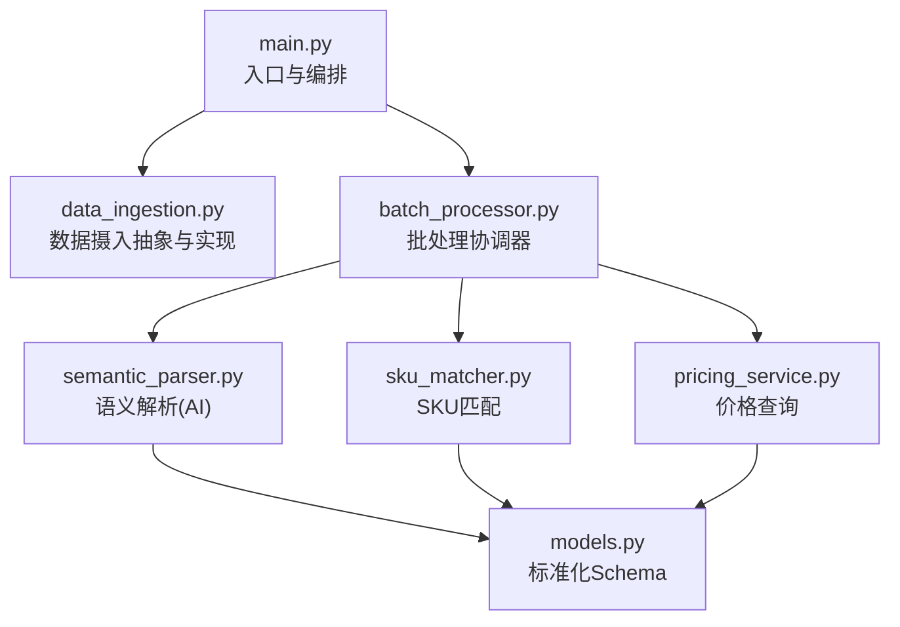
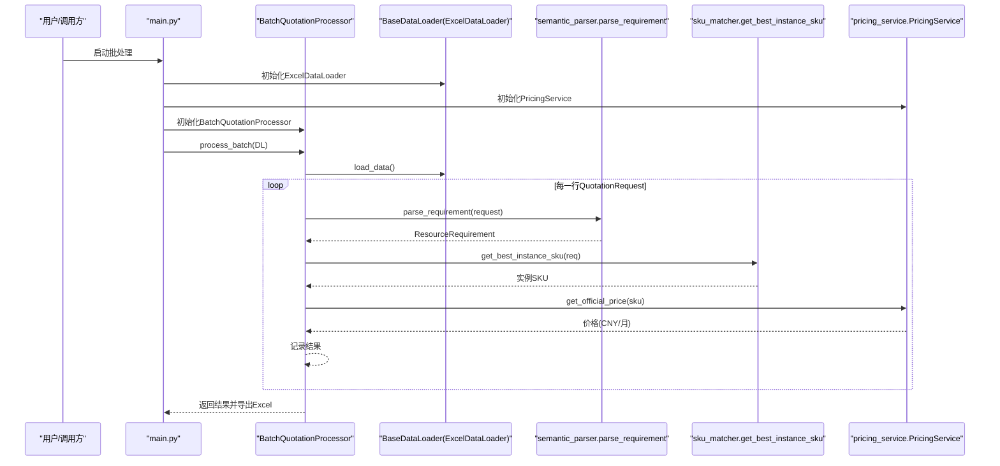
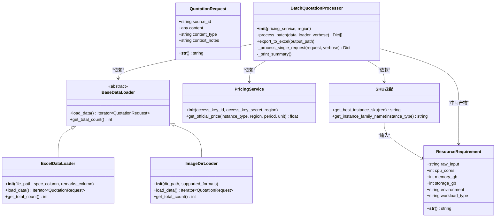
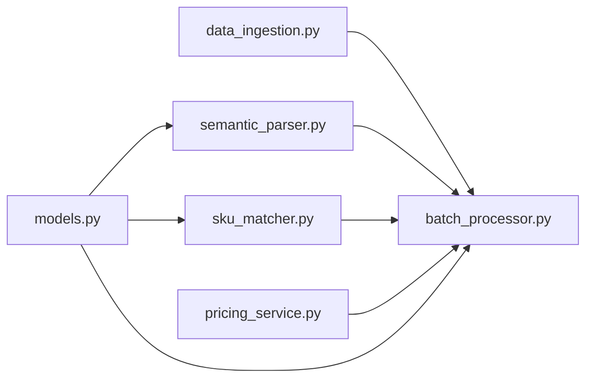

# 核心模块

<cite>
**本文引用的文件**
- [main.py](file://main.py)
- [data_ingestion.py](file://data_ingestion.py)
- [semantic_parser.py](file://semantic_parser.py)
- [sku_matcher.py](file://sku_matcher.py)
- [pricing_service.py](file://pricing_service.py)
- [batch_processor.py](file://batch_processor.py)
- [models.py](file://models.py)
- [requirements.txt](file://requirements.txt)
- [tests/README.md](file://tests/README.md)
</cite>

## 目录
1. [简介](#简介)
2. [项目结构](#项目结构)
3. [核心组件](#核心组件)
4. [架构总览](#架构总览)
5. [详细组件分析](#详细组件分析)
6. [依赖关系分析](#依赖关系分析)
7. [性能考虑](#性能考虑)
8. [故障排查指南](#故障排查指南)
9. [结论](#结论)
10. [附录](#附录)

## 简介
本文件围绕报价管道系统的核心功能模块展开，重点阐述数据摄入、语义解析、SKU匹配、价格查询与批处理五大模块的公共接口、内部逻辑、模块间依赖关系及配置要点。文档以实际代码为依据，结合流程图与类图，帮助初学者快速上手，同时为高级开发者提供深入的技术洞察与优化建议。

## 项目结构
系统采用“抽象层+流水线”的分层设计：
- 抽象层：数据摄入（BaseDataLoader）与统一数据结构（QuotationRequest/ResourceRequirement）
- 处理层：语义解析（AI）、SKU匹配、价格查询
- 协调层：批处理协调器（BatchQuotationProcessor），负责串联各模块并导出结果
- 入口：main.py 作为命令行入口，加载凭证、初始化组件并执行批处理

图表来源
- [main.py](file://main.py#L1-L100)
- [data_ingestion.py](file://data_ingestion.py#L1-L204)
- [batch_processor.py](file://batch_processor.py#L1-L244)
- [semantic_parser.py](file://semantic_parser.py#L1-L349)
- [sku_matcher.py](file://sku_matcher.py#L1-L134)
- [pricing_service.py](file://pricing_service.py#L1-L81)
- [models.py](file://models.py#L1-L54)

章节来源
- [main.py](file://main.py#L1-L100)
- [requirements.txt](file://requirements.txt#L1-L9)

## 核心组件
- 数据摄入层：定义统一的数据请求对象与抽象加载器接口，当前实现为Excel加载器，支持扩展图片/语音等多模态输入。
- 语义解析层：基于DashScope Qwen-Max的AI解析，将非结构化文本转化为标准化资源需求对象；内置缓存与回退规则。
- SKU匹配层：根据工作负载类型与资源规格在实例目录中查找最优实例，支持精确匹配、近似匹配与兜底策略。
- 价格查询层：通过阿里云BSS OpenAPI查询实例的官方价格，支持默认地区与计费周期设置。
- 批处理协调器：串联上述模块，统一处理流程、错误捕获与结果汇总导出。

章节来源
- [data_ingestion.py](file://data_ingestion.py#L1-L204)
- [semantic_parser.py](file://semantic_parser.py#L1-L349)
- [sku_matcher.py](file://sku_matcher.py#L1-L134)
- [pricing_service.py](file://pricing_service.py#L1-L81)
- [batch_processor.py](file://batch_processor.py#L1-L244)
- [models.py](file://models.py#L1-L54)

## 架构总览
整体架构遵循“数据源无关”的设计原则：批处理协调器仅依赖抽象接口，新增数据源无需修改现有逻辑。AI解析与价格查询通过外部服务完成，SKU匹配为纯业务规则，三者组合形成可扩展的报价流水线。

图表来源
- [main.py](file://main.py#L1-L100)
- [batch_processor.py](file://batch_processor.py#L1-L244)
- [data_ingestion.py](file://data_ingestion.py#L1-L204)
- [semantic_parser.py](file://semantic_parser.py#L1-L349)
- [sku_matcher.py](file://sku_matcher.py#L1-L134)
- [pricing_service.py](file://pricing_service.py#L1-L81)

## 详细组件分析

### 数据摄入模块（Data Ingestion）
- 公共接口
  - 抽象基类 BaseDataLoader：定义 load_data() 与 get_total_count() 接口，保证批处理与数据格式解耦。
  - 数据结构 QuotationRequest：统一承载 source_id、content、content_type、context_notes 字段。
- 内部逻辑
  - ExcelDataLoader：读取Excel，校验列名，逐行构造 QuotationRequest；支持规格列与备注列的可选配置。
  - ImageDirLoader：预留图片目录扫描能力，未来用于图像输入。
- 与其他模块的依赖
  - 批处理协调器通过 BaseDataLoader 抽象消费数据，不关心具体实现。
- 配置选项
  - ExcelDataLoader 的 spec_column 与 remarks_column 可按需调整。
  - ImageDirLoader 的 supported_formats 可扩展支持的图片格式集合。
- 常见问题
  - 缺失必需列：会在加载阶段抛出异常，需确认列名与Excel格式。
  - 空行过滤：空规格会被跳过，避免无效请求进入后续流程。
- 性能建议
  - 对于超大Excel，建议分片处理或限制并发读取；当前实现为惰性加载DataFrame，注意内存占用。

章节来源
- [data_ingestion.py](file://data_ingestion.py#L1-L204)
- [batch_processor.py](file://batch_processor.py#L1-L244)

### 语义解析模块（Semantic Parser）
- 公共接口
  - parse_requirement(request: QuotationRequest) -> ResourceRequirement：多模态入口，当前支持 text 类型，未来扩展 image/audio。
  - parse_with_qwen(text: str) -> ResourceRequirement：直接调用DashScope Qwen-Max进行解析。
- 内部逻辑
  - 缓存机制：对相同输入文本进行内存缓存，降低Token消耗与延迟。
  - AI解析：构造system/user提示词，调用DashScope API，解析JSON响应并归一化字段。
  - 回退策略：AI失败时退回正则规则解析，保障稳定性。
  - 正则提取：CPU、内存、存储、工作负载类型的关键词识别。
- 与其他模块的依赖
  - 输入依赖 QuotationRequest；输出 ResourceRequirement 供SKU匹配与价格查询使用。
- 配置选项
  - DASHSCOPE_API_URL：DashScope兼容模式API地址。
  - DASHSCOPE_API_KEY：通过环境变量注入，需在运行前加载 .env。
- 常见问题
  - API密钥未配置：会抛出异常，需检查 .env 文件与加载顺序。
  - AI响应格式异常：内置正则抽取JSON，若无法解析则触发回退。
- 性能建议
  - 合理利用缓存，避免重复解析相同文本。
  - 控制提示词长度与复杂度，减少Token消耗。

章节来源
- [semantic_parser.py](file://semantic_parser.py#L1-L349)
- [models.py](file://models.py#L1-L54)

### SKU匹配模块（SKU Matcher）
- 公共接口
  - get_best_instance_sku(req: ResourceRequirement) -> str：返回最佳实例SKU。
  - get_instance_family_name(instance_type: str) -> str：返回实例族友好名称。
- 内部逻辑
  - 精确匹配：按 (workload_type, cpu_cores, memory_gb) 查找实例目录。
  - 近似匹配：在同一工作负载类型内寻找最接近的配置。
  - 兜底策略：无匹配时返回默认通用型实例。
- 与其他模块的依赖
  - 输入 ResourceRequirement；输出实例SKU供价格查询。
- 配置选项
  - INSTANCE_CATALOG：实例目录字典，键为三元组，值为实例类型ID。
  - DEFAULT_INSTANCE：默认实例类型ID。
- 常见问题
  - 新规格未覆盖：建议扩展 INSTANCE_CATALOG 并保持键的规范性。
  - 实例族名称映射缺失：可扩展 family_map 以提升可读性。
- 性能建议
  - 保持 INSTANCE_CATALOG 的键有序或使用索引优化查询（当前为字典查找，时间复杂度O(1)）。

章节来源
- [sku_matcher.py](file://sku_matcher.py#L1-L134)
- [models.py](file://models.py#L1-L54)

### 价格查询模块（Pricing Service）
- 公共接口
  - PricingService.get_official_price(instance_type: str, region: str = "cn-beijing", period: int = 1, unit: str = "Month") -> float：查询官方价格。
- 内部逻辑
  - 使用阿里云BSS OpenAPI的 GetSubscriptionPrice 请求构建参数，解析响应中的 OriginalPrice。
  - 默认地区与计费周期在接口签名中标准化，简化调用。
- 与其他模块的依赖
  - 输入实例SKU；输出价格（CNY/月）供批处理汇总统计。
- 配置选项
  - ACCESS_KEY_ID/ACCESS_KEY_SECRET：通过环境变量注入。
  - 默认 region: "cn-beijing"，默认 unit: "Month"。
- 常见问题
  - API返回非Success：会抛出异常，需检查参数与账户权限。
  - 价格数据缺失：响应结构不符合预期时抛出异常。
- 性能建议
  - 合理控制并发与重试策略，避免API限流。
  - 对频繁查询的SKU进行本地缓存（可在上层实现）。

章节来源
- [pricing_service.py](file://pricing_service.py#L1-L81)

### 批处理模块（Batch Processor）
- 公共接口
  - BatchQuotationProcessor.process_batch(data_loader: BaseDataLoader, verbose: bool = True) -> List[Dict]：批量处理主流程。
  - export_to_excel(output_path: str)：导出结果到Excel。
- 内部逻辑
  - 三步流程：解析 -> 匹配 -> 询价；每一步失败均被捕获并记录错误。
  - 进度与统计：打印处理进度、成功/失败数量与成本汇总。
  - 结果结构：包含原始字段、解析结果、SKU、实例族与价格等。
- 与其他模块的依赖
  - 依赖 BaseDataLoader 抽象；依赖 semantic_parser、sku_matcher、pricing_service。
- 配置选项
  - region：默认 "cn-beijing"。
- 常见问题
  - 多模态特性未实现：image/audio类型会抛出NotImplementedError，需等待后续集成。
  - API错误：TeaException会携带RequestId等上下文信息，便于定位。
- 性能建议
  - 分批处理与异步化（如需）可减少内存峰值与IO阻塞。
  - 导出前进行数据清洗，避免导出超大文件导致内存压力。

章节来源
- [batch_processor.py](file://batch_processor.py#L1-L244)

### 类关系与数据模型

图表来源
- [data_ingestion.py](file://data_ingestion.py#L1-L204)
- [batch_processor.py](file://batch_processor.py#L1-L244)
- [pricing_service.py](file://pricing_service.py#L1-L81)
- [sku_matcher.py](file://sku_matcher.py#L1-L134)
- [models.py](file://models.py#L1-L54)

## 依赖关系分析
- 模块耦合
  - 批处理协调器与数据摄入层通过抽象接口耦合，满足开闭原则，新增数据源无需修改批处理逻辑。
  - 语义解析与SKU匹配、价格查询之间为单向依赖，职责清晰。
- 外部依赖
  - DashScope Qwen-Max：用于AI解析，需配置API密钥。
  - 阿里云BSS OpenAPI：用于价格查询，需配置AccessKey。
  - pandas/openpyxl：用于结果导出。
- 循环依赖
  - 未发现循环依赖，模块间为单向调用链。

图表来源
- [data_ingestion.py](file://data_ingestion.py#L1-L204)
- [batch_processor.py](file://batch_processor.py#L1-L244)
- [semantic_parser.py](file://semantic_parser.py#L1-L349)
- [sku_matcher.py](file://sku_matcher.py#L1-L134)
- [pricing_service.py](file://pricing_service.py#L1-L81)
- [models.py](file://models.py#L1-L54)

章节来源
- [requirements.txt](file://requirements.txt#L1-L9)

## 性能考虑
- 缓存与回退
  - 语义解析层内置内存缓存，显著降低重复请求的Token消耗与延迟；AI失败时回退至正则规则，保障稳定性。
- IO与内存
  - ExcelDataLoader惰性加载DataFrame，建议对超大文件分片处理；导出Excel前进行数据清洗，避免超大文件。
- 并发与限流
  - 价格查询建议控制并发与重试策略，避免API限流；必要时在上层实现本地缓存。
- 可扩展性
  - 新增数据源只需实现BaseDataLoader接口；SKU目录可按需扩展，保持键的一致性。

[本节为通用性能建议，不直接分析具体文件]

## 故障排查指南
- 环境变量缺失
  - 现象：提示密钥未配置或为空。
  - 处理：确保 .env 文件存在且包含 ALIBABA_CLOUD_ACCESS_KEY_ID、ALIBABA_CLOUD_ACCESS_KEY_SECRET、DASHSCOPE_API_KEY。
- API调用失败
  - 现象：出现API错误或价格数据缺失。
  - 处理：检查网络连通性、账户配额与参数合法性；批处理中会打印RequestId便于定位。
- Excel文件问题
  - 现象：找不到文件或列名不匹配。
  - 处理：确认文件路径与列名；备注列为可选，规格列为必填。
- 多模态特性未实现
  - 现象：content_type为image/audio时报NotImplementedError。
  - 处理：等待后续集成或使用text类型输入。

章节来源
- [tests/README.md](file://tests/README.md#L1-L276)
- [main.py](file://main.py#L1-L100)
- [batch_processor.py](file://batch_processor.py#L1-L244)
- [semantic_parser.py](file://semantic_parser.py#L1-L349)

## 结论
该报价管道系统通过抽象层与流水线化设计，实现了数据源无关、易于扩展的报价能力。语义解析、SKU匹配与价格查询三大模块职责清晰，配合缓存与回退策略提升了鲁棒性与性能。建议在生产环境中完善多模态输入、增加本地缓存与并发控制，并持续扩展实例目录以覆盖更多场景。

[本节为总结性内容，不直接分析具体文件]

## 附录
- 入口与运行
  - 通过 main.py 启动批处理，自动加载 .env 并初始化各组件，随后导出Excel结果。
- 测试与验证
  - tests/README.md 提供了端到端测试指南，包括环境健康检查、组件连通性测试与真实数据批处理验证。
- 配置清单
  - ALIBABA_CLOUD_ACCESS_KEY_ID、ALIBABA_CLOUD_ACCESS_KEY_SECRET、DASHSCOPE_API_KEY
  - 默认地区：cn-beijing；默认计费周期：Month

章节来源
- [main.py](file://main.py#L1-L100)
- [tests/README.md](file://tests/README.md#L1-L276)