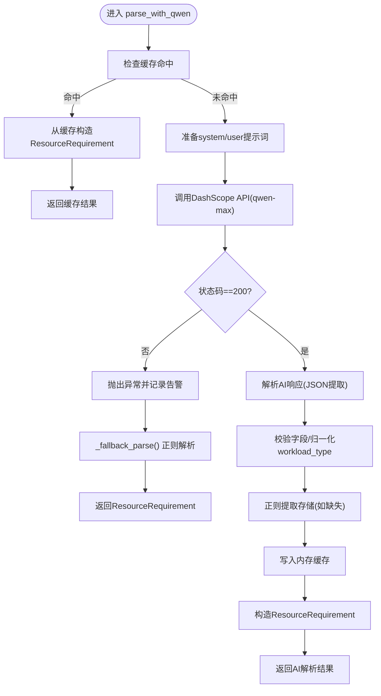

# 语义解析模块

<cite>
**本文引用的文件**
- [semantic_parser.py](file://semantic_parser.py)
- [models.py](file://models.py)
- [batch_processor.py](file://batch_processor.py)
- [data_ingestion.py](file://data_ingestion.py)
- [sku_matcher.py](file://sku_matcher.py)
- [pricing_service.py](file://pricing_service.py)
- [main.py](file://main.py)
</cite>

## 目录
1. [引言](#引言)
2. [项目结构](#项目结构)
3. [核心组件](#核心组件)
4. [架构总览](#架构总览)
5. [详细组件分析](#详细组件分析)
6. [依赖关系分析](#依赖关系分析)
7. [性能考量](#性能考量)
8. [故障排查指南](#故障排查指南)
9. [结论](#结论)
10. [附录](#附录)

## 引言
本节聚焦“语义解析模块”的实现机制，系统性阐述如何利用Qwen-Max AI模型对非结构化文本进行智能解析，并将解析结果标准化为ResourceRequirement对象。文档重点覆盖以下方面：
- _parse_with_ai方法（即parse_with_qwen函数）的实现细节：提示词工程、模型参数配置、响应解析逻辑与缓存策略。
- 工作负载类型识别算法（_identify_workload_type）的关键词匹配策略及其在SKU匹配中的指导作用。
- 实际调用示例：从原始文本到标准化ResourceRequirement的完整转换过程。
- AI解析失败时的回退机制与错误处理策略。
- API调用延迟对整体性能的影响及缓存优化方案。

## 项目结构
语义解析模块位于独立文件中，通过统一的数据结构与标准化Schema与其他模块解耦协作。下图展示了与语义解析相关的核心文件及其交互关系。

图表来源
- [semantic_parser.py](file://semantic_parser.py#L25-L68)
- [semantic_parser.py](file://semantic_parser.py#L71-L218)
- [models.py](file://models.py#L10-L38)
- [sku_matcher.py](file://sku_matcher.py#L45-L103)
- [pricing_service.py](file://pricing_service.py#L28-L80)
- [batch_processor.py](file://batch_processor.py#L42-L164)
- [main.py](file://main.py#L15-L73)

章节来源
- [semantic_parser.py](file://semantic_parser.py#L25-L68)
- [semantic_parser.py](file://semantic_parser.py#L71-L218)
- [models.py](file://models.py#L10-L38)
- [batch_processor.py](file://batch_processor.py#L42-L164)
- [data_ingestion.py](file://data_ingestion.py#L13-L30)
- [sku_matcher.py](file://sku_matcher.py#L45-L103)
- [pricing_service.py](file://pricing_service.py#L28-L80)
- [main.py](file://main.py#L15-L73)

## 核心组件
- 语义解析入口：parse_requirement(request)负责根据content_type分派到不同解析路径；当前仅支持text类型，image/audio为预留扩展点。
- AI解析核心：parse_with_qwen(text)使用DashScope qwen-max模型进行意图理解与字段抽取，包含提示词工程、模型参数、响应解析与缓存。
- 回退解析：_fallback_parse()在AI失败时启用正则规则解析CPU/GPU/存储与工作负载类型。
- 工作负载识别：_identify_workload_type()基于关键词集合判断通用、计算或内存密集型，为SKU匹配提供指导。
- 标准化Schema：ResourceRequirement确保下游组件消费一致的结构化数据。

章节来源
- [semantic_parser.py](file://semantic_parser.py#L25-L68)
- [semantic_parser.py](file://semantic_parser.py#L71-L218)
- [semantic_parser.py](file://semantic_parser.py#L220-L236)
- [semantic_parser.py](file://semantic_parser.py#L322-L349)
- [models.py](file://models.py#L10-L38)

## 架构总览
下图展示了从原始文本到最终报价的端到端流程，突出语义解析阶段的职责与边界。

图表来源
- [semantic_parser.py](file://semantic_parser.py#L25-L68)
- [semantic_parser.py](file://semantic_parser.py#L71-L218)
- [batch_processor.py](file://batch_processor.py#L80-L164)
- [sku_matcher.py](file://sku_matcher.py#L45-L103)
- [pricing_service.py](file://pricing_service.py#L28-L80)

## 详细组件分析

### 语义解析入口：parse_requirement
- 输入：统一的QuotationRequest对象，包含source_id、content、content_type、context_notes。
- 分支逻辑：
  - text：拼接content与context_notes后交由parse_with_qwen处理。
  - image/audio：抛出NotImplemented异常，预留后续多模态集成。
  - 其他类型：抛出ValueError。
- 设计要点：通过content_type实现多模态扩展点，当前版本专注于文本解析。

章节来源
- [semantic_parser.py](file://semantic_parser.py#L25-L68)
- [data_ingestion.py](file://data_ingestion.py#L13-L30)

### AI解析核心：parse_with_qwen
- 提示词工程（system_prompt）：
  - 明确角色定位（阿里云架构师）。
  - 规定提取规则：CPU、内存、工作负载类型三要素；忽略环境阶段。
  - 输出格式约束：严格返回合法JSON，包含cpu、memory、workload_type与简要reasoning。
- 模型参数配置：
  - model：qwen-max。
  - messages：system+user消息。
  - temperature：0.1，降低随机性以提升抽取一致性。
  - timeout：30秒，避免阻塞。
- 响应解析逻辑：
  - 优先从Markdown代码块中提取JSON；若失败则尝试直接匹配JSON片段。
  - 校验必需字段并进行workload_type归一化（memory_intensive→memory_intensive；compute_intensive→compute；general_purpose→general）。
  - 若AI未提供存储信息，则通过正则_fallback_extract_storage进行补充提取。
- 缓存策略：
  - 以原始text为键的内存缓存，命中后直接构造ResourceRequirement并返回，显著减少token消耗与API调用次数。
- 错误处理与回退：
  - 任何异常均记录告警并触发_regex回退解析，保证鲁棒性。

图表来源
- [semantic_parser.py](file://semantic_parser.py#L71-L218)
- [semantic_parser.py](file://semantic_parser.py#L220-L236)

章节来源
- [semantic_parser.py](file://semantic_parser.py#L71-L218)
- [semantic_parser.py](file://semantic_parser.py#L220-L236)

### 回退解析：_fallback_parse 与正则提取
- CPU核心数提取：支持“16C”、“32核”、“8 cores”等常见模式，默认值2。
- 内存提取：支持“64G/64GB”等模式，默认值4。
- 存储提取：支持“1000G存储”、“存储: 500G”等模式，默认值0。
- 工作负载类型识别：基于关键词集合进行分类，通用优先级最高，作为兜底策略。

章节来源
- [semantic_parser.py](file://semantic_parser.py#L220-L236)
- [semantic_parser.py](file://semantic_parser.py#L239-L288)
- [semantic_parser.py](file://semantic_parser.py#L322-L349)

### 工作负载类型识别：_identify_workload_type
- 内存密集型关键词：数据库、缓存、Redis、Memcache、MySQL、Oracle、PostgreSQL、Mongo等。
- 计算密集型关键词：算法、AI、训练、计算、深度学习、machine learning、GPU、科学计算等。
- 通用型关键词：中间件、Web、API、网关、Nginx、Tomcat、应用服务等。
- 归一化策略：将AI输出的memory_intensive、compute_intensive、general_purpose分别映射到memory_intensive、compute、general，确保与SKU Catalog一致。

图表来源
- [semantic_parser.py](file://semantic_parser.py#L322-L349)

章节来源
- [semantic_parser.py](file://semantic_parser.py#L322-L349)

### 从原始文本到标准化ResourceRequirement的调用示例
以下示例展示典型调用链路与关键步骤，帮助读者理解端到端流程。

- 步骤1：ExcelDataLoader将一行规格文本与备注封装为QuotationRequest。
- 步骤2：BatchQuotationProcessor调用parse_requirement(request)，text分支进入parse_with_qwen。
- 步骤3：parse_with_qwen调用DashScope API，AI返回结构化JSON。
- 步骤4：parse_with_qwen解析JSON、归一化工作负载类型、提取存储、写入缓存并构造ResourceRequirement。
- 步骤5：SKU匹配层根据workload_type/cpu_cores/memory_gb选择最佳实例。
- 步骤6：定价层查询官方价格并返回。

章节来源
- [data_ingestion.py](file://data_ingestion.py#L111-L139)
- [batch_processor.py](file://batch_processor.py#L80-L164)
- [semantic_parser.py](file://semantic_parser.py#L71-L218)
- [sku_matcher.py](file://sku_matcher.py#L45-L103)
- [pricing_service.py](file://pricing_service.py#L28-L80)

## 依赖关系分析
- 语义解析模块与数据输入层通过QuotationRequest解耦，支持Excel以外的其他数据源扩展。
- 与SKU匹配层通过ResourceRequirement解耦，工作负载类型归一化确保Catalog匹配稳定性。
- 与定价层通过实例SKU解耦，支持按月计费与区域配置。

图表来源
- [semantic_parser.py](file://semantic_parser.py#L25-L68)
- [semantic_parser.py](file://semantic_parser.py#L71-L218)
- [models.py](file://models.py#L10-L38)
- [sku_matcher.py](file://sku_matcher.py#L45-L103)
- [pricing_service.py](file://pricing_service.py#L28-L80)

章节来源
- [semantic_parser.py](file://semantic_parser.py#L25-L68)
- [semantic_parser.py](file://semantic_parser.py#L71-L218)
- [models.py](file://models.py#L10-L38)
- [sku_matcher.py](file://sku_matcher.py#L45-L103)
- [pricing_service.py](file://pricing_service.py#L28-L80)

## 性能考量
- API调用延迟影响：
  - 单次DashScope调用timeout=30秒，网络抖动可能造成整体批处理延迟上升。
  - 建议在高并发场景下增加重试与超时上限，同时结合缓存降低重复调用。
- 缓存优化：
  - 内存缓存_key为原始text，命中后可避免API调用与JSON解析开销。
  - 对于重复规格（如相同文本多次出现），缓存命中率较高，显著节省token与时间。
- 正则回退成本：
  - 回退解析仅在AI失败时触发，且正则匹配复杂度低，对整体性能影响有限。
- 批处理吞吐：
  - 批处理器按顺序处理请求，建议在外部引入队列/并发控制以进一步提升吞吐。

[本节为一般性性能讨论，不直接分析具体文件，故无章节来源]

## 故障排查指南
- 环境变量缺失：
  - DashScope API Key未配置会导致API调用失败。请在运行前设置DASHSCOPE_API_KEY。
- API错误：
  - 状态码非200或响应体异常会触发异常并记录告警，随后进入回退解析。
- 回退解析触发：
  - 当AI返回非JSON或无法提取JSON时，将自动走_regex路径；若仍无法解析，将使用默认值（CPU=2、内存=4、存储=0）。
- 多模态未实现：
  - content_type为image/audio时会抛出NotImplemented异常，需等待后续集成。

章节来源
- [semantic_parser.py](file://semantic_parser.py#L127-L159)
- [semantic_parser.py](file://semantic_parser.py#L160-L177)
- [semantic_parser.py](file://semantic_parser.py#L214-L218)
- [semantic_parser.py](file://semantic_parser.py#L44-L56)

## 结论
语义解析模块以Qwen-Max为核心，通过精心设计的提示词工程与严格的输出格式约束，将非结构化文本转化为标准化的ResourceRequirement。模块内置缓存与正则回退机制，在保证准确性的同时兼顾性能与鲁棒性。工作负载类型识别算法为SKU匹配提供明确指导，使系统能够稳定地将抽象意图落地为具体的实例规格与价格估算。

[本节为总结性内容，不直接分析具体文件，故无章节来源]

## 附录

### API定义与调用要点
- DashScope API
  - URL：兼容模式chat/completions
  - 方法：POST
  - 请求头：Authorization(Bearer + API Key)、Content-Type: application/json
  - 请求体：model=qwen-max、messages=[{"role":"system","content": "..."}, {"role":"user","content": "..."}]、temperature=0.1
  - 超时：30秒
  - 成功条件：status_code==200
- PricingService
  - 产品编码：ecs
  - 订购类型：Subscription
  - 订单类型：NewOrder
  - 默认计费周期：1个月
  - 默认区域：cn-beijing

章节来源
- [semantic_parser.py](file://semantic_parser.py#L127-L159)
- [pricing_service.py](file://pricing_service.py#L28-L80)