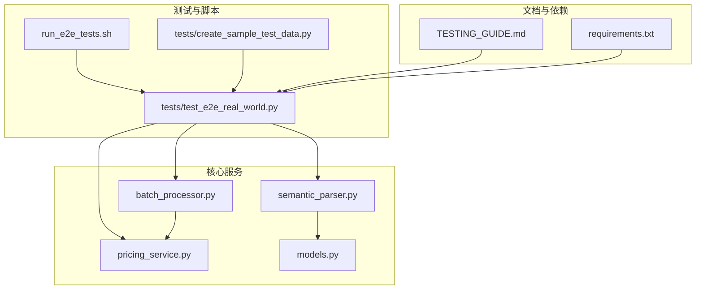
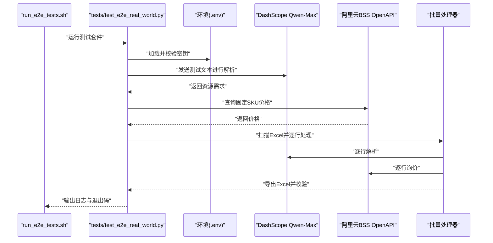
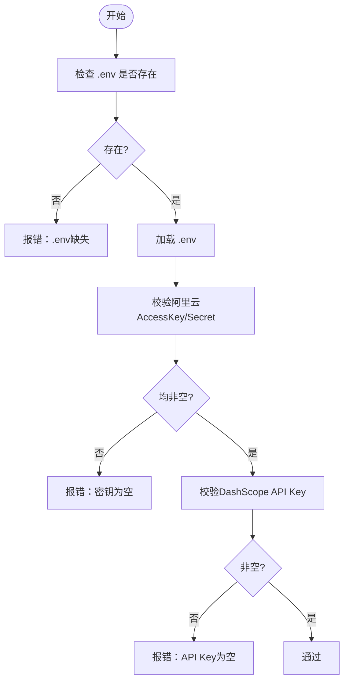
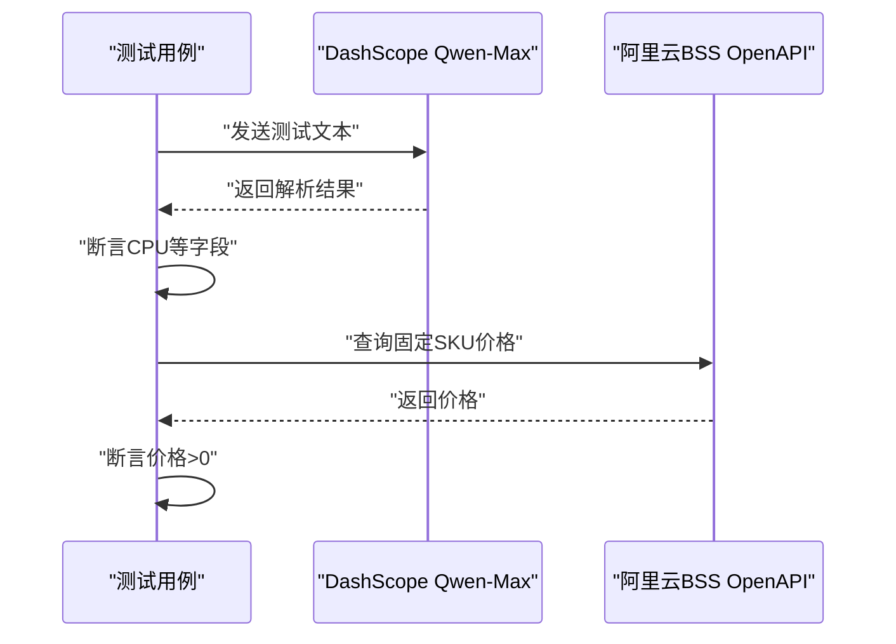
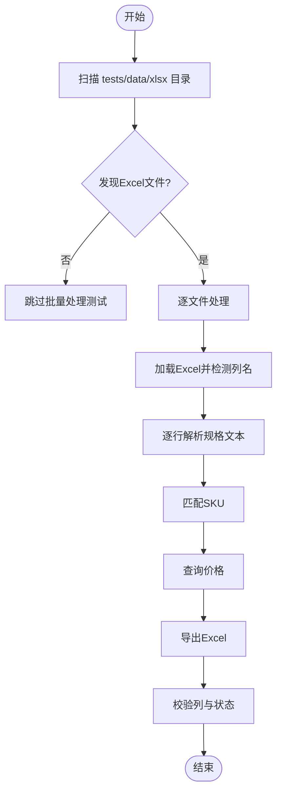
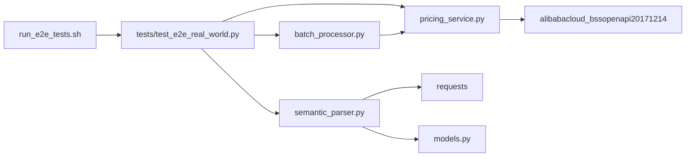

# 故障排查

<cite>
**本文引用的文件**
- [run_e2e_tests.sh](file://run_e2e_tests.sh)
- [tests/test_e2e_real_world.py](file://tests/test_e2e_real_world.py)
- [tests/create_sample_test_data.py](file://tests/create_sample_test_data.py)
- [TESTING_GUIDE.md](file://TESTING_GUIDE.md)
- [pricing_service.py](file://pricing_service.py)
- [semantic_parser.py](file://semantic_parser.py)
- [batch_processor.py](file://batch_processor.py)
- [models.py](file://models.py)
- [requirements.txt](file://requirements.txt)
</cite>

## 目录
1. [简介](#简介)
2. [项目结构](#项目结构)
3. [核心组件](#核心组件)
4. [架构总览](#架构总览)
5. [详细组件分析](#详细组件分析)
6. [依赖关系分析](#依赖关系分析)
7. [性能考虑](#性能考虑)
8. [故障排查指南](#故障排查指南)
9. [结论](#结论)
10. [附录](#附录)

## 简介
本文件系统性梳理测试过程中可能遇到的五类常见问题及解决方案：环境变量未加载、API调用失败、无测试数据、价格查询失败和AI解析失败。针对每类问题，提供具体症状、根因分析、分步解决指南，并结合 run_e2e_tests.sh 的容错处理机制，说明在环境不完整时如何继续测试。同时给出调试步骤建议，包括查看详细日志、逐个运行测试用例、手动验证API连接等。

## 项目结构
- 测试入口与脚本
  - run_e2e_tests.sh：一键运行E2E测试，自动检查环境、创建测试数据目录、生成示例数据（若缺失）、运行测试并输出日志位置。
  - tests/test_e2e_real_world.py：端到端测试套件，包含环境健康检查、组件连通性测试（AI解析与价格查询）、真实数据批量处理。
  - tests/create_sample_test_data.py：生成示例Excel测试数据。
- 核心业务模块
  - pricing_service.py：阿里云BSS OpenAPI价格查询服务封装。
  - semantic_parser.py：DashScope Qwen-Max AI解析服务封装，内置回退规则。
  - batch_processor.py：批量报价处理流水线（解析→匹配→询价）。
  - models.py：标准化资源需求模型（ResourceRequirement）。
- 文档与依赖
  - TESTING_GUIDE.md：测试指南与排障手册。
  - requirements.txt：运行所需依赖。

图表来源
- [run_e2e_tests.sh](file://run_e2e_tests.sh#L1-L83)
- [tests/test_e2e_real_world.py](file://tests/test_e2e_real_world.py#L1-L120)
- [tests/create_sample_test_data.py](file://tests/create_sample_test_data.py#L1-L42)
- [pricing_service.py](file://pricing_service.py#L1-L81)
- [semantic_parser.py](file://semantic_parser.py#L1-L120)
- [batch_processor.py](file://batch_processor.py#L1-L120)
- [models.py](file://models.py#L1-L54)
- [TESTING_GUIDE.md](file://TESTING_GUIDE.md#L1-L120)
- [requirements.txt](file://requirements.txt#L1-L9)

章节来源
- [run_e2e_tests.sh](file://run_e2e_tests.sh#L1-L83)
- [tests/test_e2e_real_world.py](file://tests/test_e2e_real_world.py#L1-L120)
- [tests/create_sample_test_data.py](file://tests/create_sample_test_data.py#L1-L42)
- [TESTING_GUIDE.md](file://TESTING_GUIDE.md#L1-L120)
- [requirements.txt](file://requirements.txt#L1-L9)

## 核心组件
- 环境健康检查：验证 .env 是否存在、密钥是否加载、DashScope API Key 是否有效。
- 组件连通性测试：分别调用 DashScope Qwen-Max 和阿里云BSS OpenAPI，断言返回值有效。
- 批量处理测试：扫描 tests/data/xlsx 下的Excel文件，逐行执行解析→匹配→询价→导出，校验输出列与状态。
- 日志系统：INFO级控制台输出与DEBUG级文件日志，便于快速定位问题。
- 容错与回退：AI解析失败时自动回退到正则规则；API异常时记录RequestId并继续流程。

章节来源
- [tests/test_e2e_real_world.py](file://tests/test_e2e_real_world.py#L85-L224)
- [tests/test_e2e_real_world.py](file://tests/test_e2e_real_world.py#L236-L453)
- [semantic_parser.py](file://semantic_parser.py#L71-L218)
- [pricing_service.py](file://pricing_service.py#L28-L81)
- [batch_processor.py](file://batch_processor.py#L80-L165)

## 架构总览
端到端测试流程由 run_e2e_tests.sh 触发，依次执行：
1) 环境健康检查（.env与密钥）
2) 组件连通性测试（AI解析与价格查询）
3) 批量处理测试（Excel→解析→匹配→询价→导出）

图表来源
- [run_e2e_tests.sh](file://run_e2e_tests.sh#L64-L83)
- [tests/test_e2e_real_world.py](file://tests/test_e2e_real_world.py#L460-L564)
- [semantic_parser.py](file://semantic_parser.py#L71-L218)
- [pricing_service.py](file://pricing_service.py#L28-L81)
- [batch_processor.py](file://batch_processor.py#L42-L120)

## 详细组件分析

### 组件A：环境健康检查（.env与密钥）
- 功能要点
  - 检查 .env 文件是否存在
  - 加载并校验阿里云AccessKey与Secret
  - 加载并校验 DashScope API Key
- 常见症状
  - 环境变量为空或未设置
  - .env 文件缺失
- 根因分析
  - .env 未放置于项目根目录
  - 密钥格式错误（带引号、多余空格）
  - Python未正确加载 .env
- 分步解决
  1) 确认 .env 位于项目根目录
  2) 按照要求格式填写密钥，避免引号与多余空格
  3) 使用 run_e2e_tests.sh 自动检测并提示继续
  4) 如需手动验证，参考“调试步骤”中的“手动验证API连接”

图表来源
- [tests/test_e2e_real_world.py](file://tests/test_e2e_real_world.py#L85-L149)
- [run_e2e_tests.sh](file://run_e2e_tests.sh#L32-L45)

章节来源
- [tests/test_e2e_real_world.py](file://tests/test_e2e_real_world.py#L85-L149)
- [run_e2e_tests.sh](file://run_e2e_tests.sh#L32-L45)

### 组件B：组件连通性测试（AI解析与价格查询）
- 功能要点
  - DashScope Qwen-Max：发送测试文本，断言解析结果（CPU等）
  - 阿里云BSS OpenAPI：查询固定SKU价格，断言价格>0
- 常见症状
  - API返回错误（如密钥无效、权限不足、网络异常）
  - 返回值不符合断言
- 根因分析
  - 密钥配置错误或过期
  - 权限不足（RAM角色缺少BSS权限）
  - 网络不可达或DNS解析失败
  - 请求参数错误（区域、SKU等）
- 分步解决
  1) 校验密钥有效性与权限范围
  2) 确认网络可达 dashscope.aliyuncs.com 与 business.aliyuncs.com
  3) 使用 run_e2e_tests.sh 的“手动验证API连接”步骤单独测试
  4) 查看日志中API错误码与RequestId，必要时联系云平台支持

图表来源
- [tests/test_e2e_real_world.py](file://tests/test_e2e_real_world.py#L155-L224)
- [semantic_parser.py](file://semantic_parser.py#L71-L218)
- [pricing_service.py](file://pricing_service.py#L28-L81)

章节来源
- [tests/test_e2e_real_world.py](file://tests/test_e2e_real_world.py#L155-L224)
- [semantic_parser.py](file://semantic_parser.py#L71-L218)
- [pricing_service.py](file://pricing_service.py#L28-L81)

### 组件C：批量处理测试（Excel→解析→匹配→询价→导出）
- 功能要点
  - 扫描 tests/data/xlsx 下的Excel文件
  - 逐行解析规格文本，匹配SKU，查询价格，导出Excel并校验列与状态
- 常见症状
  - 无Excel文件或目录不存在
  - 输出文件缺失或缺少“Price (CNY/Month)”列
  - 部分行状态为“Failed”
- 根因分析
  - 测试数据目录未创建或文件命名不规范
  - Excel列名不匹配（未检测到“Spec/规格/配置”列）
  - API调用失败导致部分行失败
- 分步解决
  1) 使用 run_e2e_tests.sh 自动生成示例数据
  2) 确保Excel包含“Spec/规格/配置”列，可选“Remark/备注/Note”
  3) 查看日志统计失败数量与错误详情
  4) 对失败行逐条复核规格文本与上下文备注

图表来源
- [tests/test_e2e_real_world.py](file://tests/test_e2e_real_world.py#L236-L453)
- [tests/create_sample_test_data.py](file://tests/create_sample_test_data.py#L1-L42)

章节来源
- [tests/test_e2e_real_world.py](file://tests/test_e2e_real_world.py#L236-L453)
- [tests/create_sample_test_data.py](file://tests/create_sample_test_data.py#L1-L42)

## 依赖关系分析
- run_e2e_tests.sh 依赖 .env 与 Python 环境，自动创建目录并生成示例数据后运行测试。
- tests/test_e2e_real_world.py 依赖 dotenv 加载 .env，依赖 semantic_parser 与 pricing_service，依赖 batch_processor 执行批量处理。
- semantic_parser.py 依赖 requests 与 DashScope API，内部包含AI解析与正则回退。
- pricing_service.py 依赖 alibabacloud_bssopenapi20171214 SDK，封装BSS OpenAPI调用。
- batch_processor.py 串联解析、匹配与询价，导出Excel并统计结果。

图表来源
- [run_e2e_tests.sh](file://run_e2e_tests.sh#L47-L66)
- [tests/test_e2e_real_world.py](file://tests/test_e2e_real_world.py#L21-L33)
- [semantic_parser.py](file://semantic_parser.py#L1-L20)
- [pricing_service.py](file://pricing_service.py#L1-L12)
- [batch_processor.py](file://batch_processor.py#L1-L20)
- [models.py](file://models.py#L1-L20)
- [requirements.txt](file://requirements.txt#L1-L9)

章节来源
- [run_e2e_tests.sh](file://run_e2e_tests.sh#L47-L66)
- [tests/test_e2e_real_world.py](file://tests/test_e2e_real_world.py#L21-L33)
- [semantic_parser.py](file://semantic_parser.py#L1-L20)
- [pricing_service.py](file://pricing_service.py#L1-L12)
- [batch_processor.py](file://batch_processor.py#L1-L20)
- [models.py](file://models.py#L1-L20)
- [requirements.txt](file://requirements.txt#L1-L9)

## 性能考虑
- API调用次数：每行一次AI解析，每行一次价格查询，建议先小数据集验证再扩大规模。
- 并发限制：DashScope与BSS OpenAPI均有请求频率限制，建议控制批处理数据量。
- 网络稳定性：确保稳定互联网连接，避免频繁重试导致超时。

章节来源
- [TESTING_GUIDE.md](file://TESTING_GUIDE.md#L420-L459)

## 故障排查指南

### 问题一：环境变量未加载
- 症状
  - 报错提示 DASHSCOPE_API_KEY 为空或未设置
  - 报错提示 ALIBABA_CLOUD_ACCESS_KEY_ID/ALIBABA_CLOUD_ACCESS_KEY_SECRET 为空
- 根因分析
  - .env 文件不存在或不在项目根目录
  - 密钥格式错误（带引号、多余空格）
  - Python未正确加载 .env
- 分步解决
  1) 确认 .env 位于项目根目录
  2) 按要求格式填写密钥，避免引号与多余空格
  3) 使用 run_e2e_tests.sh 自动检测并提示继续
  4) 如仍失败，参考“调试步骤”的“手动验证API连接”，确认密钥加载
- 调试步骤
  - 查看日志：logs/e2e_test_run_*.log
  - 逐个运行测试用例：编辑 tests/test_e2e_real_world.py，注释掉不需要的测试
  - 手动验证API连接：参考 TESTING_GUIDE.md 的“手动验证API连接”示例

章节来源
- [tests/test_e2e_real_world.py](file://tests/test_e2e_real_world.py#L85-L149)
- [run_e2e_tests.sh](file://run_e2e_tests.sh#L32-L45)
- [TESTING_GUIDE.md](file://TESTING_GUIDE.md#L286-L307)

### 问题二：API调用失败
- 症状
  - 报错包含 InvalidAccessKeyId、Forbidden.RAM 等
  - DashScope返回非200状态码
- 根因分析
  - 密钥错误或过期
  - RAM角色缺少BSS OpenAPI权限
  - 网络不可达或DNS解析失败
- 分步解决
  1) 校验AccessKey与Secret是否正确
  2) 检查网络连接与域名可达性（dashscope.aliyuncs.com、business.aliyuncs.com）
  3) 在阿里云控制台授予RAM角色 AliyunBSSReadOnlyAccess 或 AliyunBSSFullAccess
  4) 使用 run_e2e_tests.sh 的“手动验证API连接”步骤单独测试
- 调试步骤
  - 查看日志中的API错误码与RequestId
  - 逐个运行测试用例定位失败点
  - 手动验证API连接

章节来源
- [tests/test_e2e_real_world.py](file://tests/test_e2e_real_world.py#L155-L224)
- [pricing_service.py](file://pricing_service.py#L66-L81)
- [semantic_parser.py](file://semantic_parser.py#L150-L159)
- [TESTING_GUIDE.md](file://TESTING_GUIDE.md#L308-L320)

### 问题三：无测试数据
- 症状
  - 提示未发现Excel文件或目录不存在
  - 批量处理测试被跳过
- 根因分析
  - tests/data/xlsx 目录未创建或文件命名不规范
  - Excel缺少“Spec/规格/配置”列
- 分步解决
  1) 使用 run_e2e_tests.sh 自动生成示例数据
  2) 将Excel放入 tests/data/xlsx/ 目录
  3) 确保至少包含“Spec/规格/配置”列，可选“Remark/备注/Note”
- 调试步骤
  1) 查看日志中“扫描测试数据目录”的输出
  2) 确认Excel列名与路径
  3) 逐个运行测试用例定位问题

章节来源
- [tests/test_e2e_real_world.py](file://tests/test_e2e_real_world.py#L236-L304)
- [tests/create_sample_test_data.py](file://tests/create_sample_test_data.py#L1-L42)
- [run_e2e_tests.sh](file://run_e2e_tests.sh#L50-L58)
- [TESTING_GUIDE.md](file://TESTING_GUIDE.md#L321-L333)

### 问题四：价格查询失败
- 症状
  - 报错包含 Forbidden.RAM 或其他API错误
- 根因分析
  - RAM角色缺少BSS OpenAPI权限
  - 请求参数错误（SKU、区域、购买周期等）
- 分步解决
  1) 在阿里云控制台为RAM角色授予 AliyunBSSReadOnlyAccess 或 AliyunBSSFullAccess
  2) 确认SKU与区域参数正确
  3) 使用 run_e2e_tests.sh 的“手动验证API连接”步骤单独测试
- 调试步骤
  - 查看日志中的API错误码与RequestId
  - 逐个运行测试用例定位失败点

章节来源
- [pricing_service.py](file://pricing_service.py#L28-L81)
- [TESTING_GUIDE.md](file://TESTING_GUIDE.md#L334-L347)

### 问题五：AI解析失败
- 症状
  - 提示 AI解析失败，回退到正则规则
  - 解析结果异常或字段缺失
- 根因分析
  - DashScope API Key无效或网络异常
  - DashScope模型不可用或达到限流
  - 输入文本不符合期望格式
- 分步解决
  1) 检查DashScope API Key是否有效
  2) 确认网络连接
  3) 回退规则会自动启用，不影响功能，但仍建议修复AI解析
- 调试步骤
  - 查看日志中的AI解析失败与回退提示
  - 逐个运行测试用例定位失败行
  - 手动验证API连接

章节来源
- [semantic_parser.py](file://semantic_parser.py#L150-L159)
- [semantic_parser.py](file://semantic_parser.py#L214-L218)
- [TESTING_GUIDE.md](file://TESTING_GUIDE.md#L348-L359)

## 结论
通过 run_e2e_tests.sh 的容错设计与 tests/test_e2e_real_world.py 的严格日志体系，可以在环境不完整或部分API异常的情况下继续推进测试。建议优先解决环境变量与网络问题，再逐步排查API权限与数据格式问题。利用日志与“手动验证API连接”方法，可快速定位并修复问题，确保报价管道在真实环境中稳定运行。

## 附录
- 日志系统
  - 控制台：INFO级别，展示关键步骤与汇总
  - 文件：DEBUG级别，记录API调用详情与异常堆栈
- 退出码
  - 0：全部测试通过
  - 1：至少一个测试失败
  - 130：用户中断（Ctrl+C）
- 输出文件
  - tests/output/ 下生成带时间戳的Excel结果文件，包含“Price (CNY/Month)”列与状态

章节来源
- [tests/test_e2e_real_world.py](file://tests/test_e2e_real_world.py#L35-L79)
- [TESTING_GUIDE.md](file://TESTING_GUIDE.md#L235-L284)