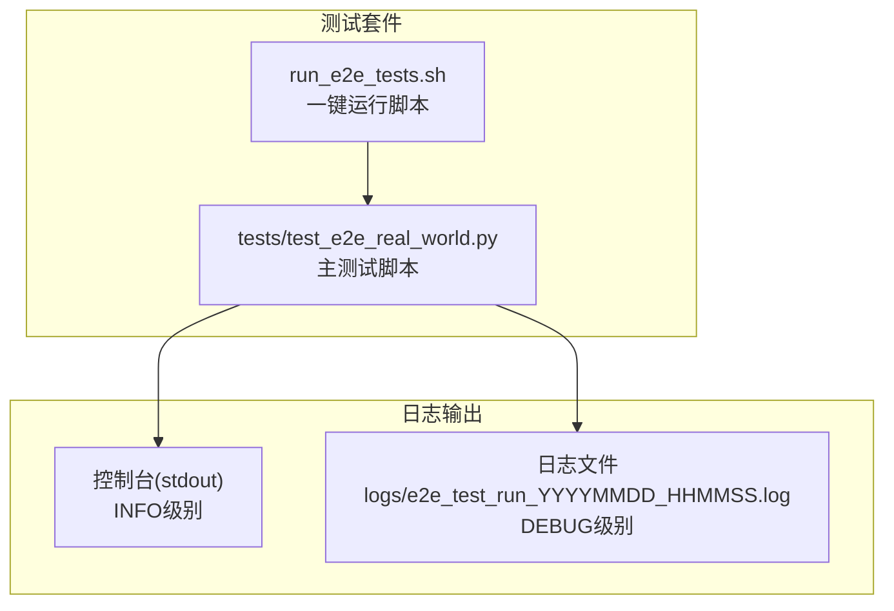
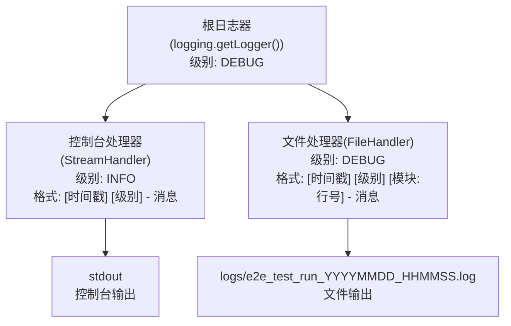
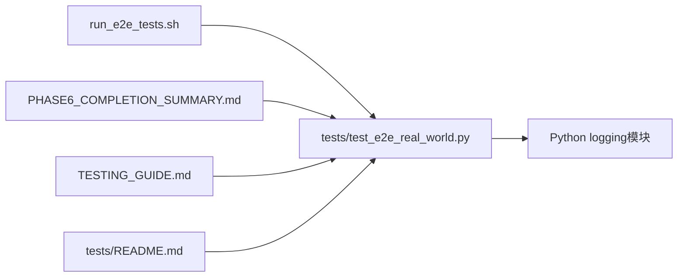

# 日志系统

<cite>
**本文引用的文件**
- [tests/test_e2e_real_world.py](file://tests/test_e2e_real_world.py)
- [run_e2e_tests.sh](file://run_e2e_tests.sh)
- [PHASE6_COMPLETION_SUMMARY.md](file://PHASE6_COMPLETION_SUMMARY.md)
- [TESTING_GUIDE.md](file://TESTING_GUIDE.md)
- [tests/README.md](file://tests/README.md)
</cite>

## 目录
1. [简介](#简介)
2. [项目结构](#项目结构)
3. [核心组件](#核心组件)
4. [架构总览](#架构总览)
5. [详细组件分析](#详细组件分析)
6. [依赖关系分析](#依赖关系分析)
7. [性能考量](#性能考量)
8. [故障排查指南](#故障排查指南)
9. [结论](#结论)
10. [附录](#附录)

## 简介
本文件系统性解析测试系统的“双输出日志架构”，即同时向控制台（INFO级别）和日志文件（DEBUG级别）输出日志的设计原理与使用场景。文档涵盖：
- 日志格式规范：时间戳、日志级别、消息体、模块与行号等字段含义
- 日志级别分类与输出位置差异：INFO仅控制台，DEBUG同时进入文件
- 日志文件存储路径命名规则：logs/e2e_test_run_YYYYMMDD_HHMMSS.log
- 日志轮转策略：当前仓库未实现自动轮转，建议结合外部工具或CI/CD平台进行归档
- 日志分析示例：如何通过日志快速定位问题，包括API调用详情与异常堆栈跟踪的解读方法

## 项目结构
测试日志系统位于端到端测试套件中，核心入口为测试脚本，日志初始化在测试主流程启动时完成，并由Shell脚本统一触发运行。

图表来源
- [tests/test_e2e_real_world.py](file://tests/test_e2e_real_world.py#L35-L78)
- [run_e2e_tests.sh](file://run_e2e_tests.sh#L60-L83)

章节来源
- [tests/test_e2e_real_world.py](file://tests/test_e2e_real_world.py#L35-L78)
- [run_e2e_tests.sh](file://run_e2e_tests.sh#L60-L83)

## 核心组件
- 双输出日志初始化函数：负责创建logs目录、生成带时间戳的日志文件名、配置根日志器、设置级别与格式化器，并注册控制台与文件处理器。
- 控制台处理器（INFO级别）：面向用户展示关键进度信息与测试摘要，简洁明了。
- 文件处理器（DEBUG级别）：记录详细调试信息、API调用详情、异常堆栈等，便于深度排查。
- Shell脚本：自动创建logs目录、运行测试、并在结束后提示最新日志文件位置。

章节来源
- [tests/test_e2e_real_world.py](file://tests/test_e2e_real_world.py#L35-L78)
- [run_e2e_tests.sh](file://run_e2e_tests.sh#L47-L83)

## 架构总览
双输出日志架构采用Python标准库logging模块，通过根日志器统一管理两个处理器：
- 控制台处理器：INFO级别，输出到stdout
- 文件处理器：DEBUG级别，输出到logs/e2e_test_run_YYYYMMDD_HHMMSS.log

图表来源
- [tests/test_e2e_real_world.py](file://tests/test_e2e_real_world.py#L35-L78)

章节来源
- [tests/test_e2e_real_world.py](file://tests/test_e2e_real_world.py#L35-L78)

## 详细组件分析

### 日志初始化与双输出配置
- 初始化时机：测试主流程启动时调用初始化函数，创建logs目录，生成唯一日志文件名（含时间戳），设置根日志器级别为DEBUG，清理已有处理器，分别注册控制台与文件处理器，并设置对应格式化器。
- 控制台格式：包含时间戳与级别，消息体为用户友好的进度信息。
- 文件格式：包含时间戳、级别、模块名与行号，消息体为详细调试信息，便于定位具体代码位置。

章节来源
- [tests/test_e2e_real_world.py](file://tests/test_e2e_real_world.py#L35-L78)

### 日志级别与输出位置
- DEBUG：仅输出至文件，包含模块与行号，适合记录API调用详情与异常堆栈。
- INFO：同时输出至控制台与文件，适合记录关键步骤、成功/失败状态与测试汇总。
- WARNING：同时输出至控制台与文件，适合记录潜在问题。
- ERROR：同时输出至控制台与文件，适合记录错误与异常。

章节来源
- [PHASE6_COMPLETION_SUMMARY.md](file://PHASE6_COMPLETION_SUMMARY.md#L168-L206)
- [TESTING_GUIDE.md](file://TESTING_GUIDE.md#L226-L234)

### 日志文件命名规则与存储路径
- 存储路径：项目根目录下的logs子目录
- 文件命名：e2e_test_run_YYYYMMDD_HHMMSS.log，其中YYYYMMDD_HHMMSS为当前运行时刻的时间戳
- Shell脚本行为：运行测试后列出最新日志文件路径，便于快速定位

章节来源
- [tests/test_e2e_real_world.py](file://tests/test_e2e_real_world.py#L45-L47)
- [run_e2e_tests.sh](file://run_e2e_tests.sh#L71-L79)

### 日志轮转策略
- 当前实现：仓库未内置日志轮转逻辑
- 建议方案：
  - 使用操作系统日志轮转工具（如logrotate）按天/按大小轮转
  - 在CI/CD中归档历史日志，保留最近N份
  - 在应用侧增加条件判断，定期重命名旧文件并创建新文件（需谨慎避免并发写入冲突）

章节来源
- [tests/test_e2e_real_world.py](file://tests/test_e2e_real_world.py#L45-L47)

### 日志格式规范
- 控制台（INFO级别）：[时间戳] [级别] - 消息
- 文件（DEBUG级别）：[时间戳] [级别] [模块:行号] - 消息
- 时间戳格式：YYYY-MM-DD HH:MM:SS

章节来源
- [tests/test_e2e_real_world.py](file://tests/test_e2e_real_world.py#L58-L71)
- [PHASE6_COMPLETION_SUMMARY.md](file://PHASE6_COMPLETION_SUMMARY.md#L168-L181)
- [TESTING_GUIDE.md](file://TESTING_GUIDE.md#L214-L225)

### API调用与异常堆栈跟踪的解读
- API调用详情：文件日志中包含模块与行号，便于定位具体调用点；控制台日志提供关键步骤与结果概览
- 异常堆栈跟踪：当发生异常时，使用DEBUG级别的exc_info=True记录堆栈，便于快速定位问题来源

章节来源
- [tests/test_e2e_real_world.py](file://tests/test_e2e_real_world.py#L146-L148)
- [tests/test_e2e_real_world.py](file://tests/test_e2e_real_world.py#L230-L233)
- [tests/test_e2e_real_world.py](file://tests/test_e2e_real_world.py#L435-L438)
- [tests/test_e2e_real_world.py](file://tests/test_e2e_real_world.py#L529-L533)

## 依赖关系分析
- 测试脚本依赖Python标准库logging模块进行日志配置
- Shell脚本负责运行测试并提示日志文件位置
- 文档文件（完成总结与测试指南）提供日志格式与级别说明，作为使用参考

图表来源
- [tests/test_e2e_real_world.py](file://tests/test_e2e_real_world.py#L35-L78)
- [run_e2e_tests.sh](file://run_e2e_tests.sh#L60-L83)
- [PHASE6_COMPLETION_SUMMARY.md](file://PHASE6_COMPLETION_SUMMARY.md#L147-L206)
- [TESTING_GUIDE.md](file://TESTING_GUIDE.md#L193-L234)
- [tests/README.md](file://tests/README.md#L100-L118)

章节来源
- [tests/test_e2e_real_world.py](file://tests/test_e2e_real_world.py#L35-L78)
- [run_e2e_tests.sh](file://run_e2e_tests.sh#L60-L83)
- [PHASE6_COMPLETION_SUMMARY.md](file://PHASE6_COMPLETION_SUMMARY.md#L147-L206)
- [TESTING_GUIDE.md](file://TESTING_GUIDE.md#L193-L234)
- [tests/README.md](file://tests/README.md#L100-L118)

## 性能考量
- 日志级别分离：INFO仅输出到控制台，避免频繁磁盘写入；DEBUG输出到文件，减少对控制台的干扰
- 文件格式包含模块与行号：便于快速定位问题，降低排查成本
- Shell脚本自动创建logs目录与提示最新日志文件：提升用户体验与可操作性

章节来源
- [tests/test_e2e_real_world.py](file://tests/test_e2e_real_world.py#L35-L78)
- [run_e2e_tests.sh](file://run_e2e_tests.sh#L47-L83)

## 故障排查指南
- 如何查看日志文件位置：运行完成后，Shell脚本会列出最新日志文件路径
- 如何区分控制台与文件日志：
  - 控制台：INFO级别，展示关键步骤与结果
  - 文件：DEBUG级别，包含模块与行号，记录API调用详情与异常堆栈
- 常见问题定位思路：
  - 环境变量缺失：查看控制台与文件日志中的错误提示，确认.env文件与变量是否正确
  - API调用失败：查看文件日志中的异常堆栈与模块行号，结合API文档与权限配置进行排查
  - 权限问题：查看文件日志中的权限类错误，确认文件系统权限与API权限
  - 无测试数据：查看文件日志中的扫描与发现信息，确认Excel文件路径与格式

章节来源
- [run_e2e_tests.sh](file://run_e2e_tests.sh#L71-L79)
- [PHASE6_COMPLETION_SUMMARY.md](file://PHASE6_COMPLETION_SUMMARY.md#L225-L262)
- [TESTING_GUIDE.md](file://TESTING_GUIDE.md#L286-L391)
- [tests/README.md](file://tests/README.md#L181-L200)

## 结论
本测试系统的双输出日志架构通过INFO级控制台输出与DEBUG级文件输出的分工协作，实现了“用户友好进度信息”与“详细调试信息”的平衡。日志文件命名规则清晰、路径明确，配合Shell脚本的自动化提示，使问题定位更加高效。当前未实现自动轮转，建议结合外部工具或CI/CD平台进行归档与轮转，以满足长期运维需求。

## 附录
- 日志文件位置与命名：logs/e2e_test_run_YYYYMMDD_HHMMSS.log
- 日志级别与输出位置对照表：
  - DEBUG：仅文件
  - INFO：控制台 + 文件
  - WARNING：控制台 + 文件
  - ERROR：控制台 + 文件
- 日志格式示例：
  - 控制台：[时间戳] [级别] - 消息
  - 文件：[时间戳] [级别] [模块:行号] - 消息

章节来源
- [tests/test_e2e_real_world.py](file://tests/test_e2e_real_world.py#L58-L71)
- [PHASE6_COMPLETION_SUMMARY.md](file://PHASE6_COMPLETION_SUMMARY.md#L168-L206)
- [TESTING_GUIDE.md](file://TESTING_GUIDE.md#L214-L234)