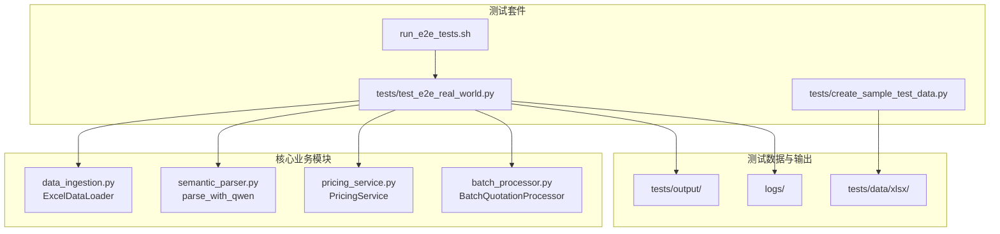
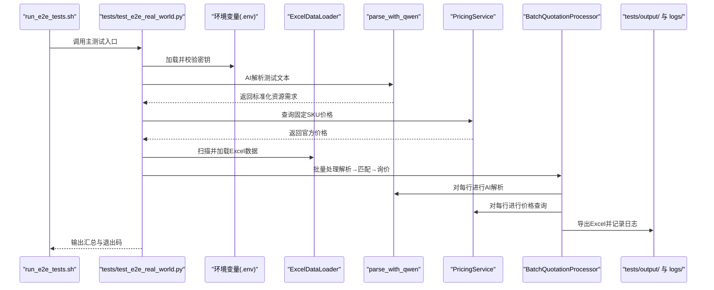
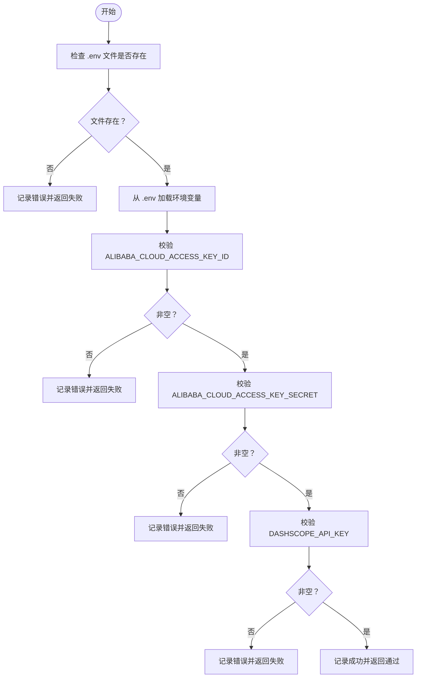
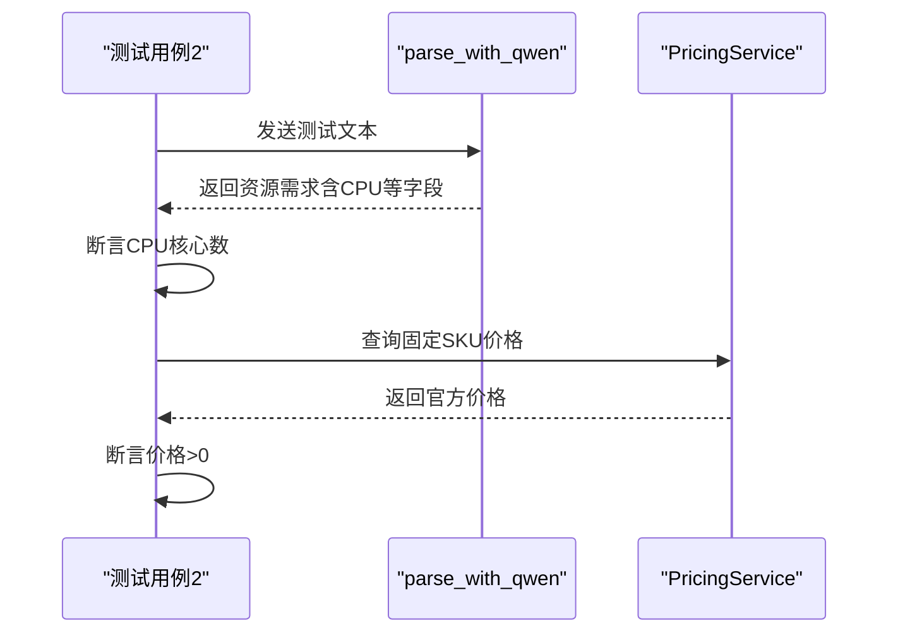
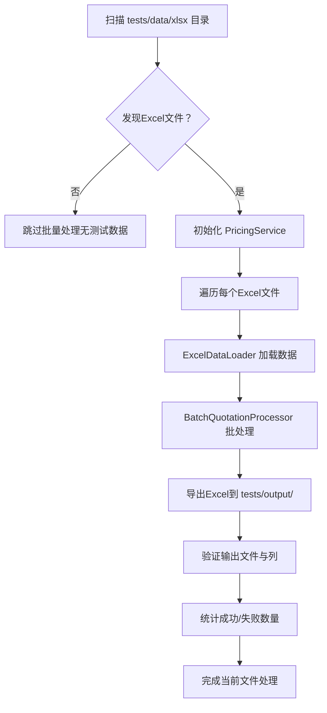
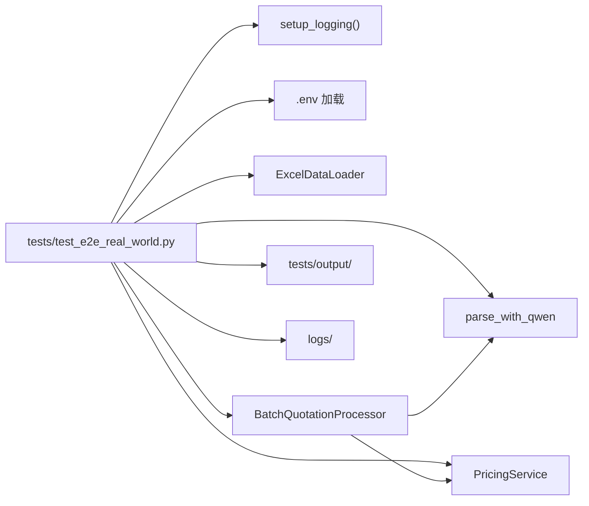

# 测试指南

<cite>
**本文引用的文件**
- [TESTING_GUIDE.md](file://TESTING_GUIDE.md)
- [tests/README.md](file://tests/README.md)
- [run_e2e_tests.sh](file://run_e2e_tests.sh)
- [tests/test_e2e_real_world.py](file://tests/test_e2e_real_world.py)
- [tests/create_sample_test_data.py](file://tests/create_sample_test_data.py)
- [batch_processor.py](file://batch_processor.py)
- [semantic_parser.py](file://semantic_parser.py)
- [pricing_service.py](file://pricing_service.py)
- [data_ingestion.py](file://data_ingestion.py)
</cite>

## 目录
1. [简介](#简介)
2. [项目结构](#项目结构)
3. [核心组件](#核心组件)
4. [架构总览](#架构总览)
5. [详细组件分析](#详细组件分析)
6. [依赖关系分析](#依赖关系分析)
7. [性能考量](#性能考量)
8. [故障排查指南](#故障排查指南)
9. [结论](#结论)
10. [附录](#附录)

## 简介
本测试指南面向端到端集成测试套件，聚焦三个核心测试用例：环境健康检查、组件连接性验证、真实数据批量处理。文档提供测试执行方式（脚本与直接运行）、双输出日志系统设计与使用、测试结果验证方法、退出码含义，以及在CI/CD中的集成建议。测试套件采用真实API调用，确保在生产环境中具备可验证的稳定性与准确性。

## 项目结构
测试相关的核心文件与目录如下：
- 测试脚本与入口：run_e2e_tests.sh、tests/test_e2e_real_world.py
- 测试数据与输出：tests/data/xlsx、tests/output、logs
- 辅助工具：tests/create_sample_test_data.py
- 核心业务模块：batch_processor.py、semantic_parser.py、pricing_service.py、data_ingestion.py
- 测试说明文档：TESTING_GUIDE.md、tests/README.md

图表来源
- [run_e2e_tests.sh](file://run_e2e_tests.sh#L1-L83)
- [tests/test_e2e_real_world.py](file://tests/test_e2e_real_world.py#L1-L120)
- [tests/create_sample_test_data.py](file://tests/create_sample_test_data.py#L1-L42)
- [data_ingestion.py](file://data_ingestion.py#L63-L147)
- [semantic_parser.py](file://semantic_parser.py#L71-L218)
- [pricing_service.py](file://pricing_service.py#L1-L81)
- [batch_processor.py](file://batch_processor.py#L18-L165)

章节来源
- [TESTING_GUIDE.md](file://TESTING_GUIDE.md#L1-L120)
- [tests/README.md](file://tests/README.md#L1-L120)

## 核心组件
- 环境健康检查：验证 .env 文件存在及关键API密钥加载成功，避免后续测试因环境缺失而失败。
- 组件连接性验证：对AI解析服务（DashScope Qwen-Max）与价格查询服务（阿里云BSS OpenAPI）进行真实连通性测试，并断言关键行为。
- 真实数据批量处理：扫描测试数据目录，逐文件加载Excel数据，执行完整报价流水线（解析→匹配→询价），导出结果并验证输出完整性。

章节来源
- [TESTING_GUIDE.md](file://TESTING_GUIDE.md#L96-L191)
- [tests/README.md](file://tests/README.md#L13-L32)

## 架构总览
测试套件以“真实API调用”为核心，串联数据加载、AI解析、SKU匹配与价格查询四个阶段，形成端到端验证闭环。日志系统同时输出控制台INFO与文件DEBUG，便于快速定位问题与审计追踪。

图表来源
- [run_e2e_tests.sh](file://run_e2e_tests.sh#L47-L83)
- [tests/test_e2e_real_world.py](file://tests/test_e2e_real_world.py#L151-L234)
- [data_ingestion.py](file://data_ingestion.py#L63-L147)
- [semantic_parser.py](file://semantic_parser.py#L71-L218)
- [pricing_service.py](file://pricing_service.py#L28-L81)
- [batch_processor.py](file://batch_processor.py#L42-L165)

## 详细组件分析

### 环境健康检查（Test Case 1）
- 目标：确保 .env 文件存在且包含必需的API密钥，避免后续测试失败。
- 关键验证点：
  - .env 文件存在
  - 阿里云Access Key ID/Secret加载成功且非空
  - DashScope API Key加载成功且非空
- 日志策略：INFO级别输出关键状态；异常时记录DEBUG级详细信息。

图表来源
- [tests/test_e2e_real_world.py](file://tests/test_e2e_real_world.py#L81-L149)

章节来源
- [TESTING_GUIDE.md](file://TESTING_GUIDE.md#L98-L116)
- [tests/README.md](file://tests/README.md#L15-L20)

### 组件连接性验证（Test Case 2）
- 目标：验证AI解析与价格查询两个核心组件的真实连通性。
- 关键验证点：
  - AI解析：向Qwen-Max发送测试文本，断言解析结果CPU核心数符合预期。
  - 价格查询：查询固定SKU（如ecs.g6.large），断言价格大于0。
- 日志策略：INFO级别展示步骤与结果；DEBUG级别记录请求参数与响应摘要。

图表来源
- [tests/test_e2e_real_world.py](file://tests/test_e2e_real_world.py#L151-L234)
- [semantic_parser.py](file://semantic_parser.py#L71-L218)
- [pricing_service.py](file://pricing_service.py#L28-L81)

章节来源
- [TESTING_GUIDE.md](file://TESTING_GUIDE.md#L117-L143)
- [tests/README.md](file://tests/README.md#L21-L24)

### 真实数据批量处理（Test Case 3）
- 目标：对真实Excel数据执行完整报价流水线，验证输出文件生成与列完整性。
- 关键验证点：
  - 扫描tests/data/xlsx目录，发现并处理所有Excel文件
  - 输出文件存在且包含“Price (CNY/Month)”列
  - 统计成功/失败行数，记录错误详情
- 日志策略：INFO级别输出处理进度与统计；DEBUG级别记录每行解析与查询细节。

图表来源
- [tests/test_e2e_real_world.py](file://tests/test_e2e_real_world.py#L236-L454)
- [data_ingestion.py](file://data_ingestion.py#L63-L147)
- [batch_processor.py](file://batch_processor.py#L42-L165)

章节来源
- [TESTING_GUIDE.md](file://TESTING_GUIDE.md#L144-L191)
- [tests/README.md](file://tests/README.md#L25-L32)

## 依赖关系分析
- 测试入口依赖于日志配置、环境变量加载、数据加载器、AI解析器与价格查询服务。
- 批处理模块对解析器与价格服务进行组合，负责导出Excel与统计结果。
- 日志系统同时输出控制台INFO与文件DEBUG，确保用户可见性与审计完整性。

图表来源
- [tests/test_e2e_real_world.py](file://tests/test_e2e_real_world.py#L31-L120)
- [batch_processor.py](file://batch_processor.py#L18-L165)
- [semantic_parser.py](file://semantic_parser.py#L71-L218)
- [pricing_service.py](file://pricing_service.py#L1-L81)
- [data_ingestion.py](file://data_ingestion.py#L63-L147)

章节来源
- [tests/test_e2e_real_world.py](file://tests/test_e2e_real_world.py#L1-L120)
- [batch_processor.py](file://batch_processor.py#L18-L165)

## 性能考量
- 预期执行时间（参考文档）：环境健康检查<1s；组件连通性3-5s；批量处理随数据量线性增长（示例4行约10-15s，100行约3-5分钟）。
- API调用次数（示例4行）：DashScope API约4次（每行1次AI解析），BSS API约4次（每行1次价格查询）。
- 并发与配额：注意DashScope与BSS的QPS与请求频率限制，建议控制批处理规模。

章节来源
- [TESTING_GUIDE.md](file://TESTING_GUIDE.md#L420-L460)

## 故障排查指南
- 环境变量未加载：确认 .env 文件存在且格式正确，避免多余空格或引号；检查密钥长度与非空。
- API调用失败：检查网络连通性、密钥有效性与账户权限；针对BSS OpenAPI，确认RAM角色具备相应权限。
- 无测试数据：使用辅助脚本生成示例数据或将Excel放入tests/data/xlsx目录。
- 价格查询失败：确认RAM角色权限（如AliyunBSSReadOnlyAccess或AliyunBSSFullAccess）。
- AI解析失败：检查DashScope API Key与模型可用性；回退规则引擎会自动启用，不影响功能。
- 调试步骤：查看最新日志文件（logs/e2e_test_run_YYYYMMDD_HHMMSS.log），按需逐个测试用例运行，或手动验证API连接。

章节来源
- [TESTING_GUIDE.md](file://TESTING_GUIDE.md#L285-L391)
- [tests/README.md](file://tests/README.md#L181-L240)

## 结论
本测试指南提供了端到端测试的完整执行路径与验证方法。通过环境健康检查、组件连通性验证与真实数据批量处理三大用例，结合双输出日志系统与清晰的退出码约定，能够有效保障报价管道在真实环境中的稳定性与准确性。建议在CI/CD中以脚本方式触发测试，并将日志与输出产物归档以便审计。

## 附录

### 测试执行方式
- 使用Shell脚本（推荐）
  - 在项目根目录执行：./run_e2e_tests.sh
  - 脚本功能：检查Python环境、验证.env、创建目录、自动生成示例数据（若无）、运行测试并显示日志位置
- 直接运行Python测试文件
  - 在项目根目录执行：python3 tests/test_e2e_real_world.py

章节来源
- [TESTING_GUIDE.md](file://TESTING_GUIDE.md#L12-L36)
- [run_e2e_tests.sh](file://run_e2e_tests.sh#L1-L83)

### 双输出日志系统
- 控制台（INFO级别）：用户友好的进度信息与关键状态
- 文件（DEBUG级别）：详细调试信息、API调用详情与异常堆栈
- 日志文件位置：logs/e2e_test_run_YYYYMMDD_HHMMSS.log
- 日志格式：控制台与文件分别采用不同格式，便于区分与检索

章节来源
- [TESTING_GUIDE.md](file://TESTING_GUIDE.md#L193-L234)
- [tests/README.md](file://tests/README.md#L100-L119)
- [tests/test_e2e_real_world.py](file://tests/test_e2e_real_world.py#L31-L79)

### 测试结果验证方法
- 环境健康检查：确认 .env 存在与密钥非空
- 组件连通性：AI解析断言CPU核心数；价格查询断言价格>0
- 批量处理：输出文件存在且包含“Price (CNY/Month)”列；统计成功/失败行数；记录错误详情

章节来源
- [TESTING_GUIDE.md](file://TESTING_GUIDE.md#L96-L191)
- [tests/README.md](file://tests/README.md#L119-L139)
- [tests/test_e2e_real_world.py](file://tests/test_e2e_real_world.py#L151-L234)

### 退出代码含义
- 0：所有测试通过
- 1：至少一个测试失败
- 130：用户中断（Ctrl+C）

章节来源
- [TESTING_GUIDE.md](file://TESTING_GUIDE.md#L253-L260)
- [tests/README.md](file://tests/README.md#L234-L239)
- [tests/test_e2e_real_world.py](file://tests/test_e2e_real_world.py#L516-L534)

### CI/CD 集成建议
- 触发方式：在CI作业中执行 ./run_e2e_tests.sh，确保在容器内安装依赖并准备 .env
- 归档产物：将 logs/ 与 tests/output/ 下的文件作为Artifacts归档，便于审计与复现
- 失败策略：根据退出码决定作业失败；对130（用户中断）可选择跳过
- 环境隔离：为不同分支或PR设置独立的 .env，避免密钥泄露

章节来源
- [TESTING_GUIDE.md](file://TESTING_GUIDE.md#L460-L515)
- [run_e2e_tests.sh](file://run_e2e_tests.sh#L47-L83)