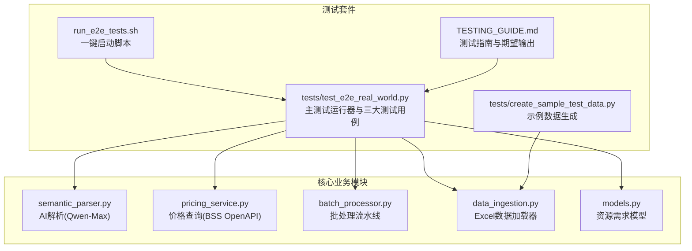
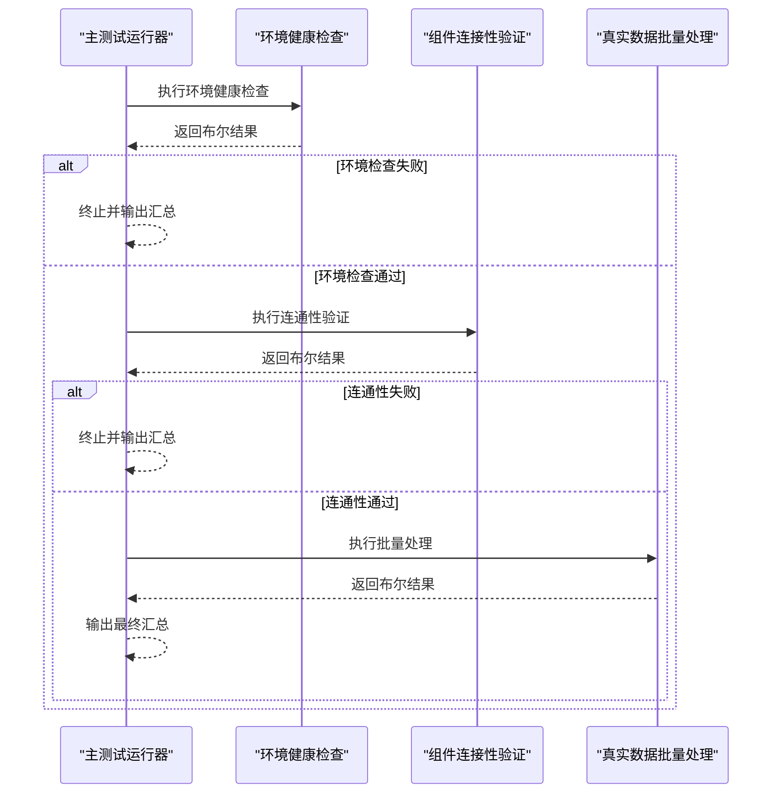
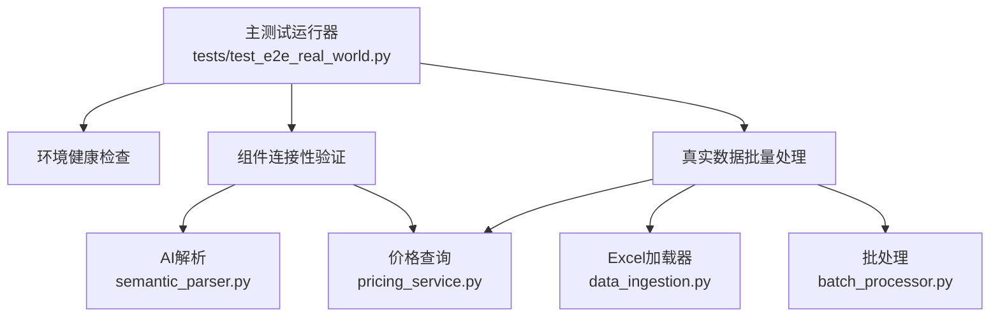

# 测试用例详解

<cite>
**本文引用的文件**
- [tests/test_e2e_real_world.py](file://tests/test_e2e_real_world.py)
- [TESTING_GUIDE.md](file://TESTING_GUIDE.md)
- [run_e2e_tests.sh](file://run_e2e_tests.sh)
- [semantic_parser.py](file://semantic_parser.py)
- [pricing_service.py](file://pricing_service.py)
- [batch_processor.py](file://batch_processor.py)
- [data_ingestion.py](file://data_ingestion.py)
- [models.py](file://models.py)
- [tests/create_sample_test_data.py](file://tests/create_sample_test_data.py)
</cite>

## 目录
1. [简介](#简介)
2. [项目结构](#项目结构)
3. [核心组件](#核心组件)
4. [架构总览](#架构总览)
5. [详细组件分析](#详细组件分析)
6. [依赖分析](#依赖分析)
7. [性能考虑](#性能考虑)
8. [故障排查指南](#故障排查指南)
9. [结论](#结论)

## 简介
本文件面向端到端测试套件中的三个核心测试用例：环境健康检查、组件连接性验证、真实数据批量处理。我们将从设计目的、验证项、执行流程、预期输出、日志表现、代码实现要点（环境变量加载、AI解析与价格查询API调用）、以及测试用例间的依赖关系与执行顺序等方面进行深入讲解，帮助读者快速理解并高效使用该测试套件。

## 项目结构
测试套件位于 tests/ 目录下，配合运行脚本与辅助工具，形成完整的端到端验证闭环。核心文件包括：
- 测试套件主体：tests/test_e2e_real_world.py
- 测试引导脚本：run_e2e_tests.sh
- 示例数据生成：tests/create_sample_test_data.py
- 测试指南：TESTING_GUIDE.md
- 核心业务模块：semantic_parser.py、pricing_service.py、batch_processor.py、data_ingestion.py、models.py

图表来源
- [tests/test_e2e_real_world.py](file://tests/test_e2e_real_world.py#L456-L564)
- [run_e2e_tests.sh](file://run_e2e_tests.sh#L1-L83)
- [tests/create_sample_test_data.py](file://tests/create_sample_test_data.py#L1-L42)
- [semantic_parser.py](file://semantic_parser.py#L71-L218)
- [pricing_service.py](file://pricing_service.py#L1-L81)
- [batch_processor.py](file://batch_processor.py#L18-L165)
- [data_ingestion.py](file://data_ingestion.py#L63-L147)
- [models.py](file://models.py#L10-L54)

章节来源
- [tests/test_e2e_real_world.py](file://tests/test_e2e_real_world.py#L456-L564)
- [run_e2e_tests.sh](file://run_e2e_tests.sh#L1-L83)
- [TESTING_GUIDE.md](file://TESTING_GUIDE.md#L1-L120)

## 核心组件
- 环境健康检查：验证 .env 中的关键环境变量是否正确加载，确保后续测试能够访问 DashScope 与阿里云 BSS OpenAPI。
- 组件连接性验证：对 AI 解析与价格查询两个核心外部服务进行连通性测试，分别调用 Qwen-Max 与 BSS OpenAPI，断言返回值符合预期。
- 真实数据批量处理：扫描测试数据目录，逐个处理 Excel 文件，执行完整的报价流水线，导出结果并校验输出完整性。

章节来源
- [tests/test_e2e_real_world.py](file://tests/test_e2e_real_world.py#L81-L234)
- [tests/test_e2e_real_world.py](file://tests/test_e2e_real_world.py#L236-L454)

## 架构总览
三大测试用例串联执行，形成“先健康检查、再连通性验证、最后批量处理”的顺序依赖链。测试套件通过统一的日志系统输出控制台与文件双通道日志，便于定位问题与审计。

图表来源
- [tests/test_e2e_real_world.py](file://tests/test_e2e_real_world.py#L456-L564)

## 详细组件分析

### 环境健康检查（TestCase 1）
- 设计目的：确保测试运行所需的 .env 文件存在且关键环境变量已加载，避免后续测试因凭据缺失而失败。
- 验证项：
  - .env 文件存在
  - 阿里云 Access Key ID/Secret 已加载且非空
  - DashScope API Key 已加载且非空
- 执行流程：
  - 定位 .env 文件并判断存在性
  - 调用环境变量加载函数加载变量
  - 读取并校验上述三项关键变量
- 预期输出（参考测试指南示例）：
  - 成功时输出 .env 存在、密钥加载成功的提示
  - 失败时输出对应变量为空或未设置的错误信息
- 代码实现要点：
  - 环境变量加载：通过环境变量加载函数加载 .env
  - 变量读取：使用环境变量读取函数获取密钥
- 日志表现：
  - 控制台 INFO 级别：关键步骤与最终结果
  - 文件 DEBUG 级别：详细路径与变量预览

章节来源
- [tests/test_e2e_real_world.py](file://tests/test_e2e_real_world.py#L81-L149)
- [TESTING_GUIDE.md](file://TESTING_GUIDE.md#L98-L116)

### 组件连接性验证（TestCase 2）
- 设计目的：验证核心外部服务连通性，确保 DashScope Qwen-Max 与阿里云 BSS OpenAPI 可用。
- 验证项：
  - AI 解析：向 Qwen-Max 发送测试文本，断言解析结果中 CPU 核心数符合预期
  - 价格查询：查询固定 SKU 的官方价格，断言价格大于 0
- 执行流程：
  - 初始化 AI 解析模块并发送测试文本
  - 初始化价格查询模块并查询固定 SKU 的价格
- 预期输出（参考测试指南示例）：
  - 成功时输出 AI 解析与价格查询成功的提示
  - 失败时输出断言失败或异常信息
- 代码实现要点：
  - AI 解析调用：通过解析函数调用 DashScope API
  - 价格查询调用：通过价格服务调用 BSS OpenAPI
- 日志表现：
  - 控制台 INFO/WARNING/ERROR 级别：步骤状态与错误信息
  - 文件 DEBUG 级别：请求参数、响应摘要与异常堆栈

章节来源
- [tests/test_e2e_real_world.py](file://tests/test_e2e_real_world.py#L151-L234)
- [semantic_parser.py](file://semantic_parser.py#L71-L218)
- [pricing_service.py](file://pricing_service.py#L1-L81)
- [TESTING_GUIDE.md](file://TESTING_GUIDE.md#L117-L143)

### 真实数据批量处理（TestCase 3）
- 设计目的：验证从 Excel 数据到最终报价输出的完整端到端流程，确保各组件协同工作。
- 验证项：
  - 输出文件生成
  - 输出文件包含“Price (CNY/Month)”列
  - 统计成功/失败行数，记录错误详情
- 执行流程：
  - 扫描测试数据目录，发现 Excel 文件
  - 初始化价格查询服务
  - 对每个文件：
    - 使用 Excel 数据加载器读取数据
    - 逐行执行批处理流水线（解析 -> 匹配 -> 询价）
    - 导出结果到 Excel
    - 校验输出文件完整性与列存在性
- 预期输出（参考测试指南示例）：
  - 成功时输出文件保存、列存在、统计结果与最终通过信息
  - 失败时输出断言失败或异常信息
- 代码实现要点：
  - 数据加载：ExcelDataLoader 将每行转换为标准化请求对象
  - 批处理：BatchQuotationProcessor 调用解析、匹配、询价并汇总结果
  - 结果导出：将结果写入 Excel 并包含状态与错误字段
- 日志表现：
  - 控制台 INFO/WARNING/ERROR 级别：步骤状态、统计与错误明细
  - 文件 DEBUG 级别：请求/响应细节与异常堆栈

章节来源
- [tests/test_e2e_real_world.py](file://tests/test_e2e_real_world.py#L236-L454)
- [batch_processor.py](file://batch_processor.py#L18-L165)
- [data_ingestion.py](file://data_ingestion.py#L63-L147)
- [TESTING_GUIDE.md](file://TESTING_GUIDE.md#L144-L191)

## 依赖分析
- 测试套件依赖关系：
  - 主测试运行器依赖三大测试用例函数
  - 环境健康检查依赖环境变量加载与变量读取
  - 组件连接性验证依赖 AI 解析与价格查询服务
  - 批量处理依赖数据加载器、批处理处理器、价格查询服务
- 外部依赖：
  - DashScope API（Qwen-Max）
  - 阿里云 BSS OpenAPI
  - pandas/openpyxl（Excel处理）
  - requests（HTTP调用）

图表来源
- [tests/test_e2e_real_world.py](file://tests/test_e2e_real_world.py#L456-L564)
- [semantic_parser.py](file://semantic_parser.py#L71-L218)
- [pricing_service.py](file://pricing_service.py#L1-L81)
- [batch_processor.py](file://batch_processor.py#L18-L165)
- [data_ingestion.py](file://data_ingestion.py#L63-L147)

章节来源
- [tests/test_e2e_real_world.py](file://tests/test_e2e_real_world.py#L456-L564)
- [semantic_parser.py](file://semantic_parser.py#L71-L218)
- [pricing_service.py](file://pricing_service.py#L1-L81)
- [batch_processor.py](file://batch_processor.py#L18-L165)
- [data_ingestion.py](file://data_ingestion.py#L63-L147)

## 性能考虑
- 真实 API 调用会产生实际费用，建议先在小数据集上验证，再扩大规模。
- DashScope 与 BSS OpenAPI 均存在并发与速率限制，建议控制批处理数据量与重试策略。
- 日志级别选择：INFO 用于用户友好输出，DEBUG 仅在排障时开启以减少日志体量。

[本节为通用指导，不直接分析具体文件]

## 故障排查指南
- 环境变量未加载：
  - 症状：密钥为空或未设置
  - 解决：确认 .env 文件存在、格式正确且无多余空格
- API 调用失败：
  - 症状：凭据无效、权限不足、网络异常
  - 解决：校验密钥、网络连通性与 RAM 权限
- 无测试数据：
  - 症状：未发现 Excel 文件
  - 解决：使用示例数据生成脚本创建测试数据
- 价格查询失败：
  - 症状：权限受限
  - 解决：授予 BSS OpenAPI 相关权限
- AI 解析失败：
  - 症状：AI 调用异常，回退到正则规则
  - 解决：检查 API Key、网络与模型可用性

章节来源
- [TESTING_GUIDE.md](file://TESTING_GUIDE.md#L285-L390)
- [tests/create_sample_test_data.py](file://tests/create_sample_test_data.py#L1-L42)

## 结论
该测试套件通过“环境健康检查 -> 组件连接性验证 -> 真实数据批量处理”的顺序，全面覆盖了报价管道在真实环境中的关键路径。三大测试用例职责清晰、相互依赖明确，配合双通道日志系统与测试指南，能够高效定位问题并保障生产可用性。建议在 CI/CD 中集成一键启动脚本，结合示例数据生成，实现自动化回归验证。