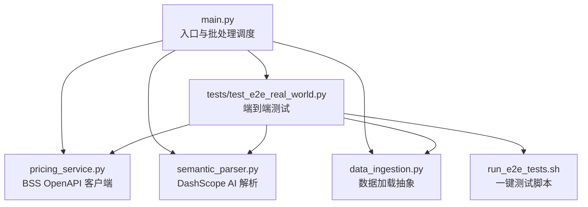
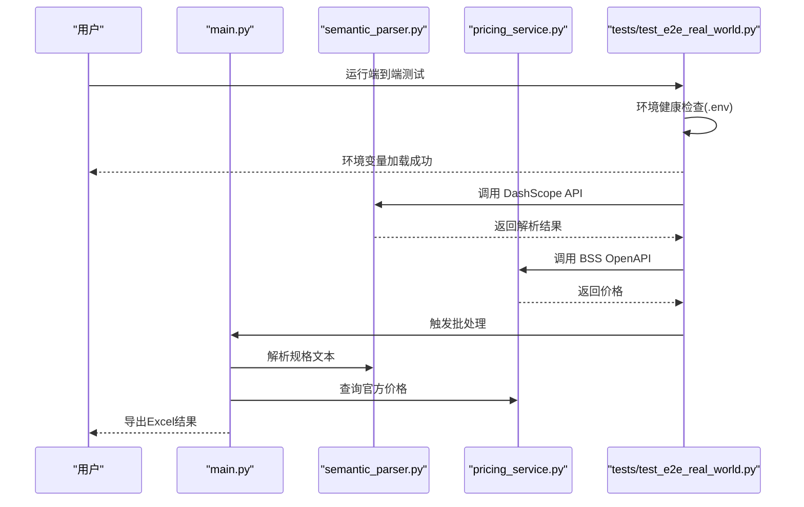
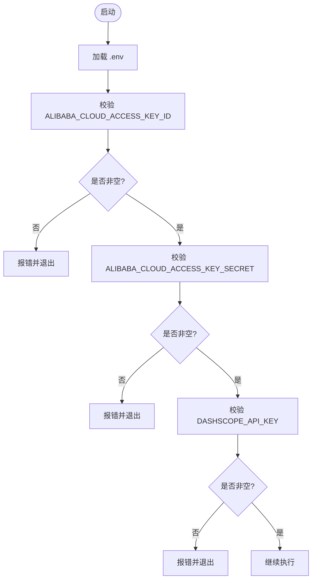
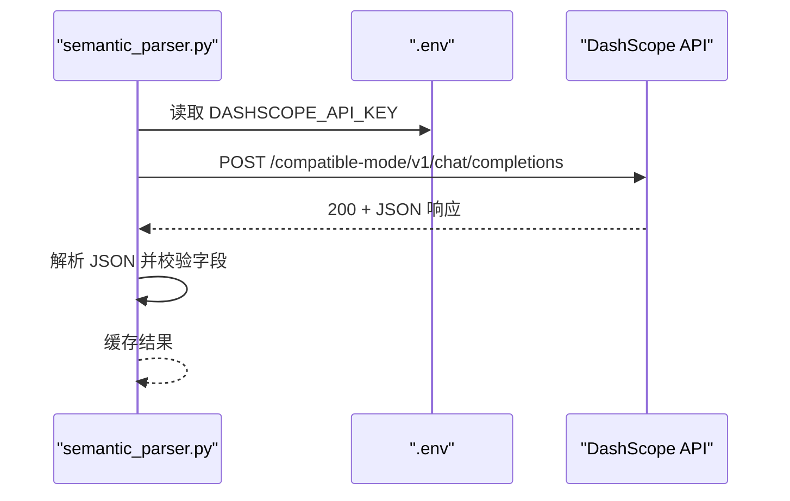
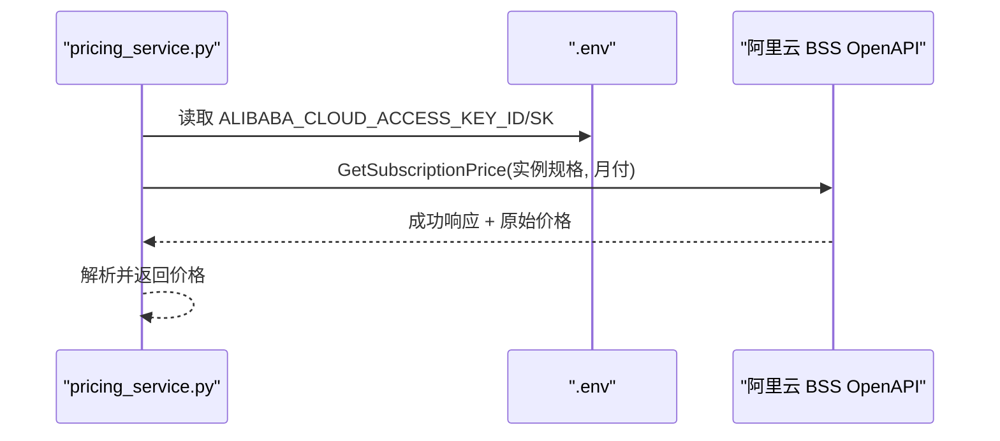
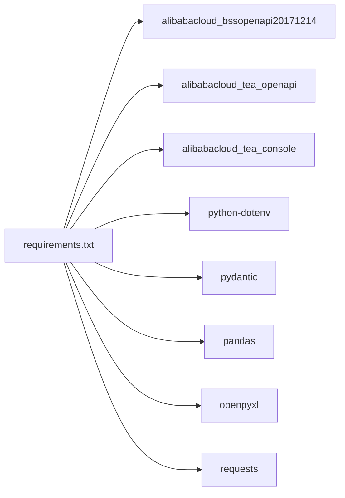

# 配置指南

<cite>
**本文引用的文件**
- [main.py](file://main.py)
- [pricing_service.py](file://pricing_service.py)
- [semantic_parser.py](file://semantic_parser.py)
- [requirements.txt](file://requirements.txt)
- [tests/README.md](file://tests/README.md)
- [TESTING_GUIDE.md](file://TESTING_GUIDE.md)
- [tests/test_e2e_real_world.py](file://tests/test_e2e_real_world.py)
- [run_e2e_tests.sh](file://run_e2e_tests.sh)
- [data_ingestion.py](file://data_ingestion.py)
</cite>

## 目录
1. [简介](#简介)
2. [项目结构](#项目结构)
3. [核心配置项](#核心配置项)
4. [架构概览](#架构概览)
5. [详细组件分析](#详细组件分析)
6. [依赖关系分析](#依赖关系分析)
7. [性能与安全考量](#性能与安全考量)
8. [故障排查指南](#故障排查指南)
9. [结论](#结论)

## 简介
本指南面向需要部署与运行报价管道的用户，聚焦于项目配置，尤其是 .env 文件中的环境变量（ALIBABA_CLOUD_ACCESS_KEY_ID、ALIBABA_CLOUD_ACCESS_KEY_SECRET、DASHSCOPE_API_KEY）的设置与安全最佳实践；同时解释 requirements.txt 中各依赖包的作用，并提供配置验证步骤与常见错误排查方法，帮助您快速、安全地完成配置并顺利运行端到端测试。

## 项目结构
项目采用分层模块化设计，主要由以下模块组成：
- 入口与批处理：main.py 负责加载 .env、初始化组件并驱动批处理流程
- 价格查询服务：pricing_service.py 封装阿里云 BSS OpenAPI 客户端
- AI 解析模块：semantic_parser.py 通过 DashScope API 对非结构化文本进行语义解析
- 数据加载层：data_ingestion.py 定义统一的数据抽象接口与 Excel 加载器
- 测试与验证：tests/README.md、TESTING_GUIDE.md、tests/test_e2e_real_world.py、run_e2e_tests.sh 提供环境健康检查、连通性测试与批量处理验证

图表来源
- [main.py](file://main.py#L1-L100)
- [pricing_service.py](file://pricing_service.py#L1-L81)
- [semantic_parser.py](file://semantic_parser.py#L1-L218)
- [data_ingestion.py](file://data_ingestion.py#L1-L204)
- [tests/test_e2e_real_world.py](file://tests/test_e2e_real_world.py#L460-L497)
- [run_e2e_tests.sh](file://run_e2e_tests.sh#L47-L82)

章节来源
- [main.py](file://main.py#L1-L100)
- [data_ingestion.py](file://data_ingestion.py#L1-L204)

## 核心配置项
本节详解 .env 文件中必须配置的三大环境变量及其作用、设置方法与安全最佳实践。

- ALIBABA_CLOUD_ACCESS_KEY_ID
  - 作用：用于初始化阿里云 BSS OpenAPI 客户端，发起价格查询请求
  - 设置方法：在项目根目录创建 .env 文件，写入键值对（注意不要加引号）
  - 安全最佳实践：
    - 严格最小权限原则：仅授予查询价格所需的只读权限
    - 定期轮换密钥，避免长期使用同一密钥
    - 限制密钥使用范围（如 RAM 角色绑定策略）
    - 不要将 .env 提交至版本控制，加入 .gitignore
- ALIBABA_CLOUD_ACCESS_KEY_SECRET
  - 作用：与 Access Key ID 配合，作为签名认证凭据
  - 设置方法：同上，保持与 Access Key ID 对应
  - 安全最佳实践：同上
- DASHSCOPE_API_KEY
  - 作用：DashScope Qwen-Max 模型调用的身份凭证
  - 设置方法：在 .env 中以键值形式配置，不要加引号
  - 安全最佳实践：
    - 仅授予必要的模型调用权限
    - 限制调用频率，避免超配额
    - 本地缓存结果减少重复调用，降低 Token 消耗

验证步骤（基于测试套件）：
- 环境健康检查：确认 .env 文件存在，且上述三项变量均已加载且非空
- 连通性测试：分别对 DashScope 与 BSS OpenAPI 发起轻量调用，验证网络可达与权限正确
- 批处理验证：对少量样本数据执行完整流程，确保输出包含价格列

章节来源
- [main.py](file://main.py#L26-L34)
- [pricing_service.py](file://pricing_service.py#L13-L27)
- [semantic_parser.py](file://semantic_parser.py#L127-L161)
- [tests/README.md](file://tests/README.md#L119-L179)
- [TESTING_GUIDE.md](file://TESTING_GUIDE.md#L290-L333)
- [tests/test_e2e_real_world.py](file://tests/test_e2e_real_world.py#L85-L149)

## 架构概览
下图展示配置如何影响系统行为：入口模块加载 .env，随后初始化 AI 解析与价格查询服务，最终驱动批处理流程。

图表来源
- [tests/test_e2e_real_world.py](file://tests/test_e2e_real_world.py#L460-L497)
- [semantic_parser.py](file://semantic_parser.py#L127-L161)
- [pricing_service.py](file://pricing_service.py#L28-L81)
- [main.py](file://main.py#L51-L79)

## 详细组件分析

### 环境变量加载与校验
- 入口模块在启动时加载 .env，并读取阿里云 Access Key 与 DashScope API Key
- 若任一密钥缺失或为空，程序会终止并提示相应错误
- 测试套件提供更严格的校验：检查 .env 文件存在、密钥非空、长度合理，并记录调试日志

图表来源
- [main.py](file://main.py#L26-L34)
- [tests/test_e2e_real_world.py](file://tests/test_e2e_real_world.py#L85-L149)

章节来源
- [main.py](file://main.py#L26-L34)
- [tests/test_e2e_real_world.py](file://tests/test_e2e_real_world.py#L85-L149)

### DashScope API 配置与调用
- 通过 HTTP 直接调用 DashScope 的兼容模式接口，使用 Bearer Token 方式携带 API Key
- 请求体包含系统提示词与用户消息，温度参数较低以提升抽取稳定性
- 若响应非 200 或无法解析 JSON，将抛出异常并触发回退逻辑（正则解析）

图表来源
- [semantic_parser.py](file://semantic_parser.py#L127-L161)
- [semantic_parser.py](file://semantic_parser.py#L161-L214)

章节来源
- [semantic_parser.py](file://semantic_parser.py#L127-L161)
- [semantic_parser.py](file://semantic_parser.py#L161-L214)

### 阿里云 BSS OpenAPI 配置与调用
- 使用阿里云 SDK 初始化客户端，设置 endpoint、region 与凭据
- 通过 GetSubscriptionPrice 接口查询实例的订阅价格，返回原始价格字段
- 若响应非成功或缺少价格数据，将抛出异常并由上层处理

图表来源
- [pricing_service.py](file://pricing_service.py#L13-L27)
- [pricing_service.py](file://pricing_service.py#L28-L81)

章节来源
- [pricing_service.py](file://pricing_service.py#L13-L27)
- [pricing_service.py](file://pricing_service.py#L28-L81)

### 数据加载与批处理
- 批处理器通过抽象接口适配不同数据源（当前为 Excel），逐条解析规格文本、匹配实例 SKU、查询价格并导出 Excel
- 若出现 API 错误，批处理器捕获并记录错误信息，不影响整体流程继续

章节来源
- [data_ingestion.py](file://data_ingestion.py#L63-L147)
- [batch_processor.py](file://batch_processor.py#L42-L165)

## 依赖关系分析
requirements.txt 中列出的依赖包及其作用如下：
- alibabacloud_bssopenapi20171214：阿里云 BSS OpenAPI 客户端库，用于价格查询
- alibabacloud_tea_openapi：阿里云 SDK 开放 API 基础库
- alibabacloud_tea_console：阿里云 SDK 控制台工具（可能用于调试）
- python-dotenv：加载 .env 文件中的环境变量
- pydantic：数据模型校验与序列化（ResourceRequirement）
- pandas：Excel 数据读取与导出
- openpyxl：Excel 文件写入引擎
- requests：HTTP 客户端，用于 DashScope API 调用

图表来源
- [requirements.txt](file://requirements.txt#L1-L9)

章节来源
- [requirements.txt](file://requirements.txt#L1-L9)

## 性能与安全考量
- 性能
  - DashScope 与 BSS OpenAPI 均存在请求频率限制，建议控制批处理规模与并发
  - 使用内存缓存减少重复调用（AI 解析模块内置缓存）
- 安全
  - 严格最小权限：仅授予必要 API 权限
  - 密钥轮换与隔离：不同环境使用独立密钥，避免泄露
  - 网络与出口：确保可访问 dashscope.aliyuncs.com 与 business.aliyuncs.com
  - 数据隐私：测试数据会发送到云端，请勿使用敏感信息

章节来源
- [TESTING_GUIDE.md](file://TESTING_GUIDE.md#L436-L460)
- [semantic_parser.py](file://semantic_parser.py#L127-L161)
- [pricing_service.py](file://pricing_service.py#L28-L81)

## 故障排查指南
- 环境变量未加载
  - 症状：提示某 API Key 为空或未设置
  - 解决方案：确认 .env 文件位于项目根目录，键值对格式正确（不要加引号），并确保无多余空格
- API 访问被拒绝或密钥无效
  - 症状：出现 InvalidAccessKeyId、Forbidden.RAM 等错误
  - 解决方案：核对密钥是否正确、网络连通性、账户状态与权限策略
- 无测试数据
  - 症状：提示未找到 Excel 文件
  - 解决方案：使用测试数据生成脚本创建示例数据，或将自定义 Excel 放入 tests/data/xlsx 目录
- 价格查询失败
  - 症状：API 返回错误或无价格数据
  - 解决方案：检查实例规格是否正确、权限是否足够、网络是否稳定
- AI 解析失败
  - 症状：AI 解析失败并回退到正则规则
  - 解决方案：检查 DashScope API Key 是否有效、网络是否可达、模型可用性

章节来源
- [TESTING_GUIDE.md](file://TESTING_GUIDE.md#L286-L333)
- [TESTING_GUIDE.md](file://TESTING_GUIDE.md#L334-L383)
- [TESTING_GUIDE.md](file://TESTING_GUIDE.md#L383-L460)
- [tests/test_e2e_real_world.py](file://tests/test_e2e_real_world.py#L85-L149)

## 结论
通过本配置指南，您可以：
- 正确设置并验证 .env 中的三大关键环境变量
- 理解各依赖包在系统中的职责与影响
- 使用测试套件完成端到端验证，确保 API 密钥有效且权限正确
- 快速定位并解决常见的配置与访问问题