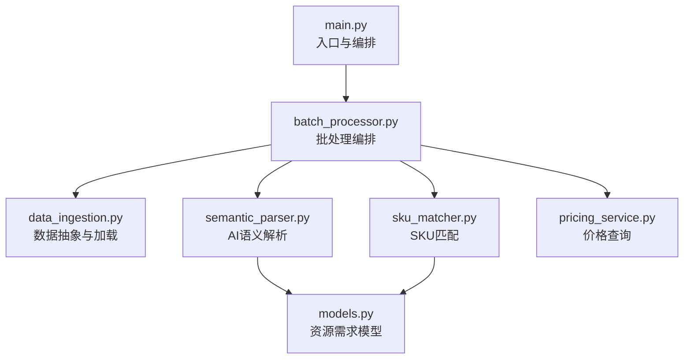
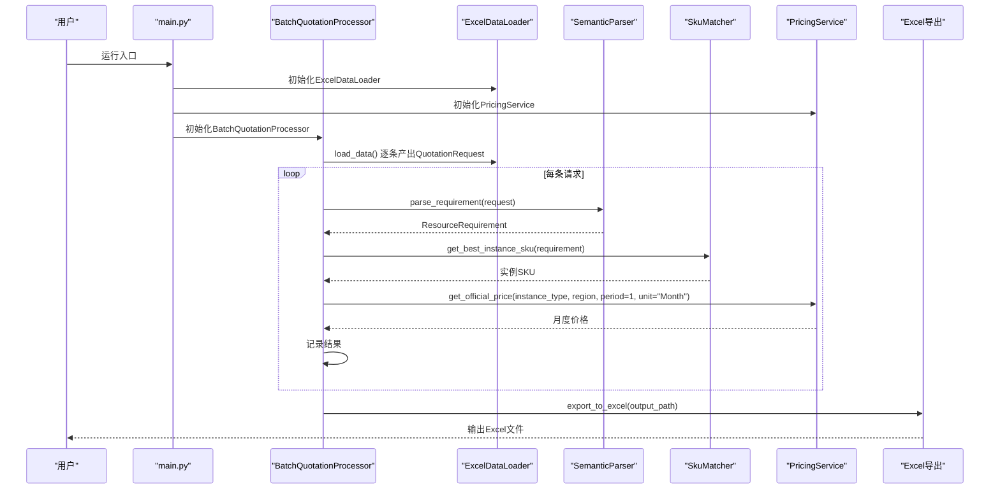
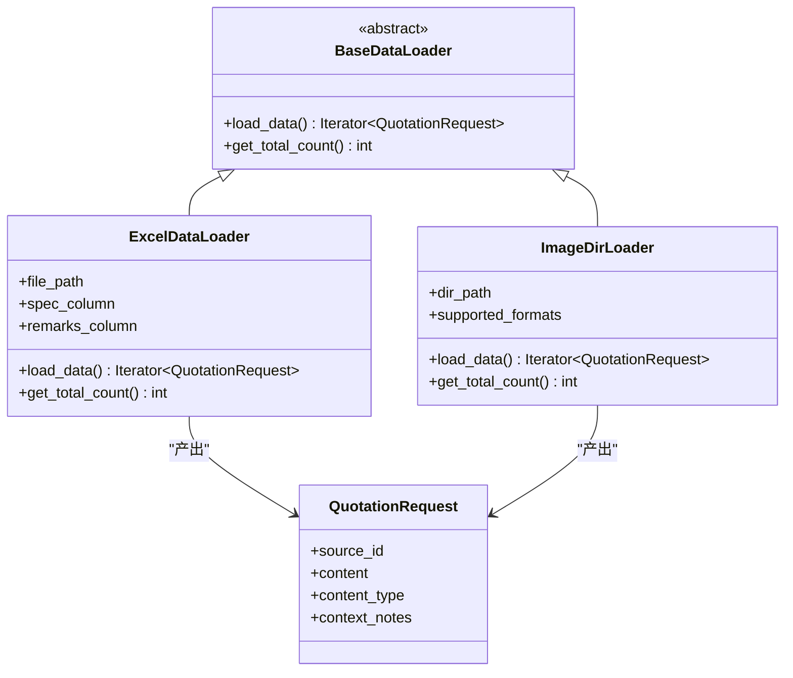
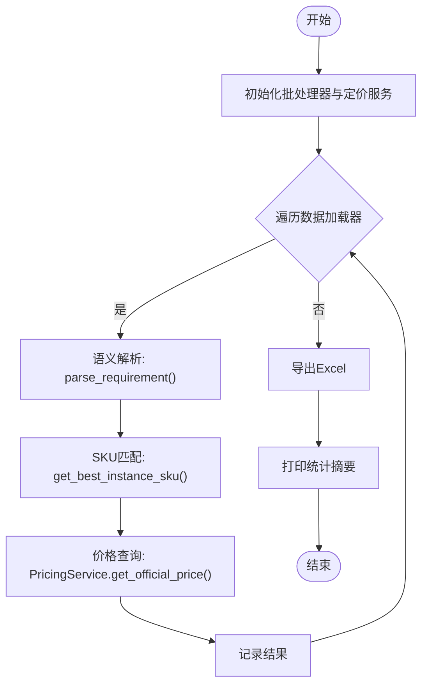
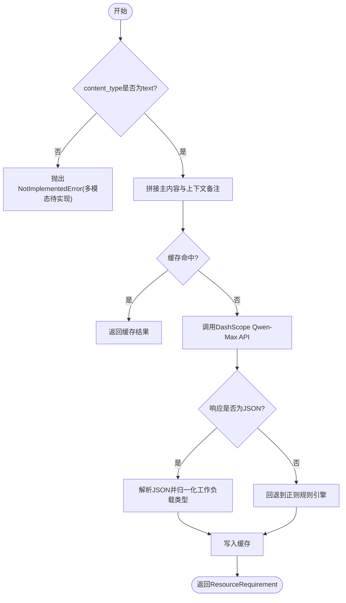
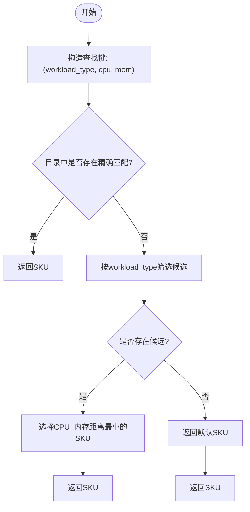
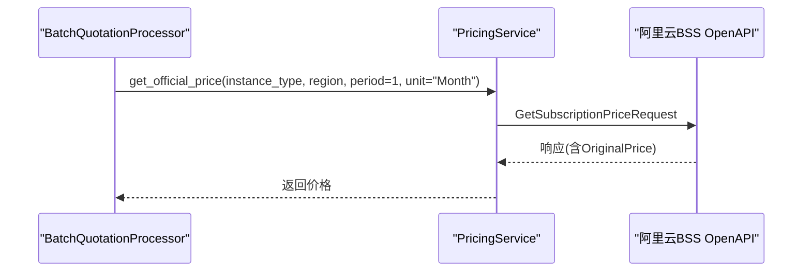
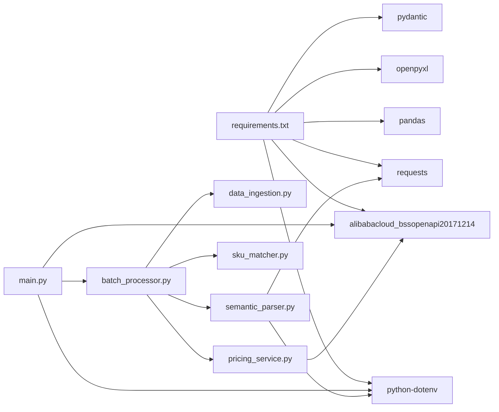

# 项目概述

<cite>
**本文引用的文件**
- [main.py](file://main.py)
- [batch_processor.py](file://batch_processor.py)
- [data_ingestion.py](file://data_ingestion.py)
- [semantic_parser.py](file://semantic_parser.py)
- [sku_matcher.py](file://sku_matcher.py)
- [pricing_service.py](file://pricing_service.py)
- [models.py](file://models.py)
- [requirements.txt](file://requirements.txt)
- [tests/README.md](file://tests/README.md)
- [PHASE6_COMPLETION_SUMMARY.md](file://PHASE6_COMPLETION_SUMMARY.md)
- [TESTING_GUIDE.md](file://TESTING_GUIDE.md)
- [run_e2e_tests.sh](file://run_e2e_tests.sh)
- [tests/create_sample_test_data.py](file://tests/create_sample_test_data.py)
</cite>

## 目录
1. [简介](#简介)
2. [项目结构](#项目结构)
3. [核心组件](#核心组件)
4. [架构总览](#架构总览)
5. [详细组件分析](#详细组件分析)
6. [依赖分析](#依赖分析)
7. [性能考虑](#性能考虑)
8. [故障排查指南](#故障排查指南)
9. [结论](#结论)
10. [附录](#附录)

## 简介
Quotation_Pipeline 是一个“数据源无关”的批量报价处理系统，旨在将非结构化文本（如Excel中的规格描述）转化为精确的云实例报价。系统通过三层处理管线实现端到端自动化：AI语义解析（从自然语言中抽取资源需求）、SKU匹配（将抽象需求映射为具体的阿里云实例规格）、价格查询（调用官方BSS API获取月度价格）。  
- 设计目标：解耦数据源与处理逻辑，支持未来扩展图像/语音等多模态输入；提供可观察、可测试、可维护的架构。
- 目标用户：需要快速批量评估云资源成本的业务人员、售前工程师、产品运营与技术团队。
- 在生命周期中的作用：作为报价流程的“前端”工具，贯穿需求收集、意图理解、规格匹配与价格生成的全过程，支撑从需求到报价的闭环。

## 项目结构
项目采用“按职责分层”的组织方式，核心模块如下：
- 入口与编排：main.py
- 批处理编排：batch_processor.py
- 数据抽象与加载：data_ingestion.py
- AI语义解析：semantic_parser.py
- SKU匹配：sku_matcher.py
- 价格查询：pricing_service.py
- 数据模型：models.py
- 测试与运维：tests/*、run_e2e_tests.sh、TESTING_GUIDE.md、PHASE6_COMPLETION_SUMMARY.md
- 依赖声明：requirements.txt

图表来源
- [main.py](file://main.py#L1-L100)
- [batch_processor.py](file://batch_processor.py#L1-L244)
- [data_ingestion.py](file://data_ingestion.py#L1-L204)
- [semantic_parser.py](file://semantic_parser.py#L1-L349)
- [sku_matcher.py](file://sku_matcher.py#L1-L134)
- [pricing_service.py](file://pricing_service.py#L1-L81)
- [models.py](file://models.py#L1-L54)

章节来源
- [main.py](file://main.py#L1-L100)
- [batch_processor.py](file://batch_processor.py#L1-L244)
- [data_ingestion.py](file://data_ingestion.py#L1-L204)
- [semantic_parser.py](file://semantic_parser.py#L1-L349)
- [sku_matcher.py](file://sku_matcher.py#L1-L134)
- [pricing_service.py](file://pricing_service.py#L1-L81)
- [models.py](file://models.py#L1-L54)

## 核心组件
- 数据抽象层（BaseDataLoader）：定义统一的数据加载接口，屏蔽具体数据源差异，当前实现为ExcelDataLoader，未来可扩展为ImageDirLoader等。
- 批处理编排器（BatchQuotationProcessor）：串联解析、匹配、价格查询三步，负责进度与统计输出，并将结果导出为Excel。
- AI语义解析（parse_requirement/parse_with_qwen）：基于DashScope Qwen-Max进行智能解析，支持缓存与回退规则。
- SKU匹配（get_best_instance_sku/get_instance_family_name）：将标准化资源需求映射到阿里云实例规格，并提供友好族名。
- 价格查询（PricingService.get_official_price）：调用阿里云BSS OpenAPI获取官方月度价格。
- 数据模型（ResourceRequirement）：统一的资源需求Schema，确保跨数据源的一致性。

章节来源
- [data_ingestion.py](file://data_ingestion.py#L1-L204)
- [batch_processor.py](file://batch_processor.py#L1-L244)
- [semantic_parser.py](file://semantic_parser.py#L1-L349)
- [sku_matcher.py](file://sku_matcher.py#L1-L134)
- [pricing_service.py](file://pricing_service.py#L1-L81)
- [models.py](file://models.py#L1-L54)

## 架构总览
系统采用“数据源抽象 + 管线编排 + 服务适配”的分层架构，核心思想是“数据格式无关、处理逻辑可复用”。下图展示了从Excel输入到Excel输出的完整流程。

图表来源
- [main.py](file://main.py#L1-L100)
- [batch_processor.py](file://batch_processor.py#L1-L244)
- [data_ingestion.py](file://data_ingestion.py#L1-L204)
- [semantic_parser.py](file://semantic_parser.py#L1-L349)
- [sku_matcher.py](file://sku_matcher.py#L1-L134)
- [pricing_service.py](file://pricing_service.py#L1-L81)

## 详细组件分析

### 数据抽象与加载（BaseDataLoader/ExcelDataLoader）
- 抽象基类BaseDataLoader定义了统一接口：load_data（迭代产出QuotationRequest）与get_total_count（统计总数），保证批处理器与数据源解耦。
- ExcelDataLoader负责读取Excel，校验列名，将每行转换为QuotationRequest（content_type为"text"），并支持备注列。
- 未来扩展：ImageDirLoader可遍历图片目录，将图片路径作为content，content_type为"image"，为后续视觉模型解析预留入口。

图表来源
- [data_ingestion.py](file://data_ingestion.py#L1-L204)

章节来源
- [data_ingestion.py](file://data_ingestion.py#L1-L204)

### 批处理编排（BatchQuotationProcessor）
- 负责循环处理每条QuotationRequest，依次执行：语义解析、SKU匹配、价格查询，并汇总统计与导出Excel。
- 错误处理：捕获NotImplementedError（多模态特性未实现）、TeaException（API错误）与通用异常，记录错误并继续处理其他请求。
- 导出字段：包含原始内容、解析结果、SKU与族名、价格、状态与错误信息等。

图表来源
- [batch_processor.py](file://batch_processor.py#L1-L244)
- [semantic_parser.py](file://semantic_parser.py#L1-L349)
- [sku_matcher.py](file://sku_matcher.py#L1-L134)
- [pricing_service.py](file://pricing_service.py#L1-L81)

章节来源
- [batch_processor.py](file://batch_processor.py#L1-L244)

### AI语义解析（parse_requirement/parse_with_qwen）
- 当前实现：基于DashScope Qwen-Max的HTTP API进行智能解析，结合系统提示词与用户输入，抽取CPU、内存、工作负载类型等。
- 缓存机制：对相同输入进行内存缓存，降低Token消耗与延迟。
- 回退策略：若AI解析失败，自动回退到正则规则引擎，保障稳定性。
- 多模态扩展：预留image/audio分支，未来接入视觉/语音模型。

图表来源
- [semantic_parser.py](file://semantic_parser.py#L1-L349)
- [models.py](file://models.py#L1-L54)

章节来源
- [semantic_parser.py](file://semantic_parser.py#L1-L349)
- [models.py](file://models.py#L1-L54)

### SKU匹配（get_best_instance_sku/get_instance_family_name）
- 精确匹配：根据(workload_type, cpu_cores, memory_gb)在实例目录中查找。
- 降级匹配：若无精确匹配，按同一工作负载类型内寻找最接近的配置。
- 兜底策略：若仍无匹配，返回默认通用型实例。
- 族名映射：将实例类型映射为更易读的族名，便于输出展示。

图表来源
- [sku_matcher.py](file://sku_matcher.py#L1-L134)

章节来源
- [sku_matcher.py](file://sku_matcher.py#L1-L134)

### 价格查询（PricingService.get_official_price）
- 使用阿里云BSS OpenAPI的GetSubscriptionPrice接口，按实例类型、区域、购买周期与单位查询官方月度价格。
- 参数简化：实例类型优先，统一默认区域与单位，减少调用复杂度。
- 错误处理：对非成功响应抛出异常，由上层捕获并记录。

图表来源
- [pricing_service.py](file://pricing_service.py#L1-L81)
- [batch_processor.py](file://batch_processor.py#L1-L244)

章节来源
- [pricing_service.py](file://pricing_service.py#L1-L81)
- [batch_processor.py](file://batch_processor.py#L1-L244)

### 数据模型（ResourceRequirement）
- 统一Schema：包含原始输入、CPU核心数、内存、存储、环境类型与工作负载类型。
- 类型约束：使用Pydantic字段校验，确保数据一致性与可追溯性。
- 可视化输出：提供格式化字符串，便于调试与日志展示。

章节来源
- [models.py](file://models.py#L1-L54)

## 依赖分析
- 外部依赖：Alibaba Cloud BSS OpenAPI SDK、DashScope HTTP调用、pandas/openpyxl、requests、python-dotenv、pydantic。
- 内部耦合：批处理器依赖数据抽象接口、AI解析、SKU匹配与价格服务；各模块职责单一，耦合度低，便于扩展与替换。
- 环境变量：通过dotenv加载，避免硬编码密钥；main.py与semantic_parser.py分别在入口与AI解析处读取密钥。

图表来源
- [requirements.txt](file://requirements.txt#L1-L9)
- [main.py](file://main.py#L1-L100)
- [batch_processor.py](file://batch_processor.py#L1-L244)
- [semantic_parser.py](file://semantic_parser.py#L1-L349)
- [pricing_service.py](file://pricing_service.py#L1-L81)

章节来源
- [requirements.txt](file://requirements.txt#L1-L9)
- [main.py](file://main.py#L1-L100)

## 性能考虑
- API调用次数：每条记录一次AI解析 + 一次价格查询，建议控制批处理规模，避免触发限流。
- 缓存策略：AI解析内置内存缓存，重复输入可显著降低Token与延迟。
- 导出性能：pandas写入Excel，数据量大时注意内存占用与IO性能。
- 并发与限流：DashScope与BSS均有限流策略，建议在大规模处理时增加节流或分批执行。

## 故障排查指南
- 环境变量缺失：确认.DOTENV中包含阿里云与DashScope密钥；入口会在缺少时直接报错并退出。
- API错误：检查网络连通性、密钥有效性与账户权限；BSS需具备相应RAM权限。
- Excel列名不匹配：确保包含“Specification/规格/配置”，备注列可选；否则会提示列缺失并给出可用列列表。
- 多模态未实现：当content_type为image/audio时会抛出NotImplementedError，需等待未来视觉/语音模型接入。
- 输出验证：测试套件会验证输出文件存在、价格列存在、成功/失败统计与错误日志。

章节来源
- [tests/README.md](file://tests/README.md#L1-L276)
- [TESTING_GUIDE.md](file://TESTING_GUIDE.md#L1-L515)
- [PHASE6_COMPLETION_SUMMARY.md](file://PHASE6_COMPLETION_SUMMARY.md#L1-L600)

## 结论
Quotation_Pipeline通过“数据源抽象 + 管线编排 + 服务适配”的架构，实现了从非结构化文本到精确报价的自动化闭环。其设计强调可扩展性（多模态入口）、可观测性（双输出日志）、可测试性（真实API端到端测试）与可维护性（模块职责清晰）。对于需要批量评估云资源成本的团队，该系统提供了即插即用的工具链，可在现有Excel输入基础上快速落地，并为未来的图像/语音输入预留扩展空间。

## 附录

### 实际使用示例（从准备Excel到生成报价）
- 准备Excel：在tests/data/xlsx/目录放置Excel文件，至少包含“Specification/规格/配置”列，备注列可选。
- 配置环境变量：在项目根目录创建.DOTENV，填入阿里云与DashScope密钥。
- 运行测试脚本：使用一键脚本自动创建示例数据、运行测试并输出日志文件。
- 查看结果：打开tests/output/中的Excel文件，查看每行的CPU/内存/存储/工作负载类型/SKU/价格/状态等字段。

章节来源
- [run_e2e_tests.sh](file://run_e2e_tests.sh#L1-L86)
- [tests/create_sample_test_data.py](file://tests/create_sample_test_data.py#L1-L42)
- [tests/README.md](file://tests/README.md#L1-L276)
- [TESTING_GUIDE.md](file://TESTING_GUIDE.md#L1-L515)