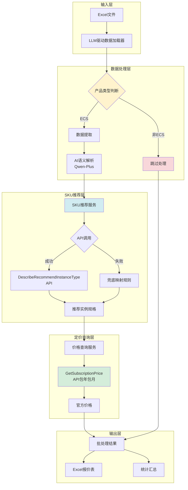
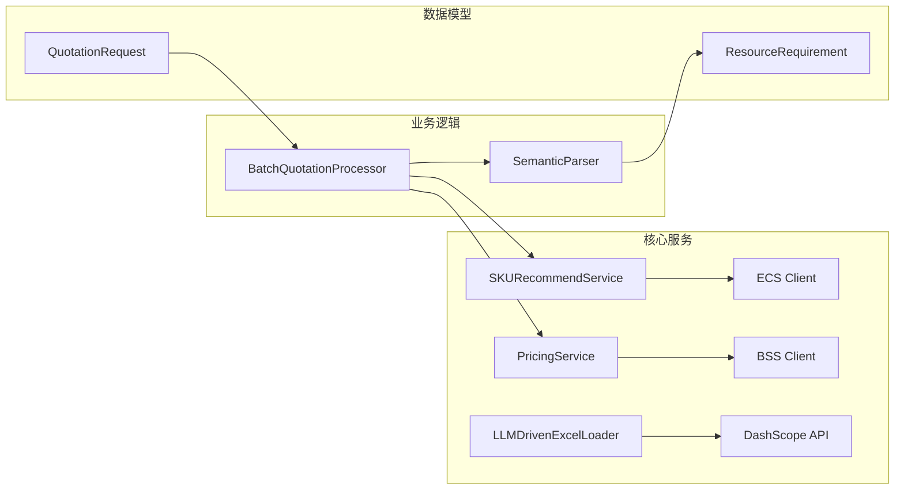
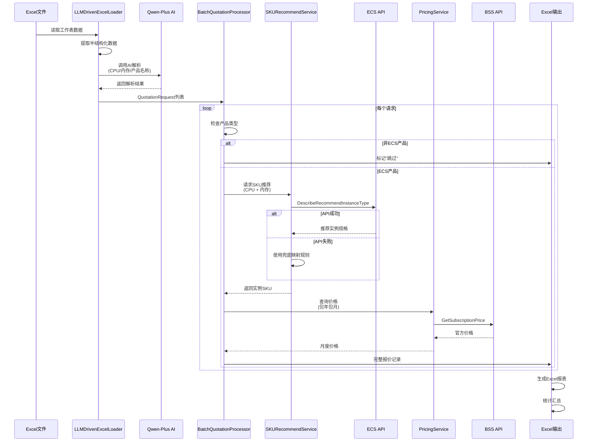
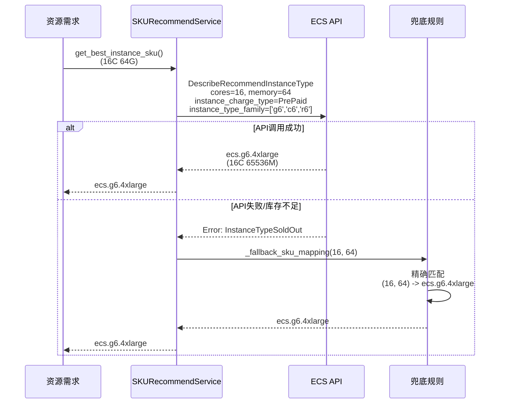
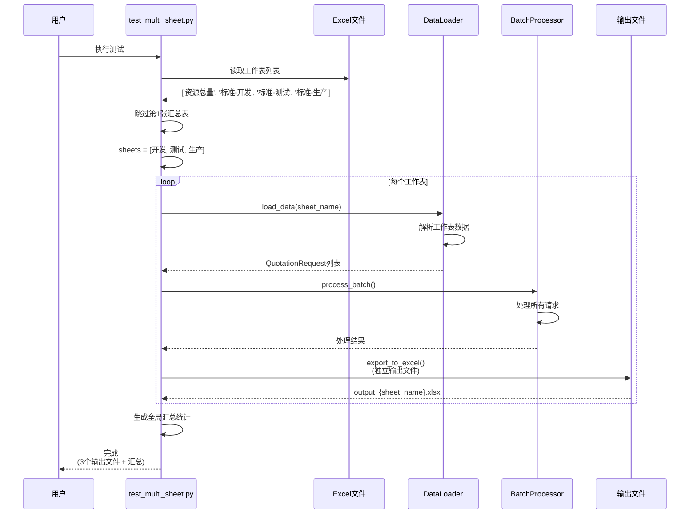

# Quotation Pipeline - 智能云服务器报价系统

> 基于AI的阿里云ECS智能报价自动化系统，支持Excel批量处理和多工作表解析

[](https://www.python.org/)
[](LICENSE)

## 📋 目录

- [系统概述](#系统概述)
- [系统架构](#系统架构)
- [核心功能](#核心功能)
- [技术栈](#技术栈)
- [快速开始](#快速开始)
- [使用指南](#使用指南)
- [API文档](#api文档)

## 🎯 系统概述

Quotation Pipeline 是一个智能化的云服务器报价系统，通过集成阿里云API和AI技术，实现从Excel表格到精准报价的全自动化流程。

**核心特性：**
- 🤖 **AI驱动解析** - 使用Qwen-Plus智能解析Excel表格数据
- 🔄 **动态SKU推荐** - 调用阿里云API实时推荐最优实例规格
- 💰 **实时询价** - 基于阿里云BSS OpenAPI获取官方价格
- 📊 **批量处理** - 支持多工作表Excel文件批量解析
- 🎯 **智能过滤** - 仅处理ECS产品，其他产品自动跳过
- 📈 **包年包月计费** - 统一使用Subscription计费模式

## 🏗️ 系统架构

### 整体架构图



### 核心组件架构



## 📈 业务流程时序图

### 完整处理流程



### SKU推荐详细流程



### 多工作表处理流程



## 🔧 核心功能

### 1. LLM驱动的数据解析

使用Qwen-Plus智能识别Excel表格中的资源配置信息：

```python
from data_ingestion import LLMDrivenExcelLoader

loader = LLMDrivenExcelLoader(
    file_path="quotation.xlsx",
    api_key=os.getenv("DASHSCOPE_API_KEY")
)

# 自动解析多个工作表
for request in loader.load_data(sheet_name="标准-生产"):
    print(f"{request.product_name}: {request.cpu_cores}C {request.memory_gb}G")
```

**智能识别能力：**
- 自动提取CPU核心数、内存大小、存储容量
- 智能识别产品类型（ECS、PolarDB、WAF等）
- 处理跨工作表Excel公式引用
- 支持非标准格式的表格

### 2. 动态SKU推荐

基于阿里云API实时推荐最优实例规格：

```python
from sku_recommend_service import SKURecommendService

sku_service = SKURecommendService(
    access_key_id=access_key_id,
    access_key_secret=access_key_secret,
    region_id="cn-beijing"
)

# 推荐实例
instance_type = sku_service.recommend_instance_type(
    cpu_cores=16,
    memory_gb=64,
    instance_charge_type="PrePaid",  # 包年包月
    priority_strategy="PriceFirst"   # 价格优先
)
# 返回: ecs.g6.4xlarge
```

**推荐策略：**
- 价格优先（PriceFirst）
- 库存优先（InventoryFirst）
- 最新产品优先（NewProductFirst）

**兜底机制：**
当API调用失败时，自动使用内置映射规则：

| CPU核心 | 内存(GB) | SKU规格 |
|---------|---------|---------|
| 4 | 16 | ecs.g6.xlarge |
| 8 | 32 | ecs.g6.2xlarge |
| 16 | 64 | ecs.g6.4xlarge |
| 32 | 128 | ecs.g6.8xlarge |

### 3. 实时价格查询

调用阿里云BSS OpenAPI获取官方价格：

```python
from pricing_service import PricingService

pricing_service = PricingService(
    access_key_id=access_key_id,
    access_key_secret=access_key_secret,
    region_id="cn-beijing"
)

price = pricing_service.get_official_price(
    instance_type="ecs.g6.4xlarge",
    region="cn-beijing",
    period=1,
    unit="Month"  # 包年包月
)
# 返回: 1920.0 (CNY/月)
```

### 4. 批量处理和多工作表支持

```python
from batch_processor import BatchQuotationProcessor

processor = BatchQuotationProcessor(
    pricing_service=pricing_service,
    sku_recommend_service=sku_service,
    region="cn-beijing"
)

# 处理多个工作表
for sheet_name in ["标准-开发", "标准-测试", "标准-生产"]:
    results = processor.process_batch(
        data_loader=loader,
        verbose=True
    )
    processor.export_to_excel(f"output_{sheet_name}.xlsx")
```

## 🛠️ 技术栈

### 后端框架
- **Python 3.8+** - 核心开发语言
- **Pandas** - 数据处理和Excel操作
- **OpenPyXL** - Excel文件读写

### AI服务
- **DashScope** - 阿里云灵积平台
- **Qwen-Plus** - 通义千问大模型（数据解析）

### 阿里云SDK
- **alibabacloud_ecs20140526** - ECS实例推荐API
- **alibabacloud_bssopenapi20171214** - BSS计费查询API
- **alibabacloud_tea_openapi** - OpenAPI通用库

### 数据模型
- **Pydantic** - 数据验证和模型定义
- **Dataclasses** - 轻量级数据结构

## 🚀 快速开始

### 1. 环境准备

```bash
# 克隆项目
git clone <repository-url>
cd Quotation_Pipeline

# 安装依赖
pip install -r requirements.txt
```

### 2. 配置环境变量

创建 `.env` 文件：

```bash
# 阿里云API密钥
ALIBABA_CLOUD_ACCESS_KEY_ID=your_access_key_id
ALIBABA_CLOUD_ACCESS_KEY_SECRET=your_access_key_secret

# 阿里云灵积平台密钥
DASHSCOPE_API_KEY=your_dashscope_api_key
```

### 3. 运行测试

```bash
# 测试单行数据处理
python3 test_single_row.py

# 测试新系统（SKU推荐+价格查询）
python3 test_new_system.py

# 测试多工作表处理
python3 test_multi_sheet.py
```

### 4. 处理实际数据

```python
from data_ingestion import LLMDrivenExcelLoader
from batch_processor import BatchQuotationProcessor
from pricing_service import PricingService
from sku_recommend_service import SKURecommendService
import os

# 初始化服务
pricing_service = PricingService(
    access_key_id=os.getenv("ALIBABA_CLOUD_ACCESS_KEY_ID"),
    access_key_secret=os.getenv("ALIBABA_CLOUD_ACCESS_KEY_SECRET"),
    region_id="cn-beijing"
)

sku_service = SKURecommendService(
    access_key_id=os.getenv("ALIBABA_CLOUD_ACCESS_KEY_ID"),
    access_key_secret=os.getenv("ALIBABA_CLOUD_ACCESS_KEY_SECRET"),
    region_id="cn-beijing"
)

# 加载数据
loader = LLMDrivenExcelLoader(
    file_path="your_quotation.xlsx",
    api_key=os.getenv("DASHSCOPE_API_KEY")
)

# 批处理
processor = BatchQuotationProcessor(
    pricing_service=pricing_service,
    sku_recommend_service=sku_service,
    region="cn-beijing"
)

results = processor.process_batch(loader, verbose=True)
processor.export_to_excel("output_quotation.xlsx")
```

## 📖 使用指南

### Excel文件格式要求

系统支持灵活的Excel格式，AI会自动识别以下信息：

```
推荐格式（但不限于此）：

| 服务器类别 | 安装内容 | 主机数 | CPU(核数) | 内存(G) | 数据盘(G) |
|-----------|---------|-------|-----------|---------|-----------|
| 中间件    | Nginx   | 1     | 16        | 64      | 1000      |
| 数据库    | MySQL   | 2     | 32        | 128     | 2000      |
```

**AI可识别的关键信息：**
- CPU核心数（支持：8C、8核、8 cores等多种表达）
- 内存大小（支持：64G、64GB、64 GiB等）
- 存储容量
- 主机数量
- 产品类型（ECS、PolarDB、WAF等）

### 产品过滤规则

系统当前**仅处理ECS产品**，其他产品自动跳过：

```
✅ ECS         → 正常处理，生成报价
⏭️  PolarDB    → 跳过，标记"跳过非-ECS产品"
⏭️  WAF        → 跳过
⏭️  云安全中心 → 跳过
```

### 输出文件格式

生成的Excel报价表包含以下列：

| 列名 | 说明 |
|------|------|
| Source ID | 数据来源标识（工作表+行号） |
| Product Name | 产品名称（ECS/PolarDB/WAF等） |
| Original Content | 原始内容 |
| Context Notes | 上下文备注 |
| Host Count | 主机数量 |
| CPU Cores | CPU核心数 |
| Memory (GB) | 内存大小 |
| Storage (GB) | 存储容量 |
| Workload Type | 工作负载类型 |
| Matched SKU | 匹配的实例规格 |
| Instance Family | 实例系列 |
| Price (CNY/Month) | 月度价格 |
| Status | 处理状态 |
| Error | 错误信息 |

## 🔌 API文档

### SKURecommendService

#### `recommend_instance_type()`

推荐实例规格。

**参数：**
- `cpu_cores: int` - CPU核心数
- `memory_gb: float` - 内存大小(GB)
- `instance_charge_type: str` - 计费方式（默认："PrePaid"）
- `zone_id: Optional[str]` - 可用区ID（可选）
- `priority_strategy: str` - 推荐策略（默认："PriceFirst"）

**返回：**
- `Optional[str]` - 推荐的实例规格，如 "ecs.g6.4xlarge"

**示例：**
```python
sku = sku_service.recommend_instance_type(
    cpu_cores=16,
    memory_gb=64,
    instance_charge_type="PrePaid",
    priority_strategy="PriceFirst"
)
```

### PricingService

#### `get_official_price()`

查询实例官方价格。

**参数：**
- `instance_type: str` - 实例规格
- `region: str` - 地域（默认："cn-beijing"）
- `period: int` - 购买时长（默认：1）
- `unit: str` - 时间单位（默认："Month"）

**返回：**
- `float` - 官方价格(CNY)

**示例：**
```python
price = pricing_service.get_official_price(
    instance_type="ecs.g6.4xlarge",
    region="cn-beijing",
    period=1,
    unit="Month"
)
```

### LLMDrivenExcelLoader

#### `load_data()`

加载并解析Excel数据。

**参数：**
- `sheet_name: Optional[str]` - 工作表名称（可选）

**返回：**
- `Iterator[QuotationRequest]` - 报价请求迭代器

**示例：**
```python
for request in loader.load_data(sheet_name="标准-生产"):
    print(f"{request.cpu_cores}C {request.memory_gb}G")
```

## 📝 更新日志

详见 [CHANGELOG.md](CHANGELOG.md)

### 最新变更 (2025-11-27)

- ✨ 新增基于API的动态SKU推荐机制
- 🔄 统一使用包年包月计费模式
- 🎯 实现ECS产品过滤，其他产品自动跳过
- 🛡️ 添加API失败兜底规则
- 📊 支持多工作表独立处理

## ⚠️ 注意事项

1. **API调用费用** - 系统会产生实际的API调用费用
2. **网络要求** - 需要稳定的网络连接访问阿里云服务
3. **API配额** - 确保账户有足够的API调用配额
4. **数据隐私** - Excel数据会发送到云端AI，请勿使用敏感信息

## 🤝 贡献指南

欢迎提交Issue和Pull Request！

## 📄 许可证

MIT License

## 📧 联系方式

如有问题或建议，请通过Issue联系。
