# Quotation Pipeline - 智能云服务器报价系统

> 基于AI的阿里云ECS智能报价自动化系统，支持Excel批量处理和多工作表解析

[](https://www.python.org/)
[](LICENSE)

## 📋 目录

- [系统概述](#系统概述)
- [系统架构](#系统架构)
- [核心功能](#核心功能)
- [技术栈](#技术栈)
- [快速开始](#快速开始)
- [使用指南](#使用指南)
- [API文档](#api文档)

## 🎯 系统概述

Quotation Pipeline 是一个智能化的云服务器报价系统，通过集成阿里云API和AI技术，实现从Excel表格到精准报价的全自动化流程。

**核心特性：**
- 🤖 **AI驱动解析** - 使用Qwen-Plus智能解析Excel多工作表数据
- 🔄 **NewProductFirst策略** - 优先推荐最新一代实例，失败自动降级到第八代
- 💰 **实时询价** - 基于阿里云BSS OpenAPI获取官方价格
- 📊 **多Sheet处理** - 自动遍历并处理Excel所有工作表
- 🎯 **智能产品识别** - ECS场景检测和PolarDB关键词过滤
- 📈 **包年包月计费** - 统一使用Subscription计费模式

## 🏗️ 系统架构

### 整体架构图

```mermaid
graph TB
    subgraph "输入层"
        A[Excel文件] --> B[LLM驱动数据加载器]
    end
    
    subgraph "数据处理层"
        B --> C{产品类型判断}
        C -->|ECS| D[数据提取]
        C -->|非ECS| E[跳过处理]
        D --> F[AI语义解析<br/>Qwen-Plus]
    end
    
    subgraph "SKU推荐层"
        F --> G[SKU推荐服务]
        G --> H{API调用}
        H -->|成功| I[DescribeRecommendInstanceType<br/>API]
        H -->|失败| J[兜底映射规则]
        I --> K[推荐实例规格]
        J --> K
    end
    
    subgraph "定价查询层"
        K --> L[价格查询服务]
        L --> M[GetSubscriptionPrice<br/>API包年包月]
        M --> N[官方价格]
    end
    
    subgraph "输出层"
        N --> O[批处理结果]
        E --> O
        O --> P[Excel报价表]
        O --> Q[统计汇总]
    end
    
    style C fill:#fff3cd
    style E fill:#f8d7da
    style G fill:#d1ecf1
    style M fill:#d4edda
```



### 核心组件架构

```mermaid
graph LR
    subgraph "核心服务"
        A[SKURecommendService] --> B[ECS Client]
        C[PricingService] --> D[BSS Client]
        E[LLMDrivenExcelLoader] --> F[DashScope API]
    end
    
    subgraph "业务逻辑"
        G[BatchQuotationProcessor]
        G --> A
        G --> C
        G --> H[SemanticParser]
    end
    
    subgraph "数据模型"
        I[QuotationRequest]
        J[ResourceRequirement]
        I --> G
        H --> J
    end
```



## 📈 业务流程时序图

### 完整处理流程

```mermaid
sequenceDiagram
    participant Excel as Excel文件
    participant Loader as LLMDrivenExcelLoader
    participant Qwen as Qwen-Plus AI
    participant Processor as BatchQuotationProcessor
    participant SKU as SKURecommendService
    participant ECS as ECS API
    participant Price as PricingService
    participant BSS as BSS API
    participant Output as Excel输出

    Excel->>Loader: 读取工作表数据
    Loader->>Loader: 提取半结构化数据
    Loader->>Qwen: 调用AI解析<br/>(CPU/内存/产品名称)
    Qwen-->>Loader: 返回解析结果
    Loader->>Processor: QuotationRequest列表
    
    loop 每个请求
        Processor->>Processor: 检查产品类型
        alt 非ECS产品
            Processor->>Output: 标记"跳过"
        else ECS产品
            Processor->>SKU: 请求SKU推荐<br/>(CPU + 内存)
            
            SKU->>ECS: DescribeRecommendInstanceType
            alt API成功
                ECS-->>SKU: 推荐实例规格
            else API失败
                SKU->>SKU: 使用兜底映射规则
            end
            SKU-->>Processor: 返回实例SKU
            
            Processor->>Price: 查询价格<br/>(包年包月)
            Price->>BSS: GetSubscriptionPrice
            BSS-->>Price: 官方价格
            Price-->>Processor: 月度价格
            
            Processor->>Output: 完整报价记录
        end
    end
    
    Output->>Output: 生成Excel报表
    Output->>Output: 统计汇总
```



### SKU推荐详细流程

```mermaid
sequenceDiagram
    participant Req as 资源需求
    participant SKU as SKURecommendService
    participant API as ECS API
    participant Fallback as 兜底规则
    
    Req->>SKU: get_best_instance_sku()<br/>(16C 64G)
    
    Note over SKU: 第一步：NewProductFirst
    SKU->>API: DescribeRecommendInstanceType<br/>cores=16, memory=64<br/>priority_strategy=NewProductFirst<br/>instance_type_families=None
    
    alt API返回最新实例
        API-->>SKU: ecs.g9i.4xlarge<br/>(第九代通用型)
        SKU-->>Req: ecs.g9i.4xlarge
    else 最新一代不可用
        API-->>SKU: Error/无推荐
        Note over SKU: 第二步：降级到第八代
        SKU->>API: DescribeRecommendInstanceType<br/>instance_type_families=['g8y','c8y','r8y']
        alt 第八代可用
            API-->>SKU: ecs.g8y.4xlarge
            SKU-->>Req: ecs.g8y.4xlarge
        else 仍然失败
            API-->>SKU: Error
            Note over SKU: 第三步：本地兜底
            SKU->>Fallback: _fallback_sku_mapping(16, 64)
            Fallback-->>SKU: ecs.g6.4xlarge
            SKU-->>Req: ecs.g6.4xlarge
        end
    end
```



### 多工作表处理流程

```mermaid
sequenceDiagram
    participant User as 用户
    participant Test as test_e2e_real_world.py
    participant Excel as Excel文件
    participant Loader as LLMDrivenExcelLoader
    participant Processor as BatchProcessor
    participant Output as 输出文件

    User->>Test: 执行端到端测试
    Test->>Excel: 读取工作表列表
    Excel-->>Test: ['Standalone（开发环境）', 'Standalone（测试环境）', '生产环境']
    
    loop 每个工作表
        Test->>Loader: load_data(sheet_name)
        Loader->>Loader: AI智能解析工作表<br/>提取CPU/内存/产品名称
        Loader-->>Test: QuotationRequest列表<br/>(带Sheet前缀)
        
        Test->>Processor: process_single_request()
        
        alt ECS产品
            Processor->>Processor: SKU推荐 + 价格查询
            Processor-->>Test: 成功结果
        else 非ECS产品
            Processor-->>Test: 跳过标记
        end
    end
    
    Test->>Output: 统一导出到Excel<br/>包含所有Sheet的结果
    Output-->>User: output_xxx.xlsx<br/>(按Sheet分组显示)
```



## 🔧 核心功能

### 1. LLM驱动的数据解析

使用Qwen-Plus智能识别Excel表格中的资源配置信息：

```python
from data_ingestion import LLMDrivenExcelLoader

loader = LLMDrivenExcelLoader(
    file_path="quotation.xlsx",
    api_key=os.getenv("DASHSCOPE_API_KEY")
)

# 自动解析多个工作表
for request in loader.load_data(sheet_name="标准-生产"):
    print(f"{request.product_name}: {request.cpu_cores}C {request.memory_gb}G")
```

**智能识别能力：**
- 自动提取CPU核心数、内存大小、存储容量
- 智能识别产品类型（ECS、PolarDB、WAF等）
- 处理跨工作表Excel公式引用
- 支持非标准格式的表格

### 2. 动态SKU推荐

基于阿里云API实时推荐最优实例规格：

```python
from sku_recommend_service import SKURecommendService

sku_service = SKURecommendService(
    access_key_id=access_key_id,
    access_key_secret=access_key_secret,
    region_id="cn-beijing"
)

# 推荐实例
instance_type = sku_service.recommend_instance_type(
    cpu_cores=16,
    memory_gb=64,
    instance_charge_type="PrePaid",  # 包年包月
    priority_strategy="PriceFirst"   # 价格优先
)
# 返回: ecs.g6.4xlarge
```

**推荐策略：**
- **NewProductFirst** - 最新产品优先（默认）
- **库存优先（InventoryFirst）** - 降级策略
- **价格优先（PriceFirst）** - 降级策略

**两级推荐机制：**
1. 第一步：使用 `NewProductFirst` 策略，不限制实例系列，让API返回最新可用产品（如第九代）
2. 第二步：如果失败，降级到第八代系列（g8y/c8y/r8y），使用库存优先和价格优先策略
3. 第三步：所有API失败后，使用本地兜底映射规则

**本地兜底映射表：**
当所有API策略失败时使用：

| CPU核心 | 内存(GB) | SKU规格 |
|---------|---------|---------|
| 4 | 16 | ecs.g6.xlarge |
| 8 | 32 | ecs.g6.2xlarge |
| 16 | 64 | ecs.g6.4xlarge |
| 32 | 128 | ecs.g6.8xlarge |

### 3. 实时价格查询

调用阿里云BSS OpenAPI获取官方价格（包年包月）：

```python
from pricing_service import PricingService

pricing_service = PricingService(
    access_key_id=access_key_id,
    access_key_secret=access_key_secret,
    region_id="cn-beijing"
)

price = pricing_service.get_official_price(
    instance_type="ecs.g6.4xlarge",
    region="cn-beijing",
    period=1,
    unit="Month"  # 包年包月
)
# 返回: 1920.0 (CNY/月)
```

### 4. 批量处理和多工作表支持

```python
from batch_processor import BatchQuotationProcessor

processor = BatchQuotationProcessor(
    pricing_service=pricing_service,
    sku_recommend_service=sku_service,
    region="cn-beijing"
)

# 处理多个工作表
for sheet_name in ["标准-开发", "标准-测试", "标准-生产"]:
    results = processor.process_batch(
        data_loader=loader,
        verbose=True
    )
    processor.export_to_excel(f"output_{sheet_name}.xlsx")
```

## 🛠️ 技术栈

### 后端框架
- **Python 3.8+** - 核心开发语言
- **Pandas** - 数据处理和Excel操作
- **OpenPyXL** - Excel文件读写

### AI服务
- **DashScope** - 阿里云灵积平台
- **Qwen-Plus** - 通义千问大模型（数据解析）

### 阿里云SDK
- **alibabacloud_ecs20140526** - ECS实例推荐API
- **alibabacloud_bssopenapi20171214** - BSS计费查询API
- **alibabacloud_tea_openapi** - OpenAPI通用库

### 数据模型
- **Pydantic** - 数据验证和模型定义
- **Dataclasses** - 轻量级数据结构

## 🚀 快速开始

### 1. 环境准备

```bash
# 克隆项目
git clone <repository-url>
cd Quotation_Pipeline

# 安装依赖
pip install -r requirements.txt
```

### 2. 配置环境变量

创建 `.env` 文件：

```bash
# 阿里云API密钥
ALIBABA_CLOUD_ACCESS_KEY_ID=your_access_key_id
ALIBABA_CLOUD_ACCESS_KEY_SECRET=your_access_key_secret

# 阿里云灵积平台密钥
DASHSCOPE_API_KEY=your_dashscope_api_key
```

### 3. 运行端到端测试

```bash
# 运行完整端到端测试（包含多Sheet处理）
python tests/e2e/test_e2e_real_world.py

# 测试指定Excel文件
python tests/e2e/test_e2e_real_world.py --file "path/to/your/file.xlsx"

# 运行其他测试
python tests/integration/test_single_row.py
python tests/integration/test_new_system.py
python tests/integration/test_multi_sheet.py
```

### 4. 处理实际数据

```python
from data_ingestion import LLMDrivenExcelLoader
from batch_processor import BatchQuotationProcessor
from pricing_service import PricingService
from sku_recommend_service import SKURecommendService
import os

# 初始化服务
pricing_service = PricingService(
    access_key_id=os.getenv("ALIBABA_CLOUD_ACCESS_KEY_ID"),
    access_key_secret=os.getenv("ALIBABA_CLOUD_ACCESS_KEY_SECRET"),
    region_id="cn-beijing"
)

sku_service = SKURecommendService(
    access_key_id=os.getenv("ALIBABA_CLOUD_ACCESS_KEY_ID"),
    access_key_secret=os.getenv("ALIBABA_CLOUD_ACCESS_KEY_SECRET"),
    region_id="cn-beijing"
)

# 加载数据
loader = LLMDrivenExcelLoader(
    file_path="your_quotation.xlsx",
    api_key=os.getenv("DASHSCOPE_API_KEY")
)

# 批处理
processor = BatchQuotationProcessor(
    pricing_service=pricing_service,
    sku_recommend_service=sku_service,
    region="cn-beijing"
)

results = processor.process_batch(loader, verbose=True)
processor.export_to_excel("output_quotation.xlsx")
```

## 📖 使用指南

### Excel文件格式要求

系统支持灵活的Excel格式，AI会自动识别以下信息：

```
推荐格式（但不限于此）：

| 服务器类别 | 安装内容 | 主机数 | CPU(核数) | 内存(G) | 数据盘(G) |
|-----------|---------|-------|-----------|---------|-----------|
| 中间件    | Nginx   | 1     | 16        | 64      | 1000      |
| 数据库    | MySQL   | 2     | 32        | 128     | 2000      |
```

**AI可识别的关键信息：**
- CPU核心数（支持：8C、8核、8 cores等多种表达）
- 内存大小（支持：64G、64GB、64 GiB等）
- 存储容量
- 主机数量
- 产品类型（ECS、PolarDB、WAF等）

### 产品识别规则

系统使用AI智能识别产品类型，并应用以下处理规则：

**ECS场景检测：**
```
若输入文本未包含 'PolarDB'、'polardb'、'数据库'、'RDS' 等关键词
→ 默认视为 ECS 实例部署场景
→ 进行SKU推荐和价格查询
```

**产品过滤：**
```
✅ ECS         → 正常处理，生成报价
⏭️  PolarDB    → 跳过，标记"跳过非-ECS产品"
⏭️  WAF        → 跳过
⏭️  云安全中心 → 跳过
```

### 输出文件格式

生成的Excel报价表包含以下列，每行对应一个配置项（包含工作表信息）：

| 列名 | 说明 | 示例 |
|------|------|------|
| Source ID | 数据来源标识 | Standalone（开发环境） - Row 4 (LLM Parsed) |
| Product Name | 产品名称 | ECS / PolarDB |
| Original Content | 原始内容 | 16C 64G 1000G存储 \| 中间件 |
| Context Notes | 上下文备注 | 中间件 |
| Host Count | 主机数量 | 1 |
| CPU Cores | CPU核心数 | 16 |
| Memory (GB) | 内存大小 | 64 |
| Storage (GB) | 存储容量 | 1000 |
| Workload Type | 工作负载类型 | general |
| Matched SKU | 匹配的实例规格 | ecs.g9i.4xlarge |
| Instance Family | 实例系列 | 通用型(第9代) |
| Price (CNY/Month) | 月度价格 | 2048.82 |
| Status | 处理状态 | Success / Failed |
| Error | 错误信息 | 跳过非-ECS产品: PolarDB |

## 🔌 API文档

### SKURecommendService

#### `recommend_instance_type()`

推荐实例规格。

**参数：**
- `cpu_cores: int` - CPU核心数
- `memory_gb: float` - 内存大小(GB)
- `instance_charge_type: str` - 计费方式（默认："PrePaid"）
- `zone_id: Optional[str]` - 可用区ID（可选）
- `priority_strategy: str` - 推荐策略（默认："PriceFirst"）

**返回：**
- `Optional[str]` - 推荐的实例规格，如 "ecs.g6.4xlarge"

**示例：**
```python
sku = sku_service.recommend_instance_type(
    cpu_cores=16,
    memory_gb=64,
    instance_charge_type="PrePaid",
    priority_strategy="PriceFirst"
)
```

### PricingService

#### `get_official_price()`

查询实例官方价格。

**参数：**
- `instance_type: str` - 实例规格
- `region: str` - 地域（默认："cn-beijing"）
- `period: int` - 购买时长（默认：1）
- `unit: str` - 时间单位（默认："Month"）

**返回：**
- `float` - 官方价格(CNY)

**示例：**
```python
price = pricing_service.get_official_price(
    instance_type="ecs.g6.4xlarge",
    region="cn-beijing",
    period=1,
    unit="Month"
)
```

### LLMDrivenExcelLoader

#### `load_data()`

加载并解析Excel数据。

**参数：**
- `sheet_name: Optional[str]` - 工作表名称（可选）

**返回：**
- `Iterator[QuotationRequest]` - 报价请求迭代器

**示例：**
```python
for request in loader.load_data(sheet_name="标准-生产"):
    print(f"{request.cpu_cores}C {request.memory_gb}G")
```

## 📝 更新日志

### 最新变更 (2025-12-03)

#### 🎯 核心功能优化
- ✨ **NewProductFirst策略** - SKU推荐优先使用最新产品优先策略（不限制实例系列），自动推荐第九代等最新实例，失败后智能降级到第八代系列
- 🔄 **多Sheet智能处理** - 端到端测试自动遍历Excel所有工作表，每个Sheet的数据独立解析，统一输出到单个报告文件
- 🎯 **ECS场景智能识别** - 增强AI提示词，默认将未明确提及PolarDB/RDS等数据库关键词的请求识别为ECS实例场景
- 📊 **Source ID增强** - 输出报告中Source ID包含工作表名称前缀（格式：`Sheet名称 - Row X (LLM Parsed)`），便于追溯数据来源

#### 🛡️ 系统增强
- 🏷️ **实例系列名称优化** - 支持第九代实例（g9i/c9i/r9i/c9ae等）的友好显示，如"通用型(第9代)"
- 🗂️ **项目结构重构** - 测试代码统一迁移至`tests/`目录，文档统一迁移至`docs/`目录，保持根目录整洁
- 📝 **两级推荐机制** - 实现灵活的降级策略：NewProductFirst → 第八代系列 → 本地兜底映射
- 🔍 **PolarDB关键词过滤** - 定义完整的数据库产品关键词列表，精准识别非ECS场景

### 历史变更 (2025-11-27)

- ✨ 新增基于API的动态SKU推荐机制
- 🔄 统一使用包年包月计费模式
- 🎯 实现ECS产品过滤，其他产品自动跳过
- 🛡️ 添加API失败兜底规则
- 📊 支持多工作表独立处理

## 📁 项目结构

```
Quotation_Pipeline/
├── app/                    # 核心应用代码
│   ├── core/              # 核心服务
│   │   ├── pricing_service.py       # 价格查询服务
│   │   ├── semantic_parser.py       # AI语义解析
│   │   └── sku_recommend_service.py # SKU推荐服务
│   ├── data/              # 数据处理
│   │   ├── data_ingestion.py       # 数据加载器
│   │   └── batch_processor.py      # 批处理器
│   ├── matchers/          # 匹配逻辑
│   └── models.py          # 数据模型
├── tests/                 # 测试代码
│   ├── e2e/              # 端到端测试
│   │   └── test_e2e_real_world.py
│   ├── integration/      # 集成测试
│   │   ├── test_single_row.py
│   │   ├── test_new_system.py
│   │   └── test_multi_sheet.py
│   ├── unit/             # 单元测试
│   ├── data/             # 测试数据
│   │   └── xlsx/        # 测试Excel文件
│   └── output/           # 测试输出
├── docs/                  # 文档
│   ├── PHASE6_COMPLETION_SUMMARY.md
│   ├── TESTING_GUIDE.md
│   └── TECHNICAL_ISSUES_ANALYSIS.md
├── scripts/              # 辅助脚本
├── .env.example         # 环境变量示例
├── requirements.txt     # 依赖列表
├── main.py             # 主程序入口
└── README.md           # 项目文档
```

## ⚠️ 注意事项

1. **API调用费用** - 系统会产生实际的API调用费用
2. **网络要求** - 需要稳定的网络连接访问阿里云服务
3. **API配额** - 确保账户有足够的API调用配额
4. **数据隐私** - Excel数据会发送到云端AI，请勿使用敏感信息

## 🤝 贡献指南

欢迎提交Issue和Pull Request！

## 📄 许可证

MIT License

## 📧 联系方式

如有问题或建议，请通过Issue联系。
